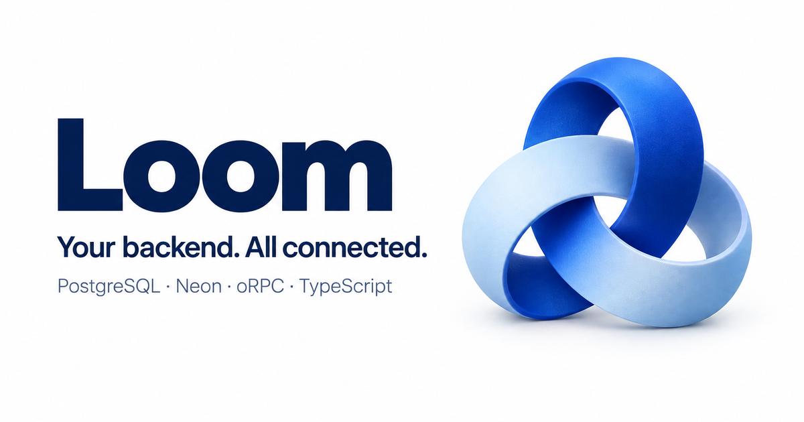

<p align="center">
  
</p>

<p align="center">
  <strong>A contract-first TypeScript backend for PostgreSQL and Neon.</strong><br />
  Typed procedures, live clients, and a database you control.
</p>

<p align="center">
  <a href="apps/docs/content/docs/quickstart.mdx">Quickstart</a> ·
  <a href="apps/docs/content/docs/overview.mdx">Documentation</a> ·
  <a href="packages/examples">Examples</a> ·
  <a href="CONTRIBUTING.md">Contributing</a>
</p>

> **In development: v0.0.0.** Kello is not published to a package registry. Evaluate it from this repository. See [current limitations](apps/docs/content/docs/operations/limits.mdx) and the [acceptance record](docs/architecture/orpc-acceptance.md) before choosing it for production.

## What is Kello?

Kello connects your PostgreSQL schema to a typed application API. Define tables with Drizzle, declare oRPC contracts, implement handlers, and generate a client that carries input, output, and error types into your frontend.

PostgreSQL owns your transactions. oRPC owns the protocol. TanStack Query owns the client cache. Kello brings those pieces together with Neon deployment, development synchronization, components, jobs, and storage.

## Familiar tools, connected

| Capability          | How it works                                                                       |
| ------------------- | ---------------------------------------------------------------------------------- |
| End-to-end types    | Required contracts, Standard Schema validation, and generated clients              |
| Live queries        | Explicit streaming contracts and native TanStack Query `liveOptions`               |
| Data and migrations | Drizzle schemas and relations, PostgreSQL transactions, reviewed migration history |
| Composable backends | Mounted components, private procedures, and initialized SDK services               |
| Authentication      | Managed Neon auth, customer-owned Better Auth, or verified third-party tokens      |
| Background work     | Durable jobs, recurring schedules, and private object storage                      |
| React and SSR       | Client-only views, Suspense, and optional request-scoped SSR                       |
| Effect              | Native oRPC Effect integration alongside Promise-based handlers                    |

## A client API you already know

Inside a React component, use the generated connection's native oRPC utilities:

```tsx
const { rpc } = connection;

const tasks = useQuery(rpc.tasks.list.liveOptions());
const createTask = useMutation(rpc.tasks.create.mutationOptions());
```

Here `tasks.list` is an explicitly streaming contract. The [React guide](apps/docs/content/docs/clients/react.mdx) covers connection lifetime, providers, and authentication; the [contracts guide](apps/docs/content/docs/authoring/functions.mdx) covers the backend.

## Try it locally

Use Bun 1.4.2 and Node 24:

```sh
git clone https://github.com/ImRLopezAG/loom.git
cd kello
bun install --frozen-lockfile
bunx turbo run build --filter=kello
bun run --cwd apps/docs dev
```

Open [localhost:4321](http://localhost:4321) for the homepage and documentation. Follow the quickstart to authenticate with Neon, link a disposable development branch, review migrations, and deploy an example. There is no public `npm install kello` step yet.

## Explore the examples

| Example                                            | Learn                                  |
| -------------------------------------------------- | -------------------------------------- |
| [React / Vite](packages/examples/tasks)            | Live tasks and optimistic updates      |
| [Next.js](packages/examples/next)                  | Client-only views and optional SSR     |
| [TanStack Start](packages/examples/start)          | Suspense live queries and optional SSR |
| [Jobs and storage](packages/examples/jobs-storage) | Private uploads and durable processing |
| [Components](packages/examples/components)         | Scoped APIs and backend services       |

Each example owns its backend. Link separate disposable Neon branches to keep their schemas isolated.

## Repository map

- [`apps/loom`](apps/loom) — the public `kello` package: CLI, runtime, client, React integrations, and tooling.
- [`apps/docs`](apps/docs) — Astro presentation site and Fumadocs documentation with compiled examples.
- [`packages/examples`](packages/examples) — consumer applications using public package exports.
- [`packages/tests`](packages/tests) — unit tests and type contracts.
- [`packages/e2e`](packages/e2e) — database, browser, and provider acceptance.
- [`packages/ts-config`](packages/ts-config) — strict runtime-specific TypeScript configurations.

## Development and verification

```sh
bun run check
```

The [contributor guide](CONTRIBUTING.md) explains the toolchain, database checks, CI, and cloud acceptance. [Execution evidence](docs/architecture/execution.md) and the [compatibility baseline](docs/architecture/compatibility.md) record what has been tested; local checks and hosted acceptance are distinct.

Publication is disabled. Package ownership, licensing, and release credentials must be settled before a public release.
