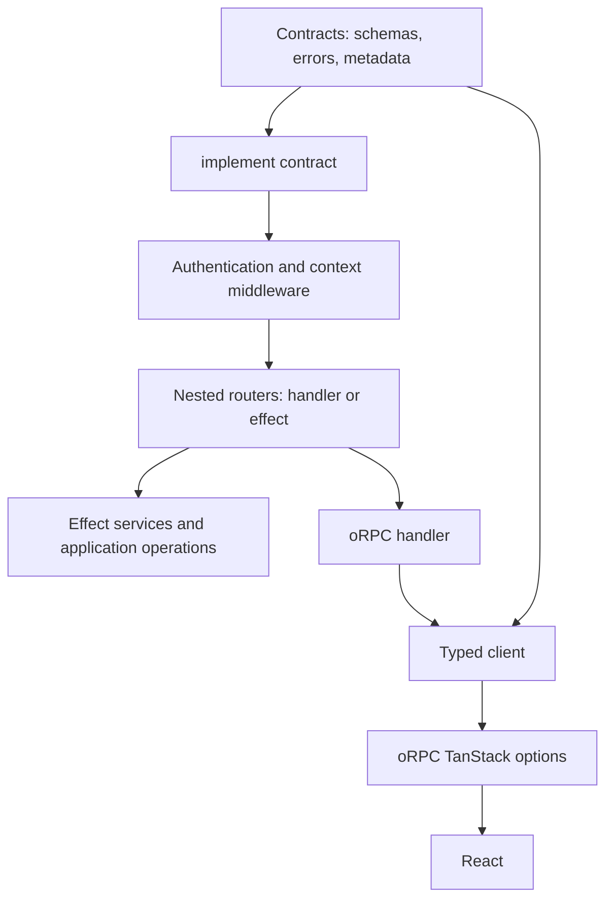
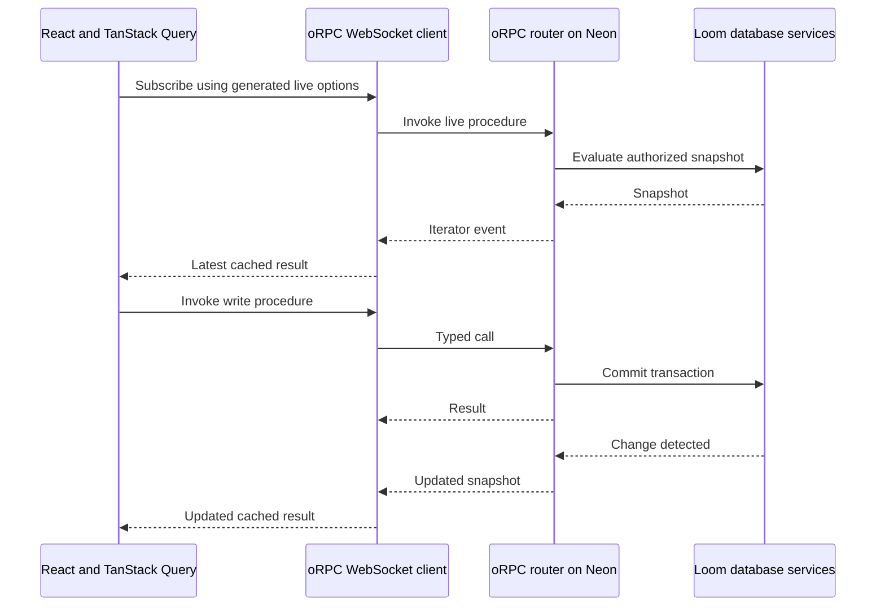

# Loom with oRPC and Effect as its framework core

**The proposal is to make oRPC the actual server-to-client foundation of Loom.** Application modules would implement oRPC procedures and routers. Effect would provide server services and execution. WebSocket would be the primary application transport, and oRPC's TanStack integration would produce client options. Generated files would continue to bind the application schema, context, router, and client.

This is an architectural assessment, not an approved implementation plan. No migration has been implemented. Findings come from inspecting Loom, Agent.io's current source and installed dependencies, and official documentation on September 24, 2026. The combined Loom/oRPC/Effect runtime has not been built, benchmarked, or deployed.

The assessment covers API authoring, types, execution, reactivity, generation, and deployment implications. It is not a complete audit of every Agent.io router or every oRPC integration.

## What Agent.io establishes

The inspected checkout is `../agent.io-eng` relative to Loom's repository root. The links below require that sibling checkout; it is not part of the public Loom repository.

| Source                                                                                           | Observed responsibility                                                                   |
| ------------------------------------------------------------------------------------------------ | ----------------------------------------------------------------------------------------- |
| [Contract base](../../../agent.io-eng/src/server/rpc/contracts/base.ts)                          | Browser-safe base contract, shared errors, cache metadata                                 |
| [RPC initialization](../../../agent.io-eng/src/server/rpc/init.ts)                               | `implement(contract)`, typed context, authentication and organization middleware          |
| [HubSpot router](../../../agent.io-eng/src/server/rpc/routes/hubspot.router.ts)                  | Contract-path implementations using `.effect(function* …)`                                |
| [Router assembly](../../../agent.io-eng/src/server/rpc/index.ts)                                 | Nested router, OpenAPI handler, batching, compression, documentation                      |
| [Effect runtime](../../../agent.io-eng/src/server/services/runtime.ts)                           | Shared infrastructure through `Layer` and `ManagedRuntime`                                |
| [Error bridge](../../../agent.io-eng/src/server/rpc/effect.ts)                                   | Known service failures become declared contract errors; other failures become defects     |
| [Client](../../../agent.io-eng/src/lib/rpc/client.ts)                                            | Direct server-side calls, browser OpenAPI client, TanStack option utilities               |
| [Transport tests](../../../agent.io-eng/src/server/rpc/contracts/__tests__/v2-transport.test.ts) | Tests for iterator delivery, Effect context, batching, and input validation before writes |

These tests were inspected, not rerun for this assessment.

The checked package manifest pins oRPC packages to `2.0.0-beta.35`, including `@orpc/experimental-effect`, and Effect to `4.0.0-rc.115`. The installed Effect adapter declares an Effect peer range of `>=4.0.0-beta.90`. That establishes a concrete integration precedent, not proof of every combination's compatibility.



The important precedent is that the router is the end-to-end API model. A separate custom RPC definition does not have to mirror it.

Agent.io still distinguishes service queries from commands in its [Foundation](../../../agent.io-eng/src/server/services/base/foundation.ts). The distinction governs permission, audit, and observation policies below the endpoint API. Its existence supports handler-based endpoints while showing that operation semantics remain meaningful.

## Proposed ownership

| Layer          | Responsibility                                                                                               |
| -------------- | ------------------------------------------------------------------------------------------------------------ |
| oRPC           | Procedures, routers, contracts, middleware composition, typed clients, public errors, wire protocol          |
| Effect         | Server dependencies, failure channels, concurrency, interruption, scoped resource lifetimes                  |
| TanStack Query | Cached results, observers, mutation state, optimistic UI callbacks                                           |
| Drizzle        | Typed SQL, tables, relations                                                                                 |
| Loom           | Project generation, database policies, reactivity, migrations, durable jobs, storage integration, deployment |
| Neon           | Database, authentication, object storage, function hosting                                                   |

Loom would become the framework that makes these parts behave as one application on Neon. It would retain responsibility for database and deployment guarantees while using oRPC's public procedure model throughout.

The existing custom request protocol, reference-to-dispatch machinery, client streaming bridge, and manually maintained option types become replacement candidates. This should culminate in removing equivalent implementations, rather than permanently maintaining two independent RPC systems.

## Handler authoring and execution policy

Application authors could use ordinary oRPC `.handler()` and `.effect()` implementations. The current Loom `query()`, `mutation()`, and `action()` builders need not survive as the authoring model.

However, the framework still needs explicit answers to these questions:

- May the operation write to the database?
- Is repeated evaluation safe for a live subscription?
- May it retry after a database conflict?
- May a client retry after losing the response?
- Does it perform external effects that cannot be rolled back?

Loom's [current transaction implementation](../../packages/core/src/server/transactions.ts) uses read-only repeatable-read transactions for queries and serializable transactions for mutations, with bounded retries for selected database errors.

Those semantics could move into contract metadata, middleware, or database service methods. They cannot be inferred reliably from arbitrary handler code. A function can call another service that sends an email, writes a row, or does both.

This also affects the requested client facade. The following is proposed syntax, not a verified implementation:

```tsx
const tasks = useQuery(api.tasks.list({ input: { projectId }, enabled: !!projectId }));

const setDone = useMutation(api.tasks.setDone({ onSuccess: () => toast.success("Saved") }));
```

If server procedures are otherwise indistinguishable, generation needs a declared policy to choose live, finite-query, or mutation options. Procedure names cannot safely supply that information. Removing separate server builders does not remove this requirement.

The facade should delegate to oRPC's native utilities and retain access to the underlying client and keys. Otherwise Loom would obscure the integration surface that motivates adoption.

## WebSocket as the primary application transport

The proposed application flow is:



oRPC supplies WebSocket client and server adapters, per-call context, and configurable socket reconnection. Reconnection is disabled by default. The same procedure model can also expose HTTP/OpenAPI endpoints for external consumers and tools. [oRPC WebSocket adapters](https://orpc.dev/docs/adapters/websocket).

Socket reconnection is distinct from restoring an active subscription. Recovery must restart the live operation, refresh credentials when necessary, and establish a fresh authorized snapshot or a valid resume position. Both layers must be verified together.

The Neon-specific work is adapting its upgrade lifecycle to oRPC's socket handler while preserving the native upgrade response. Loom already has a [Neon WebSocket boundary](../../packages/core/src/adapters/neon/websocket.ts), but the oRPC replacement has not been tested against it.

Neon supports long-running WebSockets on Node.js 24. Isolates can restart, do not share module-scope state, and lose that state on eviction. Current documentation specifies a 15-minute heartbeat timeout and a default account-wide concurrency limit. Capacity accounting for the intended persistent-connection workload must be confirmed through deployment tests. [Neon runtime limits](https://neon.com/docs/compute/functions/reference/runtime-limits).

An in-memory publisher is therefore insufficient as the sole source of cross-isolate database invalidation. PostgreSQL remains the durable authority. oRPC's publisher helpers offer distribution and resume primitives, but do not infer which SQL query results changed. [Publisher helpers](https://orpc.dev/docs/helpers/publisher).

## Live queries and optimistic updates

oRPC live options place the latest iterator event into TanStack's cache. This can replace Loom's [current snapshot bridge](../../packages/core/src/query/stream.ts) and the corresponding portion of its [option builders](../../packages/core/src/query/methods.ts). TanStack provides optimistic cache updates and mutation callbacks. [oRPC TanStack integration](https://orpc.dev/docs/integrations/tanstack-query), [TanStack optimistic updates](https://tanstack.com/query/latest/docs/framework/react/guides/optimistic-updates).

Loom would still own change detection, authorized reevaluation, consistent snapshots, and the relationship between committed writes and live results. Its [current subscription engine](../../packages/core/src/server/realtime/subscriptions.ts) defaults to one-second revision polling. Switching the wire protocol does not remove that delay.

Optimistic reconciliation needs a defined policy:

1. A user optimistically marks a task complete.
2. A previously evaluated snapshot arrives and contains the old value.
3. Replacing the cache with that snapshot can erase the optimistic edit.
4. A later snapshot contains the committed change.

WebSocket ordering does not establish causal ordering across database evaluations and concurrent operations. Possible mechanisms include pending optimistic changes layered over server snapshots and a commit/revision acknowledgement that establishes when the server has caught up. This assessment does not select or implement that mechanism.

Authentication also affects cache ownership. oRPC's client context is excluded from its generated query keys. Loom must retain session/tenant isolation through scoped clients, cache lifecycle, or explicit key composition; passing a different token alone is insufficient. [Client context and query keys](https://orpc.dev/docs/integrations/tanstack-query#client-context).

SSR needs finite completion. A live iterator can remain open indefinitely, so prefetch must take a snapshot and cancel the server stream, or use a finite operation. Hydration must then open the browser subscription deliberately. [Streaming and SSR](https://orpc.dev/docs/integrations/tanstack-query#server-side-rendering-ssr).

## Effect 4's role

Effect 4 is currently a release candidate. Its installation documentation recommends TypeScript 7, aligning with Loom's existing compiler choice. [Effect installation](https://effect.website/docs/v4/getting-started/installation).

Inspection of Agent.io's installed adapter showed that `.effect()` delegates to an ordinary oRPC handler through `handlerGen`. The adapter supplies the Effect context and passes the request abort signal into Effect execution. Ordinary handlers and Effect handlers can coexist in one router. The documented integration also supports Effect Schema and JSON Schema conversion. [oRPC Effect integration](https://orpc.dev/docs/integrations/effect).

| Benefit                    | Practical effect                                            |
| -------------------------- | ----------------------------------------------------------- |
| Typed service requirements | Computations declare infrastructure dependencies            |
| Typed failure channels     | Expected failures can be handled separately from defects    |
| Scoped resources           | Subscription and resource cleanup can be modeled explicitly |
| Structured concurrency     | Related operations can share interruption and lifetimes     |
| Replaceable layers         | Tests can substitute services without changing handlers     |

These capabilities do not automatically provide database transactions, durable execution, or cancellation of an arbitrary underlying promise. A driver or SDK must cooperate with cancellation. A fiber is not a persisted job, and an in-memory queue does not survive eviction.

Effect failure types also do not automatically become public oRPC contracts. The installed adapter allows broad Effect error channels. Agent.io explicitly maps known failures to declared errors and treats others as defects. Loom would need a similarly deliberate boundary to avoid leaking database or provider details.

Effect can remain a server concern. React consumers can continue to use ordinary TanStack Query hooks without adopting an Effect client.

The integration is still named `experimental-effect`, oRPC v2 is a beta in the inspected project, and Effect 4 is an RC. A tested, pinned version set and upgrade checks are part of the maintenance cost. The existence of a permissive peer range is not a compatibility test.

## Generated files and contracts

Generation remains useful for:

- Schema-derived tables, validators, and identifiers.
- Project-bound context, services, and procedure builders.
- Procedure discovery and root router assembly.
- Browser-safe client declarations and callable option methods.
- Deployment entry points and public endpoint metadata.

Generated schema/context bindings should remain separate from root router assembly. Otherwise application procedures importing generated helpers can create a cycle through the generated router that imports those procedures.

The browser artifact must not import server handlers, database drivers, or credentials. Public and internal procedures must remain separate exposure boundaries even if both are oRPC procedures. Jobs also need stable internal procedure identifiers and release compatibility rather than accidental dependence on browser-visible routes.

Handler inference and runtime contracts are different capabilities. Agent.io explicitly declares output schemas. A handler can infer its TypeScript return type, but that type is erased at runtime. It does not by itself supply output validation or a precise OpenAPI response schema. A standalone contract without an output declaration cannot infer the missing handler's result. [Contract-first documentation](https://orpc.dev/docs/contract-first).

Loom can derive runtime schemas for supported schema-based projections. Arbitrary joins, aggregates, and computed results require explicit schemas or a deliberately bounded schema-generation system. Effect does not remove that design decision.

## Transaction, validation, and stream lifetimes

Loom currently validates results within its [database execution boundary](../../packages/core/src/server/functions/execution.ts). Preserving rollback on invalid output is essential.

Inspection of oRPC's installed executor showed that output-validation positions depend on schema and middleware composition. A transaction wrapper must contain the required validation before it commits. Otherwise a write can commit, output validation can fail afterward, and the client can receive an error despite a successful write.

A live stream must not hold one database transaction open for its entire lifetime. Each snapshot needs a bounded database operation, while the iterator owns the longer subscription lifetime. Effect scopes can manage those lifetimes, but cannot determine their correct boundaries automatically.

Retry policies must remain coordinated across TanStack, oRPC, Effect, and PostgreSQL. Retrying each layer independently can multiply executions. Client retries after an uncertain write need a stable idempotency identity; database retries need fresh transaction scope; external side effects need their own policy.

## Advantages and costs

| Advantage                                    | Cost or constraint                                                                    |
| -------------------------------------------- | ------------------------------------------------------------------------------------- |
| One procedure model from server to client    | Breaking migration of definitions, generated contracts, and clients                   |
| Native middleware and ecosystem integrations | Convenience APIs must preserve access to those integrations                           |
| Less custom transport and streaming code     | Adapter lifecycle, reconnect, overload, and cancellation still require verification   |
| Effect service and failure types             | More concepts and prerelease dependency coordination                                  |
| OpenAPI from the same model                  | Precise documentation requires runtime schemas                                        |
| Native TanStack live options                 | Optimistic confirmation and identity isolation remain framework policies              |
| Familiarity with existing projects           | WorkOS, Redis caching, and provider-specific behavior should not become Loom defaults |

No speed improvement has been demonstrated. Middleware, validation, serialization, and Effect all have runtime costs. The potential benefit is reducing duplicated infrastructure while gaining consistent integration behavior.

Measurements should include first-subscription latency, commit-to-visible latency, concurrent connections, memory under slow consumers, browser bundle size, generated declaration size, and TypeScript checking time. Real Neon verification matters because a local socket test does not establish hosted lifecycle or scaling behavior.

## Breaking-change implications

This replaces the endpoint model, not merely its transport adapter. Existing Loom function definitions, generated references, client factories, error codes, serialization assumptions, and tests may need migration. Date/bigint behavior must be compared explicitly because the current client maps them to encoded strings.

Schema and migrations can retain their own history. Database roles, job persistence, storage authorization, and deployment coordination remain valuable implementation assets even if their RPC-facing interfaces change.

The current [authoring and Neon acceptance record](../architecture/authoring-neon-acceptance.md) proves behavior of the existing implementation. It cannot be carried forward as proof of the redesigned runtime without rerunning the affected acceptance cases.

## Decisions still needed

| Question                                          | Why it matters                                                                        |
| ------------------------------------------------- | ------------------------------------------------------------------------------------- |
| Where does execution policy live?                 | Determines live eligibility, transactions, retry safety, and generated client options |
| Which outputs require runtime schemas?            | Determines contract-first authoring and OpenAPI fidelity                              |
| How are optimistic changes confirmed?             | Prevents stale snapshots from undoing pending edits                                   |
| How are changes propagated across isolates?       | Determines hosted correctness and update latency                                      |
| How are transaction and stream scopes composed?   | Prevents commit-before-validation and long-held database transactions                 |
| How are public and internal procedures separated? | Preserves authorization and scheduler-only capabilities                               |
| Which package versions form the baseline?         | Bounds prerelease compatibility and upgrade work                                      |

The architecture fits the proposed identity: oRPC owns the public procedure model end to end, Effect owns server computation, and Loom connects those capabilities to a generated Neon-backed application. The remaining questions concern database and lifecycle guarantees that neither transport typing nor a generic handler can infer.

This document is evidence for examining that redesign. It does not authorize or claim completion of its implementation.
