# Loom: public library, authentication, and configuration gaps

Loom currently exposes too much of its implementation and deployment machinery to application authors. The examples demonstrate working mechanisms, but they do not yet demonstrate the coherent library experience we intended. The previous refactor reduced duplicated code without fully moving responsibility into the framework. That was insufficient.

This document records Angel's observations, verifies them against the current implementation, and identifies what the next plan must resolve. Revised on 2026-09-26 after further research into Neon login/linking, schema-only branching, the Neon application SDK, Convex Auth, and external-provider integrations. It is a diagnosis and requirements map, not an approved implementation plan. No runtime code or cloud resources were changed for this assessment. The scope is packaging, authentication, providers, configuration, environments, onboarding, and example fidelity; this is not a claim to have audited every subsystem or discovered every defect.

## Accepted direction from the document review

These are user decisions for the next plan, not open alternatives:

- `apps/loom` becomes the package named `loom`, containing the CLI, core, and tooling. Its published artifact provides both the executable and `loom/...` imports. Consumers must not need separately published `@loom/core` or `@loom/tooling` packages.
- Compile that package with Vite+ `vp pack`, including JavaScript and declarations. Keep server, browser, and CLI entry points separated inside the same package.
- Follow Convex's packaged auth/provider model: consumers compose providers and use hooks; they do not implement session persistence, renewal, or connection authentication themselves.
- Build onboarding around Neon login and saved credentials, then create or link a project and select/provision its environments. The CLI owns discovery and writes the required public environment settings.
- Support schema-only and data-bearing development/preview environments using Neon capabilities; define environment-variable inheritance separately from database row copying.
- Test the public package through CLI-driven creation and integration into existing applications, including real Neon acceptance.

The first version of this document was too tentative about packaging and did not research Neon's existing account/session/context workflow deeply enough. Distinguishing credentials from identifiers is necessary internally, but it is not a reason to make users configure both manually.

## 1. Observation map

| Concern                                                       | Finding                                                                                                                                               | Consequence                                                                                                 |
| ------------------------------------------------------------- | ----------------------------------------------------------------------------------------------------------------------------------------------------- | ----------------------------------------------------------------------------------------------------------- |
| `apps/loom` is only the CLI                                   | Confirmed. Its package is `@loom/cli`, its bin points to TypeScript source, and it has no library exports.                                            | Installing that package does not provide a unified Loom authoring/client API.                               |
| Applications import implementation packages                   | Confirmed. Examples and generated modules use `@loom/core/*` and `@loom/tooling`.                                                                     | Internal organization has become the public interface.                                                      |
| The libraries are not compiled                                | Correction: core and tooling export compiled `dist` JavaScript and declarations.                                                                      | The gap is the intended public package contract, not absence of compilation.                                |
| Examples still have `lib` session plumbing                    | Confirmed for Next and Start.                                                                                                                         | Consumers must understand and reproduce session wiring. Moving helpers alone did not solve ownership.       |
| Authentication assumes a frontend HTTP server                 | Confirmed for the SSR examples' cookie bridge; not universally true of Loom. The Vite tasks example already gets credentials from Neon Auth directly. | Examples teach two inconsistent integration models; native/CSR authors lack one complete provider contract. |
| `loom.config.ts` is too large                                 | Confirmed in the examples.                                                                                                                            | Infrastructure identities, auth trust, deployment state, and application overrides are mixed together.      |
| Config should be optional with sensible environment discovery | Not implemented. The loader imports `loom.config.ts` unconditionally.                                                                                 | The normal path requires a file even when platform metadata could supply most values.                       |
| Use one Neon project with development branches                | Fits the intended model; explicit branch provisioning code already exists.                                                                            | Existing machinery needs a simpler onboarding experience, not necessarily replacement.                      |
| Auth and function URLs should be identical                    | Not a valid default assumption. They identify different services.                                                                                     | A single public origin would require an explicit routing/proxy design.                                      |
| Neon automatically validates every function caller            | Incorrect for generic Neon Functions.                                                                                                                 | Loom's deployed handler must continue authenticating requests.                                              |

Evidence: [CLI manifest](../../apps/loom/package.json), [core manifest](../../packages/core/package.json), [tooling manifest](../../packages/tooling/package.json), [Next config](../../packages/examples/next/loom.config.ts), [config loader](../../packages/tooling/src/project/load.ts), [tasks sign-in](../../packages/examples/tasks/src/sign-in.tsx), and [Neon function authentication](https://neon.com/docs/compute/functions/authentication).

## 2. Public library packaging is unfinished

The repository layout is legitimate as an internal workspace: CLI, runtime, and tooling have different responsibilities. The mistake is treating those boundaries as the finished consumer API without deciding what an application actually installs.

Today:

- `@loom/cli` is private, packages `src`, and invokes `./src/cli.ts`.
- `@loom/core` is private and exports compiled `contract`, `server`, `client`, `react`, and `neon` entry points.
- `@loom/tooling` is private and exports compiled tooling.
- Generated code embeds those package names. Renaming example imports alone would not solve this.

**Accepted target:** `apps/loom/package.json` is named `loom`; its build contains the CLI, runtime, and tooling behind public subpath exports. Core/tooling source may be organized into internal modules during the move, but the artifact must not leave unresolved workspace dependencies or require consumers to install the former packages. Example and generated imports move to the same public surface.

Use `vp pack` with its `pack` block in `vite.config.ts` to build JavaScript and type declarations. Vite+ explicitly supports library and CLI packaging. A native standalone executable is not required to satisfy this decision. [Vite+ Pack](https://viteplus.dev/guide/pack).

Candidate subpaths include `loom/server`, `loom/contract`, `loom/client`, `loom/react`, and provider/framework integration subpaths. Their exact inventory belongs in the plan; the package name and one-artifact requirement are settled. Browser entry points must stay independent of CLI initialization and server credentials. Registry ownership must be verified before publication, without silently changing the requested name.

The [packed consumer test](../../packages/e2e/browser/packed-example.test.ts) is useful evidence: it installs isolated package archives instead of relying entirely on workspace resolution. But it installs the existing split package design. It cannot prove that an unpublished unified package works.

**Planning requirement:** implement the selected single `loom` artifact, define its exports and compiled CLI, then make generated files, docs, and independent examples consume that exact artifact. Keep type inference and native oRPC options intact.

## 3. Session ownership is still wrong in the primary SSR examples

The Next and Start `lib/session.ts` files are now thin, but the application still owns a session endpoint, URL discovery, a verification callback, and cookie integration. The verification callback invokes an application greeting procedure to establish whether a token works. That couples authentication setup to unrelated business functionality.

The UI asks the user to paste an access token. The package bridge stores that token in a cookie and exposes retrieval for the browser connection. This is a testing/demo mechanism, not a complete provider integration with sign-in, token renewal, logout, and platform-specific session handling.

Evidence: [Next session module](../../packages/examples/next/lib/session.ts), [Next session route](../../packages/examples/next/app/api/session/route.ts), [Next UI](../../packages/examples/next/components/notes.tsx), [cookie handler](../../packages/core/src/server/cookie-session.ts), [cookie client](../../packages/core/src/client/cookie-session.ts).

The defect is not the directory name `lib`. An application can reasonably contain business helpers there. The defect is requiring application-authored framework plumbing. Moving the same endpoint to another folder or renaming it would leave that problem unchanged.

The new [React provider](../../packages/core/src/react/provider.ts) manages connections and cache boundaries, but still expects an application-supplied auth object, session identity key, and session-change callback. It is infrastructure for integrations, not the complete authentication experience requested. The [Vite tasks app](../../packages/examples/tasks/src/main.tsx) separately constructs its connection, query client, and logout cleanup; it has not been brought under the same provider model.

**Planning requirement:** provider adapters must own credential acquisition/renewal and connect it to Loom's connection and cache lifecycle. A CSR or native application must not need a Next/Start session server. SSR may need a server adapter to access request credentials, but its framework-specific work should be packaged and documented as such.

## 4. Separate session authority, token verification, and authorization

These are three different responsibilities:

| Responsibility                                                | Appropriate owner                                                                                |
| ------------------------------------------------------------- | ------------------------------------------------------------------------------------------------ |
| Sign-in, user session, refresh credentials, token issuance    | Selected authentication provider, or an explicitly selected self-hosted authentication component |
| Acquire a current credential on web/native/SSR                | Provider SDK plus Loom integration for that platform                                             |
| Verify incoming credentials and establish invocation identity | Loom runtime deployed in Neon Functions, using configured provider trust                         |
| Decide which records/actions the identity can access          | Application authorization rules, supported by framework context and database constraints         |

The frontend does not need to implement its own authentication server merely to call Loom. But it still participates in authentication through the provider's client SDK and credential storage appropriate to its platform.

Following Convex means packaging this integration work. Selecting WorkOS or Clerk does not require Loom to mint another token or relocate those providers' session databases into Neon. A token-exchange service is a separate design with its own expiry, revocation, signing-key, and failure semantics. Nothing inspected establishes that such an exchange is necessary.

For a future component that actually hosts authentication inside Neon Functions, those functions can own issuance and sessions. That is a distinct deployment mode from verifying a managed provider's tokens. The plan must support the intended modes explicitly instead of treating all of them as a single cookie bridge.

```mermaid
flowchart LR
  P[Selected authentication provider] -->|Issues and refreshes credentials| A[Provider SDK and Loom adapter]
  A --> C[Web or native Loom client]
  C -->|Authenticated oRPC HTTP or WebSocket| F[Loom runtime on Neon Functions]
  F --> V[Verify configured provider trust]
  V --> I[Invocation identity and authorization]
  I --> D[Branch database and services]
```

Neon's documentation explicitly places inbound function authentication in the handler. Managed auth supplies credentials and verification endpoints; the platform does not automatically authenticate every public function invocation. This supports the requested direct-client model, provided Loom performs verification centrally. [Neon function authentication](https://neon.com/docs/compute/functions/authentication).

### What the Convex model actually provides

There are two relevant implementations, and Loom should learn from both:

| Reference                                                                         | What is packaged                                                                                                            | Implication for Loom                                                                                            |
| --------------------------------------------------------------------------------- | --------------------------------------------------------------------------------------------------------------------------- | --------------------------------------------------------------------------------------------------------------- |
| `@convex-dev/auth`                                                                | Authentication runs in the backend; setup adds auth tables and functions. Client providers/hooks implement the client side. | A backend-hosted auth component can support a CDN SPA or native app without a separate frontend session server. |
| `ConvexProviderWithClerk`, `ConvexProviderWithAuthKit`, `ConvexProviderWithAuth0` | Integration between the external provider's SDK and the backend connection.                                                 | Ship provider adapters rather than making each consumer build one.                                              |
| `ConvexProviderWithAuth`                                                          | A common contract accepting loading/auth state and a token fetcher with forced-refresh support.                             | Have one extensible integration contract underneath the packaged adapters.                                      |

Convex Auth itself supports backend-hosted authentication for SPA, Next.js, and React Native applications. It is not the package through which every Clerk/WorkOS/Auth0 integration must run. Those external integrations are another part of the Convex ecosystem with the same goal: framework-owned connection authentication. [Convex Auth](https://labs.convex.dev/auth), [setup](https://labs.convex.dev/auth/setup), [Clerk](https://docs.convex.dev/auth/clerk), [WorkOS](https://docs.convex.dev/auth/authkit), [Auth0](https://docs.convex.dev/auth/auth0).

The useful common contract includes loading state, authenticated state, and token acquisition that can bypass cached tokens when renewal is required. Convex's WorkOS wrapper refetches tokens and distinguishes provider sign-in from backend-accepted authentication. Loom's current `getToken`/`sessionKey` plus mandatory reload callback does not express that full lifecycle. [Custom auth integration](https://docs.convex.dev/auth/advanced/custom-auth), [WorkOS authentication flow](https://docs.convex.dev/auth/authkit#under-the-hood).

Convex Auth also exposes sign-in/sign-out hooks and a storage interface; React Native supplies storage, with secure storage recommended. Next.js uses packaged server helpers and middleware. This is the model to follow: small platform integration points are acceptable; consumer-written session engines are not. [React auth API](https://labs.convex.dev/auth/api_reference/react), [Next.js server integration](https://labs.convex.dev/auth/authz/nextjs).

**Required Loom behavior:** adapters handle refresh, sign-out, account changes, connection authentication, and cache isolation. Public auth state must distinguish loading, provider sign-in, backend acceptance, and refresh failure. SSR credentials remain request-scoped. Reauthentication must not replay writes merely because a token changed. Keep native oRPC `queryOptions`, `mutationOptions`, and `liveOptions`; authentication integrates underneath those APIs.

Neon's own app SDK already manages sessions, cached tokens, and cross-tab auth state. Its auth-only client is sufficient when Loom/oRPC remains the application's data API. Do not add a parallel session implementation or switch Loom to PostgREST just to use Neon Auth. [Neon JavaScript SDK](https://neon.com/docs/reference/javascript-sdk).

## 5. Issuers and origins should be abstracted, not erased

The current [JWT verifier](../../packages/core/src/server/auth/verify.ts) verifies signatures, issuer, expiry, and configured audience against trusted keys. That is necessary runtime behavior. The poor experience is requiring ordinary consumers to assemble these low-level values in deployment configuration.

Convex also requires trusted-provider configuration. Its WorkOS integration combines a provider-aware client wrapper with server auth configuration; custom JWT configuration still includes issuer, keys, and audience rules. A streamlined developer experience does not eliminate that trust boundary. [Convex WorkOS integration](https://docs.convex.dev/auth/authkit), [Convex custom JWT configuration](https://docs.convex.dev/auth/advanced/custom-jwt).

There is an additional extensibility issue in Loom: [auth config](../../packages/core/src/server/auth/config.ts) places `audience` outside the individual issuer entries, and [configuration assembly](../../packages/core/src/server/auth/configuration.ts) applies it across issuers. Supporting providers with different audiences needs a better model. This is a confirmed limitation, not proof that every current configuration is insecure.

Origins answer a separate browser transport question. A valid token does not configure CORS or WebSocket origin policy. Defaults and trusted deployment metadata can reduce manual configuration; they cannot safely infer trusted production sites from arbitrary request headers. Native clients also need a defined non-browser policy.

**Planning requirement:** put provider trust and provider-specific options behind auth adapters/configuration. Resolve browser policy through framework defaults and explicit overrides where necessary. Do not remove signature, audience, expiry, or authorization checks to simplify the config file.

## 6. Configuration mixes facts the framework should resolve with decisions the user should make

The current config combines several layers:

| Current surface                                      | Diagnosis / intended ownership                                                                                                                                                         |
| ---------------------------------------------------- | -------------------------------------------------------------------------------------------------------------------------------------------------------------------------------------- |
| `project`                                            | Local framework identifier, not the Neon project ID. Duplicated terminology requires users to understand two different concepts. Derive a default or retain only as a naming override. |
| `provider.projectId` and target branches             | Deployment identity. Discover from an authenticated Neon project link/environment; preserve explicit selection for CI and unusual setups.                                              |
| Database name and namespaces                         | Usually discoverable/defaultable. Advanced overrides may still matter, including independent apps sharing a branch.                                                                    |
| Runtime and migration roles/URLs                     | Necessary internal separation, excessively exposed on the common path. Provision and resolve them safely.                                                                              |
| `development` and `deployment`                       | Repeated role/name settings plus release controls. Defaults and resolved deployment state should remove duplication.                                                                   |
| Issuers, JWKS, audience                              | Auth-provider integration responsibility, not generic infrastructure boilerplate.                                                                                                      |
| Allowed origins                                      | Browser connectivity policy; framework defaults with deliberate overrides.                                                                                                             |
| Schema, contracts, application middleware/components | Real authored application behavior; keep a clear home in the application source.                                                                                                       |
| Drizzle settings                                     | Do not expose a second required schema/config authority merely because Drizzle is an implementation dependency.                                                                        |

Evidence: [config schema](../../packages/tooling/src/config/define-config.ts), [deployment schema](../../packages/tooling/src/config/deployment.ts), [development schema](../../packages/tooling/src/config/development.ts), [Next example](../../packages/examples/next/loom.config.ts).

The default path should use a saved Neon login and linked project context. Those supply management authority and target identity without repeatedly asking the user to enter either. CI uses non-interactive credentials. These are CLI implementation responsibilities, not reasons for a large `loom.config.ts`. Runtime database access remains necessary too, even if the author never writes a `database` block. Automatically injected credentials must still be checked against Loom's restricted runtime-role model; eliminating configuration must not silently grant the runtime migration privileges.

The loader currently requires `loom.config.ts`; environment-only operation would be a real feature change. The plan must specify discovery precedence, missing-value errors, conflict handling, and which resolved facts are persisted. Optional configuration means deterministic defaults, not silent selection of a production target.

### Neon already supplies the login and context model

`neon login` opens browser authorization and persists credentials at `~/.config/neon/credentials.json`; it also supports OS-keyring storage with `--keyring`. `neon auth` is the legacy alias. Authentication resolution prioritizes an explicit API key, then `NEON_API_KEY`, then saved credentials; if none exist, the CLI can initiate login. [Neon login](https://neon.com/docs/cli/login).

`neon link` records organization, project, and branch in a non-secret `.neon` context file. It normally pulls branch environment variables locally. `neon init` composes setup and linking, although its agent-tooling setup is not something Loom should blindly install as a side effect of application initialization. [Neon link](https://neon.com/docs/cli/link), [Neon init](https://neon.com/docs/cli/init).

The implementation plan must reuse a supported Neon credential/context integration, including credential renewal and profiles, rather than inventing a second account-login system or parsing a secret JSON file as though its format were a permanent SDK contract. Exact reuse through a supported package API versus a controlled CLI invocation needs a bounded implementation check. Browser login persistence itself is confirmed; it is not a missing Neon capability.

There are also **two different SDK purposes**:

- `@neon/sdk` is the platform-management client for project creation, branches, and deployment resources. The installed version is 6.1.0. Its documented `createNeonClient` accepts a credential or credential supplier; `projects.createAndConnect` combines creation/readiness/connection discovery. This does not by itself document automatic reuse of the CLI credential store. [Official SDK repository](https://github.com/neondatabase/neon-pkgs/tree/main/packages/sdk).
- `@neondatabase/neon-js`, at the JavaScript SDK URL supplied in the review, is the application Auth/Data API client. It is not the project-provisioning SDK. Its auth-only exports fit Loom's runtime auth adapters. [Application SDK](https://neon.com/docs/reference/javascript-sdk).

**Desired user journey, not final command syntax:** run Loom setup in a new or existing app → reuse Neon login or open login → create/select a project → resolve production and development targets → provision/discover enabled services → write public connection variables and non-secret project linkage → generate Loom bindings → run/deploy. Repeating setup must reuse the selected resources instead of duplicating them.

## 7. Neon project, branches, and URLs

The proposed ordinary lifecycle is sensible: link/create one Neon project, designate production, and use separate branches for development and previews. A Neon branch is a data/environment boundary, not simply another database name inside the same branch. Neon documents a root `main` branch and isolated branches, including schema-only branching. Selecting a production designation still needs to be explicit in the resulting deployment state. [Neon branching](https://neon.com/docs/introduction/branching).

Loom already has [Neon branch provisioning](../../packages/tooling/src/deploy/neon/provision.ts), including recorded acknowledgements and identity checks. The problem is that this infrastructure has not been assembled into the minimal onboarding flow requested. The next plan should reuse working safety mechanisms and stop exposing their details as mandatory setup.

The previous document missed an important simplification: Neon's app SDK supports deriving Auth and Data API endpoints from one credential-free HTTPS database URL (documented for 0.7.0-beta onward). That makes a one-input setup viable for those services. It does not establish that the same address invokes arbitrary Neon Functions. Loom should resolve and emit its function URL automatically rather than make the user discover it. [Neon SDK initialization](https://neon.com/docs/reference/javascript-sdk#initialize-the-client).

Auth and function URLs can remain distinct internally while onboarding hides that distinction. Neon documents separate `NEON_AUTH_BASE_URL` and `NEON_AUTH_JWKS_URL` values, branch-scoped database variables, and local function invocation variables such as `NEON_FUNCTION_<SLUG>_BASE_URL`. Function invocation variables pulled locally are not automatically injected into another deployed function. [Neon environment variables](https://neon.com/docs/compute/functions/environment-variables).

### Schema-only branching and environment inheritance

The review annotation is correct: Neon supports schema-only branching. The next plan must include this as a supported provisioning mode, not treat development as necessarily copying production rows. The CLI documents `--schema-only`, and the API exposes an initialization-source selection. [Neon CLI branches](https://neon.com/docs/cli/branches), [schema-only branches](https://neon.com/docs/guides/branching-schema-only).

A material distinction emerged from the installed SDK's generated API types: `parent-data` copies schema/data; `parent-schema` copies schema from a parent; `schema-only` creates an independent root from source schema. The schema-only guide describes the root mode as having no parent history and no reset-from-parent. It also contains a stale sentence saying CLI support is future work, despite documenting a CLI command later on the same page. The plan must pin and verify the chosen mode against the API, rather than applying root-mode limitations to every schema-copy operation. Installed evidence: `@neon/sdk@6.1.0`, `dist/client/types.gen.d.ts`, `init_source` documentation. [Schema-only guide](https://neon.com/docs/guides/branching-schema-only).

This affects Loom's current provisioning verifier, which expects the created branch to retain `parentId`. Root schema-only mode cannot simply be added as an extra request option without changing that verification. Empty data also means Loom must reconcile migration metadata with the already-present schema rather than replaying a full initial migration. These are framework tasks, not new consumer configuration requirements. [Current provisioning](../../packages/tooling/src/deploy/neon/provision.ts).

Environment copying needs three distinct checks:

| Kind of state                            | Verified capability / remaining check                                                                                                     |
| ---------------------------------------- | ----------------------------------------------------------------------------------------------------------------------------------------- |
| Database schema versus rows              | Explicit branch initialization modes; verify empty tables and Loom metadata behavior in real acceptance.                                  |
| Neon-managed connection/service settings | Branch-scoped settings can be resolved or pulled for the new branch; use its endpoints/credentials.                                       |
| Custom application variables and secrets | Define and test inheritance/overrides for the selected branch mode; schema copying alone does not establish what happens to these values. |

Neon's whole-backend documentation describes ordinary branches inheriting deployed functions and using branch-local invocation URLs/data. It does not, in the material inspected, establish every custom-secret inheritance rule for every schema-only mode. Preserve this as a focused acceptance question, not a claim that Neon cannot copy an environment. [Branch your backend](https://neon.com/docs/concepts/branch-your-backend), [environment variables](https://neon.com/docs/compute/functions/environment-variables).

The public model needs to distinguish:

| Value                               | Meaning                                            | Client exposure                                       |
| ----------------------------------- | -------------------------------------------------- | ----------------------------------------------------- |
| Project/branch/deployment identity  | Which environment the CLI manages                  | Identifier may be public; deployment authority is not |
| Neon management credential          | Permission to provision/deploy                     | Never ship to clients                                 |
| Loom service URL                    | HTTP/WebSocket endpoint for application procedures | Public                                                |
| Auth provider URL/client identifier | Selected provider's sign-in/token service          | Public where the provider SDK requires it             |
| Database connection credentials     | Runtime or migration access                        | Server/CLI only                                       |

A `LOOM_SERVICE_URL` alias can be useful. `VITE_`, `NEXT_PUBLIC_`, and native build-time configuration are frontend exposure conventions, not different backend services. Exact environment names are a planning decision. A project ID alone does not tell the client which branch/function to call, and a service URL alone does not authorize the CLI to deploy.

## 8. Why previous checks did not catch the product problem

The recent tests establish that the implemented cookie bridge, SSR hydration, live transport, and migration move work in their tested environments. They do not establish that users can install the intended public package or authenticate every supported client through a coherent provider API.

The previous update optimized duplicated code before settling responsibility. It made the implementation more reusable while retaining a consumer workflow the user had already rejected. That is the central design error to correct.

Next and Start should remain independent applications with their own contracts and deployments. They should share packaged integration behavior rather than copied infrastructure. Each example should exercise a real user-facing integration, not merely a different renderer around the same manually pasted token.

No new Neon execution was performed for this document. Current provider documentation was checked; source inspection and prior local acceptance evidence are not a substitute for fresh deployed acceptance of a future redesign.

## 9. Inputs the next plan must settle

1. **Public package implementation:** the selected `loom` package in `apps/loom`, compiled with `vp pack`; finalize export paths, CLI artifacts, peer dependencies, and generated imports.
2. **Auth integration contract:** provider lifecycle, token refresh, identity changes, logout, SSR access, and native credential storage boundaries. Managed providers versus a hosted auth component must be explicit.
3. **Config-free onboarding:** saved Neon login reuse, new/existing project linking, schema-only or data-bearing development branches, production designation, environment discovery, and optional advanced overrides.
4. **Configuration ownership:** distinguish application composition, auth-provider policy, platform settings, and generated/resolved deployment state. Avoid repeating the same fact across `app.config.ts`, `auth.config.ts`, and `loom.config.ts`.
5. **Neon deployment integration:** use discovered/injected service settings while retaining least-privilege runtime access and safe migration authority.
6. **Example matrix:** CSR without an application HTTP server, independent Next SSR, independent Start SSR, and a native client integration; real provider sign-in instead of pasted-token sessions. Provider variants should prove that replacing Neon Auth does not replace the transport/database layer.
7. **Acceptance:** install the intended packed public artifact outside the workspace; validate generated types and browser dependency isolation; exercise real Neon Functions, branch separation, expired/wrong-provider tokens, refresh/reconnect, logout, cross-user cache isolation, and SSR request isolation.
8. **Upgrade:** migrate existing imports/configuration and examples; preserve committed `_generated/migrations` history. The recent folder move remains valid and must not become collateral damage.

The goal for that plan is a small author-facing API backed by framework-owned integration work. Removing visible options is only successful when Loom reliably takes over the responsibilities those options currently represent.

## 10. CLI-to-application acceptance map

The next plan must cover these journeys through the packaged `loom` executable, not just call internal tooling functions:

| Journey                    | Evidence needed                                                                                                                                                                                            |
| -------------------------- | ---------------------------------------------------------------------------------------------------------------------------------------------------------------------------------------------------------- |
| Fresh application          | Install one packed `loom` archive in an isolated directory; CLI creates the app; `loom/...` and generated imports typecheck and execute without workspace aliases.                                         |
| Existing application       | CLI integrates Loom without overwriting unrelated files; rerunning is idempotent.                                                                                                                          |
| First Neon login           | Browser authorization completes, credentials persist outside the project, and a second CLI process reuses them. Cancellation or denied access leaves no falsely completed setup.                           |
| Saved login / CI           | Valid saved credentials work; expiration triggers the supported renewal/login behavior; non-interactive CI accepts its explicit credential and never hangs on a browser prompt.                            |
| Project selection/creation | Real SDK/CLI calls create or select the intended project; the resulting link survives restart; interrupted provisioning reconciles instead of blindly creating duplicates.                                 |
| Branch modes               | Real schema-only and schema/data branches prove the intended rows, migration baseline, auth environment, service URLs, and custom-variable behavior.                                                       |
| Development and deployment | CLI provisions/resolves configuration, generates and deploys Functions, then a packaged client calls the deployed endpoint and receives live results.                                                      |
| Auth integrations          | Neon Auth plus external-provider variants demonstrate sign-in, expiry/refresh, backend rejection, reconnect, logout, account switch, and isolated SSR requests without consumer-authored session handlers. |

Deterministic CLI tests can cover prompts, cancellation, conflicting files, and retry paths. Real Neon tests must separately demonstrate account/project/branch/deployment behavior; mocks cannot establish that acceptance. This research pass did not run login, create cloud resources, or execute a redesigned package. It identifies the concrete evidence the implementation must produce.
