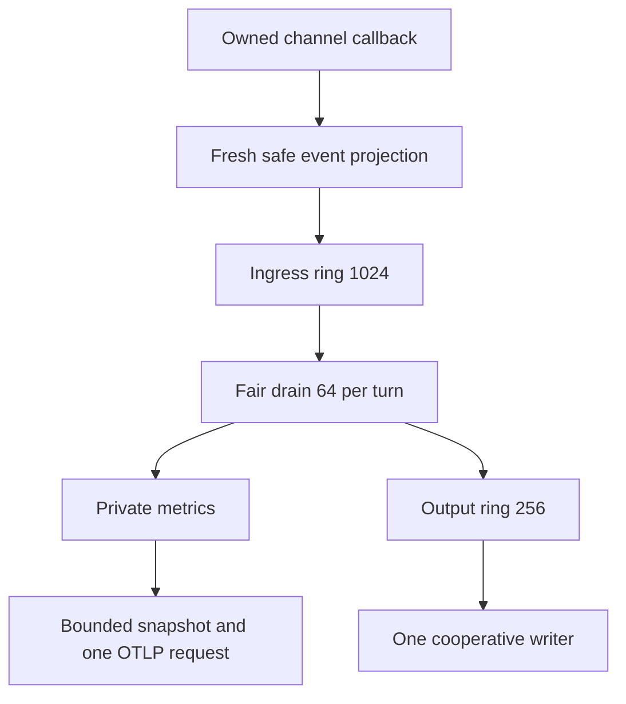
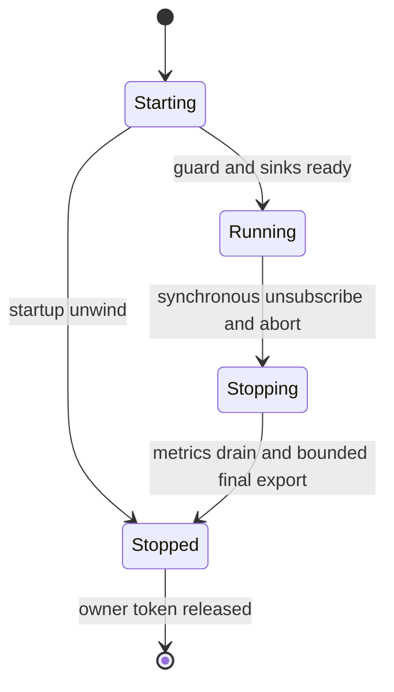

# Operational visibility implementation plan

## Goal Capsule

Make existing local-process runtime measurements usable through opt-in CLI diagnostics and bounded OTLP metrics without affecting native application behavior. The supplied plan and all acceptance gates below remain authoritative. Current user authorization supersedes its historical planning-only/no-commit instructions: implement in this isolated branch, independently review, commit exact owned files, push and open a PR; never merge, force-push or mutate production data. Retry counts are reassessment checkpoints, not reasons to abandon understood fixes. The orchestrator owns phase acceptance and shipping; the root coordinator owns cross-feature integration.

---

## Product Contract

### Summary and Problem Frame

Runtime channels already expose bounded measurements within the dev CLI process, but users have no supported consumer. Supply the local text/JSONL and explicit metrics-only exporter described in the preserved specification; there is no new UI or remote-isolate collection.

### Requirements

- R1. Preserve the exact CLI consent, validation, file ownership, exit-class and disabled behavior in the source specification.
- R2. Preserve the versioned, finite event projection, synchronous callback containment, queue bounds, loss accounting and cancellation semantics.
- R3. Preserve the private Effect registry, fixed initial 68-series mapping, 128-series/128-KiB ceilings, OTLP conformance, bounded transport and privacy boundaries.
- R4. Preserve every staged gate, actual PG18/native RPC and actual pinned collector acceptance, packed Bun/Node24 API and browser isolation checks, independent implementation/API/security reviews.
- R5. Preserve 005 ownership of its atomic 17-series extension and all previous review corrections. No publisher, schema, metadata migration or unrelated runtime edit is necessary for 001.

Product Contract unchanged. The source specification is preserved below; refinements here make its implementation units and verification boundaries explicit.

---

## Planning Contract

### Key Technical Decisions

- KTD1. Fixed descriptor projectors read only own data-property descriptors, copy approved primitives, and use an exhaustive mapped type keyed by the real publisher unions. This catches new variants and field drift without widening the public event union or allowing raw payloads. Source/internal tests use source imports consistently; only packed consumers use public package imports, superseding the source plan's blanket central-test import recommendation per current user direction.
- KTD2. Rings use fixed arrays and head/tail/size indices; callbacks do no shift, serialization, promise creation or Effect execution. A single scheduled drain handles at most 64 records before yielding. Output pump and metrics are independent after ingress; an output failure does not stall metrics.
- KTD3. Session lifetime has starting/running/stopping/stopped states and an owner token in a versioned global symbol. Stop synchronously prohibits writer calls, aborts output, unsubscribes and coalesces callers before bounded asynchronous settlement. Late arbitrary-writer settlement closes over only minimal callbacks, not session queues or a replacement token.
- KTD4. Metrics have fixed, enumerated instrument/attribute tuples and private per-session Effect state. Guard safe counter/count accumulation and finite histogram sums before updates. Snapshot conversion differences cumulative Effect buckets, encodes nanoseconds as decimal strings and never imports ambient resources. Mapping/projector interfaces are reviewable before transport is complete; full mapping acceptance still occurs after the collector spike.
- KTD5. Collector and native database gates are separate. Use unique disposable Docker containers and dynamic loopback host ports. A container receiver listens on its container interface (0.0.0.0) with Docker publishing on host 127.0.0.1; binding only container loopback would prevent published-port acceptance. Record exact image digest/version and actual parsed data, not HTTP200 alone.
- KTD6. Implementation is phased. Parallel workers edit disjoint files only within an accepted phase. Local output precedes CLI integration; the RPC-only OTLP spike precedes full exporter integration. No dependency on sibling uncommitted work. Source flags are enabled only after their gates pass.

### Lifecycle and data flow





### Deferred execution evidence

No build or runtime result is asserted by this planning pass. Dependencies are absent in this worktree and require a frozen install before execution; root pins match Bun1.4.2, Effect4.0.0, TS7.0.2. No CodeGraph index is present. The branch has no drift from source revision1590e4e in scoped files. Installed root Effect source supports the planned public APIs, but isolated build and collector acceptance remain mandatory.

---

## Implementation Units

### U1. Finite projection contract (source phase0)

**Goal/requirements:** R2,R5; freeze all current event fields and the reviewed extension seam.
**Dependencies:** none.
**Files:** new tooling diagnostics `types.ts`, `project.ts`; `packages/tests/unit/diagnostics.test.ts`.
**Approach:** KTD1; derive discriminated event records without coupling source and public-dist state. Keep declaration changes additive.
**Test scenarios:** each variant and deployment stage accepted; extra canary stripped; getters never called; hostile proxy exceptions contained; malformed enum/numeric values rejected; retained input mutation cannot change copied events; type exhaustiveness detects publisher additions.
**Verification:** source phase0 package build/types and focused projection tests pass; independent bounded contract review before communicating a baseline commit to005.

### U2. Owned bounded local session (source phase1)

**Goal/requirements:** R1,R2; reusable tooling API and safe pumps.
**Dependencies:** U1 accepted.
**Files:** diagnostics `session.ts`, `output.ts`, `index.ts`, tooling `index.ts`; diagnostics unit tests.
**Approach:** KTD2,KTD3; exact public options/stats/record/session types in the preserved contract. Separate writer formatting and cancellation from projection.
**Test scenarios:** every source phase1 scenario, including 1024/256 saturation, 2KiB lines, duplicate realm ownership, repeated stop, startup unwind, cooperative cancellation/backpressure and uncooperative late settlement across replacement sessions.
**Verification:** all source phase1 gates before U3.

### U3. CLI and native process integration (source phase2)

**Goal/requirements:** R1,R2,R4; subscriber belongs to the actual owning CLI.
**Dependencies:** U2 accepted.
**Files:** `apps/loom/src/cli.ts`, `apps/loom/src/commands/dev.ts`, diagnostics `output.ts`; `packages/e2e/integration/dev-cli.test.ts`, `diagnostics.test.ts`.
**Approach:** validate before config/provider work, attach once before development, stop after development drains; exclusive files and cooperative asynchronous stderr/file sinks.
**Test scenarios:** all source phase2 routing, mode0600/wx/symlink, invalid-option, signal, child/native RPC, parent-only event absence and replacement scenarios; execute existing PG-backed runtime regressions against isolated PG18.
**Verification:** all phase2 gates with no required DB skips.

### U4. Private RPC metrics and collector spike (source phase3)

**Goal/requirements:** R3,R4; prove Effect JSON bridge interoperability before full exporter integration.
**Dependencies:** U3 accepted (read-only API/mapping research may precede it).
**Files:** diagnostics `metrics.ts`, `otlp.ts`; `packages/tests/unit/diagnostics-otlp.test.ts`, `packages/e2e/integration/diagnostics-otlp.test.ts`.
**Approach:** KTD4,KTD5; start with RPC count/duration, inspect actual bytes and real collector output.
**Test scenarios:** isolated global metric, ambient OTEL canaries, histogram observations across boundaries, decimal nanoseconds, redirect refusal, response cap, one flight, dead collector and bounded stop, Bun/Node imports.
**Verification:** phase3 fixtures plus actual pinned collector acceptance; no declaration of exporter acceptance on fake collector alone.

### U5. Complete bounded exporter (source phase4)

**Goal/requirements:** R3,R5; complete fixed68 mapping and explicit opt-in.
**Dependencies:** U4 accepted.
**Files:** diagnostics `metrics.ts`, `otlp.ts`, `session.ts`, `types.ts`; CLI telemetry routing; diagnostics unit/OTLP integration tests.
**Approach:** KTD4; enumerate fixed tuples, cumulative retry without queues, bounded final flush and lazy import only when enabled. Provide reviewed mapping commit to005; it owns subsequent atomic extension.
**Test scenarios:** all source phase4 failure statuses, malformed/oversize/partial responses, safe accumulator overflow, 68tuples/54counters/14histograms,128series ceiling and maximum-value encoded byte bound, outage recovery, concurrent starts, output failure independence and disabled network/secret reads.
**Verification:** all source phase4 gates and collector mapping evidence.

### U6. Consumer documentation and release validation (source phase5)

**Goal/requirements:** R1-R5; usable documented public API and independently accepted delivery.
**Dependencies:** U5 accepted.
**Files:** scoped operating-limits/dev usage docs; `packages/e2e/integration/packed-consumer.test.ts`; owned plan/task/evidence artifacts.
**Approach:** correct measurement caveats; packaged API/type imports under Bun and Node24, existing browser isolation tests; exact owned staging only.
**Test scenarios:** source phase5 gates, clean packed consumer type contracts, browser boundary, unchanged disabled behavior, root checks/lint, review regression cases.
**Verification:** independent code/implementation/API/security reviews, all gates, PR registered and CI decided. No merge.

---

## Verification Contract

### Supported writer observation precondition (U2 review clarification)

The coordinator authorized this narrow clarification for independent API/security review after a native Node24 reproduction and ECMAScript analysis demonstrated that a caller-owned promise can prevent every standard settlement observer from attaching. A returned writer promise must allow standard settlement observer attachment. Subclasses, constructor getters and reentrancy remain supported when observation remains possible. If custom constructor/species/then behavior prevents observation, the adapter cannot consume a later rejection; the unsupported promise and its unhandled-rejection risk remain caller-owned. The adapter does not mutate caller promises or install global exception/rejection handlers.

This explicitly qualifies the preserved source's arbitrary-writer late-rejection guarantee below; it does not remove the compliant hung/reject/resolve/reentrant-stop/cross-session gates, synchronous writer-throw containment, or any channel payload accessor/proxy protection. Preserve the executed failure as a contract-boundary receipt, not a green skipped test. Evidence and exact proposed public wording are recorded in the U2 journal; acceptance requires fresh independent review.

The source's command table, phase gates, acceptance checklist and Done criteria below are retained without reduction. Direct Bun invocation selects named tests precisely rather than accidentally running the full integration script. Read installed Turbo bundled docs before root commands. Record actual commands, versions, exit codes, counts, review receipts and remaining external limitations in `docs/tasks/001-operational-visibility-journal.md`; each task status is maintained separately from this plan. No UI screenshot gate is invented; browser validation covers existing package browser isolation.

## Definition of Done

Every preserved source Done criterion and U1-U6 gate is met; no abandoned code, TODO placeholders, skipped required tests, eligible unresolved findings or uncommitted fixes remain. Root receives phase evidence, shared contracts, commit SHAs/PR and CI result. Provider acceptance is not required for the initial local target and must never be inferred from local collector success.

---

## Appendix

### Source provenance and preserved specification

Origin is the root checkout's untracked `plans/convex-inspired/001-operational-visibility.md` and research of the same basename, supplied explicitly by the user. Root remains read-only. The source plan SHA-256 (all original bytes) is 4e7157a5366a918cd6b29db4bab2ec1223ef3b2a2972ae6bec9254a67a6993ba. The following specification preserves all original acceptance and previous-review corrections; current user authorization and KTD1's explicit import correction take precedence over historical execution instructions.

# Plan 001: Expose bounded local diagnostics and an opt-in metrics exporter

> Executor instructions: this is an implementation handoff, not permission to execute it during planning. Follow phases in order and record each gate before advancing. The parent owns the shared index and review/handoff; do not edit another plan or research file. Preserve unrelated work, especially the existing deleted `CLAUDE.md` and untracked `AGENTS.md`. Do not publish or modify a provider without separate authorization.
>
> Drift check: run `git diff --stat 1590e4ec272cf4fc32bcaeb7123d94b2ac789fa1..HEAD -- apps/loom/src/cli.ts apps/loom/src/commands/dev.ts apps/loom/src/tooling/index.ts apps/loom/src/tooling/diagnostics packages/tests/unit/diagnostics.test.ts packages/tests/unit/diagnostics-otlp.test.ts packages/e2e/integration/dev-cli.test.ts packages/e2e/integration/diagnostics.test.ts packages/e2e/integration/diagnostics-otlp.test.ts packages/e2e/integration/packed-consumer.test.ts docs/architecture/operating-limits.md apps/docs/content/docs/operations/development.mdx` and inspect working-tree diffs for the same paths. Compare the source facts below; changed ownership, channel semantics or package versions requires replanning. New files have no baseline: check for another agent's work before creating them.

## Status

- **Status:** TODO
- **Priority:** P2
- **Effort:** L (multiple implementation/review phases)
- **Risk:** MED; telemetry callbacks execute on application paths and remote export crosses a privacy boundary.
- **Depends on:** none for the existing event union. Execute 001 before 005 telemetry integration; 005 owns the later atomic union/projector/mapping/test extension specified below. Core 005 work can proceed independently.
- **Category:** dx / direction
- **Planned at:** `1590e4ec272cf4fc32bcaeb7123d94b2ac789fa1`, 2026-10-07.
- **Plan revision:** 2 (review resolution); checksum convention: SHA-256 of this UTF-8 file with the `Plan content SHA-256` line omitted.
- **Plan content SHA-256:** 5f39ab5df0de036f6a3b39fdbe96a00e005d77dabc85e1a62f0e58db545ffa7e
- **Planning evidence:** source and installed-source reads plus official documentation only. No installs, builds, tests, runtime probes, credentials, provider operations or execution benchmarks were performed.

## Why this matters

Kello already measures runtime activity, but users must write their own same-process subscriber to see it. Add explicit local diagnostics to `kello dev`, then an optional OTLP metrics exporter using exactly the same safe event projection. Runtime work must remain successful when telemetry is slow, disconnected, malformed or shut down. This is a local operational baseline, not a hosted log service or evidence of deployment health.

### [DIRECTION-01] Make existing operational events usable

- **Evidence:** `apps/loom/src/core/server/observability.ts:47-72` defines the runtime union and publishes synchronously; `apps/loom/src/commands/dev.ts:21-23,81-87` owns development startup/shutdown in the CLI.
- **Evidence:** `docs/plans/2026-09-22-1141-feat-loom-full-framework-plan.md:80,386` requires safe diagnostics and structured CLI output, and excludes a hosted dashboard.
- **Impact:** expose the existing measurements without a custom user harness or an extra deployment service.
- **Effort / risk / confidence:** L / MED / HIGH for local ownership and CLI direction; MED for exporter interoperability until the bounded spike passes.
- **Fix sketch:** one process-owned subscriber, explicit projection, bounded asynchronous sinks, and a separately gated OTLP/HTTP JSON metrics adapter.

## Current state and research corrections

All source references below were independently read at the planned revision. Paths retaining `loom` are current filesystem paths; the public package/bin is `kello`.

`apps/loom/src/core/server/observability.ts:47-53,69-72`:

```ts
export type RuntimeMetric =
  | {
      readonly type: "rpc.procedure";
      readonly mode: "finite" | "live" | "mutation";
      readonly status: "success" | "error";
      readonly durationMs: number;
    }
// Other current variants follow.
const metrics = channel("kello.runtime.metric");
export function publishRuntimeMetric(metric: RuntimeMetric): void {
  metrics.publish(metric);
}
```

The other variants are `realtime.listener`, `realtime.coordinator`, `transaction.retry`, `revision.read`, `job.claim`, `job.lease.reaped`, `job.lease.lost`, and `database.acquire` (`observability.ts:3-67`). `RuntimeMetric` is already exported by `core/server/index.ts:66`; retain its existing compatibility. `tooling/deploy/observability.ts:5-14` publishes `{type:"release.acknowledgement",stage,status}` on `kello.deployment.metric`; status is `recorded | replayed | write-error`. Stage literals are `metadata`, `quarantine`, `migrations`, `prepared`, `bootstrap`, `triggers`, `functions`, `health`, `activated`, `complete` (`tooling/deploy/neon/release-receipt.ts:47-60`). These describe receipt writes, not successful provider operations.

`core/server/rpc/procedure.ts:66-96` returns the live iterator before the metric's `finally` publishes: `durationMs: performance.now() - started`. Thus live procedure success/duration measures initial procedure/iterator construction, not the entire stream lifetime or subsequent iteration errors. Its separate failure channel at line 87 includes a request ID and is deliberately **not subscribed to** by this plan. Do not market the RPC counter as a complete end-user request/stream success rate.

**Important research correction:** `docs/architecture/operating-limits.md:92,96,108` currently says `loom.runtime.metric`, `function.dispatch`, `loom.deployment.metric` and legacy package names. The research accurately located the document but treated those names as current. Correct the scoped measurements section to the actual `kello.*` channels and `rpc.procedure` semantics; do not reintroduce custom dispatch APIs. The duration/sample cautions at lines 94–106 remain applicable. Verify actual RPC measurement call sites before rewriting its detailed duration description; do not copy the old dispatch coverage claims. `docs/architecture/orpc-execution.md:227-248` documents native diagnostics and a historical hosted fixture using authenticated, same-peer test instrumentation. That fixture is not a supported production telemetry transport.

### Exact process ownership

`apps/loom/cli.js:1-4` imports the built CLI in the Bun process:

```js
#!/usr/bin/env bun
import { runCli } from "./dist/cli.js";
process.exitCode = await runCli(process.argv.slice(2));
```

`commands/dev.ts:4,21-23,81-87`:

```ts
export async function devCommand(root: string, file: string, structured: boolean): Promise<number> {
// ... installs SIGINT/SIGTERM handlers
  try {
    development = await startProjectDevelopment(root, file);
    report("watching");
// ... watches readiness/failures
  } finally {
    try {
      await development?.stop();
    } finally {
      process.off("SIGINT", cancel);
      process.off("SIGTERM", cancel);
    }
  }
```

The call chain is `devCommand` → `startProjectDevelopment` (`tooling/dev/project.ts:32-36,82`) → `startDevelopment` → `startDevelopmentRuntime` (`tooling/dev/runtime.ts:191-199`, calls `createRpcRuntime`) and `startDevelopmentServer` (`tooling/dev/development.ts:107-130`). `tooling/dev/server.ts:37-43` directly calls Bun `serve({hostname:"127.0.0.1", ...})`. Runtime generations, jobs and HTTP/WebSocket serving live **inside this CLI process**. Replace/drain logic is at `server.ts:65-132`; attach once around the development owner, not once per generation.

Actual child boundaries are different: `tooling/neon/credentials.ts:38-51` spawns `neon/credential-worker.js` with stdout piped as a credential protocol and stderr ignored; `tooling/project/link.ts:24` spawns a linking helper. Never subscribe to their output, forward it, instrument their payloads, or mistake either for the dev server. `packages/e2e/integration/dev-cli.test.ts:18,85` spawns the CLI from a test parent: the subscriber belongs in that child CLI, not the test parent. A separately launched application or remote Neon isolate needs its own instrumentation; a local diagnostics channel cannot cross either boundary. There is no IPC or remote collection feature in this plan.

### Effect and versions

`core/server/effect/runtime.ts:7,17-18,97-104` already supplies the diagnostics publisher through `Diagnostics`, composes `ManagedRuntime`, and disposes after pending invocation work drains. Preserve that runtime; do not create per-request exporters or replace native oRPC/Effect execution.

Package declarations independently read: `apps/loom/package.json` pins Effect 4.0.0, oRPC 2.0.0-beta.41, Drizzle 1.0.0-rc.4, TypeScript 7.0.2 and TanStack Query 5.104.0. Root declares Bun 1.4.2. Node 24 is asserted by `packages/e2e/integration/compatibility/node.test.ts:11`; PostgreSQL 18 is the documented target. These are declared/tested targets, not a claim that this planning run executed those runtimes or connected to PostgreSQL.

Pinned source actually inspected under `node_modules/.bun/effect@4.0.0/node_modules/effect/src/`:

- `Metric.ts:1612-1651,1699-1713,4046-4049`: injectable `MetricRegistry`; default registry is shared unless overridden. Always provide a private registry to updates and snapshots.
- `observability/OtlpMetrics.ts:83-98,462-493`: native exporter needs HttpClient, serialization and scope; defaults include cumulative metrics and periodic snapshots. It is not a subscriber to Kello's channels.
- `observability/OtlpResource.ts:106-125`: even explicit resource options merge `OTEL_RESOURCE_ATTRIBUTES` from configuration. This defeats a strict allowlist unless configuration is isolated.
- `observability/OtlpExporter.ts:189-194,225-230`: retries transient failures and can debug-log the failure cause. `122-124` warns manual flush does not await previously in-flight exports. Do not wire this default exporter directly into the CLI.
- `observability/OtlpSerialization.ts:27-43`: public `OtlpSerialization` service and `layerJson` serialize typed `MetricsData` into an HTTP body. These APIs are marked unstable.

## Decided API and architecture

### CLI contract

Add only to `kello dev` (not `dev quarantine` or other commands):

- `--diagnostics text` writes safe event lines to stderr. Existing stdout lifecycle output is unchanged.
- `--diagnostics jsonl --diagnostics-file <path>` writes a clean event-only JSONL file. JSONL requires a file, and a file requires JSONL; fail invalid combinations with existing `USAGE`, exit 2, before development starts. This avoids mixing project console output, CLI errors and machine-readable telemetry. `--json` continues to control the existing lifecycle messages independently.
- `--telemetry otlp` explicitly enables the optional exporter; independent of `--diagnostics`. No default or auto-enable based on environment variables.
- With that flag only, read `KELLO_TELEMETRY_ENDPOINT` (required full metrics URL) and optional `KELLO_TELEMETRY_BEARER_TOKEN`. No token CLI argument, project config field, credential fallback, general OTEL environment discovery or arbitrary resource attributes. Invalid configuration returns fixed `TELEMETRY_CONFIG_INVALID`, exit 2, before provider/project startup; never echo its value.
- No bare `kello diagnostics`/`kello logs` listener: it would subscribe in the wrong process. No process ID, attach target, production flag or promise of remote log visibility.

Resolve diagnostic file paths against `--cwd`; create with exclusive `wx`, mode 0600, no append/overwrite, no automatic directory creation. Existing files and symlinks fail with fixed `DIAGNOSTICS_OUTPUT_UNAVAILABLE`, exit 2. Do this before starting development; arrange handle closure on every exit under the owned-sink settlement rules below. Files are user-owned local artifacts with no rotation/upload; document deletion and sensitivity of operational timing data.

Extend `devCommand` with an optional fourth typed diagnostics options argument; preserve its existing three-argument behavior. Update CLI option allowlists explicitly (`cli.ts:112-121,281-296`), including rejection of these options on other commands. Avoid changing unrelated usage routing.

### Reusable tooling adapter

Add these exports to `kello/tooling`, implemented under `src/tooling/diagnostics/`:

```ts
interface DiagnosticsOptions {
  readonly output?: {
    readonly format: "text" | "jsonl";
    // Must return promptly; cancellation cooperation is required to prevent deferred writes.
    readonly write: (chunk: string, signal: AbortSignal) => void | Promise<void>;
  };
  readonly telemetry?: {
    readonly protocol: "otlp-http-json";
    readonly endpoint: string;
    readonly bearerToken?: string;
  };
}
interface DiagnosticsStats {
  readonly accepted: number;
  readonly invalid: number;
  readonly dropped: number;
  readonly outputFailures: number;
  readonly exportFailures: number;
}
interface DiagnosticsSession {
  stop(): Promise<void>;
  snapshot(): Readonly<DiagnosticsStats>;
}
function startDiagnostics(options: DiagnosticsOptions): Promise<DiagnosticsSession>;
```

Export associated types and the versioned record type. Require at least one sink. One active session per JavaScript realm: second start rejects with fixed `DIAGNOSTICS_ALREADY_ACTIVE`, without altering the first. Guard across duplicate package module instances using a versioned `Symbol.for` registry on `globalThis`; release only the owning session's token. A failed startup releases it. This is process-wide observation, not per-project, per-pool or generation attribution; never invent those labels. Programmatic callers own `stop()` and their output writer. Do not export arbitrary channel names, raw-event passthrough, injectable endpoint fetchers or test-only global toggles.

CLI opens the sink and starts the session before `startProjectDevelopment`; startup failure unwinds it. On shutdown, keep observing while `development.stop()` drains, then stop diagnostics in an inner `finally`, then remove signal handlers. An original development error remains the exit cause; telemetry failures after valid startup never change the application's exit class. `stop()` is idempotent and resolves after bounded cleanup, including on sink failure. The extra diagnostics cleanup deadline is 2 seconds; it does not claim to bound existing development/database shutdown itself.

### Record projection and failure isolation

Subscribe to both existing channels. The exported versioned JSONL record type includes all three source branches (review correction: the original sketch omitted its required loss branch):

```ts
type DiagnosticsRecord = {
  schemaVersion: 1,
  scope: "local-process",
  sequence: number,        // monotonic within this session
  timestamp: string,       // UTC ISO timestamp at observation
} & (
  | { source: "runtime"; event: RuntimeMetric }
  | { source: "deployment"; event: DeploymentMetric }
  | { source: "diagnostics"; event: { type: "diagnostics.loss" } & DiagnosticsStats }
);
```

Use an exhaustive type-directed projector with finite enums and numeric checks. Only access fixed own data properties (reject accessors); catch proxies/getters and malformed objects without calling them deliberately. Copy primitives into fresh records; never spread/stringify the original object. Drop unknown event variants and strip unknown fields. Reject non-finite/negative numbers and invalid enum values; counts/attempts must be safe integers (attempt >=1); duration values finite and nonnegative. Stop numeric accumulators before unsafe overflow, count drops instead. No SQL, request headers, raw errors, identity, function/job/table names, UUIDs, provider IDs, paths, URLs, environment values or payloads enter records. Timestamp and sequence are correlation fields only, never metric attributes.

The synchronous callback performs projection, counter updates and insertion into one fixed ingress ring (1,024 records maximum); no filesystem, console, network, serialization, asynchronous per-event promise creation or Effect runtime execution. Drop the newest record on saturation. One scheduled drain consumes at most 64 records per turn and yields; it updates metrics and copies approved records into a separate output ring (256 records maximum), without awaiting writes. Output-ring saturation drops the newest output record but does not discard its already-recorded metric update. A separate output pump formats records and permits one write in flight, honoring stream backpressure. On throw/rejection, disable only that output sink, increment its failure count, clear its output ring and abort its pending work while metrics continue. Track ingress and output drops separately internally; public `dropped` is their sum. Memory is bounded by both rings plus one line and one export request, not just the ingress ring.

Before a write, enforce a 2 KiB UTF-8 line maximum. At most one bounded line is in flight outside the ring. At the first `stop()` invocation, synchronously mark stopping, unsubscribe, stop accepting records and prohibit **all new output writer calls**, including loss records. Abort the output signal immediately and discard/count queued output records. Drain already accepted ingress into metrics only within the common 2-second budget; finish or abort network work, clear timers/queues/listeners and release only this session's guard. `stop()` is idempotent and resolves within that budget, assuming the JavaScript event loop can run. An arbitrary synchronous writer that never returns cannot be interrupted by this API.

An already-invoked arbitrary writer can ignore cancellation, settle later and perform its own side effect after `stop()` resolves. The adapter cannot revoke that effect and does not promise “no output after stop.” Attach minimal settlement handlers that consume late rejection without restarting pumps, modifying a new session or retaining rings/registry/session state. Keep no abandoned-operation collection; at most one writer operation is initiated per session at a time. Repeated sessions may leave one externally retained operation each; total caller-owned pending work across sessions is **not** bounded by the adapter. Callers needing that bound must supply cooperative writers and await their settlement before starting another session.

CLI-owned sinks must cooperate: check the signal before submitting each file/stderr write and after each asynchronous wait, remove backpressure/abort listeners on settlement, prevent queued callbacks from submitting more bytes, and close the exclusively owned file handle on unwind (never close shared stderr). Already submitted filesystem/stream writes cannot be reliably revoked; their bytes may become visible later. The stronger guarantee is no deferred application write after cancellation for work still owned by the sink; it is not a guarantee about OS-buffer delivery. Validate cooperative cancellation separately from bounded stop/late arbitrary-writer settlement. If a file operation cannot settle within the deadline, detach only its minimal close-on-settlement cleanup and record the limit; do not claim the file handle is already closed at stop resolution.

Dropped/invalid/sink-failure reporting is a separate `source:"diagnostics"` record with fixed `type:"diagnostics.loss"` and cumulative numeric counters, emitted at most once per second while running. Shutdown loss remains available through `snapshot()` and the bounded final metric snapshot; it must not trigger a new writer call. It bypasses neither size nor shutdown bounds and is never published back onto either channel. Do not claim a clean stream is complete if losses occurred. Catching around `publishRuntimeMetric` would not make third-party subscribers safe; this plan contains its own subscribers only and does not install `uncaughtException` handlers.

### Optional exporter: metrics only, bounded Effect bridge

Ship exporter phases below as part of this plan; do not silently declare completion after CLI work. Target is the owning local process exporting to an explicitly configured collector, including an HTTPS remote collector. Hosted Neon runtime instrumentation, logs, traces, auto-instrumentation, dashboards, persistent queues and delivery guarantees are out of scope.

Choose a private Effect `MetricRegistry`, explicit counter/histogram updates during asynchronous drain, `Metric.snapshot`, and a small adapter from those snapshots to the installed Effect `MetricsData` type plus `OtlpSerialization.layerJson`. Own the periodic transport and resource envelope; **do not use** `OtlpMetrics.layer`, `OtlpResource.fromConfig` or global Effect metrics. This retains tested metric primitives/serialization while keeping failure handling, privacy and response-size bounds explicit. No new dependency is needed. Do not copy Effect's complete exporter or support every metric type; the adapter handles only the counters and explicit-bound histograms below and rejects anything else.

Resource attributes are exactly `service.name="kello-dev"`, `service.version=<Kello package version>`, `deployment.environment.name="development"`, and random per-session `service.instance.id`. The instance ID is resource identity to separate cumulative process series, never an event label. No host/user/project/deployment names or source revision. Collector-side retention, authentication/authorization and resource relabeling are operator-owned; the CLI neither provisions them nor guarantees deletion. No disk spool.

Initial instruments (names fixed; attribute values drawn solely from current unions):

| Instrument | Mapping | Attributes / unit |
| --- | --- | --- |
| `kello.rpc.procedure.count` / `kello.rpc.procedure.duration` | count each rpc.procedure / observe durationMs | mode, status / `{event}`, `ms` |
| `kello.revision.read.count` / `kello.revision.read.duration` | count/read duration | status / `{event}`, `ms` |
| `kello.database.acquire.count` / `kello.database.acquire.duration` | acquisition count/duration | status / `{event}`, `ms` |
| `kello.transaction.retry.count` | one per retry event, not sum(attempt) | kind / `{event}` |
| `kello.job.claim.count` / `kello.job.claim.age` / `kello.job.claim.due_lag` | successful claims and age/lag samples | recovered / `{event}`, `ms`, `ms` |
| `kello.job.lease.reaped.count` | add event.count | none / `{job}` |
| `kello.job.lease.lost.count` | add one | reason / `{event}` |
| `kello.deployment.acknowledgement.count` | receipt events only | stage, status / `{event}` |
| `kello.diagnostics.loss.count` | per-reason lost/invalid/output/export failures | reason fixed to invalid, ingress_queue, output_queue, output, export / `{event}` |

Histograms use boundaries `[1,5,10,25,50,100,250,500,1000,5000,30000,60000]` milliseconds; OTLP supplies the implicit +infinity bucket. Use cumulative temporality and one session start timestamp, end timestamp at snapshot. Explicit bounds, bucket totals and safe integer/string timestamp encoding must pass collector conformance. No subtraction of nested durations or inference of fleet percentiles. `realtime.listener`, coordinator counts, pool counts, revision table counts and attempt numbers remain in local diagnostics but are **not exported as gauges or labels**: current events lack reliable pool/generation attribution and zero-on-disappearance semantics. This deliberate baseline avoids false fleet totals. Exported counters represent observed samples and may undercount after local drops; pair them with loss metrics.

Effect histogram snapshot buckets are cumulative across boundaries; OTLP bucket counts are per-bucket. Follow the inspected conversion in `OtlpMetrics.ts:230-245` (subtract preceding bucket count and omit infinity from explicit bounds). Include a fixture with observations spanning multiple boundaries; simply copying bucket arrays is incorrect. The live-RPC caveat above applies to both local output and exported metrics.

The initial fixed maximum is **68 OTLP series per session**: RPC 3×2×2=12; revision 2×2=4; acquisition 2×2=4; retry 2; claims 2×3=6; reaped 1; lost 4; acknowledgements 10×3=30; loss 5. Here one series is one instrument plus one attribute tuple in the private registry/resource, producing one OTLP data point per snapshot; an explicit histogram is one series, containing 13 bucket counts, 12 bounds, count and sum. There are 54 counter and 14 histogram series initially. A collector flattening histograms into 13 bucket series plus sum/count would instead yield 54+14×15=264 series; that is not this adapter's 128-series budget. No exemplars or extra min/max instruments are planned. Resource identities across sessions are collector-owned cardinality, not capped globally here.

Allow at most **128 OTLP series per session** and 128 KiB serialized request per snapshot. Reject a mapping change that exceeds these limits; never dynamically create labels. Aggregate cumulatively without storing raw history. Send every 10 seconds, at most one request in flight, no catch-up queue, no per-batch retry; after failure the next cumulative snapshot is the next attempt. Each request has a 1-second deadline including bounded response consumption. Read at most 16 KiB of response, cancel on excess. Treat redirects as errors and use manual/no-follow mode. Parse OTLP success/partial-success correctly: rejected data points or an error-bearing partial response are export failures, never print the remote error string. A 200 alone is not acceptance. Bound final export plus any in-flight cancellation within the same 2-second stop deadline; never overlap requests.

Endpoint rules: absolute HTTPS full metrics URL, or HTTP to literal `127.0.0.1` / `[::1]` only for local collectors; reject userinfo, fragments, query strings, non-HTTP schemes and missing path. Preserve the configured path; never append one unexpectedly. HTTPS destinations are explicitly operator-selected (not derived from incoming requests). TLS verification stays enabled. Optional bearer token is used only in Authorization to that exact origin, never forwarded through redirects. Fix diagnostic codes for timeout, rejected, partial, oversized, network; no raw exceptions, URLs, headers or response body logs. Ignore all generic `OTEL_*` variables, including resource attributes, headers, endpoint and debug logging settings.

### Future integration contract with plan 005 (owned by 005)

001 ships only the current nine-variant `RuntimeMetric` union plus existing deployment events. It does not create rate-limit placeholders. After 001, the 005 executor owns one coordinated implementation unit that edits `apps/loom/src/core/server/observability.ts` **and** `apps/loom/src/tooling/diagnostics/{types,project,metrics}.ts`, `packages/tests/unit/diagnostics.test.ts`, `packages/tests/unit/diagnostics-otlp.test.ts`, and `packages/e2e/integration/diagnostics-otlp.test.ts`. It extends local projection and exported mappings together, with exhaustive compile-time coverage. These later edits belong in 005's scope, not initial 001 implementation. Parent reconciles both documents; this assignment edits only 001.

The finalized additions are:

```ts
| { readonly type: "rate_limit.decision";
    readonly mode: "quota" | "attempt";
    readonly outcome: "allowed" | "denied" | "unavailable";
    readonly algorithm: "fixed-window";
    readonly durationMs: number }
| { readonly type: "rate_limit.cleanup";
    readonly status: "success" | "error";
    readonly count: number;
    readonly durationMs: number }
```

Both durations are finite nonnegative milliseconds. `count` is a nonnegative safe integer; error reports zero because it makes no confirmed deletion claim. No optional acquisition timing field, policy name/version, namespace/mount, key/digest, identity or error text. Decision duration covers the admission operation, including lock wait; attempt timing ends after its short transaction's commit/failed completion, while quota timing ends at admission inside the enclosing transaction. Cleanup duration covers the bounded cleanup transaction through completion; success/count are emitted after confirmed commit. Quota observations can include retries and later rollback and **never** prove committed business operations. Attempt allowed/denied is emitted only after commit; unavailable does not imply a charge or its absence (commit can be ambiguous).

| Future instrument | Exact mapping | Attributes / unit | Added OTLP series |
| --- | --- | --- | --- |
| `kello.rate_limit.decision.count` | Add one per observation | mode, outcome, algorithm / `{event}` | 2×3×1=6 |
| `kello.rate_limit.decision.duration` | Observe durationMs | mode, outcome, algorithm / `ms` | 6 |
| `kello.rate_limit.cleanup.count` | Sum count on success only | none / `{row}` | 1 |
| `kello.rate_limit.cleanup.duration` | Observe durationMs for both statuses | status / `ms` | 2 |
| `kello.rate_limit.cleanup.operation.count` | Add one per cleanup observation | status / `{event}` | 2 |

005 adds **17** series (9 counters, 8 histograms), giving **85/128**, comprising 63 counters and 22 histograms, with 43 series headroom. Histogram bounds and temporality stay unchanged. Equivalent flattened bucket/sum/count cardinality is 63+22×15=393. The serialized-byte cap remains independent: 005 must enumerate all allowed tuples, use maximum valid numeric values/timestamps, and assert the complete encoded snapshot stays <=128 KiB; cardinality arithmetic alone is not byte-size evidence. Other plans consume headroom only after recalculation, never by assuming this reservation remains free.

**Ordering and gates:** preferred order is accepted 001 telemetry, then this 005 extension atomically with the union additions. Core 005 can be implemented first without claiming telemetry acceptance. If 005 changes the union while an 001 projector exists, its union/projector/types/mapping/tests must land together; never suppress exhaustiveness or accept unsupported-drop behavior as completion. If the projector does not exist yet, parent must explicitly rebase the 001 implementation baseline to include this contract, with 005 owning the extension work when integrated. Do not merge an incompatible intermediate union/projector pair.

005 must run the package build/types, both diagnostics unit commands, test types and OTLP integration commands listed below. Expected: all six decision tuples and both cleanup statuses round-trip through safe local projection and OTLP mapping; error counts never increment deleted rows; invalid count/duration is rejected; identity canaries stripped; 85 series maximum and request bytes within cap; real collector accepts the additions. Its database tests separately prove rollback/retry observation semantics and commit-before-attempt-emission. Synthetic projector tests do not prove charging correctness, and local collector acceptance does not replace 005's database/browser/hosted acceptance gates.

## Alternatives and scope boundaries

- Separate subscriber CLI: rejected for phase one because it cannot see the dev process. Socket/IPC attach adds authentication and lifecycle design with no baseline need.
- Direct Effect OTLP exporter: rejected for this baseline because its configuration/error behavior conflicts with explicit bounds and redaction; no blanket claim that the upstream exporter is unsafe in other applications.
- OpenTelemetry SDK: deferred, since it adds dependency/lifecycle work and is not required for bounded counters/histograms. If the chosen serialization cannot interoperate, stop exporter delivery for review rather than silently install another SDK.
- Raw OTLP logs or application console capture: rejected; operational event metrics are sufficient and avoid payload/error exposure.
- UI: deferred under current requirements. Revisit only with accepted collection/query workflows and concrete questions CLI/collector tools cannot answer.
- Adding deployment-command flags: deferred; the adapter supports deployment events programmatically, but this plan adds flags only to dev. A dev session normally has no release acknowledgements. Do not manufacture deployment health output.
- Plans 002 optimistic confirmation, 003 invalidation, 004 Effect workflows, 005 limits and 006 FTS can add discriminated variants with bounded enums/numbers and explicit projection/mapping tests. They must not add arbitrary labels, SQL/search text, cache keys, workflow/job IDs or function names. No placeholder events or dependency on those implementations now. Unknown runtime input increments invalid/drop accounting; a known union extension requires an atomic exhaustive-projector update before integration. Plan 005 follows the ownership and ordering contract above.

## Implementation scope

Modify only these existing files:

- `apps/loom/src/cli.ts`, `apps/loom/src/commands/dev.ts`, `apps/loom/src/tooling/index.ts`.
- `packages/e2e/integration/dev-cli.test.ts`, `packages/e2e/integration/packed-consumer.test.ts`.
- `docs/architecture/operating-limits.md` (runtime measurements section only), `apps/docs/content/docs/operations/development.mdx` (diagnostics/exporter usage only).

Create only:

- `apps/loom/src/tooling/diagnostics/{index,types,project,session,output,metrics,otlp}.ts`.
- `packages/tests/unit/diagnostics.test.ts`, `packages/tests/unit/diagnostics-otlp.test.ts`.
- `packages/e2e/integration/diagnostics.test.ts`, `packages/e2e/integration/diagnostics-otlp.test.ts`.

The plan owner may maintain this plan's status/evidence. Existing publisher, runtime, adapter, scheduler, config, manifests, lockfile, bundler and Turbo configuration are read-only scope. No database schema/data changes. If packaging requires another entry or dependency, report and amend scope before proceeding. Central tests import `kello/tooling`/`kello/server`, not private cross-package source; this follows full-framework plan line 386 and `packages/tests/unit/realtime-metrics.test.ts:1-6`.

## Commands for the later executor

These are future commands, **not executed during planning**. Run from repository root unless stated. Existing scripts were read from root, `apps/loom`, `packages/tests`, and `packages/e2e` package.json. `apps/loom` has no test script; unit tests live in `@kello/tests`. Build first when exercising package exports. Read installed Turbo docs before altering any Turbo command/config; this plan alters neither.

| Purpose | Command | Required outcome |
| --- | --- | --- |
| Build public package | `bun run --cwd apps/loom build` | Exit 0; existing pack and third-party script complete |
| Core/tooling types | `bun run --cwd apps/loom typecheck` | All three configured tsc projects pass |
| Unit phase | `bun run --cwd packages/tests test unit/diagnostics.test.ts` | All new consumer cases execute, no skips |
| Exporter unit phase | `bun run --cwd packages/tests test unit/diagnostics-otlp.test.ts` | All mapping/configuration cases execute, no skips |
| CLI + process integration | `bun run --cwd packages/e2e test:integration ./integration/dev-cli.test.ts ./integration/diagnostics.test.ts` | CLI child observes its own events; lifecycle tests pass |
| OTLP integration | `bun run --cwd packages/e2e test:integration ./integration/diagnostics-otlp.test.ts` | Loopback collector cases and Bun/Node child checks pass |
| Existing dev regressions | `bun run --cwd packages/e2e test:integration ./integration/dev-server.test.ts ./integration/dev-replacement.test.ts ./integration/dev-runtime.test.ts` | All selected cases pass; database skips explicitly unresolved |
| Packed consumer | `bun run --cwd packages/e2e test:integration ./integration/packed-consumer.test.ts` | Built external consumer resolves new tooling API and types |
| Test types | `bun run --cwd packages/tests typecheck` and `bun run --cwd packages/e2e typecheck` | Exit 0 |
| Repository regression | `bun run check` and `bun run lint` | Exit 0; report unrelated baseline failures separately |
| Scope audit | `git status --short` and `git diff --stat` | No task-owned edits outside scope; prior unrelated files preserved |

Existing integration script is `bun test ./integration`; appended paths must be checked against actual runner selection on the first future run. It may run the whole integration directory, not only appended files. Never interpret unrun tests as passed. If targeting precisely is necessary, the equivalent direct runner is `cd packages/e2e && bun test ./integration/<named-file>.test.ts`, using the same installed runner without changing scripts. `LOOM_TEST_DATABASE_URL` enables database-gated cases (`dev-runtime.test.ts:20-21`); use an authorized disposable PostgreSQL 18 fixture. Do not display its value. No workspace install/dependency change is planned; missing dependencies block execution pending environment repair. The existing packed-consumer fixture itself installs dependencies in disposable temporary directories (`packed-consumer.test.ts:29`); that is a later execution gate with network/environment prerequisites, not work performed during this planning assignment.

## Staged implementation and gates

### Phase 0: Reconcile drift and lock event meaning

Inspect the listed files, installed Effect interfaces and current `rpc.procedure` call sites. Inventory the nine runtime variants plus deployment acknowledgement; write the exact allowlist matrix in `types.ts`/`project.ts` with an exhaustive compile-time check so union additions require review. Record observed git state without staging other work. Do not edit other plans.

**Gate:** drift/scope commands above, then package build and typecheck after the contract addition → no baseline discrepancy and no type failure. If source is already being changed by another feature, coordinate ownership rather than overwrite it.

### Phase 1: Implement safe session ownership and local sinks

Implement `startDiagnostics` and public types, guard, projector, ring, fair drain, output formatting and cleanup. Expose only the decided tooling API. Write unit tests through that API, publishing synthetic messages via the named channels and using controlled writers. Match the test style of `realtime-metrics.test.ts` (subscribe cleanup in finally) and `effect-runtime.test.ts` (owned lifetime).

Cover every event variant, extra secret fields, accessors/proxies, malformed enums/numbers, formatter failure, queue overflow, rejected/hung writer, cancellation, duplicate start, two stop calls, failed startup, retained event mutation, no new writer calls from the first stop invocation, and repeated start/stop without subscriber growth. Separate tests must settle/reject an uncooperative in-flight writer after stop and after a replacement session starts: its own late effect is allowed, but no old pump resumes, no new session changes, and no unhandled rejection occurs. Cooperative sink tests cancel before submission and during backpressure and assert no later application write is submitted; do not assert revocation of already submitted OS writes. Use fake time/controlled promises for bounds, not flaky elapsed-time microbenchmarks.

**Gate:** package build/types, diagnostics unit command and test typecheck → all new cases pass, ingress <=1,024 and output queue <=256, one output write, records <=2 KiB, stop resolves within simulated 2 seconds even with a promptly returned, never-settling writer promise. A throwing unrelated external subscriber is explicitly not a supported containment claim.

### Phase 2: Wire the owning CLI and verify child boundaries

Add options/help/validation and integrate session lifetime into dev's existing try/finally. Use asynchronous file writes and backpressure-aware stderr writes with the cooperative cancellation/close-on-settlement contract above. Preserve startup/cleanup errors and unchanged output with flags absent. Test invalid options before config evaluation, secure file creation, JSONL parseability, signals, update failure/recovery and no duplicate events after runtime replacement.

`diagnostics.test.ts` must launch a Bun child using built `kello/tooling`, start a real local development server with the existing `dev-server.test.ts` fixture pattern, execute native RPC work and observe runtime events inside the child. The parent only reads the selected diagnostic artifact. Include an event published in the parent and prove it is absent from the child's stream. Separately extend `dev-cli.test.ts` to test actual `runCli` routing/lifetime; neither a standalone subscriber test nor a mocked CLI alone proves the feature. Preserve the existing PostgreSQL-backed dev-runtime/replacement regressions for real runtime acceptance.

**Gate:** package build/types, CLI/process integration command and existing dev regression command → no event duplication across replacements, expected exit 2/5 behavior retained, both SIGINT/SIGTERM clean up, parent-only events absent. Tests requiring PostgreSQL must execute for full integration acceptance; skip is not success. Local HTTP/WebSocket verification does not require a browser UI.

### Phase 3: Bounded exporter design spike with concrete outcomes

Implement a minimal private MetricRegistry and fixed RPC counter/histogram mapping in the new metrics/otlp modules; use the installed public serializer and explicit resource envelope. Add loopback collector fixture in `diagnostics-otlp.test.ts` and record the spike evidence here. Do not contact an external destination.

Pass criteria: isolated registry excludes a synthetic global metric; generic OTEL environment canaries never appear; encoded timestamps/enum values/histogram counts conform to OTLP JSON; authorized collector parses cumulative counts without resets within a session; no redirect is followed; response read <=16 KiB; one request in flight; dead collector does not affect RPC; stop <=2 seconds; package types and Bun/Node 24 imports work without a new dependency. Inspect generated bytes, not just HTTP status. In a later authorized implementation environment, validate the payload against an actual local OpenTelemetry Collector pinned by version/image digest and record the exact launch/config command and output; no unpinned download or provider operation is implied here.

**Gate:** package build/types plus exporter unit and OTLP integration commands → all fixture assertions pass. Outcome branches:

1. Public Effect types/serializer and bounds pass: proceed to phase 4 with this API unchanged.
2. Serialization/type compatibility fails: fix only this small adapter within pinned APIs and rerun once; if still failing, mark exporter BLOCKED with exact errors and propose a pinned OTel SDK follow-up for parent review. Do not install it or call this plan DONE.
3. Wire format works but collector acceptance is unavailable: CLI may be accepted independently; exporter remains experimental and integration acceptance BLOCKED until the actual collector gate runs.
4. Privacy, bounded memory or shutdown gate fails: do not expose `--telemetry` in a releasable CLI. Keep phase-one local diagnostics available, report the failed gate, and retain exporter work as incomplete.

### Phase 4: Complete exporter mappings and explicit opt-in

Implement the full mapping table, bounded aggregation/snapshot loop, config checks, cumulative retry semantics, health counters and final flush. Wire `--telemetry otlp` only after phase 3 passes. Defaults make no collector request and do not inspect telemetry secrets; environment alone cannot opt in. Avoid importing or starting OTLP machinery on the disabled path (lazy import on explicit telemetry start). Never use a global logger to report raw transport causes.

Tests must cover two concurrent would-be sessions, full 68-series initial tuple enumeration (54 counters/14 histograms), the 128-series hard ceiling and <=128 KiB maximum-value encoded fixture, exact count-vs-sum semantics, nested duration independence, refused redirects with bearer canary, 401/403/429/500, timeout, malformed/oversized/partial-success response, disconnect during shutdown, idle interval, slow output while metrics continue, series cap and cumulative recovery after outage. Ensure failed batches are not persisted or queued, and no new series derives from sequence/timestamp/session labels.

**Gate:** package build/types, both unit commands, OTLP integration and test types → every mapping and failure gate passes. Collector evidence must establish schema/aggregation acceptance, not a production SLA. Runtime/CLI exit behavior must match the exporter-disabled control.

### Phase 5: Documentation, external consumer and review

Document commands, output schema, scopes, sample caveats, loss behavior, retention responsibility, limits, stop deadline and opt-in removal. Correct the scoped legacy channel names without claiming the entire historical architecture document is current. Extend packed-consumer coverage to import the API/type declarations and start/stop in Bun and Node 24. Keep browser-facing exports free of diagnostics or OTLP dependencies; inspect the existing consumer/browser-boundary checks rather than exporting this from client/react modules.

**Gate:** packed-consumer, full `bun run check`, `bun run lint`, scope audit → pass, with exact skipped/unavailable gates listed. Then obtain independent code/security, API-contract and implementation reviews via the parent orchestration. Reviewers should inspect actual output/request bytes and teardown cases, not just approve the plan. Resolve material objections and rerun affected gates before DONE. Parent owns shared index/handoff; do not independently commit, push or publish.

## Acceptance evidence and review checklist

- **Unit evidence:** complete variant projection and metric mapping; malformed/canary inputs; fixed series/queue/line/request/response bounds; loss accounting and idempotent cleanup.
- **Local integration:** real CLI child, real Bun listener/RPC, generation replacement, signals, parent/child separation, actual PostgreSQL runtime suite when configured. A synthetic event alone is not proof the runtime emits it.
- **Exporter interoperability:** fixture protocol assertions plus actual pinned local collector parsing. Distinguish accepted payload from retained/queryable provider data.
- **Browser:** no UI changes and no browser workflow in scope. Existing package/browser isolation checks remain required; no invented screenshot acceptance gate.
- **Provider:** none required for the initial local exporter target. No remote-isolate, fleet-health, hosted durability or production-load claim is accepted. Authorized future provider work must instrument each real isolate and verify shutdown/flush opportunities separately.
- **API review:** public writer documentation distinguishes no new calls from cancellation of in-flight side effects; bounded adapter cleanup and caller-owned work are separate. Exhaustive event types and future 005 mappings ship atomically under the stated ownership.
- **Security review:** token/path/error/environment canaries absent; endpoint redirects/refused protocols; exclusive file mode; no implicit consent; no arbitrary global metrics/resource leakage; no subscriber-induced application failure; no credential-worker interception.
- **Implementation review:** actual CLI owns its subscriber; hot reload never duplicates it; metadata identifies only local process scope; counts/lag/durations match source semantics; unchanged disabled behavior; no legacy APIs revived.

## Done criteria

- [ ] Every phase above passes its explicit gate; exporter phases are implemented, not merely described.
- [ ] Existing commands without flags retain output/exit behavior and start no telemetry sink or timer.
- [ ] JSONL contains only approved versioned records; text does not print raw causes.
- [ ] All bounded-memory, slow-sink, cleanup, cardinality and opt-in tests execute successfully.
- [ ] Packed tooling API resolves under supported Bun and Node; typecheck and root checks pass.
- [ ] Actual local collector acceptance is recorded with version/digest and byte-level mapping evidence.
- [ ] Independent code/security, API-contract and implementation review objections are resolved, with residual limits explicit.
- [ ] No changes outside assigned implementation scope; original unrelated work preserved.
- [ ] Parent receives evidence and updates shared plan index. Local CLI completion alone leaves the overall plan IN PROGRESS/BLOCKED, not DONE.

## Rollout, stop conditions and maintenance

Roll out local CLI diagnostics first, defaults off. Release exporter only after the spike and collector gates, also off by default. Rollback is omission of flags or removal of the owning adapter; no schema migration, persistent service or provider resource needs undoing. A telemetry failure disables/degrades telemetry with fixed loss accounting while application work continues. A configuration error fails before application startup so a user never assumes requested telemetry is active when it was rejected.

STOP and report if the runtime moves to another process, an event needs identity/payload labels, source snippets drift materially, a dependency/public entrypoint change is necessary, a gate fails twice after a bounded fix, the exporter cannot respect limits without changing its contract, or provider instrumentation is needed to satisfy a claimed outcome. Do not solve these by capturing stdout, adding an unauthenticated metrics endpoint, auto-uploading logs or installing crash handlers.

Unresolved objections are implementation evidence, not undecided APIs: the custom bounded transport and Effect snapshot-to-OTLP subset need the specified collector proof; existing sample events cannot represent whole-queue/pool/fleet state; PostgreSQL/Node/Bun execution was not verified during planning. Confidence is HIGH in ownership, source constraints and local direction, MED in exporter interoperability before phase 3. Review new variants jointly with plans 002–006 and keep label cardinality/semantics in tests. Re-evaluate Effect unstable APIs on any version change; do not follow rolling documentation over pinned source blindly.

## Review resolution (revision 2)

- **P2 writer-stop contract — resolved in design:** no new writer calls from first stop invocation; bounded adapter-owned cleanup; late arbitrary-writer side effects acknowledged. Cooperative CLI sink cancellation is specified without promising OS-buffer revocation. Separate late-settlement, cross-session and cancellation-compliance tests are required.
- **P2 cross-plan telemetry — resolved in design:** 005 owns union plus projector/types/mapping/test edits. Exact event fields, exported instruments, commit/rollback meanings and order are fixed above. Initial 68 and extended 85 OTLP series fit 128; byte-level tests and collector acceptance remain required.
- **Related 005-only P1 runtime registration/provider-harness and P2 maintenance findings:** remain 005/parent responsibilities, not edits authorized in this artifact. This plan does not claim they were resolved by changing 001.
- **Preserved decisions:** separate bounded ingress/output rings; containment only for owned callbacks; Effect `layerJson` delegates to `HttpBody.jsonUnsafe` and does not validate/repair the mapping. No demonstrated serializer incompatibility justifies changing the dependency. Byte-level OTLP and actual collector gates remain mandatory.
- **Evidence boundary:** revision is planning-only. Current source and package scripts were reread; no tests, builds, installs, database/browser/provider execution, commits or delegation occurred. All implementation acceptance checkboxes remain open and status remains TODO.

## Primary sources and version drift

Read on 2026-10-07; upstream websites can move independently of the installed packages.

- [Node 24 diagnostics channel](https://nodejs.org/docs/latest-v24.x/api/diagnostics_channel.html): synchronous subscriber calls and subscriber exceptions reaching uncaughtException motivate containing our own callback. The unversioned URL currently serves Node 26; do not adopt newer-only channel APIs.
- [Effect 4 metrics](https://effect.website/docs/v4/observability/metrics): registry-based counters/histograms support the bridge. The exact API and lifecycle decisions above derive from inspected installed 4.0.0 source, not Effect 3 examples.
- [OTLP specification](https://opentelemetry.io/docs/specs/otlp/): OTLP/HTTP JSON wire rules and partial-success semantics underpin the conformance gate. Local collector acceptance is required separately.
- [Convex CLI logs](https://docs.convex.dev/cli/reference/logs): deployment-selected logs and JSONL show the user value of scriptable diagnostics; Kello does not have that hosted transport.
- [Convex Health](https://docs.convex.dev/dashboard/deployments/health): deployment charts and insights use collected history, which this baseline does not claim to provide. They do not justify a new Kello dashboard under the existing requirements.

The completed research input is `plans/convex-inspired/research/001-operational-visibility.md`. This plan resolves its CLI ownership, output destination, consent, exporter protocol, metric subset, resource policy, failure bounds and phase decisions; corrections to legacy documentation names are stated above. Do not edit that research artifact during implementation.
