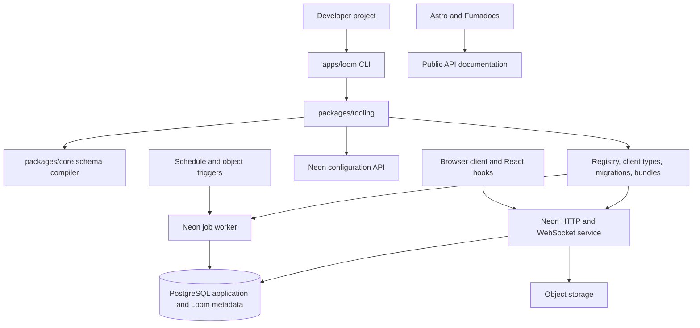
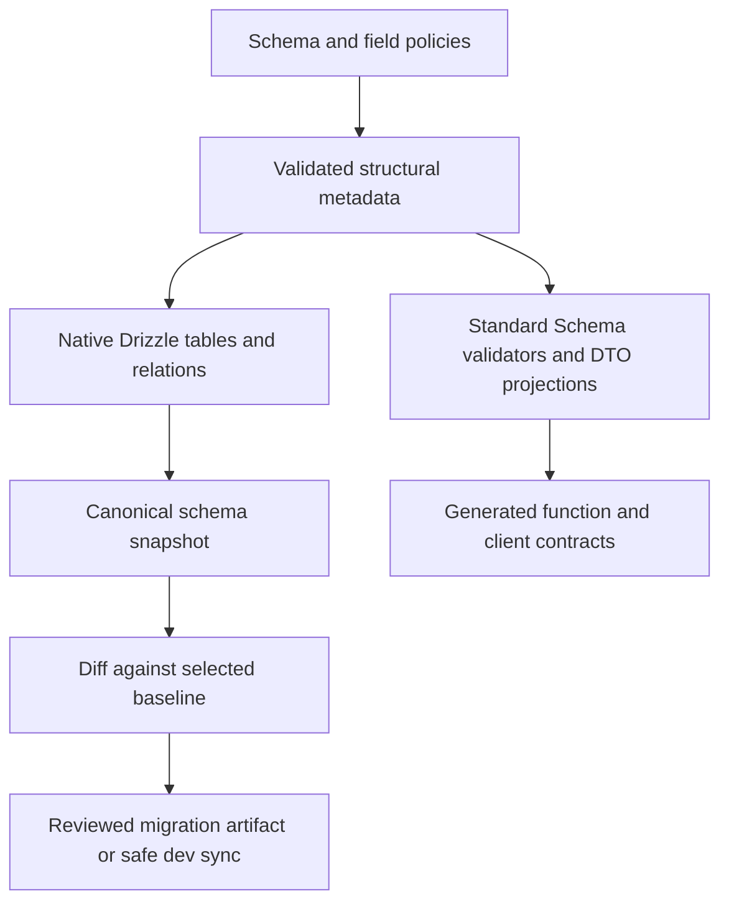
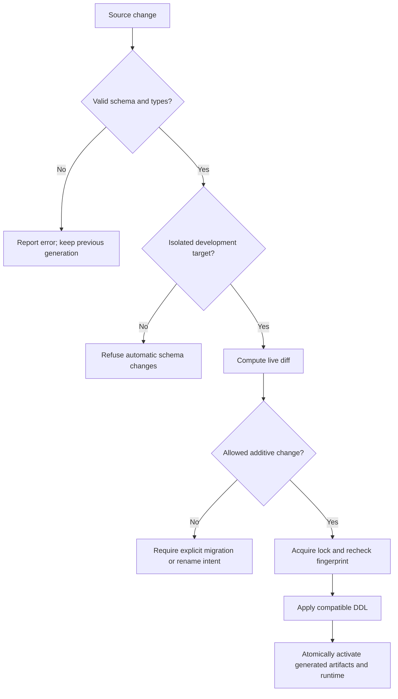
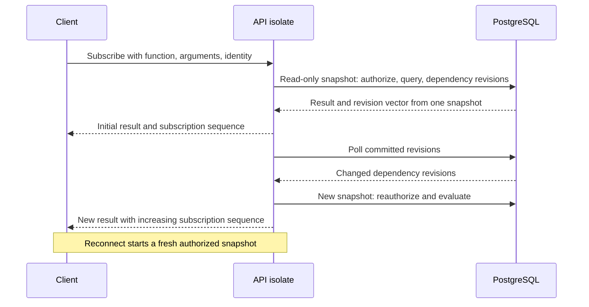
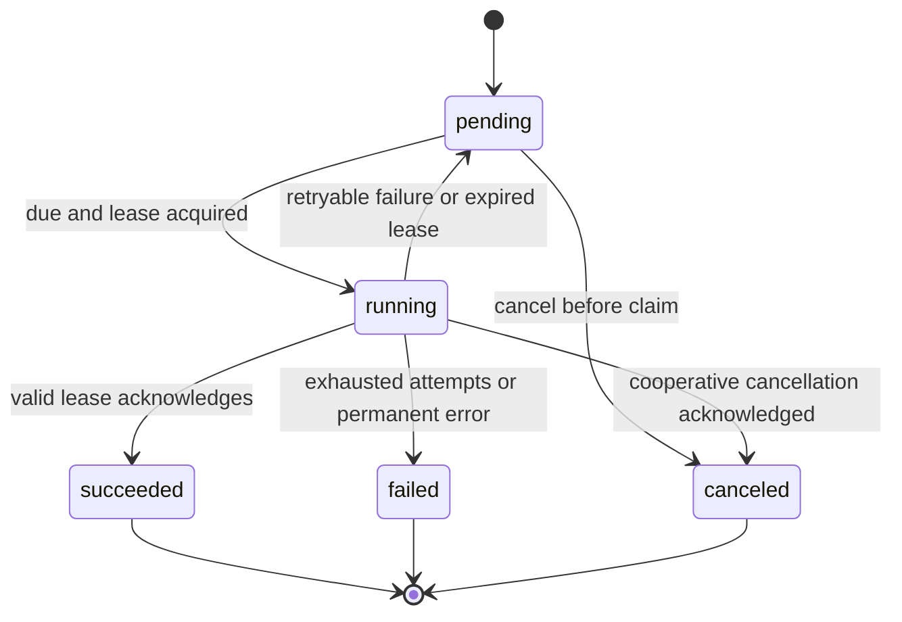
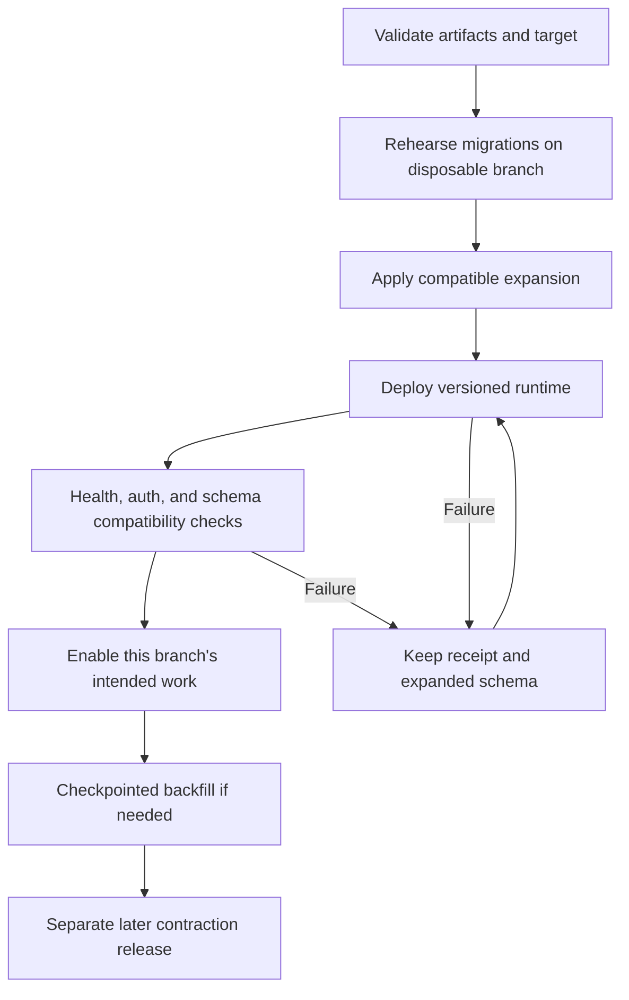

# Loom Full Framework - Plan

## Goal Capsule

- **Objective:** Developers can create, evolve, test, and deploy a typed reactive backend from a filesystem project, with relational data they can inspect and manage in PostgreSQL.
- **Means:** Bun/Turborepo development, a Loom schema and CLI, Drizzle Relations v2, and Neon Functions/Postgres (KTD1-KTD4).
- **Authority:** Requirements own product behavior. Technical decisions own mechanisms within those requirements. Implementation units and examples do not override either.
- **Execution profile:** Phased implementation of the complete framework. Start with workspace and compatibility work, then deliver the application lifecycle and production hardening.
- **Stop conditions:** Stop the affected unit on an unsupported provider capability, unsafe migration ambiguity, broken authorization boundary, or incompatible dependency combination. Report the failing contract rather than silently changing it.
- **Completion ownership:** The implementer delivers the code and verification evidence. A maintainer selects the production project and release namespace and authorizes publication or production activation.

---

## Product Contract

### Summary

Build Loom as a schema-first TypeScript backend framework with its own CLI, generated client, live queries, durable jobs, and a Neon deployment adapter. Deliver it in a Bun/Turborepo monorepo with Astro/Fumadocs documentation, separate unit and end-to-end test packages, and runnable examples.

### Problem Frame

Neon supplies database and execution primitives. Those primitives do not provide the development workflow, schema ownership, typed function registry, migration lifecycle, or subscription semantics developers expect from a Convex-like framework. Loom must own those contracts instead of exposing a collection of unrelated provider commands.

The existing repository is a Bun starter: `package.json`, `bun.lock`, `index.ts`, `tsconfig.json`, and `CLAUDE.md`. There are no framework modules or tests to extend. The starter declares TypeScript `^7` and Bun types `latest`; neither declaration establishes a verified compatibility matrix. No Git repository was present during inspection.

### Key Decisions

- **Plan the complete framework.** Governs R1-R24. (session-settled: user-directed — chosen over a monorepo-foundation-only plan: the user selected the full implementation scope.)
- **Keep the requested workspace folders.** Governs R1-R3. Add reusable library boundaries where needed without moving the requested entry points.
- **Adopt Convex-like authoring with relational ownership.** Governs R4-R11. Preserve PostgreSQL constraints and Drizzle interoperability rather than reproducing Convex storage internals.

### Requirements

**Workspace and documentation**

- R1. Use Bun workspaces and Turborepo with `apps/loom`, `apps/docs`, `packages/ts-config`, `packages/tests`, `packages/e2e`, and example applications under `packages/examples`.
- R2. Build the public documentation with Astro and the documented Fumadocs React-island integration.
- R3. Keep unit tests in an independent package and end-to-end tests in a separate package, with a reproducible locked dependency graph.

**Schema and data ownership**

- R4. Authors declare entities through a compact `defineSchema` callback in a conventional schema entry point, with optional reusable table modules.
- R5. Every entity receives an automatically generated UUIDv7 `_id` and integer millisecond `_createdAt`, both excluded from ordinary client writes and immutable after creation.
- R6. Schema declarations produce typed native Drizzle tables and support current column builders, Relations v2, and relational query v2 without a second handwritten table definition.
- R7. Validation accepts Standard Schema-compatible validators, including supported versions of Zod, Valibot, ArkType, and Effect Schema.
- R8. Table definitions can derive storage, insert, patch, command, and explicit public projection boundaries, inspired by cvx-kit.
- R9. References identify a target entity and enforce database foreign keys, with explicit nullability and deletion behavior.
- R10. Source-controlled schema and migrations define intended structure; PostgreSQL owns persisted data and enforces declared database constraints.
- R11. Runtime credentials cannot alter schema or access migration credentials. Tenant and record authorization remains mandatory even with typed IDs and validators.

**Developer and release lifecycle**

- R12. Loom provides filesystem discovery, configuration, initialization, code generation, development, migration, deployment, and diagnostic commands through its own CLI.
- R13. Saving a valid schema automatically applies safe changes to an isolated development database and refreshes generated artifacts and the local runtime.
- R14. Destructive or ambiguous schema changes stop automatic application with an actionable diff; production uses committed migration artifacts.
- R15. Migration generation and application run through programmatic adapters, without spawning the Drizzle CLI.
- R16. Deployments identify their target, detect drift, record partial progress, and support recovery across database and function updates.

**Runtime and client**

- R17. Authors register typed queries, mutations, actions, and internal functions, with validated inputs and outputs.
- R18. Queries use a consistent read-only database snapshot; mutations commit atomically with bounded transaction retries; actions handle external side effects separately.
- R19. Clients receive typed calls and subscriptions that converge after committed changes, including supported direct SQL writes, and recover after connection loss.
- R20. Authentication is checked at every invocation and subscription lifecycle boundary; internal functions cannot be invoked through the public function API.
- R21. Scheduling persists work transactionally, supports retries and cancellation, and reports failed or delayed work.
- R22. Object-storage integration authorizes access and processes provider events idempotently.

**Operations and completeness**

- R23. Logs and diagnostics expose function, deployment, migration, subscription, and job failures without disclosing credentials or user payloads by default.
- R24. Runnable examples, provider acceptance checks, and operating documentation demonstrate the full author-to-deploy lifecycle.

### Success Criteria

A developer following the published quickstart can create a projects/tasks backend, change its schema during development, generate and replay a release migration, deploy to a disposable Neon branch, and observe an authorized browser subscription update after a mutation. A second developer can reproduce this from the lockfile and committed artifacts without the first developer's local state.

### Key Flows

- F1. **Start a project:** initialize files, validate configuration, bind an explicit development target, generate types, and serve locally. Covers R4, R12-R13.
- F2. **Change a schema:** save, compile, diff, classify safety, acquire a database lock, apply allowed changes, and activate one coherent artifact generation. Covers R10, R13-R15.
- F3. **Release:** generate artifacts from the committed baseline, rehearse them on a disposable database, apply expansion, deploy compatible functions, verify, and enable intended triggers. Covers R14-R16.
- F4. **Live read:** authenticate, read a snapshot and its dependency versions, stream the result, detect a committed change, and reauthorize before refreshing. Covers R18-R20.
- F5. **Deferred work:** commit a job with application data, claim it after its due time, execute a versioned function, then acknowledge or retry. Covers R18, R21.

### Acceptance Examples

- AE1. Covers R4-R9. Defining projects and tasks produces typed task inserts, rejects an invalid project reference, and returns generated system fields after persistence.
- AE2. Covers R13-R15. Adding a nullable description during development updates the database automatically; later migration generation still contains that addition relative to the committed baseline.
- AE3. Covers R14. Renaming a populated column produces an ambiguity that requires an explicit rename mapping, never an automatic drop-and-add.
- AE4. Covers R18, R21. A mutation that rolls back leaves neither its application changes nor its scheduled job committed.
- AE5. Covers R19-R20. A matching row inserted through an authorized SQL connection refreshes a live query; after reconnect, the subscriber receives a fresh authorized result.
- AE6. Covers R16, R21. A preview branch copied from production does not execute inherited jobs or storage handlers against production services.
- AE7. Covers R16. If database expansion succeeds but function deployment fails, retry resumes from recorded state without repeating completed migrations or contracting the schema.
- AE8. Covers R7-R8. A transformed validator output is accepted only if it fits its declared storage type; patch omission does not apply an insert default.

### Scope Boundaries

The initial supported backend is PostgreSQL on Neon Functions. Bun is the development toolchain; server artifacts must run on the provider's supported Node runtime. The first release includes the entire lifecycle in R1-R24, with the bounded guarantees in KTD10-KTD14.

#### Deferred to Follow-Up Work

- Exact Convex compatibility, cross-query globally synchronized snapshots, offline writes, automatic optimistic updates, and a Convex-to-Loom migration product.
- Fine-grained row/range dependency tracking, logical replication, external brokers, and a horizontally partitioned invalidation service.
- A hosted Loom control plane or visual administration dashboard.
- Arbitrary database dialects, arbitrary raw-SQL subscription inference, and automatic conversion of any validator into relational storage.
- Sub-minute scheduling guarantees under cold starts, durable multi-step workflow orchestration, and exactly-once external effects.
- General Drizzle view/materialized-view modeling and advanced PostgreSQL types beyond the first supported schema vocabulary. Reviewed custom migrations remain an escape hatch.

---

## Planning Contract

### Key Technical Decisions

#### Workspace and runtime boundaries

- KTD1. **A CLI application plus two reusable library packages.** `apps/loom` is the executable composition root. `packages/core` contains schema and runtime APIs with separate server, client, React, and Neon subpath exports. `packages/tooling` contains configuration, code generation, migrations, and deployment adapters. Browser exports must not import server or tooling code. This preserves R1 while avoiding dependencies on an application package. Package names are private placeholders until a publishable namespace is chosen. [Turborepo structure](https://turborepo.dev/docs/crafting-your-repository/structuring-a-repository)
- KTD2. **Examples are a grouping directory, not a parent package.** Declare workspace globs for `apps/*`, `packages/*`, and `packages/examples/*`; do not create `packages/examples/package.json`. This avoids nested packages while preserving the requested location. Every example has its own manifest and consumes explicit package exports. [Workspace grouping](https://turborepo.dev/docs/crafting-your-repository/structuring-a-repository#specifying-packages-in-a-monorepo)
- KTD3. **Separate Bun tooling from Node-compatible application code.** Use Bun for installation, scripts, unit tests, and the CLI. Compile runtime libraries to ESM and declarations for Node 24 and browser consumers. Use the Node PostgreSQL adapter for deployed functions; do not ship Bun-only APIs there. Narrow the starter's Bun-only instructions in `CLAUDE.md` to allow Astro/Vite and the Node provider boundary required by R2 and R17. [Neon runtime](https://neon.com/docs/compute/functions/reference/runtime-limits)
- KTD4. **Pin a tested compatibility matrix before building on unstable APIs.** Record exact Bun, Turbo, TypeScript, Drizzle ORM/Kit, Astro, React, Fumadocs, Hono, and Neon package versions after U2. Relations v2 documentation currently directs users to the RC channel; do not use floating RC tags in committed manifests. Bun starter versions are inputs to verify, not a mandate to retain incompatible versions. [Relations v2](https://orm.drizzle.team/docs/relations)
- KTD5. **Cache pure tasks only.** Builds depend on dependency builds and declare outputs. Central tests depend on the libraries they exercise so source changes invalidate their cache. Development tasks are persistent and uncached. Migrations, deploys, cloud checks, and release side effects are uncached. Preserve Turbo's default inputs when adding custom inputs; never cache secrets, local connection state, or deployment receipts. [Task configuration](https://turborepo.dev/docs/crafting-your-repository/configuring-tasks)

#### Schema and configuration

- KTD6. **Loom owns structural metadata and compiles native Drizzle objects.** Keep table names, storage types, constraints, references, indexes, and field policies in an immutable internal representation. Resolve entity identities before resolving references so forward and circular references work. Compile this representation to native table objects used by Drizzle Relations v2. The first vocabulary covers text, boolean, integer, bigint, numeric, UUID, timestamp, JSON, enums, references, indexes, and uniqueness. Unknown types fail explicitly. Preserve `_id` and `_createdAt` SQL names; use a fixed camel-to-snake policy for ordinary fields and reject collisions. [Drizzle declaration](https://orm.drizzle.team/docs/sql-schema-declaration)
- KTD7. **Standard Schema validates values, while Loom describes storage.** Accept Standard Schema v1 at field and function boundaries and expose derived Loom validators through that interface. Validate normalized outputs before encoding to SQL or the wire. A whole-object validator is usable as an explicit function validator, but cannot be generically decomposed into columns or projected masks. Cross-field constraints need separately declared insert/patch validation. This fulfills R7 without claiming structural introspection the standard does not offer. [Standard Schema](https://standardschema.dev/)
- KTD8. **Derive field boundaries from one table declaration.** Support a shorthand fields object and an extended table form with `serverFields`, `commandFields`, and `publicFields`. Reserve system fields automatically. Insert and patch exclude server-owned fields; command schemas use their own allowlist; public DTOs project only their explicit allowlist. Empty public/command declarations grant no fields. Nullable columns follow Drizzle conventions, and `.notNull()` makes them required. Patch absence means unchanged; explicit null is distinct. Adapt cvx-kit's derivation idea, not its Convex validators or extra timestamp fields. [Pinned cvx-kit implementation](https://github.com/ImRLopezAG/cvx-kit/blob/7cbf5c008bb09535c139092ad046bf7003414c55/src/zod-table.ts)
- KTD9. **Require PostgreSQL 18 for the initial database adapter.** Use native database UUIDv7 defaults and database-generated millisecond timestamps stored as bigint. Decode `_createdAt` into a range-checked safe JavaScript integer. Database triggers reject ordinary updates to system fields; import/backfill privileges are separately controlled. References target `_id`, default to restricted deletion, and produce branded TypeScript IDs without treating a brand as authorization. Target preflight must establish PostgreSQL 18 availability before provisioning or adopting a branch. Supporting older versions requires a separate tested UUIDv7 adapter, not a silent UUIDv4 fallback. [PostgreSQL UUID functions](https://www.postgresql.org/docs/18/functions-uuid.html)

Configuration belongs in a consumer's `loom.config.ts`. It describes paths, provider target selection, and operational policy; the schema belongs in `backend/schema.ts`. Optional `backend/relations.ts`, `backend/auth.ts`, `backend/crons.ts`, and `backend/storage.ts` define their respective capabilities. Function modules live below `backend/functions/` and generated artifacts below `backend/_generated/`.

| Configuration area | Initial decision | Validation boundary |
|---|---|---|
| Project | Stable application identity and backend directory | Reject paths escaping the project unintentionally |
| Database | Application namespace, migration directory, PostgreSQL requirement | Reject system namespace collisions |
| Provider | Neon project ID and explicit environment-to-branch selection | Resolve branch IDs before mutations |
| Development | Per-developer branch; safe schema sync enabled | Refuse protected/production targets |
| Preview | Per-preview branch; committed migrations | Disable copied jobs and provider triggers |
| Production | Explicit branch; migration-only mode | Require reviewed artifacts and deploy identity |
| Authentication | Trusted issuers/JWKS, audience where applicable, origin allowlist | Fail closed for invalid identity |
| Realtime | Poll interval, heartbeat, subscription/result limits | Reject invalid or unbounded settings |
| Jobs | Retry policy, maximum attempts, leases, retention | Bound work and report exhausted retries |
| Environment | Named secret references resolved when needed | Redact values; no client-side export by default |

Pure schema inspection, type generation, and documentation builds must work without cloud credentials. Keep resolved local target state under ignored `.loom/`; commit schema, configuration, migration SQL, and migration snapshots. TypeScript configuration files are trusted executable project code, not a sandbox for untrusted input.

#### Runtime, subscriptions, and jobs

- KTD10. **One public HTTP/WebSocket service, with a separate worker entry.** Bundle logical filesystem functions into a versioned registry and dispatch through Hono. Use Neon's native Hono WebSocket adapter and exclude upgrade routes from response-rewriting middleware. Function names derive from relative module path plus export name; imports and helper files do not become endpoints. Internal registration is a separate dispatch capability. The manifest records function kind, visibility, validation contract, and build version. [WebSockets](https://neon.com/docs/compute/functions/websockets)
- KTD11. **Explicit transaction and retry contracts.** Run queries in read-only repeatable-read transactions and mutations in serializable transactions. Retry serialization/deadlock failures with a bounded policy. Mutation handlers must not perform external effects; the framework can constrain its context but cannot sandbox arbitrary Node code. Validate and encode mutation results before commit; failure rolls back application writes, scheduled jobs, and the idempotency record together. Persist idempotency keys and request fingerprints with committed mutation results. Scope keys by deployment, authenticated principal/tenant, and function contract version. Reauthorize before replaying a saved result; a previous successful call does not grant continuing access. Publish a retention window and reject expired retries rather than silently promising deduplication forever. Return a conflict when a key is reused with different input. Action calls do not receive automatic retry guarantees. Their handlers must use external idempotency keys where needed. [PostgreSQL isolation](https://www.postgresql.org/docs/18/transaction-iso.html)
- KTD12. **Start with durable table revisions and polling for live queries.** Install transactional revision triggers on tracked tables, including deletion and truncation. Updating a revision row obtains a database lock, so committed revisions for that table cannot overtake each other. Read query results and dependency revisions in the same snapshot, then compare revisions during polling. Poll once per active isolate for the union of dependencies, not once per socket. Start conservatively with all application tables as dependencies; tighten only with explicit, tested dependency metadata. Include database-backed authorization dependencies in the tracked set. Raw SQL against untracked external tables is ineligible for subscriptions. Reactive handlers may depend only on tracked database state and validated arguments/identity; time, randomness, or external API state has no automatic invalidation guarantee and belongs in ordinary calls unless an explicit tracked refresh mechanism is supplied. Fresh snapshots on reconnect avoid a fragile event cursor. UUIDs and sequence allocation order are never commit-order cursors. This costs write contention on hot tables, accepted for the first release and measured in U17. [Neon cross-isolate guidance](https://neon.com/docs/compute/functions/websockets#cross-isolate-messaging)
- KTD13. **Subscription results are ordered per subscription, not globally.** Coalesce invalidations and prevent an older in-flight evaluation from replacing a newer result. Validate every re-evaluation under its identity, invalidate caches on identity changes, close expired sessions, and clear client results on sign-out. Database-backed authorization changes participate in revision dependencies. External identity revocation follows the configured verifier's semantics; the JWT baseline observes expiry and refresh, not instantaneous remote revocation. Disconnect slow consumers with a resync reason instead of growing queues without bounds.
- KTD14. **PostgreSQL is the durable queue.** A job stores due time, function/build reference, validated arguments, attempts, lease owner/fencing token, execution state, and a unique deduplication key. Mutation scheduling inserts the job in the same transaction as domain writes. Workers claim due jobs with row locks and leases, then execute outside the claim transaction. A stale worker cannot acknowledge a reclaimed lease. Scheduled mutations use the logical job ID as their stable idempotency key across lease owners and attempts; commit their domain changes and execution result atomically so a crash before queue acknowledgement cannot repeat database effects. Delivery is at least once; external effects require idempotency. Native minute-level cron wakes the worker; an optional immediate wake is a latency optimization. Due time is a not-before time, not an exact execution SLA. Cancellation prevents unstarted execution and is cooperative for running work. [Neon schedule triggers](https://neon.com/docs/compute/functions/triggers/schedule)
- KTD15. **Authenticate provider triggers and storage operations explicitly.** Validate the provider-attested trigger header, expected trigger identity/type, target path, and payload. That trust applies only behind Neon's documented edge; local emulation uses a separate development capability. Store invocation IDs before dispatching duplicate-prone work. Storage uploads use authorized intents, bounded object metadata, and short-lived signed access; uploaded objects become application-visible only after verification. Provider events are never treated as end-user authorization. [Trigger contract](https://neon.com/docs/compute/functions/triggers/overview), [Object storage triggers](https://neon.com/docs/compute/functions/triggers/object-storage)

#### Data authority, migrations, and deployment

- KTD16. **Separate application, runtime metadata, and migration authority.** Use an application schema plus a Loom-owned metadata schema. A migration role owns DDL; the runtime role receives only necessary DML/function grants. Use a pinned Node PostgreSQL driver with small pooled connections for ordinary work and a dedicated session for migration locks. Identity is derived from verified requests and placed in transaction-local context. Optional RLS must run under a non-owner, non-BYPASSRLS role. All raw SQL escape hatches remain trusted server operations. [PostgreSQL row security](https://www.postgresql.org/docs/18/ddl-rowsecurity.html)
- KTD17. **Wrap Drizzle's programmatic migration surface behind one adapter.** Separate snapshot generation, diff planning, SQL classification, and execution. Verify the selected ORM/Kit pair against U2 fixtures, including rename hints and ambiguous create/delete changes. The ORM migrator applies artifacts; it does not produce a schema diff. A reported v1 programmatic ambiguity bug makes this a release gate. If the public API cannot meet R15, report the blocker before adopting a pinned, licensed patch/fork. Do not replace it with a subprocess or an unreviewed SQL diff engine. [Migration modes](https://orm.drizzle.team/docs/migrations), [Reported programmatic ambiguity](https://github.com/drizzle-team/drizzle-orm/issues/6053)
- KTD18. **Development sync and release history use different baselines.** Development diffs against the live isolated database. Release generation diffs against the last committed schema snapshot even after development sync. Explicit rename metadata resolves identity changes. Classify additive nullable/defaulted changes separately from required-column backfills, constraint validation, narrowing types, and deletion. Take an advisory lock before applying; recheck the source fingerprint under the lock. Record artifact hashes and drift evidence. Never run migrations in function startup. [Drizzle generation](https://orm.drizzle.team/docs/drizzle-kit-generate)
- KTD19. **Recoverable deployment stages replace cross-service atomicity.** A deploy receipt ties source/build hash, schema compatibility range, migration hashes, provider target IDs, and completed stages together. Apply expand migrations before compatible code, complete backfills with resumable checkpoints, and contract only in a later compatible release. Migration transactions exclude operations PostgreSQL forbids inside them, such as concurrent index creation; those have separate idempotent checks and recovery steps. On failure retain the expanded schema and resume or roll back code to a compatible build. [Concurrent indexes](https://www.postgresql.org/docs/18/sql-createindex.html)
- KTD20. **Use the programmatic Neon configuration runtime.** Resolve IDs and credentials in Loom tooling, then use inspect/plan/apply and branch operations. Keep provider bundling dependencies out of runtime/browser imports. Branch identity is bound into runtime configuration and checked against metadata before running work. A cloned branch must be quarantined, have copied jobs disabled, and receive environment-specific secrets before any worker or trigger is activated. A copied activation row is not proof of authorization. [Neon configuration runtime](https://neon.com/docs/reference/config-runtime), [Configuration](https://neon.com/docs/reference/neon-ts)

### High-Level Technical Design

#### Component relationships



#### Schema data flow and DSL shape

The following grammar is directional authoring guidance; U3-U5 settle exact generic signatures and diagnostics.

```text
Schema := named entity map produced by a schema-builder callback
Entity := Fields | Table(Fields, FieldPolicies, Indexes)
Field := StorageType + Nullability + Default? + Reference? + Validator?
Reference := target entity name + deletion policy
Derived := NativeDrizzleTables + StorageValidator + InsertValidator
           + PatchValidator + CommandValidator + PublicProjection
Relations := native Drizzle v2 declarations over NativeDrizzleTables
```



#### Development safety decisions



#### Subscription protocol



A change between initial evaluation and poll registration is visible through the next revision comparison. Revisions from failed transactions never become visible. Polling is a correctness mechanism; notifications may later reduce latency but cannot replace durable comparison.

#### Durable job states



#### Release lifecycle



### Output Structure

```text
apps/
  loom/
    package.json
    src/cli.ts
    src/commands/
  docs/
    package.json
    astro.config.mjs
    content/docs/
    src/content.config.ts
    src/lib/source.ts
    src/components/
    src/pages/
packages/
  core/
    package.json
    src/schema/
    src/validation/
    src/server/
    src/client/
    src/react/
    src/adapters/neon/
  tooling/
    package.json
    src/config/
    src/codegen/
    src/migrations/
    src/dev/
    src/deploy/
  ts-config/
    package.json
    base.json
    bun.json
    node.json
    browser.json
  tests/
    package.json
    unit/
    types/
    fixtures/
  e2e/
    package.json
    integration/
    browser/
    cloud/
    fixtures/
  examples/
    tasks/
      package.json
      loom.config.ts
      backend/
      migrations/
      src/
    jobs-storage/
      package.json
      loom.config.ts
      backend/
      migrations/
      src/
docs/
  plans/
  architecture/
package.json
bun.lock
turbo.json
CLAUDE.md
```

The `packages/examples` directory has no manifest. Root `docs` holds engineering plans and architecture decisions; `apps/docs/content/docs` holds public product documentation. Generated application artifacts stay inside their owning consumer project.

### Alternatives Considered

- **Put all implementation inside the CLI application:** fewer manifests, but consumers and independent tests would depend on an executable package. KTD1 provides only two additional library packages instead of a package per feature.
- **Use Zod objects as the entire schema language:** convenient shape manipulation, but conflicts with validator independence and cannot fully describe relational constraints. KTD6-KTD8 keep structure explicit.
- **Use LISTEN/NOTIFY as the live-query foundation:** lower idle polling cost in some workloads, but notifications are not durable and Neon documents an always-on database requirement for listeners. KTD12 works with reconnects and scale-to-zero at the cost of polling and revision contention.
- **Start with logical replication:** better long-term change capture, but adds replication lifecycle, retention, and infrastructure before the first usable framework. The revision mechanism has a concrete correctness argument and a measurable capacity gate, so this choice does not require competing implementations before planning.
- **Apply schema directly in production:** shortens the workflow but loses a reviewable baseline and complicates multi-release compatibility. KTD18-KTD19 preserve programmatic application with versioned artifacts.

### Risks and Implementation Gates

| Gate | Evidence needed | Owning unit | Failure behavior |
|---|---|---|---|
| Drizzle compatibility | Native table types, RQB v2, snapshot/diff APIs, rename handling | U2 | Stop dependent adapter work; record exact failing version and API |
| PostgreSQL target | Version 18 and required role/trigger privileges on Neon | U2, U14 | Reject unsupported target before mutation |
| Bun versus Node | Built runtime imports and protocol behavior on Node 24 | U2, U9 | Fix boundary; do not substitute Bun in deployment |
| Fumadocs peers | Astro, React, MDX, Tailwind, and search build together | U2, U18 | Pin compatible versions and record integration constraints |
| Realtime capacity | Contention, pool usage, fan-out, slow-client handling | U17 | Publish tested envelope; do not claim unlimited scaling |
| Neon WebSocket quota | Actual connection/invocation accounting and restart behavior | U17 | Document measured limit or unresolved provider constraint |
| Provider deployment | Trigger API support and partial-failure recovery | U14-U16 | Leave work disabled and surface resumable receipt |
| Public release identity | Package names, registry owner, license, production target | U20 | Local verification can finish; publishing stays blocked |

### System-Wide Impact

Schema changes affect validators, generated types, cached clients, persisted jobs, and deployed function versions. A schema compiler change therefore needs migration and packed-consumer coverage, not only unit tests. Database revision triggers make direct writes observable, but privileged operators can bypass them; disabling triggers falls outside supported live-query behavior and must appear in diagnostics and operating guidance.

Central tests depend on application-facing package exports. Private test hooks, if needed, must be explicit internal exports rather than filesystem imports into another package's source. CLI diagnostics offer structured output and stable exit classes so automation can perform the same operations as a human terminal user. No separate agent API or hosted dashboard is needed for this release.

### Delivery Sequence

1. **Foundation:** U1-U2 establish workspace and compatibility contracts.
2. **Authoring and data lifecycle:** U3-U8 deliver schema, validation, configuration, discovery, migration, and development behavior.
3. **Execution:** U9-U13 deliver runtime, identity, transport, live queries, and durable jobs.
4. **Provider and quality:** U14-U17 deliver deployment, storage, recovery, and capacity evidence.
5. **Product delivery:** U18-U20 complete docs, examples, and release validation. Documentation scaffolding can begin after U1-U2; feature documentation follows its owning units.

---

## Implementation Units

| Unit | Outcome | Primary paths | Depends on |
|---|---|---|---|
| U1 | Bun/Turbo foundation | Root manifests; `packages/ts-config` | None |
| U2 | Dependency and provider compatibility | `packages/e2e/integration/compatibility` | U1 |
| U3 | Schema metadata and compiler | `packages/core/src/schema` | U2 |
| U4 | Validation and field policies | `packages/core/src/validation` | U3 |
| U5 | Drizzle Relations v2 integration | `packages/core/src/server/database` | U3-U4 |
| U6 | Configuration, CLI, and codegen | `apps/loom`; `packages/tooling/src/config` | U3-U5 |
| U7 | Programmatic migrations | `packages/tooling/src/migrations` | U2-U6 |
| U8 | Development watcher | `packages/tooling/src/dev` | U6-U7 |
| U9 | Function runtime and transactions | `packages/core/src/server` | U5-U7 |
| U10 | Authentication and data authority | `packages/core/src/server/auth` | U9 |
| U11 | Client protocol and hooks | `packages/core/src/client`; `src/react` | U6, U9-U10 |
| U12 | Durable live queries | `packages/core/src/server/realtime` | U7, U9-U11 |
| U13 | Durable scheduling | `packages/core/src/server/jobs` | U7, U9-U10 |
| U14 | Neon deployment adapter | `packages/tooling/src/deploy` | U6-U10, U12-U13 |
| U15 | Storage and provider triggers | `packages/core/src/server/storage` | U10, U13-U14 |
| U16 | Deployment recovery and backfills | `packages/tooling/src/deploy`; `src/migrations` | U14-U15 |
| U17 | Operational and capacity proof | `packages/e2e/cloud`; `docs/architecture` | U12-U16 |
| U18 | Astro/Fumadocs site | `apps/docs` | U1-U2; feature units for content |
| U19 | Runnable examples | `packages/examples` | U8-U16 |
| U20 | CI and release validation | `.github/workflows`; package manifests | U17-U19 |

### U1. Establish the workspace and shared tooling

**Goal:** Convert the Bun starter into the requested workspace without discarding existing work.

**Requirements:** R1-R3. **Dependencies:** None.

**Files:** Root `package.json`, `bun.lock`, `turbo.json`, `.gitignore`, `CLAUDE.md`, `README.md`; workspace manifests; `packages/ts-config/{base,bun,node,browser}.json`.

**Approach:** Apply KTD1-KTD5. Inspect the starter entry point before replacing its root module role. Use strict shared options with runtime-specific ambient types; Astro extends its own supported preset. Keep libraries compiled with explicit exports and declarations. Create central test scripts without fake passing tests. Initialize version control during implementation if still absent.

**Patterns to follow:** Bun workspaces and Turbo's package graph conventions.

**Test expectation:** None for declarative configuration itself. Verify installation, workspace discovery, task ordering, output restoration, and package isolation with smoke checks.

**Verification:** All requested workspaces resolve through one lockfile; a clean build does not rely on root Bun globals in Node/browser packages.

### U2. Establish the compatibility baseline

**Goal:** Prove that the external APIs required by this plan are usable together.

**Requirements:** R2, R5-R7, R15, R17. **Dependencies:** U1.

**Files:** Dependency manifests; `packages/tests/types/compatibility.test-d.ts`; `packages/e2e/integration/compatibility/drizzle.test.ts`; `packages/e2e/integration/compatibility/node.test.ts`; `docs/architecture/compatibility.md`.

**Approach:** Apply KTD4, KTD9, and KTD17. Build small retained compatibility fixtures for declaration inference, Relations v2, migration generation/application, and Node exports. Inspect provider capabilities before creating a disposable target. Record exact versions and supported operating environments.

**Test scenarios:**

- Generate a schema with a reference, query it through RQB v2, and retain inferred nullable/required result types.
- Generate an additive change and an explicit rename without terminal interaction.
- Detect unsupported create/delete ambiguity without executing SQL.
- Import packed server artifacts on Node 24 without Bun globals.

**Verification:** The compatibility record contains reproduced results or named blockers; no dependent unit assumes an API that failed this gate.

### U3. Implement schema metadata and native table compilation

**Goal:** Turn compact entity declarations into deterministic typed database models.

**Requirements:** R4-R6, R9-R10. **Dependencies:** U2.

**Files:** `packages/core/src/schema/{define-schema,table,fields,references,compile}.ts`; `packages/tests/unit/schema.test.ts`; `packages/tests/types/schema.test-d.ts`; `packages/e2e/integration/schema.test.ts`.

**Approach:** Apply KTD6 and KTD9. Keep compiler metadata independent from validation libraries. Produce stable schema fingerprints and precise entity/field diagnostics. Allow imported table modules through one canonical schema entry point.

**Test scenarios:**

- Covers AE1. Compile projects/tasks and persist a row with UUIDv7 and millisecond system fields.
- Resolve forward references and a circular pair without losing table-specific types.
- Reject duplicate entities, reserved fields, unknown references, and SQL-name collisions.
- Enforce foreign keys and system-field immutability through a direct SQL connection.

**Verification:** Generated native tables work in the pinned Drizzle APIs without broad type assertions in consumer code.

### U4. Implement validator interoperability and field policies

**Goal:** Derive safe input and output boundaries from schema declarations.

**Requirements:** R7-R8. **Dependencies:** U3.

**Files:** `packages/core/src/validation/{standard-schema,derive,projection,encoding}.ts`; `packages/tests/unit/validation.test.ts`; `packages/tests/types/validation.test-d.ts`.

**Approach:** Apply KTD7-KTD8. Use cvx-kit as the derivation reference. Keep the Standard Schema adapter asynchronous-capable and preserve input/output type differences. Define JSON-safe wire handling explicitly: UUID strings, safe integers, timestamps as documented strings, and bigint/numeric strings where precision requires them.

**Test scenarios:**

- Validate equivalent data with each supported validator library and retain its inferred output.
- Reject unknown keys and attempts to set server-owned fields through ordinary inserts.
- Covers AE8. An omitted patch field remains absent, while explicit null follows storage nullability.
- Public projection excludes an unlisted secret even when the stored row contains it.
- Async refinement failure returns normalized issues; invalid transformed output never reaches SQL encoding.

**Verification:** Validator conformance tests pass without depending on a vendor's object introspection API.

### U5. Integrate Relations v2 and database access

**Goal:** Preserve native Drizzle querying through Loom's schema and transaction context.

**Requirements:** R6, R9, R18. **Dependencies:** U3-U4.

**Files:** `packages/core/src/server/database/{connection,relations,context}.ts`; `packages/tests/types/relations.test-d.ts`; `packages/e2e/integration/relations.test.ts`.

**Approach:** Apply KTD6 and KTD16. Accept explicit native relation declarations over compiled tables. Expose the current relational query API without creating a second query language. Use one selected SQL naming policy across compilation, migration snapshots, and queries.

**Test scenarios:**

- Query tasks with projects using v2 relation filters, nested selection, and ordering.
- Exercise self-relations, multiple references to the same table, and many-to-many junctions.
- Confirm nullable relation types agree with database state and constraints.
- Reject unsupported schema/adapter combinations before opening a production connection.

**Verification:** No v1 relation API is required by the quickstart or public package contract.

### U6. Build configuration, the CLI, and generated contracts

**Goal:** Give authors one filesystem-oriented entry point for framework operations.

**Requirements:** R12, R17, R23. **Dependencies:** U3-U5.

**Files:** `apps/loom/src/cli.ts`, `apps/loom/src/commands/`; `packages/tooling/src/config/`; `packages/tooling/src/codegen/`; `packages/tests/unit/config.test.ts`; `packages/tests/unit/registry.test.ts`; `packages/e2e/integration/cli.test.ts`.

**Approach:** Use the configuration table and KTD10. Provide initialize, development, generation, schema inspection/diff, migration generation/application/status, deployment plan/application/status, and diagnostics command families. Commands delegate to programmatic tooling services. Generate types and manifests atomically, with deterministic names and hashes. Include structured output, target identity, exit classes, and noninteractive failure for missing required values.

**Test scenarios:**

- Initialize into an empty directory and refuse to overwrite an existing user schema.
- Discover registered exports while ignoring helpers and generated directories.
- Detect duplicate routes, stale generated versions, and invalid configuration paths.
- Run code generation without cloud credentials and without importing deployment-only dependencies.
- Produce equivalent human and structured diagnostic results for a failed configuration.

**Verification:** A consumer imports generated public references while internal references remain unavailable to browser code.

### U7. Implement migrations and database bootstrap

**Goal:** Produce and apply auditable schema evolution through code.

**Requirements:** R10-R11, R14-R16. **Dependencies:** U2-U6.

**Files:** `packages/tooling/src/migrations/{adapter,planner,classifier,runner,history,bootstrap}.ts`; `packages/tests/unit/migration-plan.test.ts`; `packages/e2e/integration/migrations.test.ts`; migration fixtures under `packages/e2e/fixtures/migrations/`.

**Approach:** Apply KTD16-KTD18. Bootstrap roles, namespaces, and framework metadata under the migration identity. Keep framework metadata migrations versioned separately from application migrations. Validate custom SQL artifacts and mark nontransactional operations explicitly.

**Test scenarios:**

- Covers AE2. Generate the same release diff before and after live development sync.
- Covers AE3. Preserve data during an explicit rename and reject an unresolved rename guess.
- Two concurrent migration runners produce one applied history entry.
- Detect altered artifact hashes, unexpected live drift, and a required field with unbackfilled rows.
- Recover from a failed transactional migration without recording it as applied.

**Verification:** Empty-database replay and upgrade from the previous fixture baseline converge on the intended schema.

### U8. Implement automatic development updates

**Goal:** Make source saves update a development backend coherently.

**Requirements:** R12-R15. **Dependencies:** U6-U7.

**Files:** `packages/tooling/src/dev/{watcher,coordinator,generation}.ts`; `apps/loom/src/commands/dev.ts`; `packages/tests/unit/dev-coordinator.test.ts`; `packages/e2e/integration/dev.test.ts`.

**Approach:** Implement F2 and KTD18. Debounce edits, serialize application, discard stale compilations, and ignore generated-file events. Build candidate artifacts before DDL. Retain the last working runtime on compile failure; after compatible DDL succeeds, a runtime-start failure is reported without attempting a destructive schema rollback.

**Test scenarios:**

- Add a nullable field while serving requests and activate the matching schema/types generation.
- Save three revisions rapidly and ensure an older build cannot replace the newest generation.
- Fail compilation without changing the database or generated artifacts.
- Refuse auto-sync to a protected target and surface a destructive diff without executing it.
- Stop and restart the watcher without leaving a migration lock or child runtime behind.

**Verification:** F1-F2 work from a fresh consumer project, including recovery after a failed edit.

### U9. Implement function execution and transaction boundaries

**Goal:** Execute registered functions with the guarantees in R17-R18.

**Requirements:** R17-R18, R23. **Dependencies:** U5-U7.

**Files:** `packages/core/src/server/{functions,registry,dispatch,transactions,idempotency}.ts`; `packages/core/src/adapters/neon/http.ts`; `packages/tests/unit/dispatch.test.ts`; `packages/e2e/integration/transactions.test.ts`.

**Approach:** Apply KTD10-KTD11. Validate arguments before execution. Validate and encode mutation outputs inside the transaction before commit, including the saved idempotent response; validate query/action outputs before returning them. Scope database access to the active context. Internal mutation helpers reuse the current transaction instead of opening an independent nested commit. Attach request IDs and redact internal error details at the public boundary.

**Test scenarios:**

- Reject writes from a query and confirm multi-read snapshot consistency.
- Retry a serialization conflict without producing two committed results.
- Replay a mutation idempotency key after a lost response and return the saved result.
- Reject the same key with different arguments; prevent replay across identities and after access revocation.
- Return an invalid mutation output after domain writes and scheduling; verify all writes roll back without leaking an open connection.

**Verification:** Real PostgreSQL concurrency tests establish behavior; mocks alone are insufficient.

### U10. Implement identity and data-access authority

**Goal:** Enforce public/internal and user/tenant boundaries consistently.

**Requirements:** R11, R20. **Dependencies:** U9.

**Files:** `packages/core/src/server/auth/{verify,policy,context}.ts`; `packages/core/src/adapters/neon/auth.ts`; `packages/tests/unit/auth.test.ts`; `packages/e2e/integration/authorization.test.ts`.

**Approach:** Apply KTD13 and KTD16. Implement configurable JWT verification and a Neon Auth adapter. Enforce trusted issuer, applicable audience, expiration, and origin policy. Derive ownership from verified identity. For browser WebSockets, use a short-lived one-use connection ticket minted by an authenticated HTTP request; store ticket redemption durably and keep it out of logs.

**Test scenarios:**

- Reject expired, wrong-issuer, wrong-audience, and replayed connection credentials.
- Prevent a user from selecting another tenant through arguments or forged IDs.
- Fail a public attempt to call an internal function.
- Reuse a pooled connection across tenants without retaining transaction-local identity.
- Verify the runtime role cannot perform DDL and cannot bypass enabled RLS.

**Verification:** HTTP, WebSocket, internal worker, and direct database roles have documented, tested authority boundaries.

### U11. Implement the client protocol and React bindings

**Goal:** Expose typed calls and lifecycle-aware client state.

**Requirements:** R17, R19-R20. **Dependencies:** U6, U9-U10.

**Files:** `packages/core/src/client/{transport,protocol,cache,reconnect}.ts`; `packages/core/src/react/{provider,hooks}.tsx`; `packages/tests/unit/client.test.ts`; `packages/tests/types/client.test-d.ts`; `packages/e2e/browser/client.spec.ts`.

**Approach:** Version the wire protocol and define stable error classes and codecs from U4. Key client cache entries by deployment, function version, canonical arguments, and identity partition. Implement request cancellation, token refresh, reconnect backoff, loading/error states, and idempotency-key retention across mutation transport retries.

**Test scenarios:**

- Infer function arguments and results through the generated client without importing server implementations.
- Clear cached results on sign-out and prevent cross-identity reuse.
- Reject an incompatible protocol version with a recoverable upgrade message.
- Disconnect during a mutation response and retry using the same idempotency key.

**Verification:** A browser consumer uses packed client/React exports with no server credentials or Node-only imports in its bundle.

### U12. Implement persistent invalidation and subscriptions

**Goal:** Keep authorized live-query results current across processes and reconnects.

**Requirements:** R19-R20. **Dependencies:** U7, U9-U11.

**Files:** `packages/core/src/server/realtime/{revisions,poller,subscriptions,evaluation}.ts`; framework migration artifacts; `packages/tests/unit/subscriptions.test.ts`; `packages/e2e/integration/realtime.test.ts`; `packages/e2e/browser/realtime.spec.ts`.

**Approach:** Apply KTD12-KTD13 and F4. Maintain one polling coordinator per isolate with active subscriptions. Version schema generations so active subscriptions cannot silently retain obsolete dependency metadata. Read from the primary database; replica lag is outside this protocol. Use heartbeats and bounded connection/message/subscription limits.

**Test scenarios:**

- Covers AE5. Insert a newly matching row through direct SQL and refresh a previously empty result.
- Commit an update between initial snapshot and subscription registration without losing it.
- Update multiple tables concurrently and handle deadlock/serialization failures correctly.
- Roll back a writer and ensure no committed result is published from that write.
- Change authorization data, truncate a tracked table, restart an isolate, and reconnect a client.
- Delay one evaluation so it completes after a newer result; the client never regresses.

**Verification:** Two independent API processes observe the same committed changes, with bounded queues and explicit resync after disconnect.

### U13. Implement durable jobs and cron dispatch

**Goal:** Schedule recoverable work linked to application transactions.

**Requirements:** R18, R21. **Dependencies:** U7, U9-U10.

**Files:** `packages/core/src/server/jobs/{schedule,claim,execute,lease,cancel}.ts`; worker entry module; framework migrations; `packages/tests/unit/jobs.test.ts`; `packages/e2e/integration/jobs.test.ts`.

**Approach:** Apply KTD14 and F5. Store validated function versions and bounded retry policy. Define missed-cron behavior as one persisted job per received occurrence with duplicate suppression; do not invent provider replay guarantees for occurrences never delivered. Retain failed work for inspection and explicit replay.

**Test scenarios:**

- Covers AE4. Roll back a scheduling mutation and observe no runnable job.
- Crash after claim and recover after lease expiration.
- Reject acknowledgement from a worker with an old fencing token.
- Crash after a scheduled mutation commits but before acknowledgement, then reclaim the lease; verify the stable job key prevents repeated domain writes.
- Deliver the same cron occurrence twice and execute one logical queued job.
- Cancel before claim and during execution with documented distinct outcomes.
- Keep a job referencing an unavailable build failed or pending with a diagnostic, never dispatch it to an incompatible handler.

**Verification:** Queue recovery works after process termination and does not depend on `waitUntil` or process memory.

### U14. Implement the Neon provision and deploy adapter

**Goal:** Deploy the compiled framework through Loom's own tooling.

**Requirements:** R12, R16-R17, R21, R23. **Dependencies:** U6-U10, U12-U13.

**Files:** `packages/tooling/src/deploy/neon/{target,plan,apply,bundle,triggers}.ts`; `apps/loom/src/commands/deploy.ts`; `packages/tests/unit/neon-plan.test.ts`; `packages/e2e/cloud/deploy.test.ts`.

**Approach:** Apply KTD19-KTD20. Use the Neon programmatic runtime and, where its typed surface lacks a needed trigger operation, a narrow documented Neon API adapter. Compile separate API and worker entry points. Verify runtime-compatible driver and WebSocket wiring. Persist provider resource IDs and redact deployment environment values.

**Test scenarios:**

- A dry run identifies changes without mutating resources.
- Deploy to a disposable branch and call a typed query through its public endpoint.
- Covers AE6. Clone a branch containing jobs and refuse worker execution before branch-specific activation.
- Reject a project/branch mismatch and preserve a receipt after an API failure.
- Validate the WebSocket upgrade with HTTP CORS middleware enabled only on ordinary routes.

**Verification:** Cloud receipts identify the branch, build, schema compatibility, and enabled triggers; cleanup removes only resources created by the test.

### U15. Implement object storage and event ingestion

**Goal:** Authorize file access and route storage events into durable work.

**Requirements:** R20-R22. **Dependencies:** U10, U13-U14.

**Files:** `packages/core/src/server/storage/{intents,access,events}.ts`; `packages/core/src/adapters/neon/triggers.ts`; framework migrations; `packages/tests/unit/storage.test.ts`; `packages/e2e/cloud/storage.test.ts`.

**Approach:** Apply KTD15. Bind object keys to authenticated upload intents and branch identity. Reconcile upload metadata before exposing records. Treat storage and SQL as separate transactions with explicit pending/ready/failed states and orphan cleanup. Queue side-effecting handlers rather than holding the trigger request open for long work.

**Test scenarios:**

- Deny another tenant's upload/read request and reject an unbound object key.
- Process duplicate or reordered notifications without duplicate application effects.
- Fail metadata verification and retain a diagnosable pending/failed state.
- Reject a forged trigger request outside the trusted provider path.
- Retry database failure after upload without exposing an unverified object.

**Verification:** The jobs/storage example demonstrates authorized upload and idempotent downstream processing on a disposable branch.

### U16. Implement deployment recovery and resumable backfills

**Goal:** Evolve live data without assuming atomic database and code deployment.

**Requirements:** R14-R16, R21, R23. **Dependencies:** U14-U15.

**Files:** `packages/tooling/src/deploy/{receipt,resume,compatibility}.ts`; `packages/tooling/src/migrations/{backfill,nontransactional}.ts`; `packages/e2e/integration/deploy-recovery.test.ts`; `docs/architecture/deployment-recovery.md`.

**Approach:** Apply KTD19. Checkpoint backfills by a stable key and make batch writes idempotent. Keep old function artifacts available while queued jobs or supported clients depend on them, or explicitly drain/rewrite those dependencies before removal. Require contraction preconditions that prove old readers/writers are gone.

**Test scenarios:**

- Covers AE7. Resume after expansion succeeds and function deployment fails.
- Interrupt and resume a backfill without skipping or duplicating rows.
- Recover a failed nontransactional index operation from inspected database state.
- Reject contraction while old queued jobs or incompatible live connections remain.
- Roll back code while preserving compatible expanded data.

**Verification:** A rehearsal upgrades a populated prior-release fixture and survives injected failure at each deployment boundary.

### U17. Establish operational limits and cloud acceptance

**Goal:** Define the supported operating envelope with evidence.

**Requirements:** R19, R21, R23-R24. **Dependencies:** U12-U16.

**Files:** `packages/core/src/server/observability.ts`; `packages/e2e/cloud/{lifecycle,capacity,failures}.test.ts`; `docs/architecture/operating-limits.md`; diagnostics modules.

**Approach:** Instrument query evaluation, revision polling, retry count, connection count, pool wait, job age, lease expiry, and deployment stages. Measure revision-row contention and database load while subscribers are active. Account for Neon's documented runtime limits and provider billing; record actual WebSocket quota behavior instead of assuming sockets are free or unlimited.

**Test scenarios:**

- Terminate API and worker processes and verify reconnect and lease recovery.
- Simulate provider throttling and respect retry timing without a retry storm.
- Exercise a slow client and demonstrate bounded memory and deterministic resync.
- Run increasing concurrent writes/subscriptions and record latency, connection, and contention curves.
- Inspect logs and artifacts for tokens, connection strings, and user payload leakage.

**Verification:** Publish the measured envelope, test workload, environment, and remaining provider uncertainties. No undocumented numerical performance SLA becomes a release claim.

### U18. Build the Astro and Fumadocs documentation site

**Goal:** Publish a usable authoring and operating guide for Loom.

**Requirements:** R2, R24. **Dependencies:** U1-U2; relevant feature units for final content.

**Files:** `apps/docs/astro.config.mjs`; `apps/docs/src/content.config.ts`; `apps/docs/src/lib/source.ts`; `apps/docs/src/components/{layout.astro,docs.tsx,search.tsx}`; `apps/docs/src/pages/[...slug].astro`; `apps/docs/src/pages/api/search.ts`; `apps/docs/src/styles/global.css`; `apps/docs/content/docs/`; `packages/e2e/browser/docs.spec.ts`.

**Approach:** Follow the official Astro integration with React, MDX, Tailwind 4, content collections, a Fumadocs source adapter, static routes, and a static search endpoint. Ensure the search payload matches the selected Fumadocs client. Keep public content separate from engineering plans. Document setup, schemas, relations, validators, functions, auth, migrations, development sync, subscriptions, jobs, storage, deployment, and limits. Derive checked snippets from example sources where practical. [Fumadocs Astro integration](https://www.fumadocs.dev/docs/manual-installation/astro)

**Test scenarios:**

- Build and render the quickstart, a nested route, and a not-found page.
- Search for a documented function and navigate to the correct page.
- Navigate client-side between pages and retain correct sidebar state and heading links.
- Verify keyboard search and mobile navigation without hydration errors.
- Compile maintained code examples against the packed public API.

**Verification:** Documentation builds without Neon credentials and links to implemented behavior with accurate limitations.

### U19. Deliver runnable consumer examples

**Goal:** Demonstrate the complete framework through applications consuming public exports.

**Requirements:** R1, R4-R24. **Dependencies:** U8-U16.

**Files:** `packages/examples/tasks/`; `packages/examples/jobs-storage/`; `packages/e2e/browser/tasks.spec.ts`; `packages/e2e/integration/example-lifecycle.test.ts`.

**Approach:** Build a small React projects/tasks app using the requested compact schema, native relations, and live query hooks. Build a second app around authorized uploads and durable processing. Give each example independent config and migration artifacts. Both support local development with isolated PostgreSQL; provider-specific checks use disposable Neon branches.

**Test scenarios:**

- Covers AE1-AE2. Create a project/task, evolve the schema, and replay its release migration elsewhere.
- Covers AE5. Observe another client's committed task change and recover after disconnection.
- Authorize upload, schedule processing, and show retry/failure state without exposing another user's data.
- Copy an example outside the monorepo, install packed artifacts, and run it without workspace aliases.

**Verification:** The quickstart path succeeds using the same artifacts intended for release.

### U20. Add CI and validate release artifacts

**Goal:** Make clean installs and releases reproducible without hiding provider checks.

**Requirements:** R3, R23-R24. **Dependencies:** U17-U19.

**Files:** `.github/workflows/ci.yml`; `.github/workflows/cloud-acceptance.yml`; `.github/workflows/release.yml`; package manifests; `packages/e2e/integration/packed-consumer.test.ts`; `README.md`.

**Approach:** Use KTD5. Run frozen installs, type/build checks, central unit tests, PostgreSQL integration tests, browser tests, and packed-consumer checks. Run credentialed cloud acceptance separately with branch cleanup and explicit availability reporting. Keep release publication in an authorized CI workflow. Do not enable registry publishing until namespace, license, and credentials are settled.

**Test scenarios:**

- Rebuild from a clean checkout and restore generated build outputs from Turbo cache correctly.
- Change a core API and verify central tests/types and consumers cannot return stale cached success.
- Install packed libraries in Bun, Node 24, and browser consumers with no monorepo source paths.
- Ensure an untrusted pull request cannot access provider or publication secrets.
- Report cloud tests as skipped when credentials are absent, not passed.

**Verification:** A release candidate has package contents, declaration checks, consumer results, documentation build, and provider acceptance recorded separately.

---

## Verification Contract

No runtime tests are executed while authoring this plan. The implementation must create the following checks; these are required outcomes, not claims about the current starter.

| Check | Scope | Completion evidence |
|---|---|---|
| Workspace smoke | U1 | Frozen Bun install, discovered workspaces, correct Turbo graph and output restoration |
| Compatibility | U2 | Exact version matrix and passing native API fixtures |
| Unit and type checks | U3-U13 | Central Bun unit tests and positive/negative TypeScript consumer fixtures |
| Database integration | U3, U5, U7-U10, U12-U13, U16 | PostgreSQL 18 constraints, concurrency, role isolation, and recovery |
| Browser | U10-U12, U18-U19 | Auth transitions, subscriptions, docs navigation/search, and examples |
| Cloud acceptance | U14-U17 | Disposable Neon deployment, trigger/storage checks, restart recovery, cleanup receipt |
| Migration rehearsal | U7, U16 | Clean replay and populated previous-version upgrade with failure injection |
| Artifact validation | U19-U20 | Packed package consumers under Bun, Node 24, and browser builds |
| Capacity | U17 | Workload and measured latency/contention/connection envelope |

Pure unit checks require no provider credentials. Real database tests belong to `packages/e2e/integration`; cloud tests are explicitly separate. Browser tests may use Playwright even though unit tests use Bun. Test orchestration must tear down only resources it created and retain failure receipts before cleanup.

### Requirement Trace

| Requirements | Primary units |
|---|---|
| R1-R3 | U1, U18-U20 |
| R4-R6, R9 | U2-U3, U5 |
| R7-R8 | U4 |
| R10-R11 | U7, U10 |
| R12-R13 | U6, U8, U14 |
| R14-R16 | U7-U8, U14, U16 |
| R17-R18 | U9, U11, U13 |
| R19-R20 | U10-U12, U17 |
| R21-R22 | U13-U16 |
| R23-R24 | U6, U9, U14, U17-U20 |

---

## Definition of Done

- Every implementation unit meets its verification outcome, with relevant acceptance examples enforced by executable tests.
- The success-criteria journey works from a clean consumer directory and a disposable Neon branch.
- Schema compilation, generated client contracts, migration history, and deployed manifests identify compatible versions.
- Database and provider failures leave diagnosable, recoverable states; preview isolation and authorization checks pass.
- Documentation states the tested limits for subscriptions, scheduling, validators, and direct SQL writes.
- Experimental code, dead adapters, temporary fixtures, and abandoned approaches are removed from the deliverable.
- No production deployment or registry publication is reported complete without its own target-specific evidence. Release identity remains a publication prerequisite, not a reason to skip local implementation verification.

---

## Appendix

### Documentation References

References checked for planning on 2026-09-22. Recheck version-sensitive APIs at U2 and before release.

| Area | Reference | Plan use |
|---|---|---|
| Turborepo | [Crafting your repository](https://turborepo.dev/docs/crafting-your-repository) | Workspace foundation |
| Turborepo | [Repository structure](https://turborepo.dev/docs/crafting-your-repository/structuring-a-repository) | KTD1-KTD2 |
| Turborepo | [Configuring tasks](https://turborepo.dev/docs/crafting-your-repository/configuring-tasks) | KTD5 |
| Bun | [Workspaces](https://bun.com/docs/pm/workspaces) | U1 |
| Fumadocs | [Astro manual integration](https://www.fumadocs.dev/docs/manual-installation/astro) | U18 |
| Drizzle | [Schema declaration](https://orm.drizzle.team/docs/sql-schema-declaration) | KTD6, U3 |
| Drizzle | [Relations](https://orm.drizzle.team/docs/relations) | U2, U5 |
| Drizzle | [Relational queries](https://orm.drizzle.team/docs/rqb) | U5 |
| Drizzle | [Migrations](https://orm.drizzle.team/docs/migrations) | KTD17-KTD18 |
| Drizzle | [Migration generation](https://orm.drizzle.team/docs/drizzle-kit-generate) | U7 |
| Drizzle | [Programmatic ambiguity issue](https://github.com/drizzle-team/drizzle-orm/issues/6053) | Compatibility risk, not proof every release is broken |
| Validation | [Standard Schema](https://standardschema.dev/) | KTD7 |
| cvx-kit | [Pinned table implementation](https://github.com/ImRLopezAG/cvx-kit/blob/7cbf5c008bb09535c139092ad046bf7003414c55/src/zod-table.ts) | KTD8 |
| Neon | [Functions getting started](https://neon.com/docs/compute/functions/get-started) | API entry and deploy flow |
| Neon | [Deploy functions](https://neon.com/docs/compute/functions/deploy) | U14 |
| Neon | [Authentication](https://neon.com/docs/compute/functions/authentication) | U10 |
| Neon | [Environment variables](https://neon.com/docs/compute/functions/environment-variables) | Secret/config boundary |
| Neon | [WebSockets](https://neon.com/docs/compute/functions/websockets) | U12, U14 |
| Neon | [Runtime limits](https://neon.com/docs/compute/functions/reference/runtime-limits) | KTD3, U17 |
| Neon | [Trigger overview](https://neon.com/docs/compute/functions/triggers/overview) | U13-U15 |
| Neon | [Schedule triggers](https://neon.com/docs/compute/functions/triggers/schedule) | KTD14 |
| Neon | [Object-storage triggers](https://neon.com/docs/compute/functions/triggers/object-storage) | KTD15 |
| Neon | [Configuration runtime](https://neon.com/docs/reference/config-runtime) | KTD20 |
| Neon | [neon.ts configuration](https://neon.com/docs/reference/neon-ts) | U14 |
| PostgreSQL | [UUID functions](https://www.postgresql.org/docs/18/functions-uuid.html) | KTD9 |
| PostgreSQL | [Transaction isolation](https://www.postgresql.org/docs/18/transaction-iso.html) | KTD11 |
| PostgreSQL | [Row security](https://www.postgresql.org/docs/18/ddl-rowsecurity.html) | KTD16 |
| PostgreSQL | [CREATE INDEX](https://www.postgresql.org/docs/18/sql-createindex.html) | KTD19 |
| PostgreSQL | [NOTIFY](https://www.postgresql.org/docs/current/sql-notify.html) | Alternative analysis |
