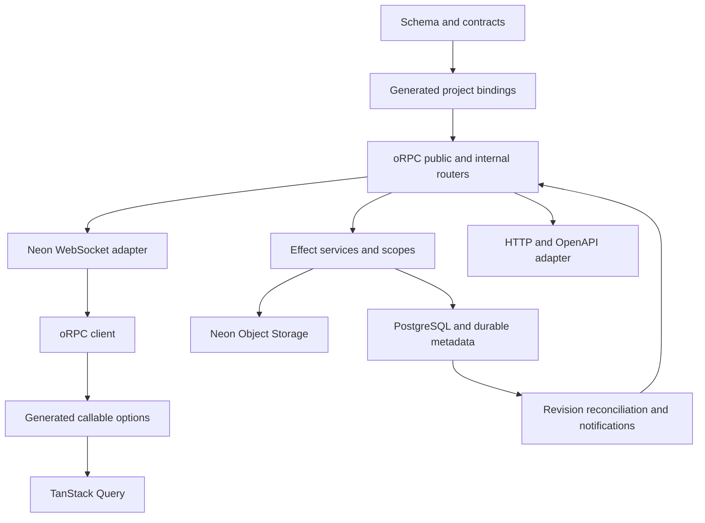
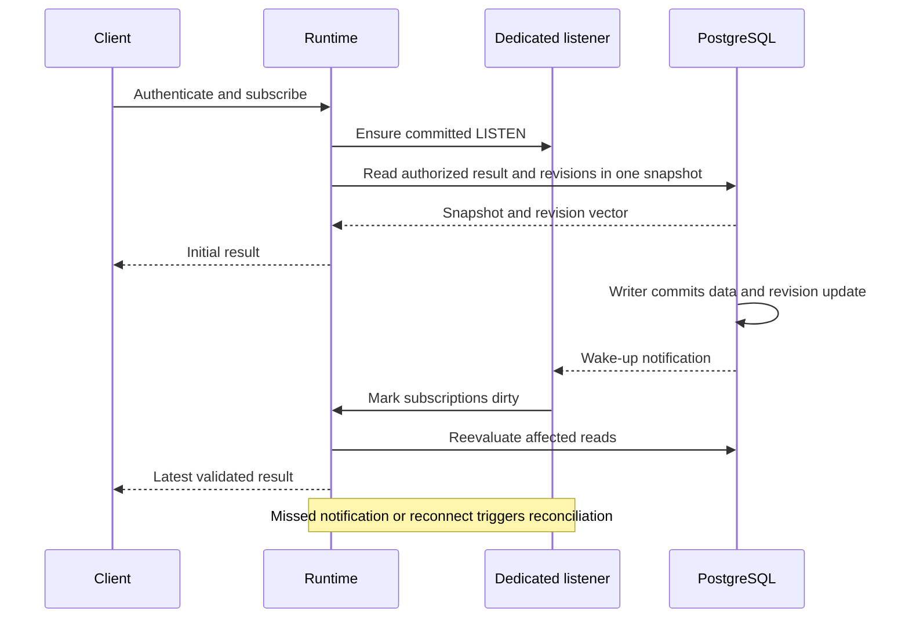
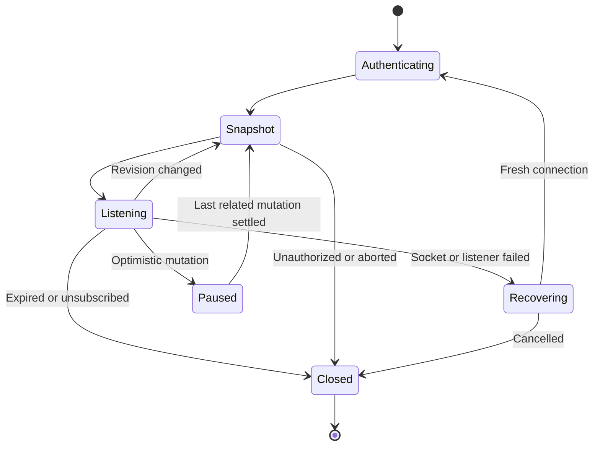
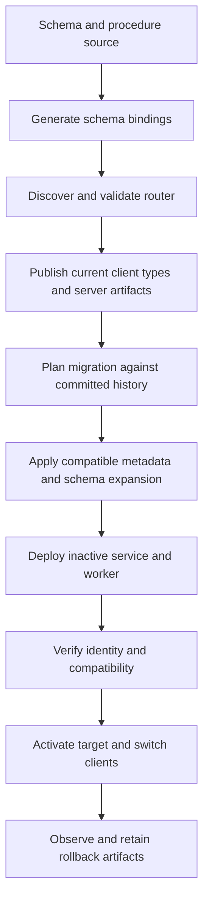
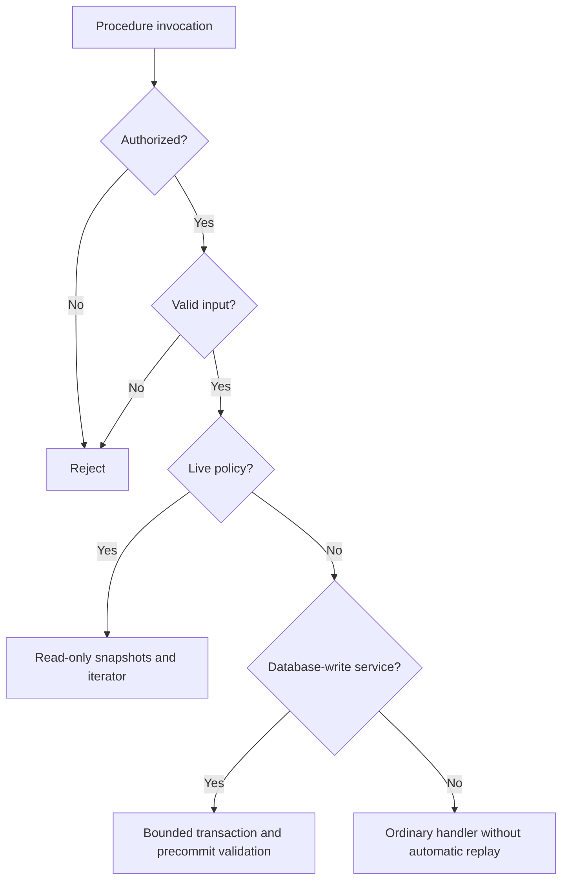

# Loom oRPC and Effect Framework Core - Plan

## Goal Capsule

- **Objective:** Developers can build and deploy typed, reactive Neon applications through one coherent Loom API, with native ecosystem integrations and verified data safety.
- **Means:** oRPC procedures and contracts, Effect services, PostgreSQL change tracking, and generated TanStack Query options (R1-R6; KTD1-KTD9).
- **Authority:** User decisions and this Product Contract govern behavior. KTDs govern implementation within those constraints. Units and examples cannot weaken either. This plan replaces the old endpoint/client architecture; the preservation map below carries forward the database and operational guarantees from `docs/plans/2026-09-22-1141-feat-loom-full-framework-plan.md`.
- **Execution profile:** Breaking pre-release migration, dependency-ordered work, characterization before replacement, real Neon acceptance before completion. Keep version `0.0.0`.
- **Stop conditions:** Stop the affected phase on incompatible dependencies, failure to preserve data or authorization, or unresolved provider requirements. Missing cloud access blocks cloud acceptance, not independent local implementation. Never count skipped checks as passes.
- **Completion owner:** The implementing agent completes the Verification Contract, removes abandoned code, and records evidence outside this plan. Publishing packages and promoting a protected production branch are separate actions, not completion requirements.

---

## Product Contract

### Summary

Replace Loom's custom function protocol with oRPC throughout server and client. Preserve the filesystem workflow and Neon data guarantees while making Effect services, live updates, contracts, and native TanStack options work together with minimal application boilerplate.

### Problem Frame

Loom currently maintains its own function registry, transport messages, streaming bridge, and query option types. Application authors encounter framework-specific abstractions where the desired ecosystem already supplies procedures, routers, middleware, contracts, and client utilities. Previous Neon acceptance verifies the current implementation, not the proposed replacement.

### Key Decisions

- **Adopt oRPC as the public procedure model.** Governs R1, R2, R6. (session-settled: user-directed — chosen over adding only an oRPC transport adapter: use one end-to-end API model.)
- **Use native TanStack Query behind callable generated methods.** Governs R3, R9. (session-settled: user-directed — chosen over custom query state and explicit option-wrapper calls: preserve familiar options with less boilerplate.)
- **Use Effect substantially on the server.** Governs R4. (session-settled: user-directed — chosen over a transport-only redesign: make service composition and resource ownership explicit.)
- **Accept the breaking change and selected prerelease channels.** Governs R13, R14. (session-settled: user-approved — chosen over preserving the old RPC API: the framework remains pre-release.)
- **Require hosted Neon proof.** Governs R10-R12, R15. (session-settled: user-directed — chosen over local-only acceptance: deployment, authentication, and object storage must work on the actual provider.)

### Requirements

**Authoring and types**

- R1. Authors implement ordinary oRPC procedures and nested routers, using Promise handlers or Effect handlers without Loom query/mutation/action registration wrappers.
- R2. Generated project bindings supply typed tables, validators, identity, relations, and services without repeating schema definitions at each handler; no-input handlers and inferred output types remain supported.
- R3. Generated methods directly return native-compatible TanStack options, accepting one options object with input and caller overrides; no required queryOptions/mutationOptions suffix or wrapper at call sites.
- R4. Effect owns infrastructure services and bounded execution lifetimes; browser consumers need not adopt Effect.
- R5. Inputs receive runtime validation before work begins, and declared or derived output contracts validate before database commit. Inferred types alone must not be described as runtime validation.
- R6. HTTP/OpenAPI and WebSocket entry points share procedure contracts, authorization, and declared errors; public clients and schemas exclude internal procedures.

**Data and live behavior**

- R7. PostgreSQL owns persisted state, constraints, and committed change metadata, including supported writes outside Loom.
- R8. Live reads converge after committed changes and reconnects, with consistent snapshots, current authorization, bounded resources, and no repeated external side effects hidden inside automatic retries.
- R9. Native optimistic-update callbacks remain available, with a documented way to prevent incoming live results from overwriting pending edits and to recover after failures.
- R10. Existing application data, migration history, restricted runtime roles, branch quarantine, and recoverable releases survive the migration.
- R11. Persisted jobs retain lease fencing, retry, cancellation, and transactional scheduling guarantees; Effect fibers do not replace the durable queue.
- R12. File bytes remain in Neon Object Storage, with authorized intents and idempotent provider-event processing.

**Lifecycle and acceptance**

- R13. Preserve Bun/Turborepo, Vite+, Oxlint anti-slop, TypeScript 7, extensionless authored imports, Node 24 runtime compatibility, and package version `0.0.0`.
- R14. Pin compatible oRPC v2 beta, Effect 4 RC, Drizzle RC, and current Neon packages; review existing patches against the selected versions.
- R15. Demonstrate the tasks and jobs-storage examples against real Neon, including actual Neon Auth, cross-runtime live updates, storage events, and recovery.
- R16. The CLI owns initialization, config, generation, development, migrations, deployment, and diagnostics. Keep one stable current generated surface and bounded private build artifacts; committed migrations remain outside disposable generated output.
- R17. Remove superseded protocol, dispatch, option-type, and streaming implementations after parity, and update docs and packed-consumer examples.

### Success Criteria

Authors can discover a procedure through generated completion, pass its options directly to native hooks, and get compile-time rejection of incorrect inputs and incompatible selections. A fresh checkout can generate, build, deploy, and exercise the examples through documented Loom commands without app-owned setup scripts.

Performance acceptance uses the controlled workload and thresholds in the Verification Contract. Report measured results rather than assuming oRPC or Effect is faster.

### Acceptance Examples

- AE1. **Covers R1-R5:** A no-input handler uses generated tables and identity; its client result infers without a handwritten return type. Wrong input and incompatible selected output fail typechecks.
- AE2. **Covers R3, R9:** A task list accepts enabled, select, staleTime, and native callbacks. A failed optimistic toggle restores the settled value without an older stream snapshot flashing over the pending edit.
- AE3. **Covers R7, R8:** A direct SQL transaction updates a task. Clients attached to distinct deployed runtimes converge after commit; rollback produces no changed result.
- AE4. **Covers R5, R10, R11:** A transaction writes a task and schedules a job, then fails declared output validation. Neither write, job, nor successful idempotency receipt commits.
- AE5. **Covers R6, R8:** Sign-out or tenant change aborts old streams and clears scoped cache data. Guessing an internal procedure path fails over both HTTP and WebSocket.
- AE6. **Covers R8:** A commit occurs while the listener reconnects. The recovered subscription sends a fresh authorized snapshot including that commit, even if its notification was missed.
- AE7. **Covers R10-R12:** A cloned branch starts quarantined. Old jobs cannot run until activation; uploaded bytes and storage-event effects remain correctly authorized and deduplicated after upgrade.
- AE8. **Covers R15, R16:** A developer creates an isolated Neon target, runs the normal example with Neon Auth, changes a safe schema field, deploys, and resumes a deliberately interrupted release through Loom.

### Scope Boundaries

The migration covers all existing framework phases, both examples, and the documentation site. Legacy endpoint/protocol compatibility is not required; data and durable work preservation are required by R10-R12. Public OpenAPI export requires representable contracts; arbitrary TypeScript-to-schema synthesis is outside this work.

#### Deferred to Follow-Up Work

Row-level dependency inference, CDC/logical replication, external message brokers, multi-region subscription distribution, offline-first entity storage, and automatic optimistic patch inference are deferred. TanStack DB is not introduced. Agent.io's WorkOS, Redis cache, and business-specific services are reference patterns, not Loom dependencies.

---

## Planning Contract

### Current Evidence and Preservation Map

`packages/core/src/query/methods.ts` currently maintains custom option types and a snapshot reducer. `packages/core/src/server/functions/execution.ts` validates and encodes inside database execution. `packages/tooling/src/migrations/revisions.ts` tracks INSERT/UPDATE/DELETE/TRUNCATE; `packages/core/src/server/realtime/subscriptions.ts` polls at a default 1000 ms. These are the replacement and preservation boundaries.

`docs/architecture/authoring-neon-acceptance.md` records prior hosted acceptance. Its temporary branches and prior results are historical evidence only. The example config records project `late-moon-69483649`; an earlier conversation used `late-moon-6948364`. U12 resolves provider identity before any cloud mutation.

Old-plan IDs below refer only to `docs/plans/2026-09-22-1141-feat-loom-full-framework-plan.md`; this document's IDs are local to this migration.

| Original phase | Disposition | Migration owner |
| --- | --- | --- |
| U1 workspace | Retain tooling, strict exports, runtime boundaries | U1, U13 |
| U2 compatibility | Refresh pins and patch review | U1 |
| U3 schema compilation | Retain structural model and system fields | U3, U4 |
| U4 validators | Retain Standard Schema; add Effect 4 and contracts | U3 |
| U5 relations/database | Retain native Drizzle and authority | U2, U4 |
| U6 config/CLI/codegen | Replace function discovery with oRPC assembly | U5, U11 |
| U7 migrations | Preserve history; add versioned metadata upgrades | U7, U11 |
| U8 development | Regenerate and replace runtimes through existing CLI | U5, U11 |
| U9 execution | Replace function kinds with procedure/service composition | U2-U4 |
| U10 identity | Preserve invocation authorization across adapters | U6 |
| U11 client/React | Replace protocol and options internals | U8, U9 |
| U12 subscriptions | Extend revisions with commit notifications | U7, U8 |
| U13 jobs | Rebind durable jobs to internal procedures | U10 |
| U14 provision/deploy | Update entry points and provider pins | U1, U11 |
| U15 storage | Rebind adapters and event handlers, retain Neon bytes | U10 |
| U16 recovery/backfill | Retain compatibility receipts and resume behavior | U11 |
| U17 limits/cloud | Measure new runtime and provider acceptance | U12 |
| U18 docs | Rewrite tutorials and API references | U13 |
| U19 examples | Migrate both runnable consumers | U12 |
| U20 CI/release | Verify packed artifacts and hosted gates | U13 |

### Key Technical Decisions

- KTD1. **One native procedure graph.** Use oRPC's public builders, contracts, router clients, and adapters. Generated bindings configure project services; they must not recreate a competing endpoint registry. Discovery accepts explicit procedure exports and router entries, rejecting collisions and helper exports. Internal routing is a separate server-only graph. Implements R1, R2, R6.

- KTD2. **Client presentation metadata is separate from database authority.** A small typed oRPC metadata field selects finite, live, or mutation option generation, inherited from router defaults with procedure overrides. Unannotated ordinary procedures remain callable through the native client and default to mutation options, with retries disabled. No naming heuristics or runtime SQL observation chooses client hook types. Live eligibility requires a database-read execution policy; this is a service/middleware capability, not a query/mutation registration DSL. Implements R1, R3, R8. This static choice is necessary because generated options exist before any database operation executes.

- KTD3. **Effect services preserve native Drizzle.** Put the existing pg/Drizzle connection, authentication, scheduling, storage, and diagnostics behind Effect 4 services and Layers. Share infrastructure per runtime; create identity, transaction, and cancellation scopes per invocation. Promise handlers use the same services through a supported Promise boundary. Do not simultaneously replace the driver with an experimental Effect SQL adapter. That extra migration has no demonstrated benefit for this scope. Follow the sibling Agent.io runtime and context composition, excluding its application-specific dependencies.

- KTD4. **Transactions contain all required validation.** Input validation precedes opening a transaction. A database-read policy uses a bounded read-only repeatable-read snapshot; a database-write policy uses serializable execution with the existing bounded conflict retry policy. A policy is attached once through service/middleware composition and inherited by procedures. The write boundary includes application output validation, transport serialization preflight, job inserts, and idempotency persistence before commit. Verify oRPC middleware ordering rather than assuming next() contains output validation. Nested service calls share the transaction and cannot start independent commits. Retrying arbitrary outer handlers, sending external effects inside retrying work, and returning live iterators from a write transaction are prohibited by the supported execution contract. External effects use durable jobs/outbox work. Implements R5, R8, R10, R11.

- KTD5. **Types infer; runtime contracts remain explicit where they cannot be derived.** Preserve Standard Schema input support and table/projection-derived validators. Ordinary code-first handlers infer client output; they perform transport-value checks but do not claim shape validation when no schema exists. Explicit contract-first APIs and precise OpenAPI exports require an output schema, supplied directly or derived from a declared projection. Do not infer a public field allowlist from the database table. Reject unsupported schema conversion at generation with the procedure path. Preserve table-branded IDs and database foreign keys; existence and access checks run inside the authorized transaction. Implements R2, R5, R6.

- KTD6. **Use oRPC serialization consistently.** Adopt the supported native RPC serializer for direct RPC calls and streams, with contract tests for Date, bigint, undefined, null, and transformed schemas. This deliberately breaks the old string-encoded Date/bigint client contract. HTTP/OpenAPI uses its documented representable schema mapping and rejects unsupported output shapes during export. Persist replay results with an explicit serializer/protocol version; never decode old receipts as new-format values. Implements R5, R6, R10, R14.

- KTD7. **Revision metadata plus notifications.** Keep transactional table revisions as durable invalidation state. Add statement-trigger NOTIFY with a bounded opaque wake-up payload; never include row data, credentials, or identity. Each runtime with active subscriptions owns one dedicated unpooled, restricted-role listener, shared across subscriptions. Commit LISTEN first, then establish a fresh snapshot and compare revisions before waiting; buffer/coalesce wake-ups during evaluation. Result and dependency revisions are read from the same snapshot. Reconcile periodically and after every listener failure; notifications are never treated as a replay log. Track all application and database-backed authorization tables initially. Raw SQL against untracked state has no live guarantee. Implements R7, R8. [PostgreSQL NOTIFY](https://www.postgresql.org/docs/current/sql-notify.html), [LISTEN startup race](https://www.postgresql.org/docs/current/sql-listen.html).

- KTD8. **Make realtime deployment cost explicit.** Offer notification mode for always-on compute and polling mode for scale-to-zero deployments. Notify mode is the acceptance target for low latency and must be explicitly configured; never silently change compute billing settings. A failed listener enters observable degraded polling and retries with bounded backoff. Do not report the notify latency gate passed while degraded. Close listeners when idle and on shutdown; enforce bounded connection budgets. Use pooled connections for snapshot work and a separate runtime direct URL for listening, never migration credentials. Implements R8, R10, R16. [Neon realtime guidance](https://neon.com/docs/compute/functions/websockets), [pooling constraints](https://neon.com/docs/connect/connection-pooling).

- KTD9. **Native options with a thin generated callable surface.** Delegate finite, live, and mutation options to the matching oRPC TanStack utility. Derive option types from upstream generics rather than maintaining copies of UseQueryOptions. Caller options take upstream precedence, including supported key overrides within the identity/protocol/mode namespace. A caller replaces the inner key, never that isolation prefix; callers do not replace the framework transport function through the convenience API. Expose native utilities and the raw client for advanced use. Bind generated methods to the active QueryClient/provider, never a process-global authenticated client. Namespace keys by non-secret identity/tenant and protocol contract, and separate finite/live caches. Implements R3, R9. [oRPC TanStack integration](https://orpc.dev/docs/integrations/tanstack-query).

- KTD10. **Optimistic updates stay in TanStack.** Provide a small opt-in lifecycle helper that identifies affected query keys, cancels their live evaluations before optimistic writes, and prevents their automatic restart while related mutations remain pending. Application callbacks supply the actual optimistic change and rollback. When the last related mutation settles, reopen with a fresh authorized snapshot. Compose and await caller callbacks without swallowing errors, and release the pause in finalization even when callbacks throw. A callback failure after a successful server write must not be treated as a failed write or automatically roll back committed state; report the callback error and reconcile. The pause must invalidate queued emissions and gate every restart path, not only cancel the current request. Do not maintain a second entity cache or infer patches from procedure names. Concurrent overlapping edits use the mutation UI overlay pattern or application reconciliation, rather than naive whole-cache rollback. Implements R9.

- KTD11. **WebSocket recovery is a new authorized invocation.** Adapt Neon's native socket to oRPC and preserve the upgrade response unchanged. Retain short-lived single-use connection tickets and origin checks; per-call metadata cannot override the authenticated identity. Check expiry and authorization for every call and live evaluation. Restore subscriptions after reconnect with a fresh snapshot; do not replay writes automatically. HTTP server callers use the same policy chain. SSR uses a finite snapshot and releases resources before hydration opens the browser stream. Implements R6, R8. [oRPC WebSocket adapter](https://orpc.dev/docs/adapters/websocket).

- KTD12. **Stable generation without server import cycles.** Keep schema-bound server bindings independent from router assembly. Generate lightweight current files under loom/_generated and private runtime bundles under .loom; no accumulated generation directories under the public import surface. Build in staging and publish a complete generation under the existing lock, retaining only the active and one previous private generation unless a release receipt pins an artifact. Clean starts bootstrap schema bindings before importing application procedures. Extensionless authored imports remain supported; emitted Node files resolve correctly through packaging. Migration SQL/history remains committed under loom/migrations. Implements R2, R13, R16.

- KTD13. **Upgrade durable state before switching code.** Introduce an explicit metadata/procedure protocol version and additive migrations, preserving applied migration hashes. Inventory queued jobs and replay receipts before cutover. Map old job identifiers to the new internal procedures only through an explicit generated migration map with validated arguments; unknown jobs block activation rather than disappear. Preserve original job envelopes and receipt versions; apply migration mappings at dispatch rather than destructively rewriting queued inputs. Quiesce old worker claims and drain or fence outstanding leases before activation. Keep old release artifacts available to drain incompatible work or roll back, but permit rollback only when the chosen worker can read all pending durable formats. New-format work that an old worker cannot read blocks that rollback and requires a compatible release. A protocol-incompatible replay receipt returns a version error; it must never become a cache miss that repeats a committed write. Browser clients with the old protocol receive a reload/version-mismatch outcome rather than being dispatched accidentally. Implements R10, R11, R16.

- KTD14. **Pin release channels, not floating tags.** The candidate matrix below is verified from npm metadata on 2026-09-24; U1 must prove compatibility before downstream units rely on it. Re-check channels at execution start and record the chosen exact pins. Keep the narrow licensed Drizzle patch unless the public API passes the rename fixtures without it. Review the Neon config patch when upgrading its package. Implements R13, R14. (session-settled: user-directed — chosen over waiting for stable releases or blocking on Drizzle upstream: use reviewed pins and verification.)

| Package family | Candidate | Existing Loom baseline |
| --- | --- | --- |
| oRPC server/client/contract/openapi/tanstack-query/experimental-effect | 2.0.0-beta.40 together | Absent |
| Effect | 4.0.0-rc.117 | 3.22.2 in tests |
| Drizzle ORM and Kit | 1.0.0-rc.4 | Same, Kit patched |
| Neon Functions | 0.11.0 | Same |
| Neon SDK | 6.1.0 | 6.0.0 |
| Neon config / config-runtime | 1.7.3 / 1.6.3 | 1.7.2 patched / 1.6.2 |
| TypeScript / Bun | 7.0.2 / 1.4.2 | Same |
| TanStack React Query | 5.103.2 | Same |

The oRPC Effect peer range includes the candidate RC, but this is not compatibility proof. Effect 4 requires updating the existing validator interoperability tests. Sources: npm package dist-tags and peerDependencies; [Effect 4 installation](https://effect.website/docs/v4/getting-started/installation), [oRPC Effect integration](https://orpc.dev/docs/integrations/effect).

### High-Level Technical Design

#### Component ownership

#### Subscription protocol

#### Subscription states and resource lifetime

A listener failure can recover inside the active socket; a socket failure must establish a new authenticated connection. Each snapshot has a short transaction, while the iterator owns the longer subscription scope (KTD4, KTD7, KTD11).

#### Author-to-deploy data flow

#### Execution decisions

#### API shape

Directional grammar: project-bound procedure → optional contract/input → reusable service middleware → ordinary handler or Effect handler. Router placement determines the generated property path. The generated method accepts native options and returns native options; hooks remain TanStack hooks. Client presentation metadata chooses the utility (KTD2), not database write detection.

### System-Wide Impact

The procedure graph changes code generation, browser imports, runtime dispatch, job references, deployment manifests, docs, and test fixtures together. Keep public contracts free of server dependencies and secrets. The raw client and HTTP/OpenAPI surface preserve access for scripts and external tooling; UI-only domain actions are not introduced.

Database notifications can increase active compute time and connection use. Table revision rows serialize concurrent writes to the same tracked table; retain that correctness property and measure the cost before attempting a different invalidation store. SQL notifications are visible to database listeners, so wake-up payloads carry no private application content.

### Risks and Implementation Gates

- **Adapter compatibility:** U1 proves pinned oRPC/Effect behavior, and U6 proves the native Neon socket bridge. Do not substitute local WebSocket success for hosted evidence.
- **Validation after commit:** U4 must inject invalid results and serialization failures. Passing handler tests alone is insufficient.
- **Lost invalidation:** U7 must exercise listener setup races and missed notifications. Keep durable reconciliation even when latency improves.
- **Uncontrolled fan-out:** U7/U12 measure write contention and subscription load; bounded queues and explicit capacity errors precede overload.
- **Metadata upgrade drift:** U11 upgrades populated old-format fixtures without rewriting applied migration files.
- **Provider access:** The prior receipt says its temporary key was revoked. Access and branch availability are prerequisites for U12, not established by that historical receipt.
- **Latest-package churn:** U1 records exact versions, licenses, patch hashes, and API proofs. A dependency failure blocks its dependents rather than silently downgrading the requested channel.

### Alternatives Considered

Keeping a custom protocol with oRPC at the edge would retain the duplicated API model rejected in R1. Replacing revision tracking with CDC would add replication operations and a different recovery protocol without evidence that the current scale needs them. Table revisions plus notifications extend an existing correctness mechanism; no competing mechanism needs a bake-off before this migration. Fully inferred runtime schemas would require a separate compiler project and do not follow from handler inference.

---

## Implementation Units

| Unit | Name | Dependencies | Primary files |
| --- | --- | --- | --- |
| U1 | Compatibility baseline | None | Package manifests, patches, compatibility tests |
| U2 | Effect runtime and services | U1 | core/server, runtime tests |
| U3 | Contracts and procedure authoring | U1, U2 | core/server, validation, type tests |
| U4 | Transaction and replay boundaries | U2, U3 | transactions, idempotency, execution tests |
| U5 | Router generation | U3 | tooling/codegen, project loading |
| U6 | Authenticated transports | U4, U5 | adapters/neon, auth, transport tests |
| U7 | Commit notifications | U4 | migrations, realtime, revision tests |
| U8 | Native client options and live iterators | U5-U7 | client, query, react |
| U9 | Optimistic and SSR lifecycle | U8 | query, browser tests |
| U10 | Durable jobs and storage | U4-U6 | jobs, storage, trigger adapters |
| U11 | CLI and upgrade lifecycle | U5-U7, U10 | tooling/dev, migrations, deploy |
| U12 | Examples and Neon acceptance | U8-U11 | examples, e2e/cloud |
| U13 | Documentation, cleanup, and release checks | U12 | docs, CI, package exports |

### U1. Establish the compatibility baseline

**Goal:** Prove the selected dependencies can support the migration.

**Requirements:** R13, R14. **Dependencies:** None.

**Files:** `package.json`, `bun.lock`, package manifests, `patches/`, `packages/e2e/integration/compatibility/drizzle.test.ts`, new `packages/tests/types/orpc-compatibility.test-d.ts`, new `packages/e2e/integration/compatibility/orpc-effect.test.ts`.

**Approach:** Apply KTD14. Characterize current public contracts and save benchmark baselines before replacing them. Review both existing patches and migrate Effect schema fixtures. Keep TypeScript and runtime exports consistent with `CLAUDE.md`.

**Test scenarios:**

- A typed Effect handler resolves a provided service and exposes a declared oRPC error.
- Missing service provision and invalid client input fail the type suite.
- Rename hints preserve existing column/table data with the reviewed Drizzle adapter.
- Packed Node and browser consumers resolve supported exports without Bun globals or server imports.

**Verification:** Locked versions, patch/license review, and compatibility results recorded; no peer-range claim substituted for a runtime result.

### U2. Introduce Effect service and request scopes

**Goal:** Share infrastructure while isolating invocation identity and lifetimes.

**Requirements:** R2, R4, R8. **Dependencies:** U1.

**Files:** `packages/core/src/server/runtime.ts`, `packages/core/src/server/database/connection.ts`, new `packages/core/src/server/effect/`, new `packages/tests/unit/effect-runtime.test.ts`, new `packages/e2e/integration/effect-scopes.test.ts`.

**Approach:** Implement KTD3 with schema-bound database, identity, storage, scheduler, and diagnostics services. Follow Agent.io's Layer/runtime composition and Loom's existing invocation guard. Keep Promise and Effect entry points on one ownership model.

**Test scenarios:**

- Concurrent identities cannot observe each other's request context.
- Disconnect or shutdown releases listeners, acquired clients, and pending work.
- Escaped transaction work fails after its scope closes.
- Cancellation does not return a still-running database client to the pool for reuse; unsupported driver cancellation waits or destroys the client safely.

**Verification:** Scope and pool counts return to baseline after completion, failure, and interruption.

### U3. Define native procedure authoring and runtime contracts

**Goal:** Expose project-bound oRPC authoring with inferred types and honest runtime validation.

**Requirements:** R1-R6. **Dependencies:** U1, U2.

**Files:** `packages/core/src/server/functions/definition.ts`, `packages/core/src/server/index.ts`, `packages/core/src/validation/`, new `packages/core/src/server/rpc/`, `packages/tests/types/functions.test-d.ts`, new `packages/tests/unit/rpc-contracts.test.ts`.

**Approach:** Implement KTD1, KTD2, KTD5, and KTD6. Bind schema context once and support reusable procedure middleware. Keep explicit runtime output projection independent from storage schema. Map expected Effect failures to declared public errors and redact defects.

**Test scenarios:**

- Covers AE1: No-input and inferred-output Promise/Effect handlers type correctly.
- Table identifiers validate syntax while missing or unauthorized records fail through authorized database access.
- Schema transforms preserve input/output types and reject malformed wire values.
- An unsupported OpenAPI conversion names the affected procedure rather than emitting a false schema.

**Verification:** Public contracts, output validation guarantees, and error behavior match the documented authoring model.

### U4. Preserve transactions and idempotency through oRPC

**Goal:** Keep commit, replay, and retry semantics correct across the new handler boundary.

**Requirements:** R5, R8, R10, R11. **Dependencies:** U2, U3.

**Files:** `packages/core/src/server/transactions.ts`, `packages/core/src/server/idempotency.ts`, `packages/core/src/server/functions/execution.ts`, `packages/e2e/integration/transactions.test.ts`, `packages/e2e/integration/idempotency.test.ts`, new `packages/e2e/integration/rpc-transactions.test.ts`.

**Approach:** Apply KTD4 and KTD6. Follow existing execution validation-before-commit and replay fingerprint logic. Keep exactly one database retry owner; client and oRPC retries default off for writes. A stable logical invocation token, not an incidental callback-context object, identifies retry attempts.

**Execution note:** Start with characterization tests for rollback and uncertain-response replay before replacing execution.

**Test scenarios:**

- Covers AE4: Invalid output and serialization failure roll back data, jobs, and receipts.
- A committed write with a lost response replays once under the same identity and fingerprint.
- Reusing a key with different arguments fails; replay after lost authorization fails.
- Read-only live work rejects writes; nested calls cannot commit independently.
- Serialization conflicts retry only bounded database work, not external effects.

**Verification:** Equivalent database outcomes through direct server calls, HTTP, and WebSocket execution.

### U5. Generate routers, contracts, and stable bindings

**Goal:** Make fresh projects and regenerated projects use one coherent oRPC graph.

**Requirements:** R1-R3, R6, R13, R16. **Dependencies:** U3.

**Files:** `packages/tooling/src/codegen/`, `packages/tooling/src/project/load.ts`, `packages/tooling/src/project/initialize.ts`, `packages/tests/unit/registry.test.ts`, `packages/e2e/integration/builder-context.test.ts`, new `packages/e2e/integration/rpc-codegen.test.ts`.

**Approach:** Apply KTD1 and KTD12. Replace FunctionKind/reference-based generation, emit public/internal graphs separately, and generate callable method declarations from oRPC types. Reuse the generation lock and user-owned-file protection.

**Test scenarios:**

- Generation starts with no _generated directory despite application imports of generated bindings.
- Renamed/deleted procedures disappear from current API types without accumulating public artifact trees.
- Helpers and internal exports cannot become public endpoints; duplicate paths fail clearly.
- A failed or interrupted generation leaves the prior complete generation usable.
- Browser bundle inspection finds no database driver, server handler, or secret-bearing config.

**Verification:** Clean checkout and repeated generation produce deterministic, bounded output and valid packed consumers.

### U6. Integrate authenticated Neon WebSocket and HTTP adapters

**Goal:** Serve the same procedure graph safely across supported transports.

**Requirements:** R6, R8, R10. **Dependencies:** U4, U5.

**Files:** `packages/core/src/adapters/neon/websocket.ts`, `packages/core/src/adapters/neon/http.ts`, `packages/core/src/adapters/neon/application.ts`, `packages/core/src/server/auth/`, `packages/e2e/integration/websocket.test.ts`, `packages/e2e/integration/authorization.test.ts`, new `packages/e2e/integration/orpc-transports.test.ts`.

**Approach:** Apply KTD11. Adapt the raw Neon WebSocket lifecycle to oRPC without replacing the upgrade Response. Register HTTP/OpenAPI separately from upgrade-sensitive middleware. Keep ingress health and provider triggers outside public procedure dispatch.

**Test scenarios:**

- Covers AE5: Ticket reuse, disallowed origin, expired session, forged identity metadata, and internal-path access fail.
- A normal HTTP request to the socket path cannot bypass handshake checks.
- Input, output, and declared errors agree across direct callers and transports.
- Binary frames, disconnects, capacity refusal, and cancellation release reserved capacity.

**Verification:** Adapter regressions pass locally; hosted upgrade behavior remains a required U12 gate.

### U7. Add transactional notifications and bounded reevaluation

**Goal:** Wake subscriptions promptly without relying on notification durability.

**Requirements:** R7, R8, R10. **Dependencies:** U4.

**Files:** `packages/tooling/src/migrations/bootstrap.ts`, `packages/tooling/src/migrations/revisions.ts`, `packages/core/src/server/realtime/`, `packages/e2e/integration/revisions.test.ts`, `packages/e2e/integration/evaluation.test.ts`, new `packages/e2e/integration/notifications.test.ts`.

**Approach:** Implement KTD7 and KTD8 for both newly bootstrapped and upgraded metadata. Preserve conservative dependency tracking. Coalesce wake-ups while guaranteeing a follow-up evaluation when a commit races an in-flight snapshot. Use one evaluation at a time per subscription and a bounded runtime-wide concurrency pool.

**Test scenarios:**

- Covers AE3: Commit, rollback, delete, truncate, and direct SQL writes produce correct revision behavior.
- Covers AE6: Commits during LISTEN setup, listener loss, and snapshot execution are reconciled.
- Duplicate/spoofed wake-ups cannot inject data or bypass authorization.
- Slow consumers and notification bursts stay bounded and converge or disconnect with resync.
- Removing the last subscriber stops polling/listening; missing tracked metadata fails closed.

**Verification:** No missed committed state in race fixtures; resource caps and degraded-mode diagnostics are observable.

### U8. Replace client plumbing with native options and iterators

**Goal:** Deliver the requested callable API on native oRPC and TanStack behavior.

**Requirements:** R3, R6, R8, R17. **Dependencies:** U5, U6, U7.

**Files:** `packages/core/src/client/`, `packages/core/src/query/`, `packages/core/src/react/`, `packages/tests/types/react.test-d.ts`, `packages/tests/unit/query-options.test.ts`, `packages/e2e/browser/client.test.ts`, new `packages/e2e/integration/orpc-live.test.ts`.

**Approach:** Apply KTD9 and KTD11. Expose raw client/native utilities alongside generated callables. Feed authorized snapshot iterators into upstream live options; remove the old transport/store bridge once this slice passes.

**Test scenarios:**

- Native enabled, select, initialData, placeholderData, retry, staleTime, skipToken, and callback typing behave as upstream supports them.
- Covers AE5/AE6: Identity changes discard old cache/streams; reconnect opens one fresh subscription per observer set.
- Custom key overrides retain identity scoping and cannot merge finite and live execution accidentally.
- Invalid arguments, declared errors, and an empty/failed stream retain documented client behavior.

**Verification:** Options work with native hooks, QueryClient operations, prefetching, and raw callers without handwritten duplicate type machinery.

### U9. Coordinate optimistic updates and SSR

**Goal:** Keep live results compatible with native mutation workflows and finite rendering.

**Requirements:** R3, R8, R9. **Dependencies:** U8.

**Files:** `packages/core/src/query/`, `packages/core/src/react/provider.tsx`, new `packages/tests/unit/optimistic-live.test.ts`, new `packages/e2e/browser/optimistic-live.test.ts`, new `packages/e2e/integration/rpc-ssr.test.ts`.

**Approach:** Implement KTD10 and the SSR part of KTD11. Use native cancellation/cache APIs and identity-bound lifecycle state. Document overlapping-edit behavior rather than promising inferred rollback for arbitrary mutations.

**Test scenarios:**

- Covers AE2: A queued older snapshot cannot overwrite a pending optimistic toggle.
- Failed mutation and throwing caller callbacks release the pause and reconcile from the server. A throwing success callback after a committed write cannot trigger automatic rollback of that write.
- Overlapping mutations do not resume a shared live key prematurely.
- Background refetch/reconnect cannot bypass a pending pause.
- SSR completes after a finite snapshot and hydration attaches exactly one browser stream.

**Verification:** No indefinite prefetch, leaked iterator, stale identity cache, or optimistic overwrite in browser acceptance.

### U10. Rebind durable jobs and Neon storage services

**Goal:** Preserve durable capabilities through internal oRPC procedures and Effect services.

**Requirements:** R4, R10-R12. **Dependencies:** U4, U5, U6.

**Files:** `packages/core/src/server/jobs/`, `packages/core/src/server/storage/`, `packages/core/src/adapters/neon/trigger-bindings.ts`, `packages/core/src/adapters/neon/storage.ts`, `packages/e2e/integration/jobs.test.ts`, `packages/e2e/integration/storage-events.test.ts`, `packages/e2e/integration/storage-intents.test.ts`.

**Approach:** Reuse persisted jobs, receipts, leases, and upload state machines. Map internal procedure contracts through KTD13; pass job fencing and identity into the same execution services. Follow existing provider trigger verification and storage backend adapters.

**Test scenarios:**

- A reclaimed job rejects the stale worker's acknowledgement and preserves stable deduplication.
- Restart after database commit but before acknowledgement does not repeat domain writes.
- Covers AE7: Duplicate object events process once; owner isolation and signed upload limits survive adapter changes.
- Cancellation, lease loss, late uploads, cleanup retries, and unsupported old job contracts report explicit outcomes.

**Verification:** Existing failure-injection scenarios pass with native procedures; actual Neon bytes/events are verified in U12.

### U11. Upgrade the CLI, metadata, and deployment lifecycle

**Goal:** Keep the full workflow usable without application-specific orchestration scripts.

**Requirements:** R10, R13, R16. **Dependencies:** U5, U6, U7, U10.

**Files:** `apps/loom/src/`, `packages/tooling/src/config/`, `packages/tooling/src/dev/`, `packages/tooling/src/migrations/`, `packages/tooling/src/deploy/`, `packages/e2e/integration/dev-sync.test.ts`, `packages/e2e/integration/release-activation.test.ts`, new `packages/e2e/integration/rpc-upgrade.test.ts`.

**Approach:** Apply KTD8, KTD12, KTD13. Add realtime-mode configuration and explicit direct runtime connection resolution. Upgrade metadata through recorded migrations and inspect durable work before activation. Keep safe dev sync separate from committed release history.

**Test scenarios:**

- Populated old metadata upgrades without changing existing data, applied hashes, or grants.
- Covers AE7: Cloned jobs stay quarantined until target identity and activation are verified.
- Incompatible pending jobs block activation with an actionable inventory.
- Failed deployment resumes at its recorded stage; code rollback retains the expanded schema. A rollback with incompatible new-format queued work is refused without modifying that work. Existing leases cannot acknowledge after the cutover fence, and incompatible replay receipts cannot cause duplicate writes.
- Invalid schema edits keep the prior runtime usable; concurrent generation/deploy cannot publish mixed artifacts.

**Verification:** Initialize, generate, dev, migrate, deploy, inspect, and recovery operate through normal config-driven Loom commands.

### U12. Migrate examples and prove the hosted implementation

**Goal:** Demonstrate the redesigned framework on the actual Neon project.

**Requirements:** R1-R3, R7-R12, R15, R16. **Dependencies:** U8, U9, U10, U11.

**Files:** `packages/examples/tasks/`, `packages/examples/jobs-storage/`, `packages/e2e/cloud/`, `packages/e2e/browser/tasks.test.ts`, `packages/e2e/browser/uploads.test.ts`, new `packages/e2e/cloud/orpc-live.test.ts`, new `packages/e2e/cloud/orpc-upgrade.test.ts`, new `docs/architecture/orpc-neon-acceptance.md`.

**Approach:** Resolve the project-ID discrepancy through an authenticated provider read, then use disposable branches within the existing loom project. Use actual Neon Auth, Functions, and Object Storage. Deploy two independently identifiable service instances against the same test database to prove cross-runtime invalidation. Record baseline/new performance with identical workload and compute settings.

**Test scenarios:**

- Covers AE8: Normal frontend sign-up/sign-in, CRUD, schema sync, deployment, and recovery succeed.
- Covers AE3/AE6: Different runtime instances receive direct SQL changes and recover across listener interruption.
- Real signed upload/download bytes, object-created events, retry, and terminal failure succeed.
- Capacity and slow-consumer load stay within the Verification Contract bounds.
- Old-format populated branch upgrades; stale clients receive a deliberate version outcome.

**Verification:** Hosted receipts identify project, branch, region, release, dependency pins, mode, test counts, measurements, and cleanup results. No credentials or user payloads are recorded.

### U13. Remove legacy implementations and finish documentation and CI

**Goal:** Leave one supported framework architecture with reproducible acceptance.

**Requirements:** R13-R17. **Dependencies:** U12.

**Files:** `packages/core/src/server/dispatch.ts`, superseded files under `packages/core/src/client/`, `packages/core/src/query/stream.ts`, package exports, `apps/docs/`, example READMEs, `.github/workflows/`, `turbo.json`, `packages/e2e/integration/packed-consumer.test.ts`, `packages/e2e/browser/packed-example.test.ts`.

**Approach:** Remove superseded public builders, protocol/reference dispatch, custom live store, and duplicate option types after parity. Retain only the narrow durable-state migration reader required by KTD13. Update tutorials, upgrade docs, realtime cost/limits, native escape hatches, and operator recovery. Keep the historical plan as history, with a pointer to this migration where repository docs choose the current architecture.

**Test scenarios:**

- Packed clean consumers build and run without workspace aliases or legacy imports.
- Documentation examples compile against the new generated API.
- CI cloud acceptance cannot report success when required provider suites were skipped.
- Browser exports contain no server secrets, pg, provider tooling, or unintended Effect runtime dependency.

**Verification:** Required checks pass, unused migration experiments are removed, and docs describe exactly the shipped surface.

---

## Verification Contract

Use the repository's existing commands below during implementation, not during planning. Cloud and database tasks remain uncached. Add the new suites to their existing package families; a successful command with skipped required tests is incomplete evidence.

| Check | Command or suite | Required evidence |
| --- | --- | --- |
| Build/type/unit/static | `bun run check` | All applicable tasks pass under exact pins |
| Lint | `bun run lint` | No disabled anti-slop rules introduced |
| Formatting | `bun run format:check` | Changed artifacts pass |
| PostgreSQL behavior | `bun run test:integration` | PostgreSQL 18, rollback/race/upgrade cases executed |
| Browser behavior | `bun run test:browser` | Auth isolation, live/optimistic/SSR consumers pass |
| Hosted behavior | `bun run test:cloud` | Required suites execute against verified disposable Neon targets |
| Package consumption | Existing packed-consumer and packed-example suites | Compiled ESM, declarations, native options, clean imports |
| Operational acceptance | U12 receipt | Two runtime instances, target identity, recovery, latency and capacity |

### Performance workload and gates

Capture the existing implementation baseline before replacement on the same region, compute size, fixture data, and client placement. Use a fixed tasks fixture, 100 concurrent subscriptions across two independent runtime instances, and 10 committed task writes per second for 10 minutes after warmup. Measure a second hot-table workload to expose revision-row lock contention.

For notification mode, the proposed release gate is p95 commit-to-browser visibility at most 500 ms and at least 50% below the same-workload polling baseline. Measure elapsed time in one test coordinator: bracket commit acknowledgement and browser observation with the same monotonic clock, and report the resulting measurement boundary. Polling mode reports its configured interval and convergence separately; it does not inherit the notification latency claim.

Warm finite-RPC p95 and project typecheck median must remain within 20% of baseline under matched runs; cold-start timing is reported separately. Browser bundle and generated declaration size must be reported with attribution; an increase above 20% requires an explicit acceptance decision before completion. Run each timing comparison three times and report distributions, not a single best run.

Resource gates: one listener per active runtime, no listener per socket, bounded reevaluation concurrency, and no unbounded transport queue. After the load stops, subscriptions/listeners return to zero and pooled clients return to their configured idle bounds. Sample heap and queued work through the run; sustained growth after warmup blocks acceptance until explained and bounded. Capture connection-budget headroom from the actual Neon target rather than assuming provider concurrency equals socket capacity.

### Review and evidence

Review correctness, type/API contracts, auth, data integrity, retry/cancellation, generation safety, and deployment recovery. Record test counts and skips separately from historical acceptance. Do not treat a model review as execution evidence. Report real provider failures and delayed event delivery honestly; bounded acceptance timeouts cannot be reclassified as success.

### Requirement trace

| Requirements | Units |
| --- | --- |
| R1-R2 | U2, U3, U5, U12 |
| R3 | U3, U5, U8, U9, U12 |
| R4-R5 | U1-U4, U10 |
| R6 | U3, U5, U6, U8 |
| R7-R8 | U2, U4, U6-U9, U12 |
| R9 | U8, U9, U12 |
| R10 | U4, U6, U7, U10-U12 |
| R11-R12 | U4, U10, U12 |
| R13-R14 | U1, U5, U11, U13 |
| R15 | U12, U13 |
| R16 | U5, U11-U13 |
| R17 | U8, U13 |

---

## Definition of Done

Each unit has working implementation, relevant type/runtime coverage, and a recorded verification outcome. All R-IDs and AE-IDs are accounted for by executed checks. The current examples use native procedures and callable options, and the complete author-to-deploy flow works on Neon.

The final state contains no abandoned experiments, alternate active RPC stack, accumulated public generation trees, skipped required cloud gates, or claims of automatically inferred runtime validation. Application data, migration history, durable work, authorization, and storage behavior satisfy the upgrade and recovery checks. Version remains `0.0.0`; package publication is not part of this plan.

---

## Appendix

### Research sources

- `docs/explainers/2026-09-24-orpc-effect-framework-core.md`: prior behavior trace and integration assessment, updated by the decisions in this plan.
- `docs/architecture/authoring-neon-acceptance.md`: historical hosted proof and current project identity evidence.
- `docs/plans/2026-09-22-1141-feat-loom-full-framework-plan.md`: retained framework guarantees mapped above.
- Sibling checkout `../agent.io-eng`: `src/server/rpc/init.ts`, `src/server/rpc/contracts/base.ts`, `src/server/rpc/routes/hubspot.router.ts`, `src/server/services/runtime.ts`, and `src/lib/rpc/client.ts` establish native router, middleware, service, and client patterns. This checkout is optional reference material, not a build dependency.
- [oRPC contract-first](https://orpc.dev/docs/contract-first), [Effect integration](https://orpc.dev/docs/integrations/effect), [TanStack options](https://orpc.dev/docs/integrations/tanstack-query), [WebSocket adapters](https://orpc.dev/docs/adapters/websocket).
- [Neon realtime](https://neon.com/docs/compute/functions/websockets), [runtime limits](https://neon.com/docs/compute/functions/reference/runtime-limits), [connection pooling](https://neon.com/docs/connect/connection-pooling).
- [PostgreSQL NOTIFY](https://www.postgresql.org/docs/current/sql-notify.html), [LISTEN](https://www.postgresql.org/docs/current/sql-listen.html), [Effect 4 installation](https://effect.website/docs/v4/getting-started/installation).
