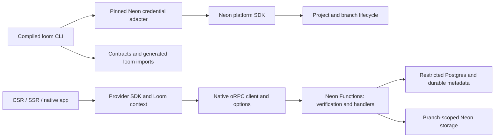
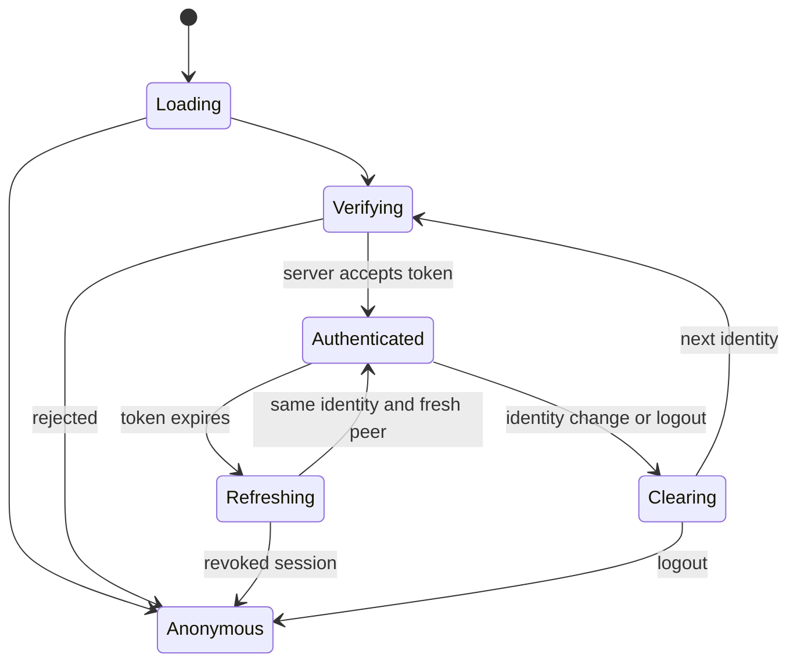

# Public Loom package, Neon onboarding, and provider authentication

## Goal Capsule

Deliver one installable `loom@0.0.0` package containing the CLI, runtime, generated-code support, and tooling. A developer can install it outside this monorepo, log in to Neon, create or link a project, provision a development branch, and deploy functions without writing session infrastructure or copying framework helpers. Applications use native oRPC clients and TanStack options with provider-owned authentication.

This is a follow-on to [the oRPC framework plan](2026-09-24-1400-refactor-orpc-effect-framework-core-plan.md), grounded in [the public-library diagnosis](../explainers/2026-09-26-loom-public-library-and-auth-diagnosis.md). Later user decisions govern: native oRPC `queryOptions`, `mutationOptions`, and explicit streaming contracts replace the earlier direct-call option factory. Preserve required contracts, Standard Schema support, Effect integration, table/validator injection, PostgreSQL authority, and existing deployment protections.

Scope includes packaging, credentials, project onboarding, optional configuration, branching, provider auth, CSR/SSR/native lifecycle, independent examples, and installed-package/cloud acceptance. It does not introduce an identity provider, replace oRPC, or publish a release. Work on the current branch without discarding unrelated changes; make a reviewed commit after each unit. Do not push or publish as a side effect of this plan.

Read Product Contract and Planning Contract once, then execute units in dependency order. Track execution outside this document. No runtime tests, builds, login, provisioning, or deployment were performed during this planning pass. The evidence below is repository inspection, official documentation, and published package source inspection.

## Product Contract

### Requirements

| ID | Required behavior | Acceptance |
|---|---|---|
| R1 | One public `loom` package owns CLI, core, and tooling in `apps/loom`; consumers import `loom/...`. | A packed artifact installs and runs in an unrelated directory without workspace resolution. |
| R2 | Vite+ compiles the package; TypeScript 7 and extensionless authored imports remain supported. | Built exports, declarations, CLI executable, and browser bundles resolve using only shipped files and declared dependencies. |
| R3 | Loom reuses Neon login, profiles, and credential refresh; CI accepts explicit credentials without browser prompts. | Fresh login, saved login, keyring, expiry, revocation, profile conflicts, and concurrent processes have executable coverage. |
| R4 | CLI supports creating a project and integrating an existing project. | Repeated or interrupted commands resume safely; ambiguous choices never select an arbitrary database, organization, or project. |
| R5 | `loom.config.ts` is optional; normal setup discovers managed connection details. | A generated app deploys without this file; an advanced override remains validated and documented. |
| R6 | Development branching supports schema-only isolation and explicit data copies. | Catalog, migration history, auth, functions, files, environment, and job isolation are checked on the actual branch. |
| R7 | Provider SDKs own sessions; Loom owns authenticated connections and server verification. | CSR and native apps require no frontend session server; SSR uses packaged integration and provider SDK handlers. |
| R8 | Neon Auth, Clerk, WorkOS, and Auth0 have typed provider adapters. | Each adapter proves token acquisition, refresh, logout, wrong-token rejection, and backend acceptance with its real provider. |
| R9 | Identity changes, refresh, and reconnect cannot expose another principal's cached data or replay writes. | Account-switch races, stale responses, optimistic state, persisted caches, and stream reconnection are tested. |
| R10 | Next.js, TanStack Start, CSR, and native integrations have independent examples. | Each uses its own application/contracts and installed public imports; examples contain no copied framework session/query plumbing. |
| R11 | oRPC contracts/options, Zod and Valibot Standard Schema, Effect, inferred context, and SSR types remain correct. | Positive and negative type fixtures compile against the packed package; invalid input/output is rejected at runtime. |
| R12 | Real installed-CLI and Neon Functions acceptance is required. | Evidence identifies artifact digest, versions, project/branch/function, commands, outcomes, cleanup, and missing gates. |

### Settled decisions

- D1 — **session-settled: user-directed. Governs R1, R2.** Own the implementation under `apps/loom`, expose `loom/...`, build with Vite+, keep version `0.0.0`. Rejected: a public CLI that requires private workspace packages.
- D2 — **session-settled: user-directed. Governs R7–R11.** Provider integrations and Loom's context manage sessions/connections. Rejected: applications copying `lib/sessions`, token-paste screens, or obligatory custom frontend session endpoints.
- D3 — **session-settled: user-directed. Governs R5, R6.** Minimize configuration, discover Neon resources, support schema-only branches. Rejected: requiring users to repeat URLs, roles, and provider internals that the platform can resolve.
- D4 — **session-settled: user-directed. Governs R11.** Use native oRPC options and explicit streaming contracts; accept Standard Schema implementations including Zod and Valibot; retain Effect. Rejected: Loom client modes and another option-building protocol.

### User flows

F1: Install → `loom login` if needed → initialize new project or link existing → choose development branch strategy → discover services → generate → deploy → receive public client configuration. Login may require a human browser interaction; automation must report that boundary truthfully.

F2: Existing app → integrate without overwriting files → choose provider → render packaged provider/context → call native oRPC options. The provider obtains credentials; Neon Functions verify them. A client cannot grant itself identity by choosing request options.

F3: Token approaches expiry → SDK refreshes once → Loom obtains a fresh connection ticket → live queries receive an authorized snapshot. Identity change instead cancels the old session epoch and removes its Loom-owned cache before another identity's results become visible.

F4: Interrupted project/branch/deploy operation → rerun reads the operation receipt → reconcile actual resource IDs and state → resume or explain recovery. Never adopt a same-name resource merely because it exists.

## Planning Contract

### Evidence and limits

| Evidence | Observed result | Consequence |
|---|---|---|
| `apps/loom/package.json` | Private `@loom/cli`, source bin, workspace core/tooling dependencies. | Current examples do not establish a distributable library. |
| `packages/core/package.json`, `packages/tooling/package.json` | Existing Vite+ builds and compiled exports. | Consolidate existing implementation; avoid rewriting the runtime. |
| `packages/tooling/src/project/load.ts`, `packages/tooling/src/dev/server.ts` | Tooling uses `Bun.build` and `Bun.serve`. | Compiling alone does not make the CLI Node-compatible. |
| Installed `@neon/config` auth implementation and Loom deploy call sites | Explicit credential input; callers use `NEON_API_KEY`. | Saved Neon login is currently not integrated. |
| Published `neon@6.2.3` archive | Auth command module exports helpers; private shared exports are blocked; no typed auth-helper API. Root module executes CLI behavior. | Isolate a pinned compatibility boundary; do not import the package root as a credential library. |
| `packages/core/src/react/provider.ts` | Consumer supplies session key and session-change callback; cache clearing is broad. | Move lifecycle into packaged adapters and scope invalidation to Loom-owned data. |
| `packages/core/src/client/rpc-transport.ts` | Tickets and native oRPC link exist; refused auth can be sticky. | Refresh must recreate authenticated peers without retrying arbitrary procedures. |
| `packages/core/src/server/auth/config.ts`, `verify.ts`, `configuration.ts` | Existing issuer/JWKS verification; global audience configuration limits mixed providers. | Preserve verification and add per-issuer policy. |
| `packages/tooling/src/deploy/neon/provision.ts` | Receipts, protected/default branch checks, parent identity checks. | Extend checks for each branch mode rather than deleting safeguards. |

Repository paths in this table are pre-migration locations. Unit file paths marked “new” are proposed outputs. Evidence is not runtime certification. Provider combinations below remain unverified until their acceptance runs succeed.

### Key technical decisions

**KTD1 — Package boundary and runtimes (R1, R2, R11).** Move implementations into `apps/loom/src/{cli,core,tooling}` initially to limit behavioral churn. Publish one manifest with explicit subpath exports, compiled bin, declarations, and notices. CLI remains a compiled **Bun 1.4.2-or-tested-compatible** program; state that requirement and test the shebang. Runtime library and Neon Functions target their supported Node runtime independently; browser exports cannot import Node/Bun/tooling modules. Node-only CLI support is outside this change, not implied by compilation. Optional framework/auth SDKs are peer dependencies of integrations; installing Loom cannot require every frontend framework. Authored TypeScript imports stay extensionless; bundled emitted modules must be executable. Preserve current TS 7 baseline and pin tested dependencies.

**KTD2 — Official Neon credential ownership (R3).** Use an exact-pinned Neon CLI compatibility adapter, initially evaluating the inspected `neon@6.2.3` auth module, while `@neon/sdk` handles resource APIs. The Neon CLI owns login, file/keyring persistence, refresh locking, and profile semantics. Do not implement a second OAuth client or parse private credential files. Invoke the official login command through an argument array; do not shell-expand credentials. Never import its executable root. The exported auth helper is not a stable SDK API: U2 must prove an isolated typed adapter works before dependent onboarding is accepted. Preserve refresh errors instead of collapsing network errors into “signed out.” One CLI invocation selects one profile; serialize in-process refresh because inspected helpers use global state. Resolve fresh credentials for long-running API operations, not once at deploy startup. Never blindly replay a resource mutation after an ambiguous response. If the pinned exported helper cannot satisfy this contract, stop dependent integration and document a reviewed replacement; do not silently ship manual file parsing.

**KTD3 — Configuration and secret ownership (R4, R5).** Keep `app.config.ts` for application env schemas/RPC composition, `auth.config.ts` for provider selection and trusted issuer policy, and optional `loom.config.ts` for operational overrides. Neon link state is nonsecret and owned through its supported CLI conventions. Ignored `.loom/` stores operation receipts and derived deployment descriptors, not login tokens. Project identity may come from explicit flags, validated config, `NEON_PROJECT_ID`, or saved link; conflicts produce an actionable error. Credential selection follows the pinned Neon CLI's actual precedence, including explicit-profile behavior, rather than an invented universal env-first rule. Selection and secret sources are separate. Generate client configuration from a strict public allowlist. Never expose database URLs, API keys, refresh tokens, server environment, or role credentials in browser output. Integration writes are atomic and preserve unrelated env entries/files.

**KTD4 — Branch lifecycle (R6).** Neon SDK distinguishes `parent-data` (child with data), `parent-schema` (schema-only child), and `schema-only` (independent root from a parent's schema). Do not treat these as aliases. Offer schema-only development by default using the documented independent-root flow; expose data-copy explicitly and support schema-only child only after its separate conformance case passes. Root branches cannot use child-reset assumptions. Schema copy contains DDL without the source migration ledger's rows: verify catalog against a recorded source migration snapshot and establish a baseline without replaying DDL. Drift or concurrent source migration invalidates that baseline and requires reconciliation. Keep migrations under `loom/_generated/migrations`; they are durable versioned history and must survive generation cleanup. Fresh runtime records must bind to the target branch. Inherited functions/jobs must fail closed before target activation; no job, webhook, or storage effect may run with the parent's authority. Verify that guard before exposing a branch. Test environment/auth/storage inheritance separately for each mode. Copying production secrets is not a default.

**KTD5 — Auth authority (R7, R8).** Neon managed Auth is a Better Auth service; external providers remain external. Loom does not mint replacement identity tokens. SDKs manage refresh/session storage, while Neon Functions verify signed tokens against configured provider presets. Resolve issuer/JWKS/audience policy from trusted project/provider configuration, never arbitrary unverified token claims. Audience policy belongs to each accepted issuer: WorkOS issuer variants do not share one universal audience rule. Auth0 uses a configured API audience and access token; opaque tokens fail clearly. Clerk and Neon presets must test their actual tokens rather than borrowing a Convex-specific template. Enforce expiration, algorithms, issuer, key rotation, tenant boundaries, and trusted origins. An SDK session is not proof the backend accepted that token. Retain existing restricted runtime database roles; injected owner-level `DATABASE_URL` is not a reason to remove role isolation.

**KTD6 — Client lifecycle (R9).** A packaged auth adapter exposes loading, current principal scope, fresh-token acquisition, and changes; framework users choose a provider rather than implementing those methods. Loom establishes a server-verified session epoch bound to deployment, issuer, subject, and relevant tenant/organization/session scope. Freeze protected reads until verification completes. Refresh for the same identity is single-flight and obtains a new ticket/peer. Changed identity/logout cancels requests/subscriptions, discards old-epoch responses even if cancellation races, and removes Loom-owned optimistic/persisted cache. Shared QueryClients keep unrelated queries. Retrying authentication or connection establishment must never replay arbitrary mutations. No untrusted user ID or token-derived string is sufficient to authorize data.

**KTD7 — SSR and native (R7, R9, R10).** SSR uses a per-request client, QueryClient, and principal context; hydrate only matching deployment/principal data. Provider SDK middleware/callback routes may be exported through thin application routes, but session cryptography/refresh is not copied into examples. CSR and native require no frontend server. Native adapters use provider SDK secure storage and a transport available on that platform; browser globals/localStorage cannot be mandatory. Context also carries existing typed tables, validators, env, identity, and Effect services. Abort/disconnect must close Effect scopes and stream resources.

**KTD8 — Dependency and publication limits (R1, R12).** Preserve the reviewed Drizzle rename patch and Neon config patch through consolidation. A workspace patch declaration alone does not patch a consumer's installed dependency: include the actual reviewed implementation in the artifact as appropriate, with exact versions and notices, and test it from the tarball. Existing third-party tooling records a Drizzle package/repository license discrepancy; redistribution/publication remains gated on resolving that discrepancy. This plan neither authorizes publication nor declares that legal question resolved. Do not upgrade all dependencies to “latest” during a structural refactor; update a required dependency with a recorded compatibility result.

### Architecture and lifecycle

**KTD9 — Deployment transition and recovery (R4, R6, R9, R12).** Separate package/import changes from wire-protocol changes. Keep the current `loom-orpc-2` protocol while its semantics remain compatible; test the previously generated client against the new server. If compatibility cannot be preserved, reject the old protocol explicitly before procedure execution and regenerate/redeploy consumers together. Never infer compatibility from both artifacts having version `0.0.0`. Before activation, verify branch identity, migration baseline, restricted-role access, and auth policy. Activate a complete release only after those checks. On failure, leave the prior release active where schema compatibility permits; a code rollback must not pretend to undo committed schema/data changes. Preserve the receipt, stop activation, and report a forward-repair path when rollback is unsafe. Test each interruption boundary on disposable resources before attempting an existing-project upgrade.

Public client composition stays: generated typed client → native `createTanstackQueryUtils(client)` → `rpc.users.user.queryOptions({ input, enabled, ...options })`, `mutationOptions()`, and explicitly contracted stream `liveOptions()`. Loom supplies client/context creation, auth, and transport; it does not reinterpret a caller's choice of query options as server authorization or transaction safety.

Wire compatibility does not override the generated release hash. Preserve the existing version handshake: an older client with a different release hash receives the documented terminal version-mismatch response before handler execution. Test both compatible same-release clients and explicit refusal; never weaken that check merely to make an upgrade fixture succeed. Keep the pre-oRPC historical fixture's refusal behavior as well.

## Implementation Units

| Unit | Deliverable | Dependencies |
|---|---|---|
| U1 | Compiled public artifact | — |
| U2 | Neon login/credential compatibility | U1 |
| U3 | Optional config and resolution | U1, U2 |
| U4 | Create/link/integrate CLI | U3 |
| U5 | Branch modes and migration baseline | U4 |
| U6 | Provider trust and server auth | U1, U3 |
| U7 | Context, refresh, and cache isolation | U6 |
| U8 | Neon and Clerk adapters | U7 |
| U9 | WorkOS and Auth0 adapters | U7 |
| U10 | Next.js and Start SSR | U8, U9 |
| U11 | Native integration | U7, U8 |
| U12 | Independent consumer examples | U5, U8–U11 |
| U13 | Installed CLI/cloud acceptance and docs | U1–U12 |

Each unit includes focused tests, code/security review, and a traceable commit. Do not combine unrelated dirty work. Paths under the consolidated package are new unless already present. Test files may be split by existing suite conventions; the behavior below is binding.

### U1. Build one installable Loom artifact

**Goal / requirements:** R1, R2, R11; KTD1, KTD8. **Dependencies:** none.

**Files:** `apps/loom/package.json`, `apps/loom/vite.config.ts` (new), `apps/loom/src/{cli,core,tooling}` (moves); root workspace/build configuration; generated import templates currently in `packages/tooling`; `packages/e2e/fixtures/packed-consumer` and package acceptance suite (new).

**Approach and patterns:** Preserve implementation while moving ownership. Define explicit client/server/contract/react/framework exports and compiled Bun bin. Update generation to `loom/...`. Remove private package dependencies after all consumers migrate. Preserve notices and patched code; retain browser/server boundaries. Follow existing Vite+ pack patterns, without exporting internal tooling internals as public API.

**Test scenarios / verification:** Pack and install in a temporary directory outside the repo with no workspace aliases or source tree. Run CLI help, generation, runtime import, browser bundling, TS7 inference/error fixtures, Zod/Valibot, Effect, and optional-peer absence. Inspect tarball for secrets, source-bin mistakes, private dependency names, and unshipped imports. Exercise the Drizzle rename patch through the installed artifact. A passing workspace build alone does not pass U1.

### U2. Reuse Neon authentication safely

**Goal / requirements:** R3; KTD2. **Dependencies:** U1.

**Files:** `apps/loom/src/tooling/neon/credentials.ts`, CLI login/profile handlers (new); migrated Neon API factory; `packages/e2e/fixtures/neon-credentials` and integration tests (new).

**Approach and patterns:** Implement the exact-pinned compatibility shim with a small validated runtime boundary and typed internal interface. Use official login/persistence; centralize credential consumption across deploy/env/branch/storage commands. Separate signed-out, revoked, insufficient permission, and transient failures. Noninteractive execution never launches a browser or hangs for input.

**Test scenarios / verification:** Fresh login, existing file/keyring profile, explicit profile versus env, revoked/expired access, refresh failure, unavailable keyring, concurrent processes, long deploy crossing expiry, and redacted diagnostics. Unit fixtures may fake OAuth transport; acceptance must include real saved login. A noninteractive credential failure exits with a recovery command. Stop dependent onboarding acceptance if the pinned helper boundary fails; do not disguise it as a supported SDK contract.

### U3. Resolve minimal configuration and public environment

**Goal / requirements:** R5, R11; KTD3. **Dependencies:** U1, U2.

**Files:** migrated `project/load.ts`, config definitions, new resolved-config module, generation templates; config-resolution and env-write fixtures (new).

**Approach and patterns:** Load optional operational config, required application contract configuration, and provider config separately. Produce one typed resolved descriptor consumed by CLI and runtime generation. Resolve saved link and managed resources before asking for missing information. Derive Function URL independently of Neon Auth/Data API URLs. Preserve application env schema validation and secret/provider boundaries.

**Test scenarios / verification:** No config, explicit overrides, conflicting project IDs, multiple databases, unavailable service, malformed config, missing required application secret, env updates preserving comments/unrelated variables, and generated public output containing no secrets. A discovered URL is not proof of a deployed healthy function.

### U4. Implement installed CLI create and integrate flows

**Goal / requirements:** R3, R4, R5; KTD2, KTD3. **Dependencies:** U3.

**Files:** new CLI init/link handlers and tooling onboarding receipt module; templates; installed-CLI integration suite.

**Approach and patterns:** Offer create versus existing link, then organization/project selection when ambiguous. Persist operation identity before resource mutations; reconcile resource IDs on retries. Reuse supported Neon linking conventions. Integrating an existing frontend previews intended files and reports collisions without overwriting application code. Provide explicit flags for CI and structured redacted output.

**Test scenarios / verification:** Empty directory, existing Next/Start/CSR project, occupied paths, cancellation, no permission, project quota, network loss after successful create, crash before local save, repeated command, and concurrent invocation. Prove one create operation does not produce duplicate resources on retry. Exercise the packed CLI in a separate process, not just exported handler functions.

### U5. Provision isolated development branches

**Goal / requirements:** R6; KTD4. **Dependencies:** U4.

**Files:** migrated `deploy/neon/provision.ts`, branch commands, migration baseline logic and activation checks; cloud branching fixtures.

**Approach and patterns:** Encode mode-specific ancestry checks, operation receipts, runtime quarantine, source-snapshot fingerprint, and baseline establishment. Reject catalog drift and racing schema changes. Preserve restricted roles, default/protected branch refusal, recovery receipts, and branch-local runtime records. Validate environment copy policy and storage/auth behavior separately; do not infer them from database branching alone.

**Test scenarios / verification:** Real independent schema-only branch, data child, and separately gated schema-only child; first and second migration deploy; source migration during provisioning; partial baseline; inherited jobs/functions attempting execution before activation; branch reset where supported; environment markers; auth records; file bytes; duplicate names and cleanup failure. Run on disposable resources associated with `late-moon-6948364`; never reset its production/default branch. Record target IDs and remove only resources owned by the test receipt.

### U6. Verify provider tokens on Neon Functions

**Goal / requirements:** R7, R8, R11; KTD5. **Dependencies:** U1, U3.

**Files:** migrated server auth config/verifier/configuration, provider preset modules and generated auth bindings; auth contract tests.

**Approach and patterns:** Add per-issuer audience/algorithm policy and typed provider configuration. Preserve trusted JWKS lookup, origin validation, tenant authorization boundaries, and restricted DB roles. Provider selection can discover managed Neon metadata; external provider app/client IDs remain legitimate configuration. Verify each HTTP request/ticket and bound WebSocket lifetime according to current transport semantics.

**Test scenarios / verification:** Wrong issuer/audience/algorithm, missing subject/expiry, expired token, JWKS rotation/outage, malicious issuer URL, cross-tenant token, mixed WorkOS issuer variants, opaque Auth0 token, and unauthorized storage/job access. Exercise real tokens against deployed functions as part of provider acceptance, not only signed fixtures.

### U7. Own client authentication and cache lifecycle

**Goal / requirements:** R7, R9, R11; KTD6, KTD7. **Dependencies:** U6.

**Files:** migrated React provider, HTTP/WebSocket transports, client factory; new adapter contract/session epoch module; lifecycle and race fixtures.

**Approach and patterns:** Replace required consumer session callbacks with packaged lifecycle handling. Keep native oRPC options and metadata. Authenticate before protected reads, single-flight refresh, replace refused peers after valid refresh, and scope cache cleanup. Tie stream cancellation and Effect finalizers to epoch disposal. Define persistence integration so old principal data cannot rehydrate into a new epoch.

**Test scenarios / verification:** Concurrent expired requests, logout during mutation, A→B→A switch, old response after abort, tenant change, token refresh without identity change, offline reconnect, expired ticket, connection rejection, slow live iterator, shared QueryClient, persisted optimistic data, and React mount/unmount. Assert mutation execution count stays one through auth/reconnect failures; ambiguous outcomes are surfaced rather than retried.

### U8. Package Neon Auth and Clerk adapters

**Goal / requirements:** R7, R8, R11; KTD5–KTD7. **Dependencies:** U7.

**Files:** new `apps/loom/src/core/react/{neon,clerk}` adapters and exports; adapter type/browser tests.

**Approach and patterns:** Compose official SDK hooks/session APIs; obtain actual signed backend tokens, not opaque cookies. Own lifecycle mapping in Loom while letting SDKs own storage and refresh. Generated setup supplies the managed Neon branch URL and safe provider presets. Custom adapter API remains available for future providers.

**Test scenarios / verification:** Loading, sign-in, sign-out, cross-tab change, forced refresh, Clerk organization switch, Neon branch mismatch, revoked session, and SSR-safe imports. Verify against both real providers. No token-copy field or custom session route may be required for CSR acceptance.

### U9. Package WorkOS and Auth0 adapters

**Goal / requirements:** R7, R8, R11; KTD5–KTD7. **Dependencies:** U7.

**Files:** new WorkOS/Auth0 React adapter exports, provider configuration helpers, adapter contract/type/browser tests.

**Approach and patterns:** Use WorkOS AuthKit SDK token retrieval and Auth0 API access tokens with explicit audience. Preserve production cookie/custom-domain requirements and provider logout behavior. Do not assume Convex's managed WorkOS provisioning partnership exists for Loom or force WorkOS development storage mode in production.

**Test scenarios / verification:** Provider login callback, expiry refresh, logout, account switch, wrong audience/client, denied organization, production-mode storage, and backend verification. Real acceptance needs provider test applications and credentials; record unavailable provider access as an incomplete gate, not a passing mock.

### U10. Supply request-scoped SSR integrations

**Goal / requirements:** R7, R9–R11; KTD7. **Dependencies:** U8, U9.

**Files:** new `loom/next` and `loom/start` implementation/export modules; SSR fixtures; migrated Next/Start example adapters.

**Approach and patterns:** Package request-scoped clients, prefetch/hydration, SDK integration hooks, and safe thin route helpers where necessary. Framework entrypoints must not leak server imports into browser builds. Use supported SDK cookie/callback machinery rather than implementing session cryptography. Preserve native oRPC options for server prefetch and client consumption.

**Test scenarios / verification:** Concurrent requests from two principals, anonymous rendering, expired token during SSR, callback errors, hydration identity mismatch, streaming SSR abort, request teardown, and browser bundle secret scan. Prove no module-global authenticated client or QueryClient; show protected prefetched content before hydration only for the matching principal. Preserve private/no-store response handling for authenticated HTML and serialized data; exclude protected requests from shared framework/CDN caches. Test two sessions through that response-cache boundary, not only through separate QueryClients.

### U11. Supply a native integration

**Goal / requirements:** R7, R9, R10; KTD7. **Dependencies:** U7, U8.

**Files:** native adapter entrypoint and Expo/Clerk example (new); native transport/type/lifecycle fixtures.

**Approach and patterns:** Reuse auth lifecycle through the native provider SDK and secure storage. Keep native browser/login callback handling provider-owned. Select the existing supported HTTP/WebSocket transports through capability configuration without introducing client procedure modes.

**Test scenarios / verification:** Device login/deep-link return, secure session restoration, background/foreground expiry, offline reconnect, logout/account switch, live subscription, and mutation count. Run an actual simulator/device acceptance where available; a web build or TypeScript fixture does not count as native acceptance.

### U12. Make examples independent consumers

**Goal / requirements:** R1, R7–R11; KTD1, KTD7. **Dependencies:** U5, U8–U11.

**Files:** `packages/examples/tasks`, `packages/examples/next`, `packages/examples/start`, native example, related e2e fixtures and READMEs.

**Approach and patterns:** Use separate contracts, generated clients, application configs, and deployed application identities. Minimum coverage: tasks CSR/Neon/Valibot/Promise; Next/WorkOS/Zod/Effect/SSR; Start/Auth0/Standard Schema/Effect/SSR; native/Clerk/Zod. Shared code belongs in `loom` only when it is framework behavior, not application business logic. Remove obsolete copied session/query infrastructure after callers migrate. Keep migrations within each application's `_generated` directory without pruning history.

**Test scenarios / verification:** Install every example using the packed package; generate, typecheck, build, sign in, mutate, observe live state, and verify authorization. Assert distinct backend application identities and contracts. Document supported combinations honestly: these examples do not prove every provider/framework cross-product. Additional combinations require their own conformance case before being advertised as tested.

### U13. Certify CLI-to-cloud behavior and publish evidence

**Goal / requirements:** R1–R12; KTD1–KTD8. **Dependencies:** U1–U12.

**Files:** installed-package acceptance runner, cloud/browser/native suites, public README and migration guide; evidence under `docs/validation/` (new).

**Approach and patterns:** Run from a clean external consumer directory using the exact tarball digest. Exercise official login, new disposable project creation, integration with the existing Loom project, schema-only development, generation, migration, deployment, auth, CRUD/live, jobs, storage, and cleanup. Retain independent local/remote outcomes. Document migration from private packages, optional config, provider setup, runtime requirements, and recovery. Capture first snapshot, mutation-to-live, and refresh/reconnect timing with sample count, cold/warm conditions, and median/p95; compare to a pre-change baseline without claiming an unmeasured speedup.

**Test scenarios / verification:** Full happy path plus permissions failure, invalid contract input/output, interrupted create/deploy, migration failure, token expiry, account switch, restart, and cleanup error. Include historical-client compatibility, pre-activation failure, and schema-compatible release rollback under KTD9. Unit/integration mocks cannot replace live provider gates. Keep logs redacted and record only IDs, hashes, versions, outcomes, and nonsecret timings. Missing credentials or unavailable native runtime block the corresponding acceptance claim and overall complete status until resolved.

## Verification Contract

V1 — **Static and artifact gates.** Use repository `build`, `typecheck`, `lint`, `format:check`, and applicable `check:static` scripts after consolidation. Preserve Oxlint anti-slop rules and TS7. Run installed artifact tests outside the workspace; inspect exports, dependency resolution, patch execution, notices, and browser bundles. Do not weaken tests to make the move pass.

V2 — **Behavior gates.** Run focused tests after each unit and existing integration suites for touched behavior. Run browser tests for auth/SSR changes and native device tests for U11. Assert runtime contracts and negative type cases, not only snapshots of generated strings. Preserve existing data isolation, job/storage durability, and explicit live-contract tests.

V3 — **Provider and cloud gates.** Use actual Neon Functions and Postgres, including the user's `late-moon-6948364` project through disposable owned branches. Prove new project creation separately on a disposable project. Verify all four auth providers with test applications. Keep “mocked,” “source verified,” “live passed,” “blocked,” and “not run” separate. Environment discovery, Function URL existence, and SDK type availability are not runtime acceptance.

V4 — **Traceability and review.** After every unit, review correctness, security, public API, and affected data migrations. Record findings/fixes and test evidence with its commit. Review cannot claim independence when performed inline. Avoid bulk staging unrelated user changes. Stop for a real scope conflict or missing external access, while continuing independent authorized work.

V5 — **Evidence format and recovery.** Record commit/artifact digest, dependency/runtime versions, test command, start/end, relevant resource IDs, expected/actual result, cleanup result, and remaining gates. Redact tokens, cookies, credentials, and user data. Receipts survive process failure but not contain secrets. Cleanup may remove only receipt-owned disposable resources; report leftovers with IDs and recovery steps. Never delete an existing project or reset a protected/default branch to make tests easier.

## Definition of Done

All R1–R12 acceptance statements and U1–U13 test scenarios are satisfied with recorded results. The compiled artifact works outside the monorepo; examples use only public imports and packaged auth/framework behavior; native oRPC options, Standard Schema, Effect, typed context, and migration durability remain intact. Real provider sessions reach deployed Neon Functions, and account changes cannot leak data or repeat mutations. CLI login, project creation/linking, branching, deployment, and failure recovery have live evidence.

Each unit has a code/security review and focused commit. All required test suites pass without unexplained skips. Missing provider access or unavailable device/cloud execution is unfinished verification, not completion. Public documentation accurately states runtime requirements and tested combinations. Publication remains a separate action with dependency/license gates; this work does not publish `loom@0.0.0`.

## Appendix: Sources and research confidence

Sources inspected on 2026-09-26; implementation must recheck exact pinned API signatures when changing versions.

- [Neon JavaScript SDK](https://neon.com/docs/reference/javascript-sdk): platform versus application SDK responsibilities.
- [Neon login](https://neon.com/docs/cli/login), [link](https://neon.com/docs/cli/link), [init](https://neon.com/docs/cli/init), [env](https://neon.com/docs/cli/env): login persistence, project association, service discovery.
- [Published CLI auth source](https://github.com/neondatabase/neon-pkgs/blob/main/packages/cli/src/commands/auth.ts): compared with the actual `neon@6.2.3` archive; helper exports are an unstable compatibility boundary, not a supported credential SDK promise.
- [Neon branching](https://neon.com/docs/introduction/branching), [schema-only guide](https://neon.com/docs/guides/branching-schema-only), [CLI branches](https://neon.com/docs/cli/branches): distinct branch modes and inheritance. Custom environment/auth/storage behavior still requires mode-specific live tests.
- [Neon Auth](https://neon.com/docs/auth/overview), [Functions environment](https://neon.com/docs/compute/functions/environment-variables): managed auth and server environment boundaries. Auth/Data API derivation does not imply the same Function URL.
- [Convex custom auth](https://docs.convex.dev/auth/advanced/custom-auth), [Clerk](https://docs.convex.dev/auth/clerk), [WorkOS](https://docs.convex.dev/auth/authkit), [Auth0](https://docs.convex.dev/auth/auth0): provider-to-backend token validation model. Convex platform-managed provisioning is not automatically available to Loom.
- [Convex Auth React](https://labs.convex.dev/auth/api_reference/react), [Next.js authorization](https://labs.convex.dev/auth/authz/nextjs): packaged context and request-scoped auth patterns, not a proposal to copy its identity service.
- [WorkOS AuthKit React source](https://github.com/workos/authkit-react): SDK session/token ownership and production configuration requirements.
- [Vite+ pack](https://viteplus.dev/guide/pack): compiled library/CLI packaging.
- [oRPC TanStack Query](https://orpc.dev/docs/integrations/tanstack-query), [Effect](https://orpc.dev/docs/integrations/effect): native options and Effect integration remain the foundation.

Planning confidence: package ownership and current auth/config gaps are directly source-grounded; provider patterns and branch-mode distinctions are documented. Highest residual implementation risks are the pinned credential helper, schema-only migration baselines and inherited effects, and refresh/SSR identity races. Their first proof points are U2, U5, and U7/U10 respectively. These are executable unit gates, not claims of completed evaluation. No production readiness or performance claim is made by this plan.
