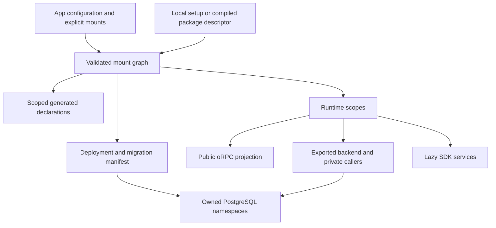
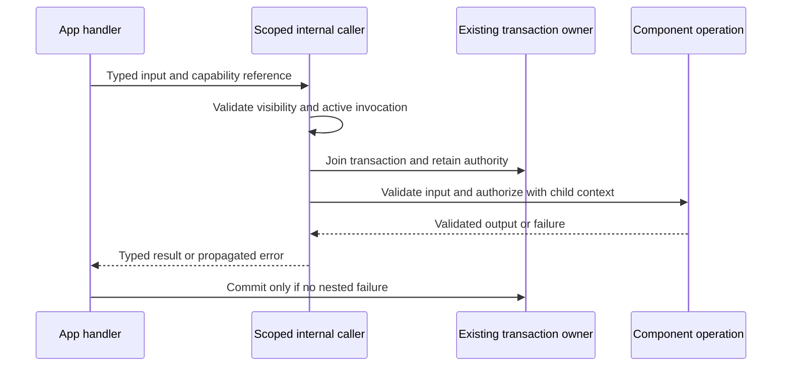
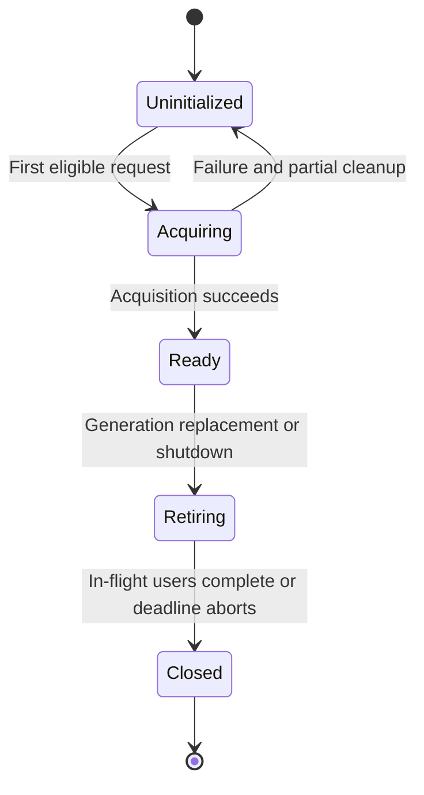
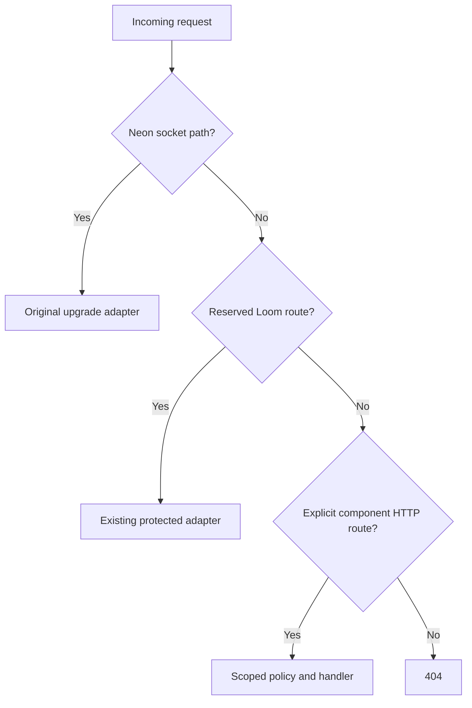

# Components, Internal Calls, and SDK Services - Plan

## Goal Capsule

- **Objective:** Application authors can reuse backend modules, call their private business logic with full typing, and use official provider SDKs without writing integration wrapper packages or exposing backend capabilities to browsers.
- **Means:** Explicit component mounting, scoped generated context, native oRPC calls, and optional SDK services (KTD1–KTD8).
- **Authority:** User requirements and repository instructions govern this plan. Product behavior belongs to R-IDs; implementation mechanisms belong to KTD-IDs. Previous plans remain authoritative for unchanged authentication, deployment, storage, and live-query behavior.
- **Execution profile:** Implement dependency-ordered units with focused tests, simplification, security and code review, and an explicit-path commit per completed unit. Record execution evidence outside this document.
- **Stop conditions:** Stop affected work for a demonstrated dependency incompatibility, a change to agreed product behavior, or a migration requiring destructive changes to existing data. Missing provider credentials block only the corresponding acceptance check; never label skipped checks passed.
- **Delivery:** The implementation executor owns integration and final verification. Work on a feature branch, preserve unrelated WIP, and leave a reviewed, committed result. Publishing npm packages, merging, and modifying production resources require separate authority.

---

## Product Contract

### Summary

Add reusable Loom components with explicit installation, private internal calls, and optional SDK services. A component can contain schemas, relations, contracts, RPC implementations, HTTP handlers, and services, using only the capabilities it needs. Generated server context supplies the component's tables, validators, environment, internal functions, and declared dependencies. Public clients continue using native oRPC and TanStack Query options.

### Problem Frame

Loom currently loads one application's schema, contracts, and procedures. It can distinguish public and internal procedures, but it has no component registration system or callable generated `context.internal`. Copying SDK initialization into applications duplicates configuration; building provider-specific wrapper packages duplicates official SDK APIs. The existing global registration type also cannot safely describe multiple component schemas in one consumer program.

### Key Decisions

- **Explicit mounting owns installation.** Governs R1, R2. (session-settled: user-directed — chosen over automatic installation from default exports: the application must visibly select its components.)
- **SDK services complement component RPCs.** Governs R3, R4, R7. (session-settled: user-directed — chosen over replacing components with SDK wrappers: reusable RPCs and internal business logic remain necessary.)
- **Typed environment declarations and bindings.** Governs R5. (session-settled: user-directed — chosen over string-based source mappings: declared variables must be discoverable and checked by TypeScript.)
- **Official SDK recipes for identity providers.** Governs R7, R13. (session-settled: user-directed — chosen over dedicated WorkOS, Clerk, and Auth0 wrapper packages: application authors can retain the vendor SDK directly.)
- **Native client options and explicit streaming contracts.** Governs R8. (session-settled: user-directed — chosen over Loom query-option facades and generated live endpoints: preserve the upstream oRPC API.)

### Requirements

**Authoring and mounting**

- R1. Only components reached through explicit `app.use(component)` registrations participate in generation and deployment.
- R2. Local definitions use `loom/components/{component}/setup.ts`, and external component installation files may use `loom/components/{consumer-chosen}.setup.ts`; the author-defined default name can be overridden per mount.
- R3. Each instance owns its optional schema, relations, RPC configuration, options, environment, and services; mounting a service-only component requires no dummy tables or contracts.
- R4. Component RPCs require contracts, and visibility distinguishes public exposure, exported backend operations callable by the mounting app, and component-private internal functions.
- R5. Environment declarations support Standard Schema validators, configuration bindings use typed application environment references, and runtime code receives typed values without embedding secrets in generated artifacts.

**Runtime behavior**

- R6. Generated `context.internal` calls preserve input/output/error typing and invoke only the current scope's private functions; parent and explicitly bound component APIs expose only intentionally exported operations.
- R7. Component services preserve the official SDK's types and behavior, with instance-scoped initialization, cleanup, and request-safe usage.
- R8. Public component procedures preserve native oRPC contracts, errors, middleware, Effect integration, OpenAPI, and TanStack Query options; subscriptions use explicitly declared streaming contracts.
- R9. Nested database calls preserve atomicity, identity, cancellation, live dependencies, and retry safety across component boundaries.
- R10. Component HTTP handlers can be mounted through Hono with explicit route ownership, while existing RPC ingress protections and Neon WebSocket behavior remain intact.

**Data, packaging, and verification**

- R11. Each stateful component instance has a stable database namespace and migration history; installation, upgrades, removal, and renaming cannot silently delete or reassign data.
- R12. Local and compiled external components work through published `loom/...` exports, with isolated generated typing and no workspace source aliases or writes into installed packages.
- R13. Documentation demonstrates SDK-only integration, contract-backed internal operations, optional webhook synchronization, and public client use without requiring provider-specific Loom packages.
- R14. Acceptance covers packed consumers, PostgreSQL transactions and migrations, browser/SSR type boundaries, and deployed Neon Functions; evidence distinguishes local tests from real cloud results.

### Scope Boundaries

This work extends the current single public `loom` package. It does not introduce another client cache, infer transactions from TanStack option constructors, or replace authentication token verification with SDK initialization.

Dedicated WorkOS, Clerk, and Auth0 packages and live provider-account acceptance remain deferred. Recipes use their official SDKs; reusable local webhook fixtures verify Loom's HTTP boundary without claiming provider certification. Arbitrary third-party code execution is not a security sandbox feature. Components share the deployed Node process and the application's trust boundary.

### Acceptance Examples

- AE1. Covers R1–R3: placing an unmounted `billing/setup.ts` beside a mounted SDK-only component adds no routes, tables, services, or env requirements. Mounting the same definition twice under different names creates distinct instances.
- AE2. Covers R4, R6, R8: an app handler calls an exported component operation, which calls its own private internal operation. The private function is absent from browser declarations, OpenAPI, HTTP dispatch, and WebSocket dispatch.
- AE3. Covers R5, R7: two mounts bind different declared API keys. Each SDK receives only its own validated value, concurrent requests do not exchange identity, and generated files contain neither key.
- AE4. Covers R9, R11: a parent write and component write roll back together when the inner call fails, even if application code catches that failure. A read-only invocation cannot gain write authority through an internal call.
- AE5. Covers R10: a signed webhook reaches its component without Loom client version headers; an invalid signature causes no database writes. Existing WebSocket clients still connect using the original upgrade request.
- AE6. Covers R11, R12, R14: a packed consumer upgrades a component schema on a disposable Neon branch, retains existing rows, and can roll back the compatible runtime without losing migration history.

---

## Planning Contract

### Grounding

The baseline is `apps/loom` at version `0.0.0`, built with `vp pack`. Its manifest pins oRPC `2.0.0-beta.40`, Effect `4.0.0-rc.117`, Hono `4.13.8`, TypeScript `7.0.2`, Drizzle `1.0.0-rc.4`, and Neon Functions `0.11.0`. Keep these pins for this work unless a concrete incompatibility requires a separately reviewed change.

Relevant boundaries already exist:

- `apps/loom/src/core/server/application/definition.ts` creates a frozen env/RPC definition and injects schema/database/env/live middleware; it has no component mounting.
- `apps/loom/src/tooling/project/load.ts` bootstraps contracts and builders before procedure discovery. Extend this two-stage pattern rather than importing generated runtime modules during analysis.
- `apps/loom/src/tooling/codegen/rpc-artifacts.ts` and `apps/loom/src/core/server/rpc/runtime-graph.ts` partition public/internal procedures. Extend one visibility authority instead of maintaining separate ad hoc registries.
- `apps/loom/src/core/server/rpc/database.ts` owns nested invocation guards and retry behavior. Its parent database object currently belongs to one relation graph, so cross-component calls need a scoped adapter over the same transaction connection.
- `apps/loom/src/core/adapters/neon/rpc-application.ts` dispatches Fetch adapters and preserves the raw WebSocket upgrade request. Hono already appears in storage and trigger adapters, but there is no shared component HTTP composition layer.
- `apps/loom/src/tooling/migrations/runner.ts`, `application.ts`, and `branch-baseline.ts` assume an application namespace. Component support must extend these paths together with revision tracking and runtime compatibility.

### Key Technical Decisions

- KTD1. **Compile one explicit mount graph.** For R1–R3, add `defineComponent` and `app.use` registration to the server authoring API. A mount returns a typed reference; declaration-time registration is sealed before generation. Nodes contain definition identity, mount path, name, options, symbolic env bindings, and capability descriptors. Reject cycles, duplicate sibling names, reserved names, and dependency references outside the graph. File discovery finds definitions and procedure modules but never installs components. This instantiates the explicit-mounting decision for R1/R2 (session-settled: user-directed — chosen over automatic mounting: installation must be visible in app configuration).

- KTD2. **Separate definitions, configuration references, and runtime values.** For R5, keep validator declarations distinct from `app.env` references. Mount overrides bind component keys to declared parent references; absent overrides resolve only the component's declared key names from the runtime environment. Validate declared defaults and asynchronous Standard Schema results before serving. Revalidate bound values against the component schema, so a broad parent schema cannot bypass a stricter child validator. Generated server `env` access resolves the active scope and fails outside runtime context. Never initialize SDKs or read runtime env during code generation. This follows the typed binding model in [Convex environment variables](https://docs.convex.dev/production/environment-variables), while retaining Loom's existing Standard Schema validation.

- KTD3. **Use component-local generated types.** For R6/R12, replace reliance on one ambient `ProjectRegistration` for component contexts with explicit generated registration types parameterized by scope. Emit local component `_generated` facades, and an application registry of mounted exports, while retaining the existing app facade. External packages ship compiled definition descriptors and declarations; consumer generation writes bindings only under the consumer's `_generated`. Dependency references carry types without importing generated runtime modules into setup files. This prevents bootstrap import cycles and ambient declaration conflicts.

- KTD4. **Three visibility levels, one compiler authority.** For R4/R6/R8, define private, exported-backend, and public projections of the contract graph. `context.internal` is a request-bound native oRPC local caller for private functions. `context.components.<mount>.rpc` exposes only that mount's exported-backend operations. Component authors explicitly export those operations; mounting does not publish them over the network. Public exposure requires an explicit app registration of selected exported contracts, with normal app authorization middleware. HTTP component handlers are separately explicit under KTD8. [Convex component authoring](https://docs.convex.dev/components/authoring) supplies the visibility precedent; [oRPC server-side clients](https://orpc.dev/docs/client/server-side) supply the local-call primitive.

- KTD5. **Internal calls inherit execution authority.** For R9, extend the existing invocation boundary rather than recursively invoking public middleware. One outer transaction owns commit and retry; each scope constructs its own Drizzle relation adapter over that transaction. Preserve identity, deadline, signal, and authorization on every call. Register internal work with the outer pending-work tracker so an unawaited child cannot race the commit; completion drains that work and propagates its failures. Derive a child automatic policy from the inherited execution authority, never from a new transport request. A nested failure poisons the transaction even if caught, matching existing Loom behavior. Read-only callers cannot escalate. Default automatic handlers remain single-attempt; retryable database-only and live evaluation contexts cannot acquire SDK services. No automatic replay of external effects is added. Visibility is independent of the database policy; client query/mutation options are never an authorization source.

- KTD6. **Cross-scope access uses explicit capabilities.** For R3/R6/R9, a child receives only its own context and explicitly bound dependency references. Parent access is limited to the child's exported API/services, and siblings gain no ambient access. Dependency bindings expose typed operations or services, not another component's options, env, raw database, or private registry. Preserve verified caller identity through calls as immutable context; each operation still authorizes its resource access. Namespaces enforce framework ownership, not isolation from hostile npm code or arbitrary raw SQL in the same process.

- KTD7. **Services keep vendor objects intact.** For R7, a component declares lazy runtime service factories receiving validated env/options and declared services. Use a scope owned by the existing ManagedRuntime to acquire once per mounted instance per active runtime generation, coalesce concurrent acquisition, and release on retirement or shutdown. Do not acquire shared SDKs in the current per-invocation Effect scope, which closes after each call. Check service access against invocation policy even when the instance has already been initialized. Promise factories adapt into that lifecycle. Request identity and mutable session state stay in invocation context, never on the singleton SDK. Expose the object itself so method receivers and SDK overloads survive; do not proxy every vendor method into RPC. A service-only component exports its service capability to the parent. Service initialization failure fails the requesting call, disposes partial resources, and permits a later fresh acquisition; it does not cache a rejected promise forever.

- KTD8. **Hono composes HTTP without changing transport ownership.** For R10, route the Neon socket path to the existing upgrade adapter before Hono. Hono then mounts existing Loom RPC/OpenAPI/storage/health routes and explicit component HTTP factories beneath a component-owned prefix. Reject reserved/duplicate prefixes before serving. Scope component middleware to its prefix, and retain route-specific origin/auth/body/time-limit policies. Require each external route to select verified-user authorization, signed-webhook verification, or explicit anonymous access; reject missing policy at generation. Anonymous access is not the default. Use oRPC's Fetch/OpenAPI adapter for contract-backed external HTTP routes, as documented by the [oRPC Hono adapter](https://orpc.dev/docs/adapters/hono). Webhook verification consumes bounded original bytes before schema validation, and the SDK's signature verifier remains the authenticity authority. Schema validity alone is insufficient.

- KTD9. **Persist namespace ownership.** For R11, map the canonical mount path to a readable, bounded SQL namespace with a stable hash suffix, then persist the path-to-namespace association in Loom metadata. Never silently truncate identifiers or reuse orphaned namespaces. Keep application migration history at `loom/_generated/migrations`; store component histories under its `components/<stable-instance-id>` subtree. Extend one deployment migration manifest with all scopes, acquire locks in deterministic order, and activate a runtime only when every required scope is compatible. Removing a mount preserves data/history and marks it detached. A renamed mount is a new identity unless an explicit reviewed rename migration transfers ownership; pending jobs/live clients must be accounted for before transfer or deletion. No automatic schema drop.

- KTD10. **Scope all durable references and invalidations.** For R9/R11, include mount identity in procedure references, schedules, storage callbacks, replay receipts, table revisions, live dependencies, and compatibility hashes. External package version alone is not an instance identity. A parent live computation records the union of child database dependencies. SDK services are unavailable during replayable live evaluation. Old workers resolve against the runtime generation that owns their references; removed components fail closed or follow an explicit job migration, never fall through to the app namespace.

- KTD11. **Publish component artifacts, not source-directory assumptions.** For R12, define a versioned serializable descriptor for module entry points, schemas/contracts, capability names, and definition version, paired with compiled executable exports. Resolve package exports through the consumer installation, include transitive runtime dependencies in the Neon bundle, and reject unsupported descriptor versions with a diagnostic. Codegen hashes the resolved component graph and artifacts. This extends the existing compiled package boundary; filesystem scanning of arbitrary `node_modules` directories is unnecessary.

- KTD12. **Keep auth recipes separate from authentication guarantees.** For R13, show official WorkOS, Clerk, and Auth0 SDK initialization and use, while explaining that backend SDK access does not validate a browser's bearer token or handle frontend sessions. Existing verified-token context remains authoritative. Optional synchronization examples justify their tables by local query needs and use signed, deduplicated webhooks. [WorkOS webhook guidance](https://workos.com/docs/events/data-syncing/webhooks) informs signature and retry handling; Loom does not maintain a mirror of the provider API.

### High-Level Technical Design

These sketches describe ownership and flow. Names illustrate the target API; they are not implementation code or fixed method signatures.

**Composition and data flow (KTD1–KTD4, KTD9–KTD11):**



**Internal invocation protocol (KTD5/KTD6):**



**Service lifecycle (KTD7):**



**Dispatch decisions (KTD4/KTD8):**



**Authoring grammar (R1–R8):**

```text
component definition := name + optional env/options/schema/relations/rpc/services/http
installation := app.use(imported component, optional name/options/env/dependency bindings)
private call := context.internal.<function>(validated input)
mounted backend call := context.components.<mount>.rpc.<export>(validated input)
mounted SDK use := context.components.<mount>.services.<service>.<vendor method>(vendor input)
local SDK use := context.services.<service>.<vendor method>(vendor input)
configuration env binding := component key <- app.env.<declared key>
runtime env read := generated env.<key> or context.env.<key>
public client := generated native client -> native createTanstackQueryUtils -> queryOptions/mutationOptions/liveOptions
```

**Source and artifact layout:**

| Path | Ownership |
|---|---|
| `loom/app.config.ts` | Explicit mounts and app env declarations |
| `loom/components/billing/setup.ts` | Local component definition |
| `loom/components/billing/contracts/`, `functions/`, `internal/` | Component contracts, exported implementations, private implementations |
| `loom/components/billing/_generated/` | Local server typing facades |
| `loom/components/customerIdentity.setup.ts` | Consumer-selected external installation configuration |
| `loom/_generated/components/` | Mounted app-facing typed references |
| `loom/_generated/migrations/components/` | Committed component migration history |

### Risks and Rollout

Per-instance contexts affect codegen, the transaction adapter, scheduler references, and migrations together. Preserve existing single-app behavior as the zero-component case. Capture that behavior before refactoring and keep the public wire protocol unchanged.

Deploy schema expansion before a runtime requiring it. Retain the previous compatible runtime and descriptors while requests, subscriptions, or jobs reference them. A migration failure leaves the previous runtime active; retry resumes from recorded scope history. Destructive cleanup is a separate explicit operation after compatibility checks, not a side effect of removing an import.

Neon environment values resolve at deployment/runtime, not during generation. Custom function variables are merged by Neon deployments, so unmounting a component must not silently delete shared values. The official [environment-variable source](https://github.com/neondatabase/website/blob/main/content/docs/compute/functions/environment-variables.md) documents these semantics; declaration changes require runtime revalidation and service replacement.

This plan makes no performance improvement claim. Acceptance measures generation/typechecking cost and request behavior; the mechanism targets one service acquisition per instance, zero network hops for internal calls, and no extra transactions for nested database calls.

---

## Implementation Units

Paths labeled new are planned additions. Each unit must retain the no-component application case.

| Unit | Title | Primary files | Depends on |
|---|---|---|---|
| U1 | Component definitions and mount graph | `core/server/application`, `core/server/components` | None |
| U2 | Typed environment bindings | `core/server/application/environment.ts`, `core/server/components` | U1 |
| U3 | Discovery and generated scope types | `tooling/project`, `tooling/codegen` | U1, U2 |
| U4 | Internal and exported backend callers | `core/server/rpc`, `tooling/codegen` | U3 |
| U5 | Cross-component database execution | `core/server/rpc/database.ts` | U4 |
| U6 | Component migrations and ownership | `tooling/migrations`, `tooling/deploy` | U3, U5 |
| U7 | SDK service lifecycle | `core/server/effect`, `core/server/components` | U2, U4, U5 |
| U8 | Hono component HTTP | `core/adapters/neon` | U4, U7 |
| U9 | Jobs, storage, and live references | `core/server/rpc`, `tooling/dev`, `tooling/deploy` | U5, U6, U7 |
| U10 | External package artifacts | `tooling/codegen`, `apps/loom/package.json` | U3–U9 |
| U11 | Examples and SDK recipes | `packages/examples`, `apps/docs` | U10 |
| U12 | Real Neon and release acceptance | `packages/e2e`, `docs/validation` | U11 |

Table paths beginning `core/` or `tooling/` are relative to `apps/loom/src/`.

### U1. Component definitions and mount graph

- **Goal / requirements:** Establish explicit typed installation and optional capabilities (R1–R4; KTD1/KTD6; AE1).
- **Dependencies:** None.
- **Files:** `apps/loom/src/core/server/application/definition.ts`, `apps/loom/src/core/server/index.ts`, new `apps/loom/src/core/server/components/definition.ts` and `graph.ts`; new `packages/tests/unit/components.test.ts` and `packages/tests/types/components.test-d.ts`.
- **Approach:** Extend the definition identity/sealing pattern, return typed mount references, and normalize one acyclic graph. Component option defaults are author-declared; a mount needs options only when its declaration has unresolved required inputs. Reserve prototype-sensitive names as well as framework names.
- **Test scenarios:** Mount a service-only definition with no options; mount two named instances; reject duplicate names, cycles, forged references, post-seal registration, and `__proto__`; verify an unmounted definition has no runtime effects and invalid option types fail compilation.
- **Verification:** Graph diagnostics identify the source mount without evaluating service factories; existing application definitions retain their behavior.

### U2. Typed environment bindings and runtime values

- **Goal / requirements:** Make component env configuration and runtime access typed and secret-safe (R5; KTD2; AE3).
- **Dependencies:** U1.
- **Files:** `apps/loom/src/core/server/application/environment.ts`, `definition.ts`, new `apps/loom/src/core/server/components/environment.ts`; `packages/tests/types/application-environment.test-d.ts`, new `packages/tests/unit/component-environment.test.ts`.
- **Approach:** Distinguish symbolic references from schema declarations and validated output. Support Zod, Valibot, and asynchronous Standard Schema validation; retain current redacted validation errors. Apply component defaults and explicit bindings without exposing unrelated process env.
- **Test scenarios:** Bind two distinct app keys to two mounts; reject undeclared keys and type-incompatible refs; revalidate a broad string against a stricter child validator; verify missing required values fail before traffic, defaults work, generated access outside scope throws, and secrets never appear in diagnostics or artifacts.
- **Verification:** Positive and negative type fixtures pass without consumer casts; runtime values remain isolated under concurrent invocations.

### U3. Scoped discovery and generation

- **Goal / requirements:** Generate usable component contexts from local definitions without bootstrap cycles (R1–R6, R12; KTD1–KTD4).
- **Dependencies:** U1, U2.
- **Files:** `apps/loom/src/tooling/project/load.ts`, `references.ts`, `apps/loom/src/tooling/codegen/application.ts`, `contracts.ts`, `procedures.ts`, `rpc-artifacts.ts`, `generate.ts`; new `packages/tests/unit/component-codegen.test.ts` and `packages/tests/types/component-context.test-d.ts`.
- **Approach:** Bootstrap the mount graph before schema/contract resolution, emit explicit scope registrations, and keep runtime imports out of analysis. Treat `components/` as a reserved source boundary. Generate stable current facades with bounded temporary artifacts; preserve committed migration history.
- **Test scenarios:** Fresh generation with no `_generated`; same component mounted twice; same table name in unrelated scopes; local and package definition coexistence; contract/handler mismatch; unmounted invalid runtime env ignored; deterministic regeneration; interrupted generation leaves previous usable output.
- **Verification:** `db`, tables, validators, env, and builders infer the correct scope; app and component registrations do not merge ambiently.

### U4. Native internal calls and visibility

- **Goal / requirements:** Add request-bound typed internal and exported-backend callers (R4, R6, R8; KTD4/KTD6; AE2).
- **Dependencies:** U3.
- **Files:** `apps/loom/src/core/server/rpc/runtime-graph.ts`, `procedure.ts`, `capabilities.ts`, `apps/loom/src/tooling/codegen/rpc-artifacts.ts`; new `packages/tests/unit/component-internal.test.ts` and `packages/tests/types/component-rpc.test-d.ts`.
- **Approach:** Reuse native oRPC local-call machinery with scoped registry resolution, middleware/error validation, and active invocation guards. Add explicit public projection registration and reject conflicting paths. Do not expose whole private routers as serializable references.
- **Test scenarios:** Parent calls exported operation and child calls private operation; wrong input and output are rejected; typed declared errors survive; sibling/private access fails at types and runtime; forged network paths are absent from HTTP/WS/OpenAPI; retained caller fails after invocation ends; Promise and Effect handlers share behavior.
- **Verification:** Public native TanStack options infer the same contract output, while browser bundles contain no private router or SDK initialization code.

### U5. Cross-component transactions and execution authority

- **Goal / requirements:** Preserve nested-call atomicity and prevent unintended external replay (R9; KTD5/KTD6; AE4).
- **Dependencies:** U4.
- **Files:** `apps/loom/src/core/server/rpc/database.ts`, `snapshot.ts`, `runtime-graph.ts`; new `packages/tests/unit/component-execution.test.ts`, `packages/e2e/integration/component-transactions.test.ts`.
- **Approach:** Characterize existing parent guards first. Rebind each child's relation graph to the owned transaction rather than reusing the parent's schema adapter. Carry one failure/retry owner and immutable invocation identity through all scopes.
- **Test scenarios:** Parent/child writes commit together; an unawaited child write completes before commit and a child rejection rolls back; caught child error still rolls back; read-to-write escalation rejects; cancellation invalidates all scoped adapters; two concurrent identities never exchange DB state; serialization failure retries only eligible database-only work; automatic handler executes once; service acquisition from retryable/live context rejects before acquisition.
- **Verification:** PostgreSQL evidence shows one transaction per call chain, no partial writes, and no duplicate fake SDK side effects under injected conflicts.

### U6. Namespaces, migrations, and lifecycle ownership

- **Goal / requirements:** Safely install and evolve stateful instances (R11; KTD9; AE6).
- **Dependencies:** U3, U5.
- **Files:** `apps/loom/src/tooling/migrations/snapshot.ts`, `planner.ts`, `runner.ts`, `application.ts`, `branch-baseline.ts`, `runtime-compatibility.ts`; deployment manifest code under `apps/loom/src/tooling/deploy`; new `packages/e2e/integration/component-migrations.test.ts`.
- **Approach:** Extend migration manifests and metadata ownership before enabling generated component schemas. Keep physical names independent from file placement, constrain PostgreSQL identifier length, and qualify references explicitly. Apply revision triggers and runtime grants to each owned schema.
- **Test scenarios:** Two instances with identical logical table names retain independent rows; namespace collision rejects; additive upgrade preserves data; second-scope failure prevents runtime activation; rerun resumes safely; unmount retains history/data; rename without mapping fails compatibility checks; schema-only branch baseline includes every owned scope.
- **Verification:** Inspect PostgreSQL catalogs, migration histories, and grants using a restricted runtime role; prove no migration credential reaches the deployed bundle.

### U7. SDK services and Effect lifecycle

- **Goal / requirements:** Inject exact SDK clients without per-provider framework wrappers (R3, R7; KTD7/KTD12; AE3).
- **Dependencies:** U2, U4, U5.
- **Files:** `apps/loom/src/core/server/effect/runtime.ts`, `services.ts`, new `apps/loom/src/core/server/components/services.ts`; new `packages/tests/unit/component-services.test.ts` and `packages/tests/types/component-services.test-d.ts`.
- **Approach:** Use the existing Effect scope for lazy per-generation acquisition and finalizers; support Promise and Effect factories with typed test overrides. Bind no request identity into shared objects. Retirement stops new acquisition and drains active calls using existing shutdown deadlines.
- **Test scenarios:** Concurrent first calls acquire once and remain available across successive requests; a preinitialized service still rejects access from a retryable/live invocation; two mounts receive distinct configuration; vendor method relying on `this` works; partial acquisition cleans up; failed acquisition can recover; hot reload replaces resources once; shutdown/abort releases resources; user A state is unavailable to user B; SDK overloads and typed Effect failures remain intact.
- **Verification:** Runtime counters prove acquisition/finalizer cardinality; browser artifacts contain no SDK secret-bearing initializer.

### U8. Hono routing and external HTTP contracts

- **Goal / requirements:** Add component HTTP composition while preserving ingress behavior (R8, R10; KTD8; AE5).
- **Dependencies:** U4, U7.
- **Files:** `apps/loom/src/core/adapters/neon/rpc-application.ts`, `rpc-http.ts`, `rpc-entry.ts`, new `component-http.ts`; new `packages/tests/unit/component-http.test.ts`, `packages/e2e/integration/component-http.test.ts`.
- **Approach:** Compose existing Fetch handlers beneath Hono, keeping socket upgrade ahead of middleware. Give external HTTP handlers their own explicit policies and component context. Keep raw-body signature verification ahead of oRPC payload validation.
- **Test scenarios:** A route without an access policy fails generation; contract-backed route validates input/output; public health route needs no RPC protocol headers; signed webhook accepts exact bytes once; changed bytes, expired signature, oversized body, and duplicate event reject or deduplicate as documented; path collisions fail generation; wildcard middleware cannot intercept reserved routes; WebSocket upgrade and storage routes regressions remain green.
- **Verification:** External HTTP clients work without Loom RPC headers, while protected RPCs still reject missing/invalid credentials and protocol metadata.

### U9. Durable work, storage callbacks, and live dependencies

- **Goal / requirements:** Make existing durable and reactive capabilities instance-aware (R9, R11; KTD10).
- **Dependencies:** U5, U6, U7.
- **Files:** `apps/loom/src/core/server/rpc/capabilities.ts`, `runtime-graph.ts`, `snapshot.ts`, `snapshot-stream.ts`, relevant job/storage runtime modules, `apps/loom/src/tooling/dev/quarantine.ts`; new `packages/e2e/integration/component-durable-live.test.ts`.
- **Approach:** Encode scope identity in references at their creation boundary and resolve through the compiled graph. Track child revisions in parent live snapshots and preserve deployment-generation ownership. Extend branch quarantine to component jobs.
- **Test scenarios:** Same function path in two mounts schedules distinct targets; parent rollback removes a child schedule; storage callback resolves correct scope; retry receipt cannot collide across mounts; parent subscription updates after child write and does not update for unrelated instance; reconnect preserves authorization; removed target never invokes a different component; schema branch cloning does not execute copied jobs.
- **Verification:** Durable records and WebSocket events show correct scope/version identifiers without exposing private procedure metadata to clients.

### U10. Compiled external component packaging

- **Goal / requirements:** Prove components work as installed libraries (R12, R14; KTD3/KTD11).
- **Dependencies:** U3–U9.
- **Files:** `apps/loom/package.json`, `apps/loom/vite.config.ts`, `apps/loom/src/tooling/codegen`, `apps/loom/src/tooling/project`; new `packages/e2e/fixtures/components-package/` and `packages/e2e/integration/packed-components.test.ts`.
- **Approach:** Add the minimal public component exports under `loom/...`, compile descriptor/runtime/declaration artifacts with vp, and install tarballs into an isolated consumer outside workspace resolution. Preserve extensionless authored imports and compiled ESM resolution.
- **Test scenarios:** Install a packed SDK-only component and a stateful component with a transitive dependency; generate/build/typecheck/deploy bundle without workspace aliases; reject unsupported descriptor version; leave installed package files untouched; two separately built components do not collide in global types; server-only exports fail browser-boundary checks.
- **Verification:** Consumer succeeds with only packed artifacts and declared dependencies; inspect package contents for missing entries, source aliases, secrets, and duplicate server runtimes.

### U11. Independent examples and integration documentation

- **Goal / requirements:** Show the supported developer experience without provider wrapper packages (R7, R8, R13, R14; KTD12).
- **Dependencies:** U10.
- **Files:** New `packages/examples/components/`; focused updates to `packages/examples/tasks`, `packages/examples/next`, `packages/examples/start`; new component and SDK recipe pages under `apps/docs/src/content/docs`; new `packages/e2e/browser/components.test.ts`.
- **Approach:** Provide a small SDK-only local component recipe, a schema/RPC component with private internals, and an optional signed synchronization route. Include WorkOS, Clerk, and Auth0 official SDK configuration recipes as independent examples. Exercise Zod and Valibot contracts plus Effect and Promise handlers. Keep shared connection/auth behavior in Loom providers.
- **Test scenarios:** Typecheck every recipe against pinned official SDK versions; render a CSR consumer with native options; SSR two users concurrently and verify cache isolation; compile explicit streaming liveOptions; errors and aborts reach consumer UI; no duplicated session or query infrastructure is introduced into example lib folders.
- **Verification:** Examples import only public compiled exports. Document that live provider-account checks are deferred and SDK initialization alone is not authentication.

### U12. Real Neon acceptance and final review

- **Goal / requirements:** Demonstrate the complete implementation on the deployment target (R14; AE1–AE6).
- **Dependencies:** U11.
- **Files:** New `packages/e2e/cloud/components.test.ts`, `packages/e2e/fixtures/cloud-components.ts`; existing cloud runner; new component acceptance report under `docs/validation`.
- **Approach:** Verify the selected Loom project through the authenticated CLI, provision disposable acceptance branches, and deploy packed-consumer artifacts. Preserve the default branch. Reuse current cloud target guards and record resource IDs and cleanup evidence without secrets.
- **Test scenarios:** Two mounted instances persist isolated data; parent/internal call works; private network call is denied; Hono route and signed test webhook work; invalid body/signature leaves no writes; native streaming receives child database updates; runtime upgrade preserves rows and compatible active clients; service generation replacement changes configuration; schema-only branch workflow preserves owned schema history.
- **Verification:** Record actual deployment URLs, redacted requests/results, catalog assertions, timings, and cleanup. Run final correctness, security, API-contract, type-safety, reliability, data-integrity, performance, and simplicity review; resolve actionable findings before acceptance.

---

## Verification Contract

Existing commands are evidence entry points, not claims that these checks already passed. Add new suites to the owning runners without caching side effects.

| Gate | Command or runner | Required evidence |
|---|---|---|
| Compiled package | `bun run build` | vp-built ESM and declarations; packed consumer succeeds |
| Type boundaries | `bun run typecheck` | Positive and negative fixtures, TS7, SDK overloads, Zod/Valibot/Effect |
| Unit behavior | `bun run --cwd packages/tests test` | New focused component suites plus existing affected suites |
| Database and packaging | `bun run test:integration` | PostgreSQL 18 transaction, migration, ownership, tarball tests |
| Browser and SSR | `bun run test:browser` | Native client options, provider lifecycle, cross-user isolation |
| Neon Functions | `bun run test:cloud` | Real deployment acceptance for U12, not local substitutes |
| Static quality | `bun run lint` and `bun run check:static` | Oxlint/anti-slop and applicable vp checks |
| Formatting | `bun run format:check` | Changed files conform to repository formatter |

Per-unit execution starts with focused scenarios and affected type/build checks. Each completed unit gets simplification and applicable code/security review before its traceable commit. Review evidence names files, findings, resolutions, checks, and commit. Apply reviewer roles sequentially when repository instructions disallow subagent dispatch; do not claim independent review in that case.

Test instrumentation must demonstrate zero HTTP hops for internal calls, one outer database transaction per nested chain, and one successful service acquisition per instance/runtime generation. Record cold/warm acquisition latency and generation/typecheck time for representative 1-, 10-, and 50-instance fixtures. No latency improvement claim is accepted without a measured baseline and equivalent workload.

Cloud failures stay failures; unavailable credentials are skipped checks with a stated recovery action. The deferred real WorkOS/Clerk/Auth0 acceptance does not block component infrastructure, but the real Neon component checks do gate completion. There is no repository `release:validate` script to invoke by assumption.

---

## Definition of Done

Every U-ID satisfies its named scenarios and verification outcome, with traceable review and commit evidence outside this plan. R1–R14 and AE1–AE6 are covered by the final report; no required Neon result is represented by a local fixture.

A clean packed consumer can install two component instances, generate typed context, call exported and private operations through the intended boundaries, use an official SDK, migrate on Neon, and consume a public streaming contract with native oRPC options. The no-component application path remains compatible.

Generated artifacts contain no secrets or browser-reachable server code. Migration history survives regeneration and unmounting. Existing data and unrelated WIP remain intact. Disposable cloud resources are cleaned up, abandoned implementation attempts are removed, and operational limitations are documented accurately.
