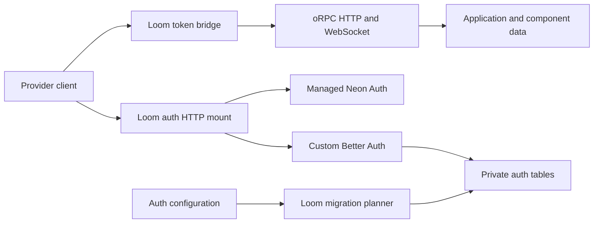
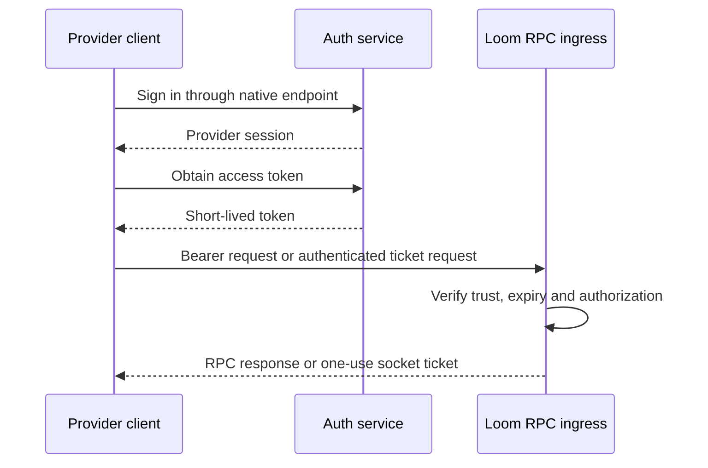
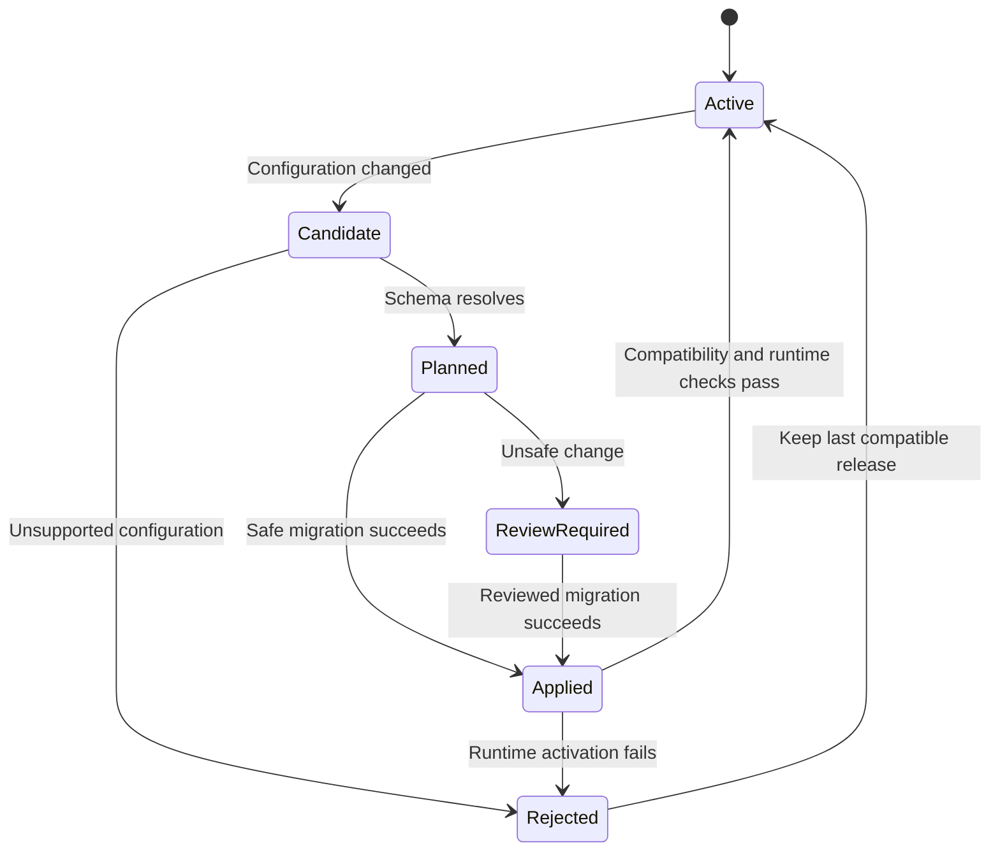
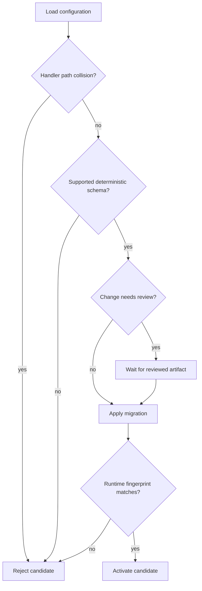

# Loom Hosted Auth and Better Auth Plugins - Plan

## Goal Capsule

**Objective:** Developers can authenticate Loom applications and use Better Auth plugins without building an authentication server in each frontend or maintaining duplicate auth table definitions.

**Means:** Separate managed Neon Auth, external token providers, and custom Better Auth hosting, with native HTTP handlers and one Loom migration owner (KTD1–KTD6).

**Authority:** The Product Contract owns behavior; the Planning Contract owns mechanisms within it. This plan supersedes frontend-hosted auth defaults in `docs/plans/2026-09-26-0919-refactor-public-package-neon-auth-plan.md`. Other package, component, RPC, and dev synchronization requirements remain in force.

**Execution:** Implement U1–U8 in dependency order. Preserve unrelated work. The executor owns tests, simplification, code/security review, and a scoped local commit after each unit. Publishing, pushing, and production auth/data conversion require separate authority. Keep receipts outside this plan under `docs/validation/`.

**Stop conditions:** Stop the affected unit when pinned upstream APIs cannot preserve required semantics, a migration would destroy unreviewed data, or provider access prevents acceptance. Continue independent units. Local substitutes never satisfy a required hosted Neon test.

## Product Contract

### Summary

Loom Auth remains the managed Neon Auth integration. External providers retain their own clients and pass access tokens to Loom. Custom Better Auth can run inside the Loom Functions server, with its native plugins, endpoints, and client APIs. Its table requirements join Loom's migration workflow automatically.

### Problem Frame

The Next.js and TanStack Start examples currently use framework auth proxy routes. That makes frontend server ownership appear necessary even for applications that only need a provider and a token. Better Auth plugins introduce another gap: a plugin may add persistence, HTTP endpoints, server-only methods, hooks, and client behavior together. Handling only its tables would not make it usable.

### Key Decisions

- **Separate provider models.** (session-settled: user-directed — chosen over one combined auth abstraction: preserve each provider's own authentication API.) Governs R1–R3.
- **Host custom auth with the backend by default.** (session-settled: user-directed — chosen over mandatory frontend auth servers: CSR and native clients must work too.) Governs R4, R5, R12.
- **Derive plugin persistence.** (session-settled: user-directed — chosen over consumer-generated auth schema source: the Better Auth configuration already declares its tables.) Governs R6–R8.
- **Preserve complete plugins.** (session-settled: user-directed — chosen over a tables-only integration: plugins can combine persistence, endpoints, and client interaction; Better Inbox is a test-only compatibility target, not a shipped integration.) Governs R9, R10.

### Requirements

#### Provider ownership

- R1. Loom Auth exposes a managed Neon Auth provider backed by Neon's supported SDK.
- R2. External auth uses the provider's own client and a typed token callback; Loom verifies tokens server-side against configured trust.
- R3. Selecting custom Better Auth does not change the managed Neon Auth database or take ownership of its tables.
- R4. Custom Better Auth may run on the Loom Functions server or on a user-selected external server.
- R5. CSR clients require no frontend auth server; Next.js and Start auth routes are optional integration choices.

#### Persistence and lifecycle

- R6. The configured Better Auth instance and its enabled plugins determine Loom-managed auth migrations without a consumer-maintained Drizzle auth schema file.
- R7. Migration history lives under `loom/_generated/migrations/`, survives code regeneration, and participates in the existing migration safety workflow.
- R8. Removing a plugin or auth mount disables its runtime capabilities while retaining its data until explicit reviewed cleanup.
- R9. Native plugin endpoint, hook, and server-only boundaries remain intact.
- R10. Native client plugins preserve their inferred methods and results.
- R11. `loom dev` observes auth configuration/plugin changes and activates compatible code only after successful schema synchronization.

#### Client behavior and acceptance

- R12. Authenticated SSR forwards credentials from the current request when available; it does not invent access to another origin's cookies.
- R13. Sign-out, expiry, refresh, and account changes preserve cache and WebSocket isolation.
- R14. Tests consume the compiled `loom/...` package and verify inference without broad casts or source aliases.
- R15. Real Neon Functions and a disposable Neon branch demonstrate managed auth, hosted Better Auth, plugin persistence, and client behavior.
- R16. Documentation states supported plugin/schema features and reports incompatible configurations before migration or deployment.

### Acceptance Examples

- AE1. A CSR user signs in through Loom Auth, calls a protected oRPC method, and subscribes with native live options. No Next.js or Start server participates. Covers R1, R5, R13.
- AE2. Adding a test plugin to custom Better Auth creates its declared table through `loom dev`; its native client reads a record created by a server-only service call. Covers R6, R9–R11.
- AE3. Removing the test plugin makes its endpoints unavailable while existing rows remain. Re-enabling the same mount restores access without recreating its namespace. Covers R8.
- AE4. Two overlapping SSR requests for different users return only their own data, while an uncredentialed request remains anonymous. Covers R12, R13.
- AE5. An incompatible schema change produces an actionable diagnostic and leaves the active release usable. Covers R11, R16.

### Scope Boundaries

Dedicated WorkOS, Clerk, and Auth0 packages and live acceptance remain deferred. Their SDKs fit R2; this plan does not duplicate them. Moving existing users from Neon Auth into custom Better Auth is a separate data migration. Generic support for every third-party plugin, arbitrary custom adapters, and databases other than PostgreSQL are outside this implementation.

Better Inbox is permitted as a pinned test-only dependency and compatibility target. Do not build or ship a Better Inbox wrapper, integration package, or product example. Test installed native plugins alongside focused fixtures; synthetic fixtures alone cannot establish real-plugin compatibility. Existing RPC contracts, explicit streaming contracts, Zod/Valibot Standard Schema support, and Effect integration must continue to work.

## Planning Contract

### Current Integration Points

- `apps/loom/src/core/adapters/neon/rpc-application.ts` already builds a Hono application. It reserves `/api/loom/*`, then delegates to component HTTP routes.
- `apps/loom/src/core/adapters/neon/component-http.ts` implements individual routes, origin policy, verified-user and signed-webhook access. Its fixed preflight headers and request-body handling are not a native Better Auth wildcard mount.
- `apps/loom/src/core/react/neon.ts`, `core/next/server.ts`, and `core/start/server.ts` implement the current managed provider and frontend proxies. `core/client/neon-token.ts` distinguishes proxy/direct token acquisition.
- `apps/loom/src/core/server/auth/rpc-definition.ts` separates verification from procedure authorization. Preserve that separation.
- `apps/loom/src/tooling/migrations/project.ts` applies migration scopes after history, drift, and review checks. `component-scopes.ts` retains detached component namespaces.
- `apps/loom/src/core/schema/compile.ts` adds `_id` and `_createdAt` to Loom entities. Better Auth tables must not pass through that entity compiler.

### Key Technical Decisions

- KTD1. Keep separate managed, external-token, and custom-auth entry points, sharing only the existing transport authentication lifecycle. Preserve native oRPC client and TanStack options. This implements R1–R5 (session-settled: user-directed — chosen over one combined auth abstraction: provider-specific APIs remain native).
- KTD2. Put the managed Neon proxy at the Loom service's `/api/auth/*` using the pinned SDK's public `handleAuthProxyRequest`. Neon remains the session authority. Custom hosting uses native Better Auth's Request/Response handler at that path instead; a deployment cannot mount both there. External hosting requires no local auth handler. This implements R4, R5 (session-settled: user-directed — chosen over mandatory frontend proxies: backend hosting serves every client type). [Neon overview](https://neon.com/docs/auth/overview), [Better Auth Hono integration](https://better-auth.com/docs/integrations/hono).
- KTD3. Introduce an optional `loom/better-auth` integration whose typed configuration factory receives validated environment and a Loom-owned database binding. Keep that factory independent of `_generated` runtime imports. Preserve the concrete Better Auth instance type for native `auth.api` and client inference. Register it explicitly through the existing component/application graph; filesystem discovery never activates it.
- KTD4. Resolve the effective schema using the public `getAuthTables` export from pinned `@better-auth/core`, then translate it into native Drizzle tables in memory. Use the same model/field mapping for the official Better Auth Drizzle adapter and Loom snapshots. Refactor the snapshot boundary to accept owned native tables without pretending they are Loom entities. This implements R6 (session-settled: user-directed — chosen over consumer-generated schema code: one configuration supplies persistence). BA's Kysely-only `getMigrations` would add another migration owner; it is not the selected route. Existing Drizzle ownership makes a second storage mechanism unnecessary. [Database integration](https://better-auth.com/docs/concepts/database), [Drizzle adapter](https://better-auth.com/docs/adapters/drizzle), [published resolver export](https://unpkg.com/@better-auth/core@1.7.6/dist/db/index.d.mts).
- KTD5. Treat auth persistence as an owned component migration scope with native IDs and private tables. Do not inject Loom system columns, entity validators, public CRUD, or `_id`-dependent triggers. Runtime roles have DML rights only. Never touch `neon_auth`. Existing external databases remain user-migrated unless explicitly adopted through a separately reviewed ownership operation.
- KTD6. Compare the effective schema used at runtime with the planned schema fingerprint before activation. Resolve plugin initialization through the pinned supported lifecycle; reject schema-changing initialization that cannot be resolved deterministically without running requests. Do not execute migrations during auth initialization. Reject unknown field semantics rather than silently coercing them. Fingerprint schema structure and plugin versions, excluding secret values, session data, and runtime credentials.
- KTD7. Retain removed plugin tables and columns in an ownership manifest separate from the current runtime schema. Diff additive changes against this retained target; classify incompatible changes for review. Before activation, check that retained constraints permit the new adapter's writes. A removed required field without a database default blocks activation until a reviewed compatible migration resolves it. Explicit cleanup produces a normal reviewed migration. Persist the manifest and history under `_generated/migrations/`; generation pruning must exclude them. R7, R8 govern the lifecycle.
- KTD8. Custom Better Auth uses its JWT plugin for Loom access tokens, with explicit issuer, audience, expiry, algorithm, and JWKS trust. Its opaque session token is not a Loom JWT. Managed auth uses the Neon SDK's supported token operation. External providers supply a token callback with refresh intent and loading/authenticated state. No client-selected issuer, JWKS URL, or provider label grants trust. [Better Auth JWT plugin](https://better-auth.com/docs/plugins/jwt).
- KTD9. Reuse principal-bound query clients, hydration verification, and one-use WebSocket tickets. On local sign-out or principal change, cancel work, close streams, and discard private cache before exposing the next identity. Locally issued JWTs use a short lifetime of at most five minutes. Remote revocation may remain effective only at expiry unless a provider supplies an online session check; document and test this bound.
- KTD10. Preserve native plugin endpoints on a dedicated mount before component catch-all routing. Mount collisions fail configuration. Apply credentialed origin policy, body limits, deadlines, and no-store responses without reparsing signed bodies or losing multiple Set-Cookie headers. Native plugin CSRF, callback, and endpoint authorization remain authoritative; oRPC middleware does not automatically protect these routes.
- KTD11. Use request-scoped credentials for optional SSR. Bearer forwarding is preferred; cookie forwarding is restricted to a configured auth origin and the incoming request's relevant cookies. Do not create a global authenticated client, serialize tokens into hydration, or default to broad shared-domain cookies. Cross-site cookie restrictions are a deployment constraint, not something CORS can solve.

### Dependency Baseline

Registry metadata currently reports Better Auth, `@better-auth/core`, and `@better-auth/drizzle-adapter` at **1.7.6**. Pin the tested versions in the lockfile and development fixtures, and keep the integration an optional package subpath. Do not bundle a second Better Auth copy or widen the advertised compatibility range without tests.

The workspace pins `@neondatabase/auth 0.5.0-beta`, Hono `4.13.8`, oRPC `2.0.0-beta.40`, Effect `4.0.0-rc.117`, Drizzle ORM/Kit `1.0.0-rc.4`, and TypeScript `7.0.2`. Keep unrelated upgrades out. Neon documents its managed service separately from self-hosted Better Auth; matching version numbers or plugin availability must not be assumed.

### High-Level Technical Design

These sketches describe boundaries and order; exact helper names may change when type fixtures expose a simpler API.

**Components and ownership — KTD1–KTD5:**



The two auth-handler destinations are exclusive choices, not a chain. External token providers bypass the local auth mount.

**Authentication protocol — KTD8–KTD11:**



**Release lifecycle — KTD6, KTD7:**



Rollback restores code only when compatible with the applied catalog; it never runs destructive inverse SQL automatically.

**Schema data flow — KTD4–KTD7:**

```text
Effective Better Auth options + plugins
  -> canonical model/field/index descriptions
  -> native Drizzle tables + logical-to-physical lookup
  -> retained ownership target + previous snapshot
  -> classified SQL + artifact hash
  -> existing locked migration runner
  -> runtime fingerprint validation and activation
```

**Hosting and credential modes — R1–R5, R12:**

| Mode | Session authority | Handler location | Loom credential | Migration owner |
|---|---|---|---|---|
| Managed Loom Auth | Neon | Loom proxy to Neon | Neon-issued access token | Neon for auth tables |
| Custom hosted | Better Auth | Loom Function | BA JWT plugin token | Loom for owned auth scope |
| External | External provider | User/provider selected server | Provider access token | External owner |

**Configuration surface — KTD3:**

```text
application
  environment: Standard Schema declarations
  use: explicit named auth component

auth component
  name: stable namespace identity
  configuration: validated environment -> native Better Auth options
  plugins: native server plugins
  service: concrete native auth API

browser
  provider: managed Loom Auth OR provider-owned client
  token bridge: loading + identity state + fetch token(refresh intent)
  RPC: existing generated client with native oRPC options
```

**Activation decisions — KTD6, KTD7, KTD10:**



### Mapping Rules and Risks

The translator must preserve logical model keys separately from physical table and column names. Resolve foreign keys through canonical keys before aliases; reject collisions and overlong PostgreSQL identifiers. Preserve nullability, unique constraints, indexes, references, JSON, dates, arrays/enums, and ID modes supported by the pinned adapter. Never evaluate JavaScript default functions into static SQL values. Keep runtime defaults and update hooks in the native adapter configuration.

Secondary storage, database rate limiting, additional fields, plugin field overrides, and `disableMigration` change table requirements. A disabled-migration table is externally owned and must be validated as present before enabling dependent features. Unknown constructs fail with a plugin/model/field diagnostic. Do not claim arbitrary plugin support merely because registration typechecks.

Use real Better Auth JWT, organization, and two-factor plugins, plus Better Inbox, to exercise native persistence, endpoints, server-only methods, and client inference. Pin Better Inbox as a test-only dependency after checking its peer compatibility with the selected Better Auth version. Keep small synthetic plugins for controlled unsupported-schema, collision, and ownership cases that real packages cannot reproduce reliably.

### Plugin and Configuration Test Matrix

Run parameterized unit tests for every row, actual PostgreSQL adapter/catalog tests for supported persistence variants, and HTTP/client integration tests for affected endpoints. Use a representative combined configuration for browser and hosted Neon acceptance; avoid an unbounded Cartesian product. Record exact dependency versions and configuration case IDs in results. These are required tests to implement, not completed validation.

| Dimension | Required configurations | Assertions |
| --- | --- | --- |
| Core persistence | Default; additional optional/required fields; model/field aliases; each supported ID strategy | Physical names, constraints, foreign keys, adapter writes/reads, and inferred fields agree; invalid configurations fail before applying SQL. |
| Storage options | Database sessions; secondary storage with database persistence enabled/disabled; verification persistence; database rate limiting | Only required owned tables are planned; session and verification operations use their configured storage. Use the pinned upstream option names. |
| JWT | Alone; combined with other plugins | Key persistence, token issuance, JWKS, rotation, issuer/audience verification, and native client token types work. |
| Organization | Default; teams disabled/enabled; schema aliases and supported extra fields | Conditional tables/fields and native routes follow configuration; membership authorization and references remain correct. |
| Two-factor | Disabled/enabled; supported schema overrides | Native enrollment/challenge/verification, persisted state, session behavior, and client methods work using deterministic test credentials and clocks. |
| Better Inbox | Alone; with organization; configured fan-out limit | Native notification persistence and client reads work; user/organization authorization is enforced; server-only creation is not an HTTP endpoint. |
| Combined plugins | JWT + organization + two-factor + Better Inbox | Shared core fields, foreign keys, route registration, inferred client methods, and sign-in-to-plugin flows coexist without collisions. |
| Runtime-only changes | Origin policy, token lifetime, and a plugin option that does not change its resolved schema | Runtime behavior changes as configured without spurious DDL or migration history entries. |
| Lifecycle | Add, remove, re-add; change schema options; supported pinned-version upgrade | Seeded data survives; disabled routes disappear; types refresh; incompatible activation is blocked; repeated generation/deploy is idempotent. |
| Invalid configurations | Duplicate aliases/routes, unsupported fields, missing externally owned tables, nondeterministic schema | Actionable diagnostics identify the plugin/model/field; no partial migration or candidate activation. |

Use the pinned native schema resolver as an independent contract reference, inspect the actual PostgreSQL catalog, and perform real native-adapter operations. Comparing two outputs of Loom's own translator is insufficient. Keep explicit expected constraints for representative cases so resolver and translator regressions cannot silently change expectations together. Select high-risk pairs such as aliases plus organization references, secondary storage plus two-factor, and custom IDs plus plugin foreign keys. Unsupported combinations must fail clearly and be documented rather than skipped as passing.

Sources for the test surfaces: [organization](https://better-auth.com/docs/plugins/organization), [two-factor](https://better-auth.com/docs/plugins/2fa), [database configuration](https://better-auth.com/docs/concepts/database), and [Better Inbox](https://github.com/better-inbox/better-inbox).

## Implementation Units

### U1. Define provider boundaries and prove the public type surface

**Goal:** Make the three provider models explicit without weakening native inference.

**Dependencies:** None. **Requirements:** R1–R5, R14, R16; KTD1, KTD3, KTD8.

**Files:** Existing `apps/loom/src/core/server/auth/rpc-definition.ts`, `apps/loom/src/core/react/neon.ts`, `apps/loom/package.json`; proposed `apps/loom/src/core/better-auth/definition.ts`, `packages/tests/types/better-auth.test-d.ts`, `packages/tests/types/auth-provider.test-d.ts`, `packages/tests/unit/auth-provider.test.ts`.

**Approach:** Establish the optional public subpath and typed configuration descriptor before runtime integration. Preserve native plugin tuple inference and custom session fields. Use existing Standard Schema environment declarations. Define the generic external token bridge on top of existing auth lifecycle, with no provider SDK wrappers.

**Execution note:** Start with positive and negative type fixtures against compiled exports.

**Test scenarios:**

- Native test-plugin and JWT plugin methods retain exact input/output types; nonexistent methods and invalid inputs fail typechecking.
- Zod and Valibot environment declarations both infer values; missing or invalid values fail before initialization.
- A root public import does not pull Better Auth, database code, or secrets into a browser bundle.
- An external token callback honors forced refresh and loading state without changing provider session ownership.
- An Effect-backed component service can expose the concrete auth instance without losing plugin types.

**Verification:** Type suite, provider unit suite, packed export inspection, and the per-unit gates below.

### U2. Compile Better Auth schemas into owned native tables

**Goal:** Produce equivalent runtime adapter tables and migration snapshots from the same configuration.

**Dependencies:** U1. **Requirements:** R3, R6, R14, R16; KTD4–KTD6.

**Files:** Existing `apps/loom/src/tooling/migrations/adapter.ts`, `planner.ts`, `apps/loom/src/tooling/project/load.ts`; proposed `apps/loom/src/core/better-auth/schema.ts`, `apps/loom/src/core/better-auth/database.ts`, `packages/tests/unit/better-auth-schema.test.ts`, `packages/e2e/integration/better-auth-schema.test.ts`.

**Approach:** Add the narrow native-table snapshot input, preserving existing Loom entity behavior. Normalize the effective pinned BA schema, then give the resulting lookup to the official Drizzle adapter. Keep tooling metadata server-only and separate from public entity validators.

**Test scenarios:**

- Run the configuration matrix against core auth and real plugin schemas; additional fields, conditional plugin tables, aliases, secondary storage, and database rate limiting produce the expected tables and constraints.
- Renamed models/fields keep correct foreign-key targets, including an alias matching another logical key.
- Dates, JSON, booleans, text IDs, supported numeric/UUID IDs, arrays and enums round-trip through the actual adapter.
- Defaults based on time run per insertion, not at generation; reordered equivalent configuration yields identical snapshots. Runtime-only option changes produce no schema diff.
- Secondary storage and `disableMigration` follow the configured ownership rules.
- Unsupported schema types, nondeterministic initialization, duplicate names, and missing external tables reject before SQL application.
- Neither `_id` nor `_createdAt` is injected; no public credential-table validator is generated.

**Verification:** Resolver unit tests plus PostgreSQL 18 adapter/catalog tests and per-unit gates. Pin any compatibility limitation found here before dependent units proceed.

### U3. Integrate migration ownership and dev synchronization

**Goal:** Safely evolve auth plugin persistence through the existing CLI lifecycle.

**Dependencies:** U2. **Requirements:** R7, R8, R11, R16; KTD5–KTD7; AE3, AE5.

**Files:** Existing `apps/loom/src/tooling/migrations/component-scopes.ts`, `project.ts`, `runtime-compatibility.ts`, `apps/loom/src/tooling/codegen/components.ts`, and dev coordinator; proposed `apps/loom/src/tooling/migrations/auth-scopes.ts`, `packages/e2e/integration/better-auth-migrations.test.ts`, `packages/e2e/cloud/auth-dev-watch.test.ts`.

**Approach:** Add retained auth ownership to migration scopes and release fingerprints. Reuse locks, drift checks, reviewed hashes, namespace identity, and watcher staging exclusions. Account for native auth tables in deployment schema provisioning and compatibility validation.

**Test scenarios:**

- Add a real plugin and toggle a schema-affecting option while dev runs: generate one migration, apply once, and activate schema/type bindings; repeated idle scans do nothing. U8 proves the complete handler flow after U4 exists.
- Stop dev, edit config: no database/runtime change occurs until explicit dev or deployment starts.
- Remove and re-add real plugins with seeded rows: retain and reuse data; remove the entire mount: mark its scope detached.
- Drop/type-change requests require reviewed artifacts; failed application leaves prior compatible runtime active. Removing a required plugin field without a database default blocks incompatible activation while preserving its rows.
- Concurrent dev/deploy attempts serialize migration ownership; interrupted application resumes without duplicate history.
- Code generation replaces `_generated` without deleting migration history or the ownership manifest.
- Existing application/component migrations remain unchanged when custom auth is absent.

**Verification:** Migration integration suite, cloud watcher scenario on a disposable branch, and per-unit gates.

### U4. Mount native custom auth and connect verified RPC identity

**Goal:** Serve Better Auth and its plugins from Neon Functions with correct access boundaries.

**Dependencies:** U1–U3. **Requirements:** R4, R9, R13, R16; KTD3, KTD8–KTD10.

**Files:** Existing `apps/loom/src/core/adapters/neon/rpc-application.ts`, deployment entrypoint, component runtime and auth verification; proposed `apps/loom/src/core/adapters/neon/auth-http.ts`, `apps/loom/src/core/better-auth/runtime.ts`, `packages/tests/unit/auth-http.test.ts`, `packages/e2e/integration/better-auth-http.test.ts`.

**Approach:** Add a native auth handler capability with explicit mount ownership. Initialize the instance once per runtime scope and drain/close owned resources on shutdown. Expose its server API through existing component services/internal calls; do not auto-publish methods as RPC procedures.

**Test scenarios:**

- Sign-up/sign-in/session/sign-out and a local OAuth test-provider callback preserve native status, redirect, and cookie behavior.
- Real plugin endpoints are reachable at the configured native auth mount using native clients; disabled-plugin endpoints are unavailable and wrong methods retain upstream behavior. Session-protected reads reject unauthorized users; arbitrary HTTP paths cannot invoke server-only methods.
- Hostile Origin, callback redirect, oversized body, duplicate mount, and encoded path traversal fail safely.
- Valid JWT reaches protected RPC; wrong audience/issuer/algorithm, expiry, and malformed/opaque tokens fail.
- JWKS rotation and unknown-key refresh work with bounded network fetches and configured URLs only.
- Plugin endpoint, RPC, and WebSocket requests drain on shutdown without leaking pools or Effect scopes.

**Verification:** HTTP integration, auth security tests, resource lifecycle tests, and per-unit gates.

### U5. Move managed Loom Auth hosting to Functions

**Goal:** Offer managed Neon sign-in without a frontend auth proxy.

**Dependencies:** U1, U4. **Requirements:** R1, R3, R5, R13; KTD1, KTD2, KTD8, KTD10; AE1.

**Files:** Existing `apps/loom/src/core/react/neon.ts`, `core/client/neon-token.ts`, auth environment resolution, deployment entrypoint; proposed `apps/loom/src/core/adapters/neon/neon-auth-http.ts`, `packages/tests/unit/neon-auth-http.test.ts`; extend `packages/e2e/cloud/neon-auth.test.ts`.

**Approach:** Use the public SDK proxy primitive inside the backend mount. Resolve trusted upstream URL and cookie-signing secret from server configuration. Supply the SDK client with the service auth URL and preserve its plugin/token behavior. Do not reuse the custom BA database binding.

**Test scenarios:**

- Real Neon sign-up, session reload, token acquisition, protected RPC, and sign-out work through the deployed Loom URL.
- Multiple Set-Cookie values, provider errors, password-reset links, and OAuth callback origins remain correct.
- An injected upstream URL, forged forwarding header, or cross-origin redirect cannot exfiltrate cookies/tokens. Generated manifests and schema fingerprints contain no cookie secret or credential value.
- Branch-local auth configuration never points a preview deployment at production auth by accident.
- Managed configuration creates no custom auth migration and does not modify `neon_auth`.
- Proxy outage yields a bounded failure without trusting stale unauthenticated state.

**Verification:** SDK contract tests and hosted Neon acceptance; local proxy mocks alone do not complete U5.

### U6. Migrate clients and optional SSR examples

**Goal:** Demonstrate simple provider usage across CSR, Next.js, and TanStack Start.

**Dependencies:** U4, U5. **Requirements:** R2, R5, R10, R12–R14; KTD1, KTD9, KTD11; AE4.

**Files:** Existing `apps/loom/src/core/client/server-session.ts`, `auth-lifecycle.ts`, `apps/loom/src/core/next/server.ts`, `core/start/server.ts`; existing `packages/examples/tasks`, `packages/examples/next`, `packages/examples/start`; proposed `packages/e2e/browser/auth-provider-boundaries.test.ts`, `packages/e2e/integration/auth-ssr.test.ts`.

**Approach:** Make the managed provider and generic token bridge the shared package API. Remove mandatory frontend proxy routes from the canonical examples; retain only explicitly optional compatibility adapters with migration guidance. Keep framework-specific SSR request handling small and package-owned. Preserve native oRPC queryOptions, mutationOptions, and explicit streaming liveOptions.

**Test scenarios:**

- CSR managed auth and custom BA clients work without any frontend server auth route.
- Two parallel SSR users and an anonymous visitor have independent query clients and hydration payloads.
- No token, cookie, account secret, or credential row appears in HTML, serialized query state, logs, or client bundles.
- Account switch/sign-out during a fetch or stream prevents late old-user results from populating the new cache.
- Refresh reconnects streams using a new one-use ticket; expiry closes existing access within the documented bound.
- Cookie-blocked cross-site deployment reports an actionable configuration error; the documented same-site setup succeeds without a frontend auth handler.
- Externally hosted BA uses the same token bridge without local migration ownership.

**Verification:** Framework builds, type fixtures, browser provider tests, SSR integration, and per-unit gates.

### U7. Verify real plugins and configuration combinations

**Goal:** Prove native plugin persistence, routes, server boundaries, and client inference across configuration variants without implementing a third-party product.

**Dependencies:** U2–U4, U6. **Requirements:** R6, R8–R10, R14, R16; AE2, AE3.

**Files:** Proposed `packages/e2e/fixtures/better-auth-configurations.ts`, `packages/e2e/fixtures/better-auth-plugin.ts`, `packages/e2e/fixtures/better-auth-plugin-client.ts`, `packages/tests/unit/better-auth-configurations.test.ts`, `packages/e2e/integration/better-auth-plugins.test.ts`, `packages/e2e/browser/better-auth-plugins.test.ts`, `packages/tests/types/better-auth-plugins.test-d.ts`; scoped test dependency declarations and lockfile updates.

**Approach:** Exercise installed JWT, organization, two-factor, and Better Inbox plugins through compiled Loom exports, native clients, and the actual Better Auth adapter. Implement the matrix above using named configuration cases and targeted interaction pairs. Synthetic fixtures supplement real plugins for negative cases. Better Inbox remains a test dependency; no wrapper or notification product is shipped. For upgrade acceptance, use two explicitly pinned compatible releases and seeded data; do not describe a configuration toggle as a dependency upgrade.

**Test scenarios:**

- Real plugin tables are created through Loom migrations, and native client requests reach their native handlers without reimplementing endpoints as oRPC procedures.
- Better Inbox reads a notification produced by its server-only API; user B cannot read or mutate user A's notifications. Organization cases enforce native membership behavior and configured fan-out bounds.
- Server-only methods remain unavailable over HTTP and absent from the browser client's callable methods.
- Organization teams and two-factor configuration variants change schema/routes as upstream specifies; enrollment, challenge, membership, and client interactions exercise actual stored state.
- JWT tokens reach protected Loom RPC while opaque session tokens and invalid JWT claims are rejected.
- Combined plugins coexist; refresh and re-login retain records; removal/re-addition follows AE3 and unregisters disabled endpoints.
- Positive and negative compile fixtures preserve exact plugin method inputs/results, custom fields, and plugin-specific availability without broad casts.
- Runtime-only configuration edits cause no migration; structural edits produce the expected migration and compatibility decision. Repeated generation and deployment remain idempotent.

**Verification:** Parameterized unit matrix, real PostgreSQL adapter/catalog and HTTP integration, representative browser flows, type fixtures, and per-unit gates. Report unsupported combinations explicitly; passing a synthetic fixture is not evidence that a real plugin passed.

### U8. Hosted acceptance, compatibility documentation, and release verification

**Goal:** Validate the complete developer journey using the packed library on Neon.

**Dependencies:** U1–U7. **Requirements:** R1–R16, AE1–AE5.

**Files:** Extend `packages/e2e/cloud/run.ts`; proposed `packages/e2e/cloud/better-auth.test.ts`, `packages/e2e/cloud/auth-plugins.test.ts`, `packages/e2e/integration/packed-auth.test.ts`, `apps/docs/content/docs/integrations/better-auth.mdx`, `apps/docs/content/docs/integrations/auth-providers.mdx`; update existing auth/example documentation and README in a scoped merge that preserves unrelated edits.

**Approach:** Install a packed `loom` artifact into a clean consumer. Run both managed and custom modes on disposable branches of the configured Loom Neon project. Deploy Functions, not just local servers pointed at Neon. Record migration artifacts, deployed URLs, versions, test outcomes, and cleanup without secrets.

**Test scenarios:**

- CLI bootstrap/configuration, dev plugin addition, migration, deploy, browser login, RPC, explicit live subscription, and real-plugin interactions succeed as a consumer, including the representative combined configuration from U7.
- A second deployment is idempotent; restart preserves sessions and rows; additive plugin upgrade preserves existing users and plugin records.
- Failed candidate deployment retains the last compatible release; reverting code never destroys retained tables.
- Independent Functions instances verify the same keys and sessions; no instance-local session authority is required.
- Schema-only branches and data-copy branches have correct branch-local endpoints and tested credential/secret setup.
- Packed consumer builds with TS7 and extensionless imports; browser dependency graph excludes server entry points.
- Delete test branches/resources and verify cleanup; missing credentials are recorded as blocked, not passed.

**Verification:** Complete Verification Contract and final security, correctness, API, migration, and simplicity reviews.

## Verification Contract

Run commands from the repository root unless a test path is specified. These are execution requirements, not claims that planning ran them.

- Build and types: `bun run build` and `bun run typecheck`.
- Lint/static checks: `bun run lint` and `bun run check:static`; retain Oxlint anti-slop rules without suppressing findings.
- Unit tests: `bun run test`, with targeted `bun test packages/tests/unit/<affected-file>` while developing.
- PostgreSQL integration: `bun run test:integration` using PostgreSQL 18 and disposable schema/branch credentials.
- Browser verification: `bun run test:browser`, including actual rendered Next.js, Start, CSR, and test-plugin flows.
- Hosted acceptance: `bun run test:cloud`; extend the runner so new auth scenarios cannot silently be omitted.
- Type assertions belong in `packages/tests/types/` and run through the existing strict typecheck. Include negative cases, not only successful examples.

Every unit requires relevant tests plus simplification, correctness/API review, security review, and scope-appropriate migration/performance review. Resolve significant findings, rerun affected checks, then make the requested scoped local commit. Preserve a receipt with commands, versions, results, unresolved limitations, and commit identity in `docs/validation/`.

For cloud acceptance, verify the configured project ID before mutation. Earlier acceptance used `late-moon-69483649`; do not copy the shorter conversational ID. Use disposable branches and isolated test users. Log neither database URLs nor tokens, cookie secrets, passwords, or private keys. A local server connected to Neon proves database integration only; hosted Functions acceptance requires the deployed Function URL.

Capture startup and login/token/RPC latency across warm and cold Function requests, together with baseline measurements from the existing example. No unsupported speedup claim or invented latency SLA is part of this plan. Confirm schema resolution is absent from the request hot path and pool/stream counts return to baseline after shutdown.

## Definition of Done

- U1–U8 meet their stated verification outcomes and R1–R16 have evidence in the validation receipts.
- AE1–AE5 succeed against the compiled consumer and required hosted Neon paths.
- Managed, custom, and external auth ownership are documented with working examples and explicit credential/SSR boundaries.
- No consumer-generated auth schema source, duplicate migration owner, public credential tables, or mandatory frontend auth server remains in the canonical flow.
- Dependency versions and supported schema features are pinned and documented; unsupported cases fail before deployment.
- Data survives plugin removal, re-addition, and compatible upgrades; destructive cleanup is reviewed explicitly.
- Per-unit commits and reviews are recorded, temporary cloud resources are removed, and abandoned experimental code is deleted.
- No required test is marked passed because it was skipped, mocked, or replaced by local-only evidence.
