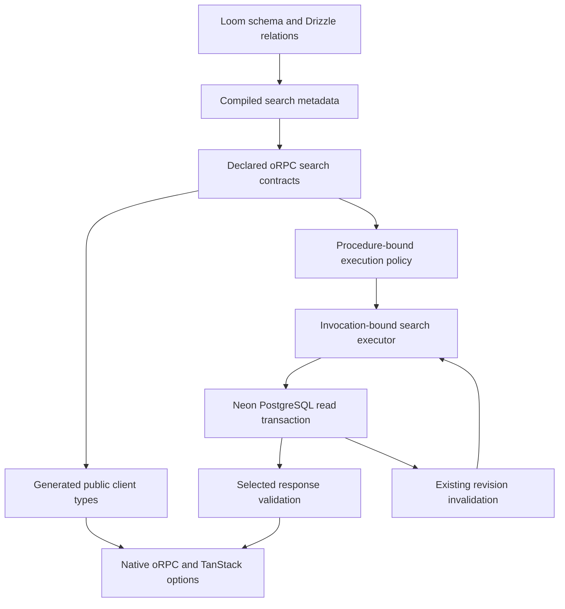
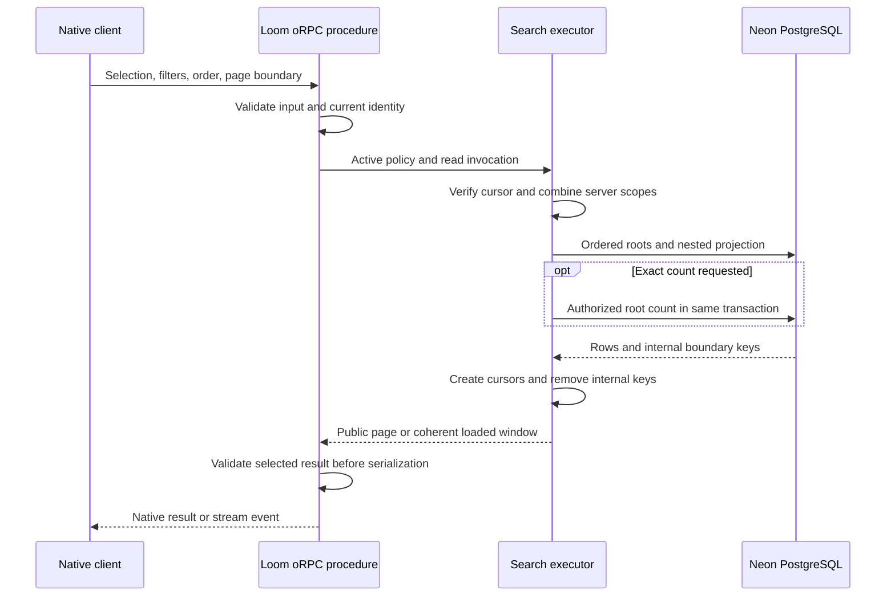
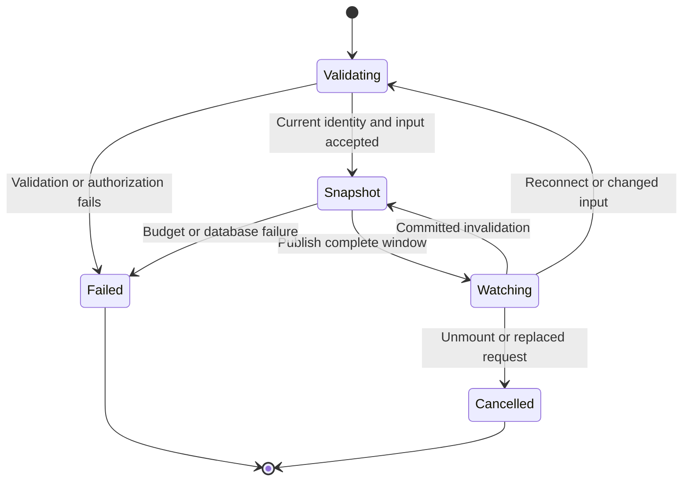
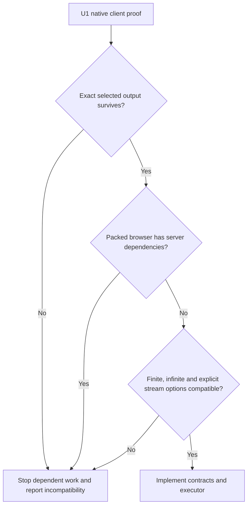

# Relational Search and Pagination - Plan

## Goal Capsule

- **Objective:** Developers can build typed, authorized lists with related records, load further pages, and keep loaded results live without maintaining duplicate search schemas.
- **Means:** Extend Loom's generated contracts and invocation context around native Drizzle relational queries and native oRPC/TanStack options (KTD1, KTD2, KTD3).
- **Authority:** Product behavior belongs to R1–R19. KTDs own implementation mechanisms within those requirements. Units and test cases cannot weaken either contract.
- **Execution profile:** Prove the public typing boundary first, then implement dependency-ordered units with unit, type, database, browser, packed-consumer, and hosted Neon verification.
- **Stop conditions:** If U1 cannot preserve selection-dependent types with the agreed native oRPC surface, stop dependent implementation and present the exact incompatibility. Stop cloud mutations when the target is protected, branch ownership is unverified, or credentials cannot be obtained securely. Routine implementation details remain the executor's responsibility.
- **Ownership and landing:** The implementing session completes verification and removes abandoned experiments. Follow the repository's current review and commit conventions, preserve unrelated work, and do not infer publication or a production deployment from this planning request.

---

## Product Contract

### Summary

Add schema-derived relational search contracts, a transaction-bound executor, and cursor pagination through Loom's generated API. Preserve native oRPC options and prove exact client-selected result types before expanding the implementation. Cover finite pagination and explicitly declared live subscriptions with the test matrix below.

### Problem Frame

Ontology's search API demonstrates useful filtering, sorting, and pagination, but its manually assembled search schemas and broad partial-row output do not deliver the requested contract-to-client relation typing. Its cursor implementation also supplies concrete regression cases: omitted ordering keys, guessed uniqueness, truncated fractional numeric values, and weak query binding.

Loom already compiles tables, validates their native relation graph, generates oRPC contracts, and owns request transactions. The missing feature is a search boundary that connects those capabilities without exposing every database table or requiring consumers to recreate their schema on the client.

### Key Decisions

- **Native oRPC client options.** Governs R3, R4. (session-settled: user-directed — chosen over Loom-specific query/mutation wrappers: consumers should use the upstream options and their overrides.)
- **Generated schema and relation knowledge.** Governs R1, R2. (session-settled: user-approved — chosen over manually maintained search field schemas: the Loom schema is already authoritative.)
- **Explicit streaming contracts.** Governs R12. (session-settled: user-directed — chosen over automatically generated live endpoints: subscriptions are declared intentionally.)
- **Authorization stays server-owned.** Governs R8, R9. (session-settled: user-approved — chosen over making a declared relation automatically public: relation knowledge does not grant permission.)

### Requirements

**Authoring and typing**

- R1. Derive search field codecs, nullability, ID brands, and eligible relation paths from Loom's compiled schema and validated Drizzle relation graph.
- R2. Inject the generated search contract factory into contract authoring and the typed search executor into handler context, including component-local contexts.
- R3. Keep native oRPC contracts, errors, metadata, transports, and TanStack `queryOptions`, `infiniteOptions`, and `liveOptions` as the public integration surface.
- R4. Infer exactly the requested root and nested projection through raw client calls and native options, including nullability and ID brands; do not substitute `Partial<Row>`, `any`, `unknown` result fields, or consumer casts.
- R5. Validate request selections and actual projected responses at runtime, with Standard Schema compatibility for Zod, Valibot, and Effect authoring.

**Query behavior and authorization**

- R6. Support typed root filters, declared relation predicates, ordering, and nested relation projections with per-relation filters, ordering, and limits.
- R7. Resolve direct and many-to-many relations through the declared graph, keeping junction internals out of responses unless intentionally exposed by a contract.
- R8. Let each contract restrict selectable, filterable, orderable, searchable, and reachable fields; hidden fields must not become filter or count oracles.
- R9. Combine server-owned root and relation authorization policies with client filters, and reauthorize every request and live reevaluation.
- R10. Execute search within Loom's active read invocation, with no independent database client, write escalation, or query work escaping the invocation lifetime.

**Pagination and liveness**

- R11. Provide deterministic forward and backward keyset pagination with opaque cursors, explicit terminal results, and hidden internal ordering keys.
- R12. Offer explicitly declared streaming search contracts whose first event supplies the initial result and whose later events update the loaded window through native `liveOptions`.
- R13. Keep each published live window ordered, adjacent, and free of duplicate roots or missing boundary rows at its database snapshot.
- R14. Separate root pagination from nested relation limits; loading further children uses a separately declared child search contract.
- R15. Make an exact authorized root count optional and distinguish it from page length; rows and count in one response share a read snapshot.
- R16. Reject unsupported selections, invalid limits, invalid cursors, and over-budget requests with typed errors rather than silently widening selection or truncating the requested result.

**Delivery and proof**

- R17. Work through the public packed `loom/...` package and generated browser API, without client runtime imports of database schemas or server-only dependencies.
- R18. Demonstrate supported pagination behavior across type, unit, database, native-client, browser, SSR/non-SSR, component, and actual Neon Functions tests.
- R19. Document the complete authoring-to-client flow and the finite/live consistency guarantees, with tested examples and public JSDoc.

### Acceptance Examples

- AE1. Covers R1–R5, R17. A developer selects task titles and label names; the generated client returns only those fields with the correct array and nullable shapes, while an attempt to read an unselected owner field fails typechecking.
- AE2. Covers R7–R11. Two users request the same task/label search; each sees only authorized roots and related records, and one user's cursor cannot continue the other's query.
- AE3. Covers R11, R14, R15. A page size of two over five matching roots yields pages of two, two, and one, with no root duplication from multiple labels and an optional count of five on every unchanged snapshot.
- AE4. Covers R12, R13. After two live pages are loaded, inserting, deleting, or moving a row across their boundary publishes one coherent replacement window without a separate finite bootstrap request.
- AE5. Covers R9, R12, R18. Revoking permission during a hosted WebSocket subscription removes access before any subsequent result is published and does not preserve another identity's cached results.

### Scope Boundaries

The implementation covers generated relational search, finite cursor traversal in both directions, optional counts, bounded nested projections, explicit live windows, and the supported consumer surfaces in R18.

**Considered and not built:**

- Offset-based random page jumping and Redis pagination: neither establishes the requested PostgreSQL keyset semantics; reconsider if an explicit product requirement needs random access or another backend.
- A GraphQL server, raw SQL from clients, and arbitrary browser callbacks: the requested graph-shaped selection remains inside declared oRPC contracts.
- Frozen snapshots across separate page requests: keeping a database transaction open across browsing or reconnects is outside the finite consistency contract in KTD7.
- Independently paginating every nested array in one root response: R14 provides an explicit child endpoint instead of an ambiguous cursor tree.
- Automatic global database exposure: R8 and R9 require a contract and policy for every exposed surface.
- A new cache, custom query engine, custom transport, per-row dependency tracker, or new authentication provider: the existing implementations cover this work's boundaries.
- Automatic production indexes inferred from arbitrary filters: application indexes remain deliberate schema choices. Query plans and documentation identify the indexes this feature needs.

#### Deferred to Follow-Up Work

- Indexed full-text ranking, facets, vector search, arbitrary aggregate ordering, and database-specific search extensions. Initial text search is an explicit bounded string operator over allowed fields.
- Resumable historical event replay and minimal row patches. Live subscriptions publish current windows, using Loom's existing invalidation mechanism.
- Independent component schemas beyond the relation boundaries already accepted by Loom.

---

## Planning Contract

### Current Baseline and Evidence

The owning manifest is `apps/loom/package.json`: oRPC `2.0.0-beta.40`, Drizzle ORM/Kit `1.0.0-rc.4`, Effect `4.0.0-rc.117`, TypeScript `7.0.2`, and TanStack Query `5.103.2`. Retain these pins for the first compatibility proof. Changes to pins require a separate justified decision.

| Existing boundary | Evidence | Consequence for this plan |
|---|---|---|
| Table and field compilation | `apps/loom/src/core/schema/compile.ts`, `define-schema.ts`, `table.ts` | Reuse metadata and literal table types; do not create a second authoring schema. |
| Whole public-row validation | `apps/loom/src/core/validation/derive.ts` | A partial projection needs its own derived shape; the whole-row validator is insufficient. |
| Native relation validation | `apps/loom/src/core/server/database/relations.ts` | Search uses the accepted graph, including namespaces and through edges. |
| Contract callback and context construction | `apps/loom/src/core/contract/index.ts`, `server/rpc/procedure.ts` | Currently injects table validators derived before relations are available. Attach search after validating the project graph, within the existing validators object. |
| Generated registrations and client | `apps/loom/src/tooling/codegen/application.ts`, `contracts.ts` | Currently use `RouterContractClient` and `RouterUtils`; selection-dependent output is not established. |
| Invocation-owned database access | `apps/loom/src/core/server/rpc/database.ts`, `transactions.ts` | Bind search to the active read transaction and its cancellation/lifetime guards. |
| Explicit live reevaluation | `apps/loom/src/core/server/rpc/live-context.ts`, `snapshot.ts` | Reuse the subscription lifecycle rather than creating a second engine. |
| Conservative revision capture | `apps/loom/src/core/server/rpc-runtime.ts` | Current scope-wide table tracking can cover nested/junction reads; query-specific invalidation is not promised. |
| Native client compatibility coverage | `packages/tests/types/rpc-options.test-d.ts` | Add search assertions for native options, select, cache, and suspense. |
| Hosted acceptance runner | `packages/e2e/cloud/run.ts`, `orpc-live.test.ts` | Add a search suite with required project/branch checks and actual hosted transports. |

The Ontology explanation supplies regression inputs. The subsequent [U1 characterization receipt](../validation/2026-09-29-search-u1-typing-proof.md) demonstrates the fixed-output native boundary; it does not establish R4. The [typing review](../reviews/2026-09-29-search-opus-typing-review.md) proposes generated declaration specialization and reproduces unsafe cross-projection placeholder reuse. Its corrected type-only sketch is neither a packed generation proof nor a runtime implementation. These findings determine KTD2 and KTD13. This revision changes planning documents only.

### Key Technical Decisions

- KTD1. **Expose schema-derived factories in existing generated contexts.** Implement R1 and R2 through the project registration and generated component registration already used for validators. Add search to `validators.tables.<entity>`; authoring supplies allowed columns, reachable relations, scopes, and budgets, while generated schema and relations supply codecs and cardinality. A finite search descriptor exposes input and output validators for native contract chaining; streaming is declared separately. Construct these factories once the compiled schema and validated graph are both available, rather than making callers pass relations repeatedly or extending schema compilation before that graph exists. One public descriptor owns input eligibility, projection types, runtime response checks, SQL metadata, and OpenAPI conversion. Native table metadata remains server-side; the browser receives only masked public type declarations. (session-settled: user-approved — chosen over importing and passing schema/relations in every handler: generation already owns those inputs.)

- KTD2. **Gate dependent work on generated selection typing with native runtime options.** The proposed mechanism specializes the generated raw client and the existing generated connection's `rpc` declarations from KTD1's descriptor. Runtime creation still uses native `createORPCClient` and `createTanstackQueryUtils`; no replacement option factory, cache, transport, or global upstream type augmentation is introduced. The installed `ProcedureUtils` has a fixed `TOutput`, and `RouterUtils` extracts that output: directly reconstructing upstream utilities from a specialized raw client loses the input/output relationship. P009 records that boundary honestly; the generated `connection.rpc` is the proposed selection-aware options entry point. U1 must prove this declaration specialization in a packed consumer using exported native option types, retaining errors, context, selection callbacks, page parameters, cancellation, and ordinary non-search procedures. Handwritten DTOs or stand-alone generic declarations cannot satisfy the gate. This is an unproven technical proposal, not an accepted compatibility result. If it requires changed option runtime behavior, excludes required native controls, or cannot satisfy KTD13, stop dependent work and surface the exact decision. [Native options](https://orpc.dev/docs/integrations/tanstack-query).

- KTD3. **Keep native contract identity and bind search policy to the procedure.** Descriptor-derived input and output schemas carry Loom-owned identity so native input/output chaining can register the matching descriptor without inspecting third-party validator ASTs. Discovery rejects mixed descriptors, substituted output schemas, or finite/stream mismatches and preserves identity through errors/meta chaining. Context execution obtains the active procedure policy rather than accepting client-provided policy or losing restrictions when the handler calls a generic table executor. Require a server scope for the root and each reachable relation; intentionally public data uses an explicit public policy, never a missing-policy default. This implements R3, R8, R9, and R10. [Contract-first procedures](https://orpc.dev/docs/contract-first).

- KTD4. **Derive a bounded declarative input language.** Reuse native Drizzle column and relation types for field/operator eligibility and runtime metadata for validation. Support scalar comparisons, membership, null checks, Boolean composition, explicit literal text matching, and relation predicates that the declared graph can compile safely. Keep selection, filter, order, and relation permissions separate. Unknown keys and empty explicit projections fail validation; omitted projection selects the contract's allowed default fields. Validate depth, list size, predicate count, and response budget before executing. This implements R5, R6, R8, and R16. [Relational queries](https://orm.drizzle.team/docs/rqb), [Standard Schema](https://standardschema.dev/schema).

- KTD5. **Compile root membership without multiplying root rows.** Use native relational projections and existence predicates for to-many membership, including many-to-many through paths. Apply authorization to each traversed relation and junction where its visibility affects membership. Count distinct authorized roots using the same membership predicate, excluding page limits and cursor boundaries; return an exact count as a nonnegative decimal string rather than a potentially rounded JavaScript number. Nested ordering and limits are independent of root cursor ordering. This implements R6, R7, R9, R14, and R15. [Drizzle relation v2 migration](https://orm.drizzle.team/docs/relations-v1-v2).

- KTD6. **Use lexicographic keysets with a verified unique suffix.** Default ordering is ascending creation time and ID. Represent explicit multi-field order as an ordered tuple in public input and append the root primary key when needed. Sort priority cannot depend on object insertion order: TanStack hashes plain-object keys in sorted order, which would merge distinct priority orders into one cache entry. Support mixed directions and explicit null placement. A backward request without a cursor starts at the dataset tail; reverse the database comparison/order for retrieval, then return rows in the declared display order. Fetch ordering keys internally even when omitted from the projection. Use one extra matching root to determine continuation, remove it before returning, and derive tokens from the retained boundary rows. Implement R11 and R16 without guessed unique fields or lossy key conversion. [Compound keyset pagination](https://orm.drizzle.team/docs/guides/cursor-based-pagination).

- KTD7. **Finite pages share a snapshot only within one invocation.** Repeating a page with an unchanged database is deterministic. Between page requests, inserts before the cursor are not backfilled, deletes are skipped, and updates that cross the cursor may cause an already seen row to reappear or an unseen row to move behind it. The cursor is a boundary value, not a reference requiring the boundary row to still exist. Refresh restarts the traversal. Count describes the current authorized snapshot, not the original traversal snapshot. This defines R11 and R15's finite consistency limits.

- KTD8. **Authenticate and conceal cursor contents.** Use the existing `jose` dependency for an authenticated encrypted, versioned token; do not build cryptography or use a short sort hash. Bind it to the contract policy version, logical entity/component namespace, canonical membership query, projection, ordered keys, and server authorization scope. The identity binding uses stable issuer/subject and relevant organization/policy inputs; ordinary access-token refresh does not invalidate a cursor. Content revisions do not invalidate finite cursors, while incompatible schema/policy changes do. Transport only exact typed key values, including decimal/bigint values and null markers. Page size and loaded-page count are excluded from query bindings and may change within budget; direction is checked against the token's intended boundary use. Set a finite server-owned token lifetime and test issuance/expiry with a controlled clock. A dedicated branch-stable server key is provisioned through existing Loom environment/deployment facilities, never derived from a user's access token or a Neon management credential. Missing keys fail startup for exposed search procedures. Rotation deliberately invalidates old cursors with a typed restart error. This implements R8, R9, R11, and R16; tokens do not replace authorization.

- KTD9. **Publish a live loaded window from one snapshot.** An explicit live contract accepts the search plus an anchor and a requested loaded-page count. It issues its own boundary tokens under KTD8; a finite endpoint's cursor cannot be reused across the streaming contract. Each event contains the whole currently loaded window, partitioned into display pages, with continuation metadata. Recompute all its roots in one read invocation, then atomically replace the native live query value. Increasing loaded pages preserves the anchor and opens a replacement stream; cancel the old stream and accept only the active request epoch. This provides R12 and R13 without stitching independently revised finite pages or requiring a finite bootstrap request. Finite traversal still uses native `infiniteOptions`. This is bounded current-window reactivity, not Convex's historical per-page range retention. [Native live options](https://orpc.dev/docs/integrations/tanstack-query), [Convex reactive pagination](https://docs.convex.dev/database/pagination).

- KTD10. **Use native Drizzle execution and Loom's existing revision system.** Read through the invocation's database and register the root, related, junction, and authorization-table dependencies. Initial scope-wide revision capture is acceptable and must remain conservative. Reevaluate on relevant external SQL commits as well as Loom writes. Cancellation releases all work and reconnect starts with a fresh authorized window. This implements R7, R9, R10, R12, and R13 without new polling or transport machinery.

- KTD11. **Validate selection-dependent results at the shared RPC boundary.** Before serialization or any validator that can strip fields, check the complete result against KTD1's descriptor and the normalized validated input. Cover arbitrary handler returns, internal/direct calls, Effect handlers, and every streaming yield; calling the search executor must not be a prerequisite for validation. Reject hidden/extra fields, missing selected fields, wrong scalars, and wrong relation shapes. The native output schema also validates the envelope and eligible public values. Input transforms must not be reapplied to stored values. Standard Schema's validation interface does not supply JSON Schema conversion; its separate Standard JSON Schema interface may be used where the pinned oRPC adapter supports it. U2 proves conversion from the Loom-owned descriptor without inspecting Zod, Valibot, or Effect ASTs. This implements R4 and R5. [OpenAPI generation](https://orpc.dev/docs/openapi/specification), [Standard Schema interfaces](https://standardschema.dev/).

- KTD12. **Bound work without silently changing results.** Reuse existing Loom invocation timeout/cancellation and validate contract-owned limits for root page size, live loaded-window size, nested relation size/depth, input size, and encoded output bytes. A relation limit cannot bound the complete query cost by itself. An exhausted budget fails the request/event with a typed error; it must not present a truncated result as exhausted pagination. Test indexed root traversal, relation fanout, and counts on Neon, recording query plans and cold/warm timings without claiming an unmeasured speed improvement. This implements R10, R16, and R18.

- KTD13. **Prove native cache controls cannot falsify projection typing.** Native `keepPreviousData` can return a title-only page while a done-only request is pending, even when keys differ. Typing that placeholder as the new selection violates R4. U1 must prove a type-only option specialization whose previous-data input represents every authorized prior projection and whose callback result satisfies the current projection. Cover native observer reuse, defaults, scoped utility options, initial data, and custom query functions; do not silently drop placeholder support or add an unapproved runtime wrapper. Extra properties in structurally compatible initial data are permitted by native types; missing selected fields and wrong scalars are not. Default keys partition projection and identity; explicit custom keys remain caller-owned and documentation must explain their collision risks. Ordinary unsafe downstream overrides cannot be claimed as verified by generated declarations. If the required native surfaces cannot express these guarantees, record the failing boundary and stop under KTD2. [TanStack paginated queries](https://tanstack.com/query/latest/docs/framework/react/guides/paginated-queries).

- KTD14. **Infer sound results for nonliteral selections.** Literal inputs retain exact fields. Conditional, optional, union, or widened selections return a sound union or conservative shape containing only fields guaranteed by that input; never pretend a widened selection requested all fields. U1 proves inference from schema/relations-derived descriptors for root and nested variables, not only fresh literals. Negative compiler fixtures test forbidden inputs; annotations characterizing a known failure cannot count as positive evidence for R4. No casts or suppression annotations belong in consumer examples. This implements R1, R4, and R18.

### High-Level Technical Design

These sketches describe the boundaries and data flow. Names in the API grammar are directional and must pass U1 before becoming public declarations.

**Component topology and data ownership**



**Protocol and data-flow sequence**



**Live lifecycle and request replacement**



**Compatibility decisions**



**Directional API grammar**

```text
Authoring
  schema.ts + relations.ts -> generated graph-aware validators
  defineContract callback receives validators
  validators.tables.<entity>.search chooses allowed columns, relations and budgets
    -> matching input + output schemas + private descriptor identity
  native contract attaches descriptor.input and descriptor.output
  validators.tables.<entity>.liveSearch declares a separate streamed window descriptor
  native contract chaining retains errors and metadata

Handler
  context.search.<entity>.paginate receives validated input and server scopes
  context.search.<entity>.watch receives validated window input and server scopes
  each call remains bound to the active procedure policy and transaction

Finite input
  columns? + where? + with? + ordered fields? + limit + cursor? + direction?

Live input
  same selection and membership + anchor? + page size + loaded pages

Nested selection
  declared relation -> columns? + where? + ordered fields? + bounded limit?

Finite output
  rows + nextCursor + previousCursor + optional exact count as decimal string

Live output
  pages of rows + nextCursor + previousCursor + optional exact count as decimal string

Client
  generated client receives the current token getter
  generated connection.client -> raw calls with selection-dependent declarations
  generated connection.rpc -> native queryOptions or infiniteOptions
  generated connection.rpc -> explicit watch liveOptions, optionally with suspense
  options retain enabled, skipToken, select, retry and cache controls
  placeholder and nonliteral selection guarantees must pass KTD13 and KTD14
  directly rebuilding upstream utilities has the fixed-output limit in KTD2
```

### Assumptions and Implementation-Time Questions

The following are technical defaults, not additional session-settled product choices:

- Bidirectional keysets and a live loaded-window representation are the proposed mechanisms for the pagination coverage requested. U1 proves their compatibility with the accepted native options surface.
- Conservative initial budgets should use existing Loom limit conventions. Choose and document concrete defaults during U2; test each default and boundary. Increasing nested reach requires an explicit contract decision.
- The dedicated cursor key extends environment validation and release secret handling in `tooling/deploy/neon/environment.ts` and `prepare-release.ts`. U4 must prove stable provisioning across redeployments without making it a browser or provider-injected variable. Token lifetime and contract budgets get concrete documented defaults during U2/U4 and exact boundary tests.
- The pinned Drizzle version's accepted ordering scalar set and relation predicate forms must be established in U3 and U4. Reject unsupported forms in both types and runtime validation rather than emitting approximate SQL.
- U1 resolves KTD2 and KTD13 with a packed positive proof. The reviewed declaration sketch and its placeholder restriction are candidates, not proven solutions. A failure cannot be settled by retaining an expected-error annotation or removing a native control.
- Neon profile and disposable branch access are verified at execution time. No provider writes or acceptance tests are authorized by this planning-only run.

### Alternatives and Risks

| Choice considered | Decision and consequence |
|---|---|
| Copy Ontology's compiler | Borrow behavior and regression fixtures; its domain aliases, numeric cursors, and broad partial outputs do not satisfy R4 or R11. |
| Manually declare a DTO per search projection | Works for finite fixed views, but cannot satisfy R4's client-selected projection; it is not a silent fallback. |
| Treat oRPC middleware/interceptors as a dependent-type solution | Installed types keep a fixed output; U1 must prove an actual type boundary, not assume metadata repairs it. |
| Generate declarations for the existing native client and `rpc` result | Proposed by KTD2; preserves native runtime, but adds declaration maintenance and requires proof against every supported option surface. Direct upstream utility reconstruction remains fixed-output. |
| Generate every possible projection as an overload or separate file | Combinatorial growth is unnecessary; derive a bounded public graph and reusable selection types instead, then measure TS7 cost on representative graphs. |
| Accept blind previous-page placeholders for different projections | Runtime data can lack newly selected fields. KTD13 gates a sound native option specialization; a compiler-only sketch cannot establish safety. |
| Reevaluate each finite page independently for live mode | Produces overlapping or missing boundary rows; KTD9 publishes a coherent window instead. |
| Hold one read transaction for the entire session | Preserves a snapshot but conflicts with the serverless request lifetime; KTD7 documents finite behavior. |
| Create a new GraphQL/cache engine | Adds machinery already covered by Drizzle, oRPC, and TanStack; R3 keeps those integrations. |

The highest feasibility risk is R4 through native oRPC's fixed output types. The highest security risk is a nested relation or filter revealing another owner's rows even when the root is scoped. The highest liveness risk is publishing a late result from a replaced identity/input or combining pages from different snapshots. U1, U5, and U7 respectively own the proof for these risks.

### System-Wide Impact

Contract generation changes public typings, context injection, contract identity validation, and the browser/server packaging boundary. Existing non-search contracts must retain their current behavior. Search's read-only policy must override forged client operation hints and direct server invocation paths.

Schema compilation currently derives validators without relations. Root and component generation, application RPC construction, and runtime invocation construction must converge on one graph-aware context builder. Otherwise contract discovery and handler execution can disagree about relation paths or policy identity. U2 owns that builder; U5 and U6 connect every call site. Browser declarations contain only the contract-authorized graph, while internal component capabilities keep their existing isolation.

Output validation moves to the shared invocation boundary under KTD11. Tests must cover handlers that return constructed data or yield events without invoking search. Generated option declarations must follow native alias changes at the pinned dependency boundary without modifying unrelated procedures. Query defaults and placeholder reuse are part of U1's feasibility proof, not a later UI polish task.

Components keep their local logical entity names and physical namespaces. A component's search context cannot acquire another component's tables or private fields through an inferred relation path. Mount changes invalidate the corresponding policy fingerprint and live resource scope.

The tasks example gains a shared label catalog and a junction table for M2M proof; a separate private-relation fixture tests ownership isolation. Apply those fixture changes through generated migrations under `_generated/migrations`, preserving existing data. No production schema or user-owned provider configuration is replaced.

---

## Implementation Units

### U1. Prove native selection typing and consumer compatibility

**Goal:** Establish that the requested contract-to-client API can satisfy R3 and R4 before building its runtime.

**Requirements:** R1–R5, R17; AE1. **Dependencies:** None.

**Files:** `packages/tests/types/search-contracts.test-d.ts`, `packages/tests/types/rpc-options.test-d.ts`, `packages/tests/types/orpc-compatibility.test-d.ts`, `packages/e2e/integration/packed-search.test.ts`, `packages/tests/unit/search-options.test.ts` (new), `apps/loom/src/tooling/codegen/application.ts` as the generation boundary to study.

**Approach:**

1. Extend the existing characterization into a positive KTD2 proof using an actual compiled schema and validated M2M graph. Minimal descriptor/type-generation scaffolding is allowed here; a manually declared row or generic client is insufficient.
2. Generate specialized raw and existing `rpc` declarations through the normal packed fixture, using native exported option aliases. Preserve ordinary procedures and characterize direct upstream reconstruction separately.
3. Prove KTD14's literal, variable, conditional, and widened inputs alongside all three option forms, errors, context, select, tagged cache access, suspense, and page parameters. Check optional property inference with both supported exactOptionalPropertyTypes settings.
4. Prove KTD13 with real native QueryObserver projection switches and compile-time callback/default constraints. Test repeated callback reuse while the new request is pending, not only a completed fetch.
5. Record the proven mechanism or exact failed boundary; remove unsuccessful declarations. Report representative TS7 time/size measurements for nested graphs without claiming a performance improvement.

**Execution note:** Start with failing type assertions and the packed consumer proof. Do not implement dependent units while KTD2 is unresolved.

**Patterns to follow:** Existing native option assertions and packed-consumer fixtures.

**Test scenarios:**

- Covers AE1. Selecting only a title and nested label name retains their exact types and rejects an unselected owner property.
- A nullable one relation remains nullable, a many relation remains an array, and a branded ID does not become an unbranded string.
- Native select, initial data, placeholder data, suspense, and cache access use the selected result rather than a broad schema row.
- Generated raw and `rpc` results satisfy R4 without consumer casts; direct upstream reconstruction is characterized under P009 rather than represented as selection-aware.
- Switching from title-only to done-only pending data never permits an absent done field to be read as a Boolean under the supported generated options.
- P001–P010 and P108–P116 specify the compatibility cases and failure criteria.

**Verification:** Positive TS7 assertions, schema-derived packed declarations, and native observer behavior jointly establish KTD2, KTD13, and KTD14. Negative fixtures remain necessary, but expected errors reproducing the current broad output are failure evidence. A green characterization suite or fixed-output procedure is insufficient.

### U2. Derive search contracts and runtime policy metadata

**Goal:** Make contract authoring schema-aware while retaining native contract identity and validation.

**Requirements:** R1–R5, R8, R16; AE1. **Dependencies:** U1 passing.

**Files:** `apps/loom/src/core/contract/index.ts`, `apps/loom/src/core/schema/compile.ts`, `apps/loom/src/core/validation/types.ts`, `apps/loom/src/core/server/rpc/procedure.ts`, `apps/loom/src/core/search/types.ts` (new), `metadata.ts` (new), `contract.ts` (new), `validation.ts` (new), `packages/tests/unit/search-contracts.test.ts` (new), `packages/tests/types/search-contracts.test-d.ts`, `packages/e2e/integration/search-openapi.test.ts` (new).

**Approach:**

1. Build KTD1's shared descriptor and graph-aware validator context from compiled fields and the accepted graph, preserving existing table validators and ID helpers.
2. Add finite and explicit live descriptor factories under table validators using KTD3 and KTD11, retaining native input/output chaining and serialization.
3. Derive separate capability maps and bounded request validators under KTD4 and KTD12.
4. Add the generated-schema OpenAPI converter and explicit error definitions for invalid cursor, selection, and query budget failures.

**Patterns to follow:** Existing public/command/storage validator separation and contract implementation identity checks.

**Test scenarios:**

- Zod, Valibot, and Effect contract composition accepts the generated search schemas without library-specific AST inspection.
- Unknown table/relation/field names and fields outside allowed operations fail in types and at the runtime boundary.
- Omitting columns uses the allowed default; explicitly selecting no fields fails instead of requesting all storage columns.
- Native errors/meta chaining retains the exact schemas and policy fingerprint through discovery.
- Matching descriptor schemas retain identity; mixed policies, graph/table identity mismatches, and finite/stream mismatches fail discovery.
- P011–P021 and P117–P121 cover schema, codec, descriptor, and policy validation.

**Verification:** Generated descriptors match actual compiled fields and permitted relations. Non-search contracts pass their existing discovery and identity checks.

### U3. Compile authorized relational search membership and projection

**Goal:** Translate the validated query shape into bounded native Drizzle queries, including M2M.

**Requirements:** R6–R9, R14–R16; AE2, AE3. **Dependencies:** U2.

**Files:** `apps/loom/src/core/search/compiler.ts` (new), `projection.ts` (new), `apps/loom/src/core/server/database/relations.ts`, `packages/tests/unit/search-compiler.test.ts` (new), `packages/e2e/integration/search-relations.test.ts` (new), `packages/e2e/fixtures/search-schema.ts` (new).

**Approach:**

1. Implement KTD4 and KTD5 with native column references and parameterized values.
2. Preserve relation aliases, direct/to-many/through cardinality, and policy restrictions while deriving exact projections.
3. Compile membership and optional count from the same canonical predicate rather than a domain-specific search router.
4. Establish the supported relation predicate and scalar operator set against the pinned Drizzle version.

**Execution note:** Characterize the Ontology regressions as Loom behavior tests; do not import Ontology's production code.

**Patterns to follow:** Native relations-v2 handling and current schema/database test fixtures.

**Test scenarios:**

- Covers AE2. A scoped task with private labels cannot expose the other owner's label through projection, predicate, or count.
- Covers AE3. Multiple qualifying labels do not duplicate a task or increase the root count.
- A missing optional one relation yields null, and an empty many relation yields an empty array without losing nested field validation.
- A one relation removed by child filtering or authorization has a sound nullable result, even when the native graph marks the underlying link required. Declare that possibility from descriptor policy; never leak a forbidden child to satisfy a non-null type.
- Nested child limits and filters do not change root page membership unless the contract explicitly declares a relation membership predicate.
- P022–P036 cover filtering, ordering eligibility, relation paths, and injection attempts.

**Verification:** Real PostgreSQL results match a fixture oracle for direct and M2M graphs, with no per-root query pattern and no silently stripped relations.

### U4. Implement exact bidirectional cursors and key provisioning

**Goal:** Make finite traversal deterministic, opaque, and bound to the correct query and policy.

**Requirements:** R8, R9, R11, R16; AE2, AE3. **Dependencies:** U3.

**Files:** `apps/loom/src/core/search/cursor.ts` (new), `ordering.ts` (new), `apps/loom/src/tooling/deploy/neon/environment.ts`, `prepare-release.ts`, `packages/tests/unit/search-cursor.test.ts` (new), `packages/e2e/integration/search-pagination.test.ts` (new).

**Approach:**

1. Implement KTD6's ordered tuple and forward/backward comparisons with the same explicit null semantics as the query order.
2. Encode exact boundary values and KTD8's bindings through the existing `jose` library.
3. Provision the dedicated server key through the existing environment/deployment owner, stable across cold starts and replicas.
4. Add bounded token parsing and typed restart errors, with no raw token or key contents in diagnostics.

**Patterns to follow:** Existing secret-redaction and provider environment preparation, not activation-token hashing as an auth-key substitute.

**Test scenarios:**

- Traversing tied timestamps in both directions returns every stable root once in display order.
- A projection excluding ID and creation time still produces a valid continuation and exposes neither internal key in the row.
- Decimal/bigint keys, nulls, and mixed directions retain exact comparisons after token round trips.
- A valid cursor decrypts on another Function replica; key rotation and changed query/identity/policy produce typed restart errors.
- P037–P061 cover finite boundaries, ordering, and token validation.

**Verification:** Fixed-snapshot property tests and PostgreSQL differential tests establish complete traversal. Hosted key provisioning proves restart/replica continuity, not merely an in-process encode/decode test.

### U5. Bind execution to read transactions, policies, and counts

**Goal:** Inject search into native handlers without creating a parallel database or authorization layer.

**Requirements:** R2, R5, R8–R11, R15, R16; AE2, AE3. **Dependencies:** U4.

**Files:** `apps/loom/src/core/server/rpc/procedure.ts`, `database.ts`, `snapshot.ts`, `apps/loom/src/core/search/executor.ts` (new), `apps/loom/src/core/server/rpc-runtime.ts`, `packages/tests/unit/search-executor.test.ts` (new), `packages/e2e/integration/search-transactions.test.ts` (new), `search-pagination.test.ts`.

**Approach:**

1. Add KTD1's context service using the active procedure and invocation guards.
2. Combine server policies, client membership, and cursor boundaries in one read path.
3. Implement KTD7's count within the snapshot and KTD11's shared selected-response boundary for all handler returns and stream events.
4. Register KTD10's dependency scope and preserve existing read-only/lifetime restrictions for direct, HTTP, and WebSocket calls.

**Patterns to follow:** Existing transaction sharing, snapshot reads, guarded callbacks, and Effect service injection.

**Test scenarios:**

- A forged native operation hint cannot turn a search procedure into a write transaction.
- Rows and exact count agree when a concurrent writer commits between the two SQL statements.
- Calling search outside its active invocation, after cancellation, or for another contract's entity fails before SQL.
- Output containing a hidden field, wrong scalar, or wrong relation cardinality fails before publication.
- A handler that constructs a response without calling search still receives the same selected-response check before output can be stripped or serialized.
- P062–P076 and P122–P124 cover authorization, output bypass, transaction lifetime, count semantics, and concurrent finite requests.

**Verification:** Native transport and direct-call integration tests prove read ownership and authorization. Same-invocation count consistency is demonstrated with a deterministic concurrency barrier.

### U6. Generate public clients and component-local search contexts

**Goal:** Deliver the proven API through the actual package and generated application boundaries.

**Requirements:** R1–R5, R7–R10, R17; AE1, AE2. **Dependencies:** U5.

**Files:** `apps/loom/src/tooling/codegen/application.ts`, `contracts.ts`, `components.ts`, `apps/loom/src/core/server/application/definition.ts`, `apps/loom/src/core/server/rpc-runtime.ts`, `apps/loom/package.json`, `packages/e2e/integration/search-codegen.test.ts` (new), `search-components.test.ts` (new), `packed-search.test.ts`, `packages/tests/types/components.test-d.ts`, `search-contracts.test-d.ts`.

**Approach:**

1. Wire U1's specialized raw/`rpc` declarations and U2's graph-aware validator builder through root, component, application, and invocation generation. Keep the native client/options runtime creation unchanged under KTD2.
2. Preserve KTD3 policy identity across generated registries, internal procedures, and component mounts.
3. Keep type-only schema knowledge out of browser runtime modules and test regeneration through the existing watcher.
4. Verify generated contracts and clients are current without retaining generation directories or adding hand-authored app scripts.

**Patterns to follow:** Current packed consumer/component tests and generated-file replacement conventions.

**Test scenarios:**

- A new table field or relation becomes available after generation; old/removed fields stop typechecking.
- Two mounts of the same component retain local types and separate physical namespace/query bindings.
- Unmounted/internal component search procedures are unreachable from the public generated client.
- A packed browser consumer uses only `loom/...` and generated API imports and resolves no PostgreSQL/node runtime modules.
- P077–P082 and P125–P127 cover generation, components, public graph masking, and unchanged ordinary procedures.

**Verification:** Generation and packed type/runtime tests reproduce the requested API without workspace-source resolution shortcuts.

### U7. Implement coherent live loaded windows

**Goal:** Keep loaded search results reactive through explicit native streaming contracts.

**Requirements:** R5, R7, R9, R10, R12, R13, R16; AE4, AE5. **Dependencies:** U6.

**Files:** `apps/loom/src/core/search/live.ts` (new), `apps/loom/src/core/server/rpc/live-context.ts`, `snapshot.ts`, `apps/loom/src/core/server/rpc-runtime.ts`, `packages/e2e/integration/search-live.test.ts` (new), `packages/tests/unit/search-live.test.ts` (new), `packages/e2e/browser/search-client.test.ts` (new), `packages/e2e/browser/fixture/search-client.tsx` (new).

**Approach:**

1. Implement the explicitly declared streamed window in KTD9 with the existing live invocation lifecycle.
2. Subscribe to KTD10 dependencies and publish only KTD11-validated complete windows.
3. Prove input/identity replacement and cancellation using native option keys and transport lifetimes, without a second cache or a bootstrap query.
4. Exercise loaded-page increases, shrinkage, reconnects, permission changes, and query budget failures.

**Patterns to follow:** Existing native `liveOptions`, stream lifetime, external SQL invalidation, and slow-peer tests.

**Test scenarios:**

- Covers AE4. A boundary-crossing insert/delete/order update replaces the complete loaded window with one sorted, duplicate-free snapshot.
- Covers AE5. Revocation, logout, or changed identity stops publication and isolates the next identity's cache.
- Changing a filter while a previous stream is delayed cannot publish the old selection into the new query value.
- Projection switches with native placeholders satisfy KTD13 during loading and reconnect, not only after the first accepted event.
- Changing only a joined label or its junction row updates the window even when the root row is unchanged.
- P083–P097 cover live semantics and lifecycle failures.

**Verification:** Browser and real database tests prove native first-event loading and coherent updates, including external commits and deterministic request races.

### U8. Prove hosted Neon, consumer DX, and documentation

**Goal:** Establish acceptance on real Neon Functions and ship an executable authoring-to-client example.

**Requirements:** R1–R19; AE1–AE5. **Dependencies:** U7.

**Files:** `packages/e2e/cloud/search.test.ts` (new), `packages/e2e/cloud/run.ts`, `packages/e2e/fixtures/cloud-search.ts` (new), `packages/e2e/integration/packed-search.test.ts`, `packages/e2e/browser/search-client.test.ts`, `packages/examples/tasks/loom/schema.ts`, `relations.ts`, `contracts/tasks.ts`, `functions/tasks.ts`, generated migration outputs, `apps/docs/content/docs/authoring/search.mdx` (new), `clients/pagination.mdx` (new), `authoring/relations.mdx`, documentation navigation, public search JSDoc in `apps/loom/src/core/search/`.

**Approach:**

1. Extend the existing required cloud runner with a search suite and use an owned disposable branch in the Loom Neon project.
2. Deploy the packed library and generated functions, verify finite HTTP and live WebSocket paths, and collect redacted acceptance receipts.
3. Add the tasks/labels/junction example with normal generated migrations and native finite/live consumers.
4. Exercise SSR, suspense, and client-only consumers against the same public contracts, keeping live stream iteration out of blocking SSR work.
5. Document KTD7/KTD9 consistency, KTD1's full schema-to-contract-to-client flow, KTD2's generated versus direct upstream typing boundary, KTD13 cache controls, nested limits, and cursor restart behavior with checked examples.

**Patterns to follow:** Current cloud branch protection, runtime-role verification, packed frameworks, SSR isolation, and docs example compilation.

**Test scenarios:**

- A Function cold start and a second replica can continue the same finite query and invalidate after an external SQL commit.
- Root-only, direct relation, and M2M pages match a database oracle on the disposable Neon branch.
- Browser client-only and suspense examples load without an application auth server or duplicate initial query.
- Request-scoped SSR clients never share another user's pages, and hydration preserves the selected type/value representation.
- P098–P107 and P128–P130 cover hosted, framework, and regression acceptance.

**Verification:** Required cloud tests ran against verified Neon branch/Function receipts and every supported scenario has a completed owning test. Build/lint alone and skipped cloud tests cannot satisfy R18.

---

## Verification Contract

### Test Layers and Completion Gates

| Layer | Repository entry point | Required evidence |
|---|---|---|
| Types | `@loom/tests` typecheck; workspace typecheck | TS7 positive/negative assertions for generated raw/native option results. |
| Unit | `@loom/tests` test through Vite+ | Canonicalization, codecs, validation, bounds, token parsing, and selected-output checks. |
| Database integration | `@loom/e2e` `test:integration` with a verified test database | Actual PostgreSQL comparisons, relations, transaction barriers, and counts. |
| Browser | `@loom/e2e` `test:browser` | Native finite/live/suspense state, cancellation, identity isolation, and no duplicate bootstrap. |
| Packed consumers | Existing packed integration harness plus `packed-search.test.ts` | Installed package resolution and schema-derived generated raw/`rpc` declarations; direct upstream utility reconstruction has separately labeled characterization. |
| Cloud | `@loom/e2e` `test:cloud` through `cloud/run.ts` after adding the search suite | Real hosted Neon Functions and Neon database receipts, including transport and replica behavior. |
| Repository static gates | Root build, typecheck, test, lint, and format/static checks | Owning package and impacted consumer checks pass with the configured Oxlint anti-slop rules. |
| Documentation | Existing docs example generation/build and affected example checks | All shown API snippets compile against the packed/current package, with public JSDoc present. |

Use the repository's existing commands and test filters at execution time; these entry points identify the owning suites without prescribing shell recipes. Run the full relevant suite after a fix. Database tests that skip due to missing environment must be counted as unexecuted coverage, not passing acceptance.

Each unit requires simplification, correctness/code, security, and anti-slop/static review before its commit, following current repository conventions. Review the implementation's actual diff and test evidence, preserve unrelated dirty changes, and retain a unit-linked review/verification receipt outside this immutable plan.

### Fixture and Oracle Strategy

Use deterministic tasks, projects, labels, task-label junctions, optional one relations, and private owner-scoped relations. Include equal timestamps, duplicate sort values, nulls, mixed directions, deleted boundary rows, exact decimal/bigint keys, and enough roots to span several pages. Separate shared-catalog M2M from private-label M2M so the happy path cannot hide relation authorization defects.

For stable datasets, compare concatenated forward pages and reversed backward traversal with one canonical authorized, ordered database result. Assert root uniqueness, full coverage, display order, and correct terminal cursors across varied page sizes. Seed reproducible randomized cases and retain failing seeds. Do not require the same invariant across a changing finite traversal; P070–P074 enforce KTD7 instead.

For live tests, place writes behind deterministic barriers, wait for a committed revision, and compare each accepted window with its authorized snapshot oracle. Validate one coherent event at a time rather than independently sampling pages. Use external SQL writes, not only Loom mutations, and include junction and authorization-table commits.

### Pagination Scenario Matrix

The matrix defines supported cases and rejection behavior. It is comprehensive across the declared contract, not a claim to enumerate every possible database state. Related cases use parameterized/property tests rather than duplicating implementation details.

#### Types, Contracts, and Validation

| ID | Input/action and expected result | Owner/layer |
|---|---|---|
| P001 | Select two root fields; raw client output contains exactly those fields and rejects reading an unselected property. | U1 types/packed |
| P002 | Select nested one and many relations; nullable-one and array cardinalities remain exact. | U1 types |
| P003 | Select M2M label fields; client result includes the selected label shape without a junction wrapper. | U1 types/packed |
| P004 | Select branded IDs and supported date/bigint/decimal values; native transport and option results retain the supported wire types. | U1 types/packed |
| P005 | Native query/infinite/live options receive the projection; select callbacks and tagged cache results see the same output. | U1 types |
| P006 | Initial data omits a selected field or supplies a wrong scalar; reject it. Structurally compatible extra fields follow native assignability. Placeholder callbacks obey KTD13 rather than assuming all prior data has the current projection. | U1 types/native observer |
| P007 | Use query/infinite/live suspense consumers; defined data and page parameter types remain correct. | U1 types |
| P008 | Use enabled/skipToken and native overrides; supported upstream controls remain available with no custom option wrapper. | U1 types/browser |
| P009 | Rebuild utilities directly with upstream createTanstackQueryUtils; characterize its fixed-output boundary. Contrast with selection-aware generated connection.rpc; do not count this expected limitation as positive R4 evidence. | U1 types/packed |
| P010 | A packed browser imports the generated API; no schema evaluation, PostgreSQL driver, server secret, or node-only runtime dependency enters its graph. | U1 packed |
| P011 | Compose generated contracts with Zod, Valibot, and Effect; inputs/outputs/errors validate through Standard Schema. | U2 unit/types |
| P012 | Request an unknown entity, column, relation, or operator; both type assertions and runtime validation reject it. | U2 unit/types |
| P013 | Request a private field through selection, filtering, ordering, or text search; each capability is independently denied. | U2 unit/types |
| P014 | Omit columns; return the declared public default and no private field. Missing root/relation scope fails authoring or runtime validation; explicit public policies succeed. | U2 unit/types |
| P015 | Supply an empty/all-false root or child projection; reject instead of falling back to all columns. | U2 unit |
| P016 | Include/exclude projection modes conflict; reject the ambiguous projection. | U2 unit |
| P017 | Unknown request keys, prototype-like keys, raw SQL, or function values reach the wire; reject without schema traversal side effects. | U2 unit |
| P018 | Nested reach exceeds allowed graph depth or follows a cycle indefinitely; reject before database work. | U2 unit |
| P019 | Predicate/list/string/input sizes exceed their configured boundary; reject, while the exact boundary succeeds. | U2 unit |
| P020 | ID brand, UUID syntax, scalar/nullability, or stored codec is wrong; reject with the correct validation boundary. | U2 unit/types |
| P021 | Generate OpenAPI for search contracts; nested allowed fields, errors, and envelope schemas are represented without a fake universal schema. | U2 integration |

#### Filtering and Relations

| ID | Input/action and expected result | Owner/layer |
|---|---|---|
| P022 | Scalar comparison and Boolean AND/OR/NOT combinations run; roots match the reference membership predicate. | U3 database |
| P023 | Empty membership list, false Boolean filter, or mutually exclusive conditions run; return an empty result, not all roots. | U3 database |
| P024 | Null equality/checks target nullable fields; match PostgreSQL null semantics rather than ordinary equality with null. | U3 database |
| P025 | Literal text contains percent, underscore, quotes, Unicode, or backslash; escaped matching and parameterization remain correct. | U3 database |
| P026 | Unsupported scalar/operator or ordering type is requested; reject in types and runtime rather than comparing lossy encodings. | U3 types/database |
| P027 | A declared optional one relation is absent; root remains present with the selected relation null. | U3 database |
| P028 | A many relation has zero children; root remains present with an empty array. | U3 database |
| P029 | Children have their own filter/order/limit; nested rows obey it independently of root order/page size. | U3 database |
| P030 | A root has more than one matching M2M target; return that root once and count it once. | U3 database |
| P031 | Junction links are removed or target records disappear; membership/projection follows the actual accepted relation semantics. | U3 database |
| P032 | Two relation aliases point at one table; columns and predicates bind to the intended alias without cross-contamination. | U3 database |
| P033 | Relation predicates express supported existence/nonexistence semantics; empty-child behavior matches the specified predicate. | U3 database |
| P034 | Nested filter targets an unauthorized child or junction; it cannot reveal hidden membership through roots or count. | U3 database/security |
| P035 | A child endpoint pages its own relation; independent child cursors do not appear accidentally inside the root page API. | U3 database/packed |
| P036 | A malicious filter value or field path resembles SQL; it remains a bound value or fails validation, never changes query structure. | U3 database/security |

#### Finite Traversal and Cursor Semantics

| ID | Input/action and expected result | Owner/layer |
|---|---|---|
| P037 | Empty table/filter result; rows are empty and both continuation cursors are terminal. | U4 database |
| P038 | One root with page size one; return one root and no forward continuation. | U4 database |
| P039 | Root count equals the page size; no phantom extra page or cursor is returned. | U4 database |
| P040 | Root count is page size plus one; first page has a valid next boundary and final page has one root. | U4 database |
| P041 | Five roots with page size two; forward traversal is two/two/one with complete ordered coverage. | U4 database/property |
| P042 | Request minimum/default/maximum valid limits; honor them, while zero, negative, fractional, NaN, infinity, and over-limit values fail. | U4 unit/database |
| P043 | Omit ordering; stable default order includes the unique ID suffix. | U4 database |
| P044 | Equal primary sort values span several pages; appended verified uniqueness prevents duplicates and gaps. | U4 database/property |
| P045 | Use all supported scalar ordering codecs, including exact numeric extremes; token round trips preserve database comparison values. | U4 unit/database |
| P046 | Nullable sort with nulls first/last and ascending/descending variants; traversal equals the database oracle. | U4 database/property |
| P047 | Use two or more fields with mixed directions; lexicographic continuation matches the complete ordered query. | U4 database/property |
| P048 | Exclude ID and sort fields from output; traversal still works and internal keys never appear in rows. | U4 database |
| P049 | Start backward without a cursor or traverse from a valid last boundary; rows remain in display order and previous/next boundaries refer to the correct sides. | U4 database/property |
| P050 | Switch direction using the appropriate next/previous boundary and change page size; recover the correct neighboring rows within budget. | U4 database |
| P051 | Delete the row that supplied a cursor boundary; continuation still uses stored key values and requires no row lookup. | U4 database |
| P052 | Continue after exhaustion; return a terminal empty result without a cursor loop. | U4 database |
| P053 | Reorder equivalent filter-object keys; canonical query binding remains equivalent. Reverse sort-tuple priority; native cache keys and cursor binding become distinct. | U4 unit/native-client |
| P054 | Use a cursor from another contract/entity/component mount; reject with the public invalid-cursor error. | U4 unit/database |
| P055 | Change filter/order/projection/relation policy while reusing a cursor; reject and require a fresh traversal. | U4 unit/database |
| P056 | Change identity, issuer, organization, or relevant scope policy; reject the old cursor. Refresh only the access token for the same authorization scope; continuation succeeds. | U4 integration/security |
| P057 | Truncate, tamper, append data, corrupt encoding, or oversize a token; reject before issuing query SQL. | U4 unit/security |
| P058 | Unsupported token version, expired token, or removed policy fingerprint; return a typed restart error without token details. | U4 unit |
| P059 | Negative/fractional/overflow numeric token keys or malformed null/type tags appear; reject without coercion or precision loss. | U4 unit |
| P060 | Decode a cursor on a cold Function or another replica with the same branch key; continue normally; another branch key fails. | U4/U8 cloud |
| P061 | Rotate the server cursor key or omit it at startup; old tokens restart explicitly and missing provisioning fails startup. | U4/U8 cloud |

#### Authorization, Counts, Transactions, and Concurrent Writes

| ID | Input/action and expected result | Owner/layer |
|---|---|---|
| P062 | Anonymous call to a protected search, including direct/HTTP/WebSocket invocation; fail before publishing or issuing authorized query SQL. | U5 integration/security |
| P063 | Two identities use identical input; results/counts contain only their authorized roots and children. | U5 integration/security |
| P064 | Client OR/NOT tries to negate server scope; server authorization remains AND-combined and cannot be replaced. | U5 database/security |
| P065 | Forged mutation/operation metadata reaches search; the server still uses a read-only transaction. | U5 integration/security |
| P066 | Request exact count for a page of two among five; count is five; omit count and perform no count query or misleading total. | U5 database |
| P067 | M2M membership, soft-deletion policy, and relation authorization affect count; count equals distinct matching authorized roots. | U5 database |
| P068 | A writer commits between row and count statements; both reads observe the same invocation snapshot. | U5 database/barrier |
| P069 | Count exceeds safe JavaScript integer range at the driver/codec boundary; preserve the exact nonnegative decimal string through validation and transport, never a rounded number. | U5 unit/types |
| P070 | Insert before the boundary between finite requests; later pages do not backfill the earlier position, per KTD7. | U5 database/barrier |
| P071 | Insert after the boundary; a later finite page can include the new root in its current snapshot. | U5 database/barrier |
| P072 | Delete roots from already loaded or future pages; continuation skips deleted roots without inventing a frozen snapshot. | U5 database/barrier |
| P073 | Update a sort value across the boundary; demonstrate KTD7's possible repeat/miss and that refresh restarts correctly. | U5 database/barrier |
| P074 | Change a row's filter membership/authorization between pages; reevaluate current permissions and never return a now-forbidden row. | U5 database/barrier |
| P075 | Query is cancelled, times out, or executes after invocation completion; release work and reject escaped execution. | U5 integration |
| P076 | Executor/handler emits wrong scalar, extra private field, or malformed relation; output validation fails before return/yield. | U5 unit/integration |

#### Generation and Component Boundaries

| ID | Input/action and expected result | Owner/layer |
|---|---|---|
| P077 | Add/change/remove schema field or relation and regenerate; search declarations and policy fingerprint update together. | U6 codegen/types |
| P078 | Contract discovery preserves meta/errors and policy identity; incompatible implementation or substituted schema is rejected. | U6 codegen |
| P079 | Mount the same component twice; logical types work in both while cursors and physical table scopes remain isolated. | U6 component/database |
| P080 | Request another component's private entity/relation from an internal handler; context capabilities reject it. | U6 component/security |
| P081 | Unmount a component; generated public reachability and its subscription resources disappear without this search feature dropping retained data. | U6 component/integration |
| P082 | Watcher regeneration fails partway; last valid generated API remains usable and a successful retry replaces it cleanly. | U6 codegen/integration |

#### Live Windows and Client Lifecycle

| ID | Input/action and expected result | Owner/layer |
|---|---|---|
| P083 | Subscribe to explicit live search; first event contains the window without a separate finite request. | U7 browser/integration |
| P084 | Load another page in the live window; one replacement stream returns coherent pages and cancels the old stream. | U7 browser/integration |
| P085 | Insert before, at, or after a loaded page boundary; each event's pages are adjacent, ordered, and duplicate-free. | U7 database/property |
| P086 | Delete first/last/boundary roots or empty the dataset; window refills or shrinks consistently and terminal metadata updates. | U7 database/property |
| P087 | Change sort/filter membership across a boundary; atomic replacement contains the correct current window. | U7 database/property |
| P088 | Modify only child content or M2M junction membership; subscribed projection/membership updates on its declared dependencies. | U7 integration |
| P089 | External SQL commits outside Loom; existing revision invalidation publishes the resulting authorized window. | U7 integration/U8 cloud |
| P090 | Lose/reconnect transport, refresh the same user's token, or restart a Function; a valid streaming anchor survives and the first resumed value is a fresh authorized window. A finite contract's cursor is rejected as a live anchor. | U7 browser/U8 cloud |
| P091 | Revoke auth or switch identity during a delayed reevaluation; no late value from the prior identity is accepted. | U7 browser/security |
| P092 | Change selection/filter/order while the old request is delayed; old data cannot overwrite the active query epoch. | U7 browser |
| P093 | Unmount, abort, or rapidly change loaded pages; subscriptions and read transactions terminate without leaked listeners. | U7 browser/integration |
| P094 | Slow client or repeated commits stress publication; bounded behavior preserves the latest complete snapshot and existing slow-peer policy. | U7 integration |
| P095 | Request a live window beyond row/byte/depth budgets; emit typed failure, not silent exhaustion or partial page stitching. | U7 integration |
| P096 | An initially empty/terminal live window gains or loses matching rows; continuation and visible rows update correctly. | U7 integration |
| P097 | Count requested on live updates; rows and exact count describe the same emitted snapshot. | U7 integration |

#### Framework, Packed, and Neon Acceptance

| ID | Input/action and expected result | Owner/layer |
|---|---|---|
| P098 | Native finite infinite-query load-more/load-previous runs in a browser; page params, retry, and terminal flags follow the response. | U8 browser |
| P099 | Client-only and suspense finite/live examples run; data loads with provider-owned token acquisition and no mandatory frontend auth server. | U8 browser/packed |
| P100 | SSR prefetch/hydration runs for different concurrent identities; caches are request-scoped and selected values serialize correctly. | U8 SSR/packed |
| P101 | A live subscription is used in an SSR-capable app; rendering does not wait for stream completion and the browser opens only the intended subscription. | U8 SSR/browser |
| P102 | Packed Next.js and TanStack Start consumers use the selected query results; no internal workspace imports or duplicate server schema are required. | U8 packed |
| P103 | Deploy fixtures to the verified disposable Neon branch; finite HTTP and explicit live WebSocket calls match the relational oracle. | U8 cloud |
| P104 | Two deployed Functions/replicas observe root, child, junction, and authorization commits; both enforce current scopes and coherent windows. | U8 cloud |
| P105 | Indexed root traversal, deep allowed relations, fanout, and optional counts are measured with representative fixtures; retain plans/timings and enforce configured budgets. | U8 cloud/performance |
| P106 | Missing database/cloud environment or provider failure prevents acceptance; report unexecuted/failed cases rather than counting skipped tests as proof. | U8 harness |
| P107 | Regenerate/build documented finite/live/M2M examples and public JSDoc; they match the shipped signatures and state KTD7/KTD9 limits. | U8 docs/types |

#### Schema-Derived Typing and Cache Safety

These cases extend P001–P107 without changing their IDs. U1's proof cases block dependent work; later cases verify the same guarantees through the completed runtime.

| ID | Input/action and expected result | Owner/layer |
|---|---|---|
| P108 | Derive task and nested label selections from the compiled schema and accepted M2M graph; packed raw and generated rpc results retain exact fields without handwritten row DTOs. | U1 types/packed |
| P109 | Pass unknown root/nested columns through predeclared variables, spreads, and generic call sites; types reject forbidden paths and runtime validation remains authoritative. | U1 types/U2 unit |
| P110 | Pass conditional, optional, union, or widened projections; returned types expose only guaranteed fields or require valid narrowing, including nullable child branches. | U1 types |
| P111 | Use omitted/default columns, valid exclusions, and nested defaults; exact output follows the descriptor. Empty/conflicting choices retain P015/P016 rejection. | U1 types/U2 unit |
| P112 | Preserve native select, context/errors, abort signals, skipToken, initial data, retry, staleTime, and query/infinite/live page parameters; unrelated fixed-output methods remain native-compatible. | U1 types/packed |
| P113 | Cache a title-only page then request done-only with previous-data placeholders while fetching is pending; the supported API cannot type the old title-only data as a done-bearing row. Blind keepPreviousData is rejected if it cannot satisfy KTD13. | U1 types/native observer |
| P114 | Reuse the same placeholder callback across multiple projection switches; cached placeholder reuse cannot bypass the accepted typing guarantee. | U1 types/native observer |
| P115 | Configure query defaults, scoped utility options, custom query functions, and initial data; every claimed generated option surface preserves required selected fields. Unsupported guarantees trigger KTD2 rather than a cast or hidden runtime guard. | U1 types/native observer |
| P116 | Test native structural initial-data assignability: compatible extra fields remain allowed, missing selected fields/wrong scalars fail, and reading an unselected result field fails. Positive projection assertions must compile without suppressions. | U1 types |
| P117 | Root/component contract callbacks receive graph-aware table validators; schema fields, codecs, ID brands, and relation shapes come from a single descriptor. | U2 unit/types |
| P118 | A graph contains a table from another compiled schema, mount, or namespace; descriptor construction rejects it before discovering a public contract. | U2 unit/security |
| P119 | Chain native input/output/errors/meta using one descriptor; retain identity. Mix two descriptors or substitute finite/stream schemas; reject discovery before serving requests. | U2 unit/codegen |
| P120 | Compose descriptor schemas with supported Zod, Valibot, and Effect authoring; output checks and OpenAPI conversion use public interfaces/Loom metadata without inspecting third-party ASTs. | U2 unit/integration |
| P121 | Filter or authorization removes a graph-required one relation; public output accounts for nullability, root remains scoped, and forbidden child data never appears to satisfy a non-null declaration. | U2 types/U3 database |
| P122 | Handler returns manually constructed hidden/extra fields without calling search; shared RPC validation rejects before an output schema can strip them, for direct, HTTP, and WebSocket paths. | U5 integration/security |
| P123 | A native or Effect handler omits a selected field or returns a wrong nested scalar/cardinality; finite response fails at KTD11's boundary. | U5 unit/integration |
| P124 | Stream's first or subsequent yield violates the requested shape; reject that event before publishing, terminate safely, and release invocation resources. | U5/U7 integration |
| P125 | Regenerate after adding/removing a relation or changing a codec; raw client, generated rpc, validators, public graph, and policy fingerprint agree without additional hand-authored schema files. | U6 codegen/types |
| P126 | Generated browser declarations include only descriptor-authorized entities/paths; internal component capabilities and runtime schema imports remain inaccessible through the public client. | U6 packed/security |
| P127 | Apply native options to a non-search procedure beside a specialized search procedure; method overloads, input, output, errors, and call context remain unchanged. | U6 types/packed |
| P128 | Switch projections while finite/infinite/live consumers load, hydrate, or reconnect; defaults and placeholder behavior obey the U1-proven boundary through actual consumers. | U7/U8 browser/SSR |
| P129 | Default keys distinguish projection, ordered sort priority, and auth scope; compatible selections share only intentionally equivalent keys. Document explicit custom-key collision responsibility in checked examples. | U8 native-client/docs |
| P130 | Use the complete schema/relations → validators → contract → handler → generated raw/rpc flow from the packed package against hosted Neon, with selected M2M fields and runtime rejection of malformed output. | U8 cloud/docs |

### Hosted Acceptance and Resource Ownership

Use Loom's existing Neon project `late-moon-6948364` only after confirming the authenticated CLI/SDK profile can read it. Create/select an owned unprotected disposable acceptance branch using the existing cloud runner conventions. Verify endpoint identity against the connection URL before DDL, use separate migration/runtime roles, and deploy Functions from the packed candidate.

Keep access tokens, database URLs, cursor keys, and provider credentials in local/provider environment configuration. Acceptance records contain branch/Function IDs, package/source revision, scenario IDs, assertions, query metrics, and redacted logs. Cleanup removes only resources created for this run; preserve failed fixtures for diagnosis under the existing harness policy. Production branches and unrelated provider apps are outside the test target.

---

## Definition of Done

- U1 establishes KTD2 with exact selected-result types, or reports a blocking incompatibility before dependent units begin. A blocked proof is not completion of the feature.
- R1–R19 and AE1–AE5 are satisfied through U1–U8 and their owning tests; P001–P130 have explicit pass/fail/unexecuted evidence.
- All required impacted type, unit, database, browser, packed, and real Neon Functions gates pass. A skipped gate or local-only proof cannot replace hosted acceptance.
- Each implementation unit has simplification, code/correctness, security, and anti-slop/static review evidence, followed by a traceable commit under current repository rules.
- Consumers use the public package and current generated API without casts, duplicate schemas, custom option wrappers, or application-owned database clients.
- KTD13 and KTD14 pass positive packed and native-observer proof. Existing expected-error characterization is not reported as accepted projection typing; direct upstream utility reconstruction is documented with its actual limitation.
- Existing contracts, components, auth boundaries, and generated migration/data retention behavior continue to pass their relevant regression checks.
- Documentation and JSDoc cover the supported API and its finite/live limits with checked examples.
- Abandoned proof code, unused helpers, temporary fixtures, dead branches, and debugging exports are removed from the final diff; unrelated workspace changes remain preserved.

---

## Appendix

### Sources That Shape the Design

- Ontology reference scope: repository `sunday/ontology`, files `src/server/rpc/search/` and its schema/query/compiler tests. Its domain-specific aliases and partial outputs are comparison evidence, not implementation dependencies.
- [Drizzle relations v2](https://orm.drizzle.team/docs/relations-v1-v2) informs native M2M through-edge handling in KTD5.
- [Drizzle relational query options](https://orm.drizzle.team/docs/rqb) informs KTD4's projections, nested filters, and relation limits.
- [Drizzle keyset pagination](https://orm.drizzle.team/docs/guides/cursor-based-pagination) informs KTD6's compound ordering.
- [Drizzle indexes and constraints](https://orm.drizzle.team/docs/indexes-constraints) informs verified uniqueness and intentional index fixtures.
- [oRPC native TanStack options](https://orpc.dev/docs/integrations/tanstack-query) informs KTD2 and KTD9; the installed declaration types remain the compatibility authority.
- Installed `@orpc/tanstack-query/dist/index.d.ts` establishes the fixed-output `ProcedureUtils`/`RouterUtils` boundary; installed TanStack Query `types.ts`, `queryObserver.ts`, and `utils.ts` establish previous-data callback/reuse behavior for KTD13. These pins, rather than a documentation-only example, govern the compatibility proof.
- [U1 characterization](../validation/2026-09-29-search-u1-typing-proof.md) and [typing review](../reviews/2026-09-29-search-opus-typing-review.md) ground KTD2/KTD13's proof gates; their sketches and green negative fixtures do not establish feature acceptance.
- [TanStack paginated queries](https://tanstack.com/query/latest/docs/framework/react/guides/paginated-queries) explains previous-data placeholders and informs P113–P116/P128.
- [oRPC contract-first implementation](https://orpc.dev/docs/contract-first) informs KTD3's native identity boundary.
- [oRPC Effect integration](https://orpc.dev/docs/integrations/effect) informs Standard Schema/Effect consumer tests without a separate execution engine.
- [oRPC OpenAPI generation](https://orpc.dev/docs/openapi/specification) informs KTD11's explicit converter requirement.
- [Standard Schema interfaces](https://standardschema.dev/) distinguishes runtime validation from Standard JSON Schema conversion in KTD11 and P120; it does not imply arbitrary validator AST introspection.
- [Convex pagination](https://docs.convex.dev/database/pagination) and [reactive query range semantics](https://docs.convex.dev/api/interfaces/server.Query) expose the live page-boundary issue addressed by KTD9. Loom's loaded-window contract deliberately states its own semantics.

All new paths in the units identify planned additions; they are not claims that search already exists. Review and execution progress belongs in separate receipts and version control, not mutable status fields in this plan.
