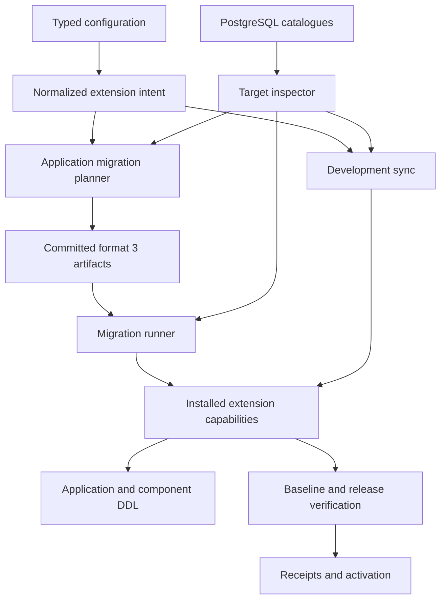
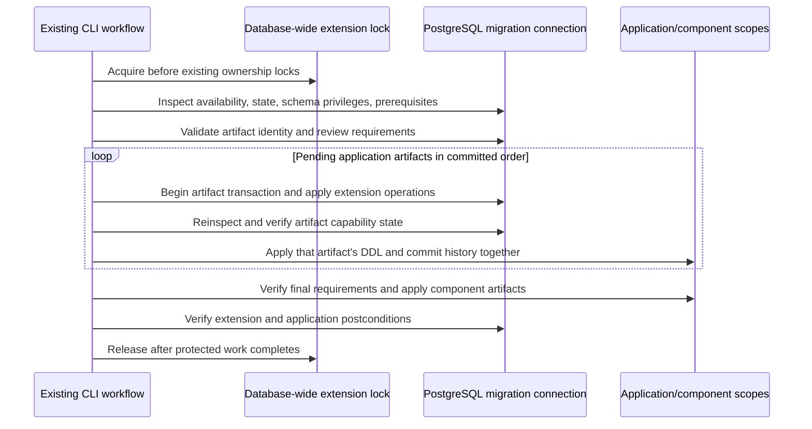
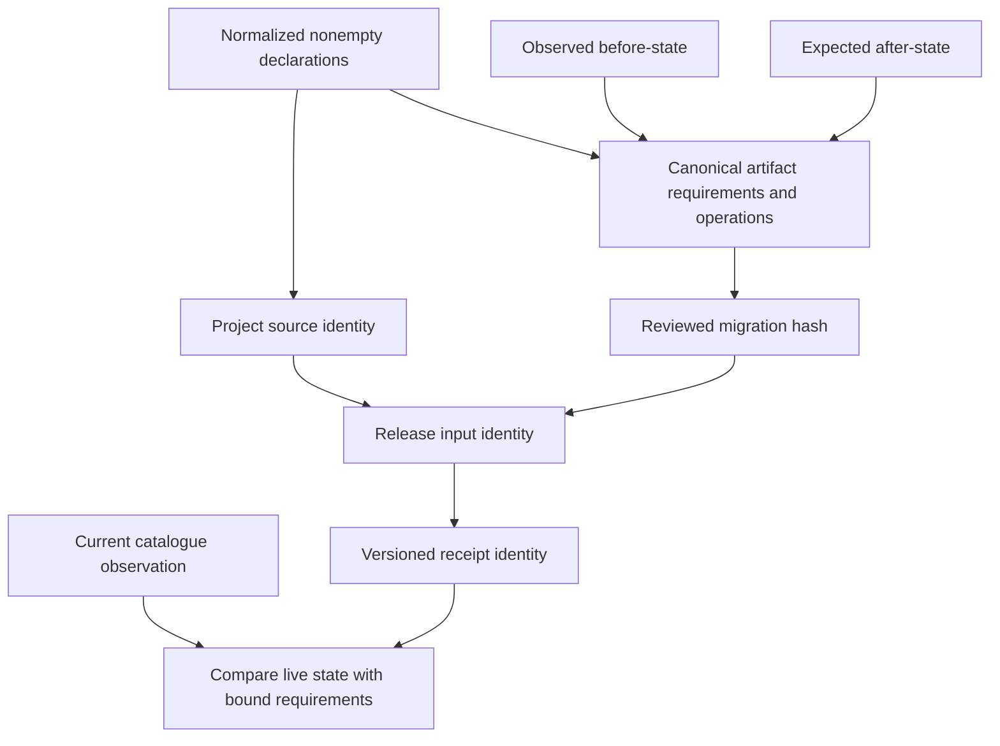
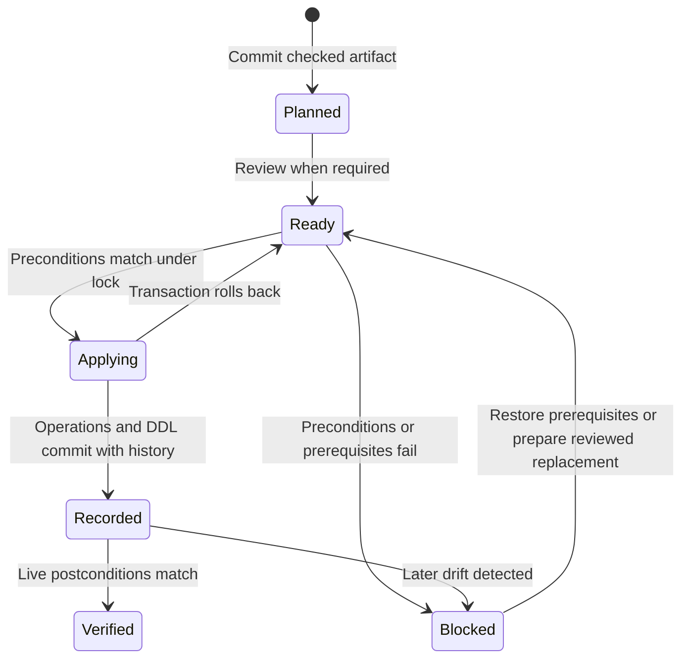
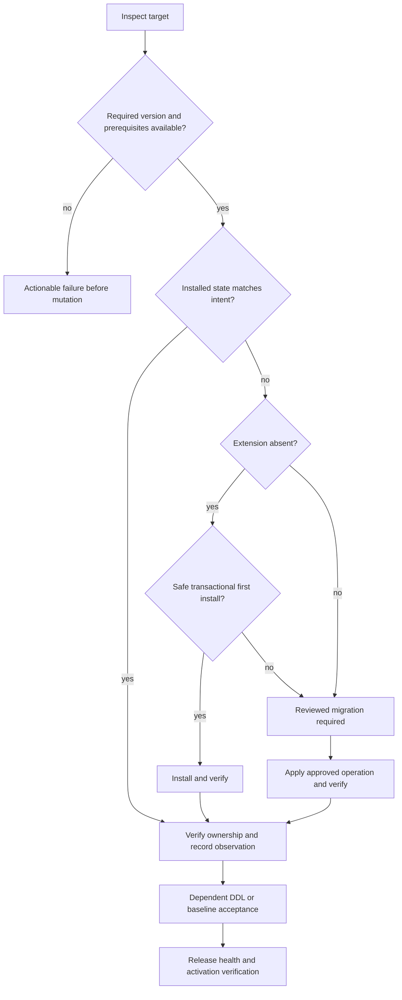
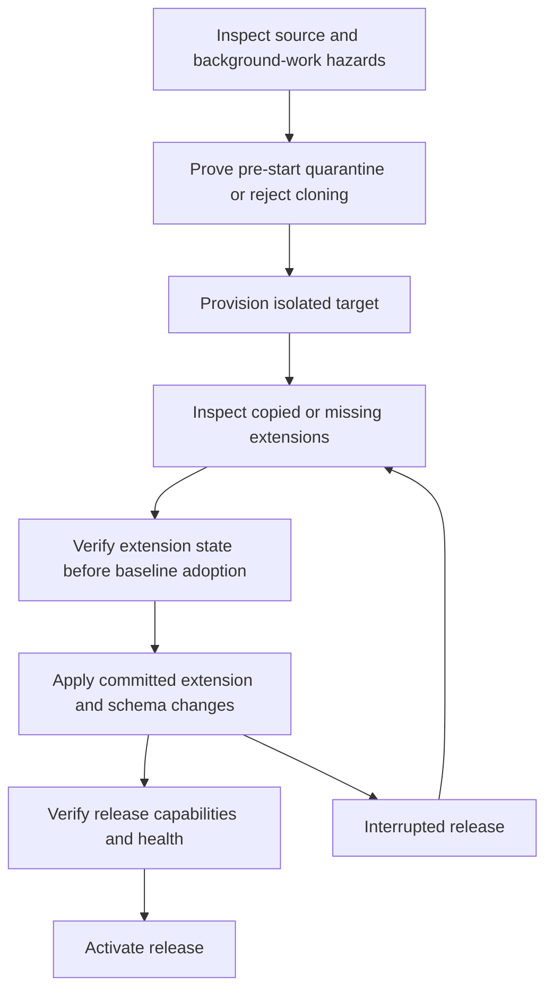

# Neon PostgreSQL Extensions - Plan

## Goal Capsule

- **Objective:** Loom applications can enable PostgreSQL extensions from source-controlled configuration and reproduce the required database capabilities in development and deployed branches.
- **Means:** Typed configuration, inspected PostgreSQL state, committed migration artifacts, and verified deployment receipts, per KTD1-KTD10.
- **Authority:** The confirmed scope covers configuration, development, migrations, branches, and deployment. PostgreSQL remains the authority for installed extension state.
- **Execution profile:** Seven dependency-ordered implementation units. Keep progress outside this document.
- **Stop conditions:** Surface provider limitations that invalidate a promised behavior, unsupported artifact compatibility, or an unprovable branch quarantine guarantee. Routine target failures follow the diagnostic behavior defined below.
- **Completion owner:** The implementer delivers the Verification Contract and Definition of Done; live Neon acceptance remains a required gate before claiming provider support.

---

## Product Contract

### Summary

Add typed extension declarations to `database.extensions` in `loom.config.ts`.
Each declaration specifies an exact version and may specify a schema.
The schema defaults to `extensions`; users can override it where the extension supports the requested placement.
Loom carries those declarations through development sync, migration planning and application, branch provisioning, and deployment verification.

### Problem Frame

Loom currently models application and component schemas, but its database configuration has no extension declarations.
Installing an extension manually leaves its version, schema, dependencies, and deployment prerequisites outside the committed lifecycle.
Neon provides extension binaries; PostgreSQL installs each extension into an individual database.
Configuration therefore needs both static names for authoring and live checks against the specific target.

### Requirements

#### Configuration and authoring

- R1. `database.extensions` accepts canonical PostgreSQL extension names from a maintained Neon PostgreSQL 18 catalogue, with compile-time completion and strict runtime validation.
- R2. Each entry requires an exact version string; `schema` is optional and defaults to `extensions`. Loom accepts valid custom schemas when the extension and target permit them.
- R3. Omitting extensions preserves existing project behavior and artifact compatibility.
- R4. Diagnostics distinguish unknown names, unavailable versions, fixed-schema conflicts, missing dependencies, missing privileges, and unmet provider prerequisites before extension mutation.

#### Development and migrations

- R5. Safe first installation participates in development sync before application or component DDL that can depend on the extension; repeated sync is idempotent.
- R6. Production installation, version changes, and supported schema moves are represented in committed, reviewable, integrity-checked migration artifacts. Configuration changes alone do not mutate production.
- R7. Loom verifies installed versions and schemas rather than accepting name existence as success; unmanaged pre-existing extensions are adopted only through an explicit reviewed artifact.
- R8. Removing a declaration never drops an extension or dependent data automatically. Updates and schema moves require review and must preserve the supported retained-release contracts.
- R9. Extension-owned objects remain outside Loom's application/component DDL ownership, system-field protections, and blanket table grants, including when a custom schema overlaps an application schema.

#### Branches and deployment

- R10. Parent-data and schema-only branches verify their extension state and prerequisites before accepting a baseline or applying dependent DDL.
- R11. Deployment identity binds the required extensions and their committed changes; activation and every resumed release verify the current database state.
- R12. Branch creation cannot let inherited extension background jobs execute before quarantine. If Loom cannot establish that guarantee for a target, it fails before creating or waking that clone and explains the provider action required.
- R13. Extension mutation uses the existing migration authority and database connections; runtime credentials never receive DDL authority.

#### Usability and delivery

- R14. Existing CLI workflows expose actionable extension status without leaking credentials. An agent can use the same configuration, artifacts, review hashes, and commands as a developer.
- R15. Documentation and packed-consumer coverage demonstrate the complete lifecycle, the schema override, and target-dependent limitations.

### Key Decisions

- KD1. **Full lifecycle scope** (session-settled: user-approved — chosen over configuration-only support: the user confirmed development, migration, branch, and deployment integration). Governs R5-R15.
- KD2. **Optional schema with a default** (session-settled: user-directed — chosen over mandatory schema declarations: the user requested `extensions` as the default and a user override). Governs R2, R4.

### Key Flows

- F1. **First installation:** A developer declares a supported extension, runs development sync, and sees the requested version and schema installed before application DDL. Covers R1-R5, R9, R13.
- F2. **Reviewed change:** A developer changes a version or supported schema placement, creates a migration artifact, rehearses it, and applies its reviewed hash. Covers R6-R8, R13-R14.
- F3. **Branch preparation:** Provisioning inspects the source, prevents inherited background execution, and validates the target extension state before adopting schema history. Covers R10, R12.
- F4. **Release and resume:** A release checks committed extension intent, prepares the database, verifies health, and activates. A resumed release rechecks the database even when the extension stage already has a receipt. Covers R11, R14.

### Acceptance Examples

- AE1. Declaring `pg_trgm` version `1.6` without a schema installs it into `extensions` on a compatible target; declaring a supported custom schema installs it there instead. Covers R2, R5.
- AE2. An installed extension with the right name but a different version or schema produces drift or reviewed adoption, never silent success. Covers R7.
- AE3. An extension-only configuration change produces a committed artifact and a development result showing work applied even when the application tables are unchanged. Covers R5-R6.
- AE4. Changing an installed extension after a release stage completed prevents resumed activation until the expected state is restored or a new reviewed release is prepared. Covers R11.
- AE5. A parent branch containing active `pg_cron` jobs is rejected before clone creation when provider-level prevention of execution cannot be proved. Covers R12.

### Scope Boundaries

#### Deferred to Follow-Up Work

Typed vector/GIS fields, indexes, codecs, and query operators belong in a separate plan.
Extension installation creates database capabilities; it does not add them to Loom's field vocabulary or reactive query tracking.

#### Outside This Integration

Arbitrary SQL hooks, extension drop automation, a second application scheduler, automatic compute restarts, automatic provider-plan changes, and dependency upgrades are outside this integration.
Drizzle ORM and Kit stay on `1.0.0-rc.4` under the user's package decision.

---

## Planning Contract

### Context and Research

The current implementation already provides strict configuration validation, isolated development targets, dedicated migration connections, migration review hashes, ownership locks, branch baselines, and resumable release journals.
This integration extends those paths rather than adding a second migration engine.

| Existing seam | Consequence for this plan |
| --- | --- |
| `apps/loom/src/tooling/config/define-config.ts` validates a strict PostgreSQL 18 database object | Add the typed declaration and validator at this boundary; do not fetch a provider catalogue while loading configuration. |
| `apps/loom/src/tooling/migrations/planner.ts` and `apps/loom/src/tooling/migrations/history.ts` use format 2 and canonical hashes | Add a versioned artifact contract while preserving the exact legacy hash algorithm. |
| `apps/loom/src/tooling/dev/sync.ts` reconciles multiple schema scopes | Prepare database-wide extension capabilities once before the scope loop. |
| `apps/loom/src/tooling/migrations/connection.ts` restricts application identifiers and owns DDL connections | Keep that validation; canonical extension names such as `uuid-ossp` need a separate quoting path. |
| `apps/loom/src/tooling/migrations/adapter.ts`, `apps/loom/src/tooling/migrations/drift.ts`, and `apps/loom/src/tooling/migrations/application.ts` inspect and protect application namespaces | Filter extension membership and replace schema-wide object grants where they would touch extension objects. |
| `apps/loom/src/tooling/deploy/neon/` journals provisioning, baselines, quarantine, and activation | Bind extension intent and observation to those identities and recheck on resume. |

Neon's current table lists PostgreSQL 18 versions `vector` 0.8.6, `pg_trgm` 1.6, and `citext` 1.8.
The product name pgvector maps to the SQL extension name `vector`.
The same table includes unavailable or blocked entries, including `pg_search`, `plv8`, and new installations of `pg_ivm`; a typed list cannot simply copy every table row. [Neon extension reference](https://neon.com/docs/extensions/pg-extensions#update-an-extension-version).

PostgreSQL reports installable versions, dependency names, fixed schemas, trust, and relocation support through `pg_available_extension_versions`.
`relocatable = false` alone does not mean initial placement has a fixed schema.
`CREATE EXTENSION IF NOT EXISTS` does not verify the existing installation, and `CASCADE` can select dependency defaults independently of the requested version. [PostgreSQL availability view](https://www.postgresql.org/docs/18/view-pg-available-extension-versions.html), [CREATE EXTENSION](https://www.postgresql.org/docs/18/sql-createextension.html).

A newly published Neon extension version may need a compute restart before it becomes available on a running target.
Read replicas receive installations and updates when their computes restart.
Some extensions require preloads, support enablement, or endpoint settings; these prerequisites must be reported rather than silently changing project infrastructure. [Neon extension reference](https://neon.com/docs/extensions/pg-extensions).

`pg_cron` runs while compute is active and requires `cron.database_name` configuration.
Neon's page explicitly warns that cross-database scheduling is unsupported, despite including a contradictory example later in the page; this integration must not depend on that example.
Managed cron settings may require Neon Support and a restart. [Neon pg_cron](https://neon.com/docs/extensions/pg_cron).

### Key Technical Decisions

- KTD1. **Typed names, live availability.** Check in a dated catalogue of canonical SQL names supported for new Neon PostgreSQL 18 installs. Keep versions as exact opaque strings, not a static version union or semver ranges. Configuration uses a partial map of names to version and optional schema. Runtime inspection is authoritative for the specific database. This avoids a documentation refresh becoming a configuration-network dependency. Implements R1-R4.
- KTD2. **Default schema with explicit conflicts.** Normalize an omitted schema to `extensions`, per KD2 and R2. Create it with migration-role ownership and no untrusted CREATE privilege. For a fixed-schema extension, require an explicit matching override when its fixed schema differs from the default. Reject incompatible requested placement instead of silently ignoring it. Existing custom schemas require safe ownership and privileges; avoid silently rewriting unrelated grants. Reject Loom metadata/control namespaces as custom extension targets. Accept provider-owned fixed schemas through verified installation privileges without changing their ownership or schema grants. Implements R2, R4, R13.
- KTD3. **Explicit dependency pins.** Require extension prerequisites to be declared with their own versions and placements. Resolve a dependency graph from target metadata and apply it in deterministic order. Never use blind `CASCADE`; report missing declarations with dependency names. Keep the always-installed PostgreSQL language baseline outside user-managed dependency pins. Implements R4, R6-R7.
- KTD4. **Extend the existing application migration chain.** Introduce format 3 for extension-aware application artifacts, with canonical required extension state, typed operations, and before/after extension state. An extension-only artifact belongs to that same chain. Replay pending application artifacts in order: each artifact's extension operations precede its own dependent DDL in the same transaction. Do not install the newest configuration state ahead of earlier artifacts that require older extension versions. Verify final capability requirements before component migrations. Component artifacts can declare requirements but cannot independently mutate global extensions. Keep format 2 parsing and hashing unchanged. This retains one application release ordering authority and avoids a competing extension journal. Implements R3, R6, R11.
- KTD5. **Database-wide serialization.** Acquire a database-wide extension advisory lock before component ownership and namespace locks wherever extension preparation is possible. Use the same lock order in development, migrations, provisioning, and release verification. Reinspect after acquiring it and reject stale artifacts when their extension preconditions no longer hold. Do not release it between preparing capabilities and dependent DDL. This covers extensions whose names and installation state are database-wide. Implements R5-R7, R10-R11.
- KTD6. **Observed state and membership.** Inspect `pg_extension`, `pg_namespace`, `pg_available_extension_versions`, update paths, and extension membership in `pg_depend`. Hash required names, exact versions, placements, and dependency identities in deterministic order; exclude volatile OIDs and connection details. Observe ownership and privileges separately as acceptance checks. Exclude extension members and their subordinate objects, such as member-table indexes and columns, while retaining ordinary application objects that depend on extension types/functions. Extend the existing pinned Drizzle Kit adapter patch to filter these identities before unsupported-metadata conversion; post-filtering a failed snapshot is insufficient. Unrelated provider-installed extensions do not cause global drift. Implements R7, R9-R11.
- KTD7. **Review changes and preserve recovery boundaries.** Automatic development sync installs only new extensions whose installation is established to be transactional. Adoption, updates, and schema moves use reviewed artifacts. Use PostgreSQL update paths rather than numeric version comparisons; schema moves require relocation support. Before a shared extension change, rehearsal and reviewed compatibility evidence must cover retained Loom releases. If compatibility cannot be demonstrated, retire affected releases before the change. A failed transactional operation records no success; unsupported nontransactional extension scripts stop with an explicit manual-operation requirement. No automatic inverse operation is a rollback promise. Implements R5-R8, R11.
- KTD8. **Separate capability grants from application grants.** Give runtime roles USAGE on required extension schemas, preserve extension-defined object privileges, and grant only documented privileges needed for declared capabilities. Do not grant access to extension administration tables or blanket execution of privileged routines. Keep qualified SQL/name resolution; do not widen every runtime connection's search path. Scope existing table, sequence, and function protections to Loom-owned entities. Implements R9, R13.
- KTD9. **Quarantine before execution can begin.** Preflight parent-data cloning for extension background work, including active cron jobs. The initial implementation rejects clones with runnable inherited schedules unless an already-established provider setting prevents execution before compute startup. SQL quarantine after clone creation is not sufficient proof. Existing-target installs validate required endpoint settings; Loom does not enable a scheduler or restart compute automatically. Implements R10-R12.
- KTD10. **Use existing CLI and release gates.** Carry extension intent through project source hashes, plan/status output, review hashes, baseline receipts, release identity, health checks, and activation. Use versioned validators for new receipts and preserve old receipt readers for extension-free projects. A receipt records a completed attempt; live inspection proves current state. Shared CLI behavior supplies agent parity without a new agent API. Implements R3, R11, R14-R15.

### High-Level Technical Design

These sketches describe boundaries and ordering; module names and internal signatures remain implementation choices within the units.

#### API surface sketch

| Configuration path | Contract |
| --- | --- |
| `database.extensions` | Optional partial map; empty means no extension intent. |
| `database.extensions.vector.version` | Exact string such as `0.8.6`, checked against the target. |
| `database.extensions.pg_trgm.schema` | Optional custom placement, such as `custom_extensions`. |
| Omitted per-extension schema | Normalizes to `extensions`. |
| Fixed-schema extension | Explicit matching placement when the default conflicts. |

#### Component and data-flow sketch

#### Apply protocol sketch

#### Identity data-flow sketch

#### Artifact state sketch

These are workflow states, not a proposal for another persistent journal.

#### Decision sketch

#### Branch and release lifecycle sketch

### System-Wide Impact

Extension declarations belong to the application configuration and project identity, not a component's independent database lifecycle.
Both development and deployment must prepare them before inspecting dependent schemas.
Format 3 affects migration planning, hashing, validators, status, history, and packed consumers; old artifacts must retain their existing semantics.
Branch baselines and release receipts need extension identities that are portable across clones without copying catalogue OIDs.
Application grant changes must retain existing auth, revision tracking, and component isolation guarantees.

### Assumptions and Risks

| Risk or assumption | Decision and delivery consequence |
| --- | --- |
| Static Neon docs and actual compute availability differ | KTD1 uses live target metadata. Report restart/enablement prerequisites; no automatic restart. |
| Fixed-schema extensions conflict with the default | KTD2 makes the conflict explicit and accepts a matching override. |
| Drizzle introspection includes extension-owned entities | U3 proves filtering under the current pinned Drizzle contract; do not solve this by upgrading Drizzle. |
| Two applications share a database | KTD5 serializes mutation; artifacts validate observed preconditions. Compatibility with consumers outside Loom cannot be inferred and must be an operator responsibility in reviewed updates. |
| Extension scripts perform external or nontransactional work | KTD7 refuses automatic application without an established transactional path. Catalogue membership does not imply blanket safe installation. |
| A clone can run cron before SQL quarantine | KTD9 rejects the unsafe provisioning path before the target starts. |
| Updates affect retained releases and replicas | U6 verifies retained-release compatibility and reports replica restart requirements before activation; advertise no automatic downgrade or replica refresh guarantee. |
| No live Neon target was inspected during planning | U7 includes a real provider gate. Local PostgreSQL success alone cannot establish provider support. |

### Open Questions

No product question blocks local implementation.
Exact extension availability, target role privileges, provider enablement, and safe scheduler settings are target-specific inputs checked by U2 and U5.
An unavailable target must produce a diagnostic, not a fabricated success or an automatic infrastructure change.

---

## Implementation Units

### U1. Typed extension configuration and catalogue

- **Goal:** Make extension declarations discoverable, valid, and part of project identity.
- **Requirements:** R1-R4, R14; KD2; KTD1-KTD2; F1.
- **Dependencies:** None.
- **Files:** Modify `apps/loom/src/tooling/config/define-config.ts`, `apps/loom/src/tooling/project/load.ts`, and `apps/loom/src/tooling/index.ts`. Add `apps/loom/src/tooling/config/extensions.ts` and `packages/tests/unit/extensions-config.test.ts`; extend `packages/tests/unit/config.test.ts`.
- **Approach:** Follow the existing Valibot strict-object/default normalization pattern. Check in the PostgreSQL 18 catalogue with canonical names, documentation dates, and prerequisite metadata. Exclude entries blocked for new installation and identify provider-gated entries without implying availability. Export the inferred authoring types through `loom/tooling` and include normalized nonempty intent in the source hash. Omitted and empty declarations use the legacy hash input shape, per R3.
- **Test scenarios:** A valid `vector` version plus an omitted schema normalizes to `extensions`; a `pg_trgm` custom schema survives normalization. Unknown names, missing versions, extra properties, and malformed schemas fail with the correct config path. A range string never selects a version; it must match a target's exact version token to be accepted. Canonical `uuid-ossp` is accepted without relaxing application identifier validation. An extension change changes project identity; omitted and empty declarations retain the legacy hash input shape.
- **Verification:** Unit tests and packed typechecking prove completion, rejection, normalization, and source-version invalidation.

### U2. Target inspection, dependency resolution, and extension operations

- **Goal:** Translate declared intent into checked PostgreSQL operations and reproducible observations.
- **Requirements:** R4, R7-R8, R13; KTD2-KTD3, KTD5-KTD7; F1-F2; AE1-AE2.
- **Dependencies:** U1.
- **Files:** Add `apps/loom/src/tooling/migrations/extensions.ts`, `packages/tests/unit/extensions-plan.test.ts`, and `packages/e2e/integration/extensions.test.ts`; modify `apps/loom/src/tooling/migrations/connection.ts` for the shared lock and narrowly scoped quoting helpers.
- **Approach:** Use the existing owned migration connection. Inspect capability metadata and installed state; normalize stable observations. Resolve explicit dependencies and valid update paths. Distinguish initial placement from relocation. Render only typed, validated operations with properly quoted canonical names, schemas, and version literals. Acquire and expose the common database-wide lock in the ordering defined by KTD5. Mark operation safety from established script/extension behavior; fail explicitly for unsupported transactional semantics.
- **Test scenarios:** Inspect matching, missing, and mismatched installations on PostgreSQL 18. A fixed-schema conflict fails before DDL; a nonrelocatable extension with no fixed schema permits valid initial placement but rejects a later move. A metadata/control schema target fails before grants or installation; a supported provider-owned fixed schema does not receive ownership or grant changes. A missing dependency names the required declaration; an invalid update path fails without history changes. Name/version strings cannot inject SQL. Concurrent conflicting installs serialize and the stale attempt fails its precondition. A failing operation rolls back the installation and observation.
- **Verification:** Local PostgreSQL integration observes actual `pg_extension` state and proves failure leaves no success receipt or changed dependent schema.

### U3. Extension-aware artifacts and schema ownership

- **Goal:** Make extension changes durable while keeping extension entities outside Loom-managed application DDL.
- **Requirements:** R3, R6-R9; KTD4, KTD6-KTD8; F2; AE2-AE3.
- **Dependencies:** U1-U2.
- **Files:** Modify `apps/loom/src/tooling/migrations/planner.ts`, `apps/loom/src/tooling/migrations/history.ts`, `apps/loom/src/tooling/migrations/custom.ts`, `apps/loom/src/tooling/migrations/adapter.ts`, `apps/loom/src/tooling/migrations/drift.ts`, `apps/loom/src/tooling/migrations/application.ts`, `apps/loom/src/tooling/migrations/status.ts`, and `apps/loom/src/tooling/migrations/runtime-compatibility.ts`; extend `patches/drizzle-kit@1.0.0-rc.4.patch` and its explanation in `patches/README.md`. Extend `packages/tests/unit/migration-plan.test.ts`, `packages/tests/unit/custom-migration.test.ts`, `packages/e2e/integration/migrations.test.ts`, and `packages/e2e/integration/component-migrations.test.ts`; add `packages/tests/unit/extensions-artifact.test.ts`.
- **Approach:** Add a discriminated format 2/3 contract and preserve the exact format 2 hash branch. Format 3 binds required state and typed operations to the application's existing history chain. An extension-only plan has meaningful before/after extension state even with identical table snapshots. Component plans carry capability requirements without repeated installation. Reject extension mutations hidden inside custom SQL when they bypass the tracked operation contract. Use membership-aware introspection and targeted object privileges, including custom schema overlap. Keep ordinary objects with dependencies on extension types in the application snapshot.
- **Test scenarios:** Existing generated/custom format 2 fixtures retain identical hashes and apply. Tampering with a format 3 version, schema, operation order, or required dependency invalidates its hash. An extension-only diff yields an artifact. `hstore` or `citext` members in an application schema are excluded, but an application table depending on an extension type remains managed. Application protection neither grants an extension administration table nor revokes an extension's intended routine privileges. Removing a declaration emits no DROP EXTENSION. Hidden custom extension DDL is rejected with the tracked alternative.
- **Verification:** Legacy fixture hashes, migration status, drift checks, and actual grants prove artifact compatibility and ownership boundaries under the unchanged Drizzle pins.

### U4. Development and migration CLI integration

- **Goal:** Apply and explain extension intent consistently through existing developer workflows.
- **Requirements:** R5-R8, R13-R14; KD1; KTD4-KTD5, KTD7-KTD10; F1-F2; AE1-AE3.
- **Dependencies:** U2-U3.
- **Files:** Modify `apps/loom/src/tooling/dev/sync.ts`, `apps/loom/src/tooling/migrations/runner.ts`, `apps/loom/src/tooling/migrations/project.ts`, and `apps/loom/src/cli.ts`. Extend `packages/e2e/integration/migration-runner.test.ts`, `packages/e2e/integration/migration-cli.test.ts`, and `packages/e2e/integration/config-resolution.test.ts`; add `packages/e2e/integration/dev-extensions.test.ts`.
- **Approach:** Coordinate database-wide capabilities once for each workflow. Development prepares its desired state before application/component scope inspection. Production preflights the whole pending chain, then replays each artifact's extension operations and dependent DDL together, per KTD4. Retain isolated-target checks and dedicated credentials. Development sync records extension-only work and declines updates/moves/adoption requiring review. The production runner uses committed operations and existing review hashes. Extend existing plan/status/doctor diagnostics with required, available, installed, and pending extension state. Preserve machine-readable output where already supported and add a structured extension result to the existing command result contract.
- **Test scenarios:** Safe first sync installs before dependent custom/native schema DDL; the second sync does no work. An extension-only sync reports applied work and records history. Replaying two artifacts that require different extension versions runs each version's dependent DDL at the correct point; failure rolls back that artifact without claiming the later state. A version change or unmanaged installation requires a reviewed migration instead of silently changing the target. Missing privileges and an unavailable binary produce distinct redacted diagnostics. The migration runner rejects uncommitted config/artifact mismatches. CLI and direct tooling calls produce the same operation classification and failure.
- **Verification:** End-to-end CLI tests inspect database state and returned status; no migration path can be reached using a runtime connection alone.

### U5. Branch baselines and pre-start quarantine

- **Goal:** Carry extension state through both branch modes without accepting drift or inherited background execution.
- **Requirements:** R10, R12-R13; KD1; KTD5-KTD6, KTD9-KTD10; F3; AE5.
- **Dependencies:** U2-U4.
- **Files:** Modify `apps/loom/src/tooling/migrations/branch-baseline.ts`, `apps/loom/src/tooling/deploy/neon/schema-provision.ts`, `apps/loom/src/tooling/deploy/neon/provision.ts`, `apps/loom/src/tooling/deploy/neon/provision-project.ts`, `apps/loom/src/tooling/deploy/neon/quarantine.ts`, and `apps/loom/src/tooling/dev/quarantine.ts`. Extend `packages/e2e/integration/quarantine.test.ts`, `packages/e2e/integration/dev-quarantine.test.ts`, and `packages/e2e/cloud/component-schema-branch.test.ts`; add `packages/e2e/integration/extensions-branch.test.ts`.
- **Approach:** Capture source extension requirements and observations once under the shared lock. Version baseline/provisioning receipt identity without invalidating old extension-free receipts. For schema-only targets, inspect what the provider copied and install only missing committed capabilities before dependent schema establishment. For parent-data targets, verify copied state before baseline acceptance. Inspect background-work hazards before branch creation and before waking an externally provisioned clone; apply KTD9. Do not equate application scheduler quarantine with extension scheduler quarantine.
- **Test scenarios:** Parent-data cloning verifies matching state without duplicate CREATE. A schema-only target containing some extension objects converges without blind replay; missing dependencies install in order. A mismatch blocks baseline history adoption. A stale completed provisioning receipt is reobserved. Active cron jobs with no pre-start prevention block the provider create call. A target with missing cron endpoint settings fails before installation. Source baselines use names rather than OIDs so they survive cloning.
- **Verification:** Local branch-like database fixtures prove baseline checks. Disposable Neon branches prove actual parent-data and schema-only behavior. A provider-call spy proves an unsafe clone is never requested.

### U6. Release identity, retained compatibility, and activation verification

- **Goal:** Make extension capability correctness a prerequisite of a completed or resumed deployment.
- **Requirements:** R8, R11, R13-R14; KD1; KTD4-KTD7, KTD10; F4; AE4.
- **Dependencies:** U3-U5.
- **Files:** Modify `apps/loom/src/tooling/deploy/neon/release-database.ts`, `apps/loom/src/tooling/deploy/neon/release-receipt.ts`, `apps/loom/src/tooling/deploy/neon/plan-release.ts`, `apps/loom/src/tooling/deploy/neon/prepare-release.ts`, and `apps/loom/src/tooling/deploy/neon/retained-release.ts`; extend the existing release compatibility metadata where needed. Extend `packages/tests/unit/release-receipt.test.ts`, `packages/tests/unit/release-compatibility.test.ts`, `packages/e2e/integration/release-database.test.ts`, `packages/e2e/integration/release-preparation.test.ts`, and `packages/e2e/integration/release-activation.test.ts`.
- **Approach:** Bind normalized extension requirements and committed extension operations into release identity. Apply the ordered chain through U4 and verify the final state before health and activation. Reobserve at every resume, including completed stages. Bind reviewed compatibility evidence to the changing artifact and retained release IDs; rehearse retained workloads against the proposed state, or require their retirement when compatible behavior cannot be demonstrated. Report replica/provider prerequisites explicitly. Preserve extension-free legacy receipt behavior through versioned readers.
- **Test scenarios:** A matching extension-only release prepares and activates. Changing intent invalidates an old receipt. Out-of-band version/schema drift after a completed stage blocks resumed activation. Failed operations cannot mark the stage complete. An incompatible retained release blocks the update; retirement or reviewed successful rehearsal resolves it. Releasing one component does not repeat database-wide installation. Extension-free release fixtures continue passing.
- **Verification:** Release integration tests prove receipt identity, live rechecks, retained compatibility, and activation refusal on extension drift.

### U7. Documentation, packed consumers, and Neon acceptance

- **Goal:** Prove that applications can author and ship the API and that the documented provider lifecycle works.
- **Requirements:** R1-R15; KD1-KD2; KTD1-KTD10; F1-F4; AE1-AE5.
- **Dependencies:** U1-U6.
- **Files:** Update `apps/docs/content/docs/authoring/configuration.mdx`, `apps/docs/content/docs/operations/migrations.mdx`, and `apps/docs/content/docs/operations/deployment.mdx`; add `apps/docs/content/docs/integrations/postgres-extensions.mdx`. Extend `packages/e2e/integration/packed-consumer.test.ts` and `packages/e2e/integration/docs-examples.test.ts`; add `packages/e2e/cloud/extensions.test.ts` and register it through `packages/e2e/cloud/run.ts` as required by the runner.
- **Approach:** Document canonical names, version pins, default/custom placement, fixed-schema overrides, explicit dependencies, review, removal, provider prerequisites, and qualification of extension SQL. Explain that vector/GIS authoring remains separate. Add packed typechecking of the actual published tooling export. Use a disposable Neon project/database and both branch modes for the provider gate; redact identifiers/URLs as existing fixtures require and clean up only resources created by the test.
- **Test scenarios:** A packed application accepts supported keys and rejects unsupported keys at compile time. Documentation examples parse and reproduce the default/override behavior. A real Neon PostgreSQL 18 database verifies `vector` at an actually available pinned version, at least one custom-schema extension, an extension-only release, resumed drift detection, and both branch modes. A version update is exercised only with an actual supported update path; otherwise record that scenario as unverified rather than claim success. The provider diagnostic path names required restarts/settings without executing them.
- **Verification:** All local gates pass, the packed consumer proves usable exports, and provider evidence names the tested versions and branch modes. Cloud tests that did not run do not count as provider acceptance.

---

## Verification Contract

No builds, tests, database mutations, or runtime experiments are part of writing this plan.
The following gates apply during implementation.

| Gate | Scope | Pass signal |
| --- | --- | --- |
| `bun run check` | U1-U7 | Build, typecheck, unit tests, and static checks pass with no new warnings attributable to this integration. |
| `bun run test:integration` | U2-U7 | PostgreSQL 18 proves install/update checks, transaction behavior, artifacts, grants, CLI, baselines, and release resume. |
| Packed consumer tests in the integration suite | U1, U3, U7 | Isolated consumer uses published tooling types; legacy artifacts and documentation examples work. |
| `bun run test:cloud` with the extension fixture selected by the cloud runner | U5-U7 | Disposable Neon evidence covers both branch modes, installed capabilities, activation, and drift refusal. |
| `bun run test:browser` when documentation navigation or rendered pages change | U7 | Documentation pages render and navigate through the existing docs fixture. |
| Review of git diff and legacy fixtures | U1-U7 | No Drizzle upgrade, unrelated WIP removal, legacy hash rewrite, runtime DDL grant, or automatic DROP/restart is introduced. |

Local tests need a PostgreSQL 18 fixture with known extension binaries, including at least `pg_trgm`, `citext`, and `hstore` or equivalent membership coverage.
The implementer must establish those binaries in the fixture/CI image rather than skip core extension scenarios when packages are missing.
Mocks cover unavailable versions and provider-call refusal; they do not substitute for actual local installation or the Neon branch gate.
Rehearse a supported update path on a disposable target and preserve the installed-state evidence.
If live Neon credentials or a necessary version path are unavailable, report the missing acceptance gate explicitly and do not claim the whole Definition of Done.

### Requirement Coverage

| Requirements | Implementing units | Primary proof |
| --- | --- | --- |
| R1-R4 | U1-U2, U7 | Configuration/type tests, target preflight, packed consumer. |
| R5-R6 | U3-U4 | Extension-only history, operation order, review and CLI integration. |
| R7-R8 | U2-U4, U6 | Observed state, adoption, update path, removal, retained compatibility. |
| R9 | U3-U4 | Membership filtering and actual object privileges. |
| R10, R12 | U5 | Both branch modes and pre-create background-job refusal. |
| R11 | U6 | Release identity, resumed live checks, activation refusal. |
| R13-R14 | U2, U4-U6 | Owned DDL connection, privilege boundary, shared CLI results. |
| R15 | U7 | Documentation, isolated consumer, and live Neon acceptance. |

---

## Definition of Done

- All seven units meet their test scenarios and the Verification Contract, including the required Neon provider gate.
- Applications can declare typed extensions with optional schemas, synchronize safe installs, commit reviewed changes, provision branches, and deploy with verified capabilities.
- Extension-only changes are visible in history and deployment identity; resumed deployments refuse mismatched live state.
- Legacy format 2 artifacts and extension-free project receipts retain their behavior and hashes.
- Custom schemas preserve application ownership and extension privileges; runtime roles gain no DDL or extension administration authority.
- Branch provisioning enforces the pre-start quarantine rule and documents actionable unsupported target conditions.
- Documentation states tested provider versions and limitations and keeps vector/GIS authoring separate.

---

## Appendix

### Sources and References

Official provider and PostgreSQL references were inspected on 2026-10-01.
Target-specific Neon capability and permission checks remain implementation acceptance work.

- [Neon supported extensions and updates](https://neon.com/docs/extensions/pg-extensions#update-an-extension-version).
- [Neon pg_cron configuration and limitations](https://neon.com/docs/extensions/pg_cron).
- [PostgreSQL CREATE EXTENSION](https://www.postgresql.org/docs/18/sql-createextension.html).
- [PostgreSQL ALTER EXTENSION](https://www.postgresql.org/docs/18/sql-alterextension.html).
- [PostgreSQL available extension versions](https://www.postgresql.org/docs/18/view-pg-available-extension-versions.html).
- [PostgreSQL extension dependencies](https://www.postgresql.org/docs/18/catalog-pg-depend.html).
- [PostgreSQL extension update scripts](https://www.postgresql.org/docs/18/extend-extensions.html#EXTEND-EXTENSIONS-UPDATES).

### Considered and Not Built

A standalone extension migration journal would duplicate ordering and recovery authority already supplied by the application migration chain.
An unrestricted extension name escape hatch would weaken the requested typed Neon API.
Automatic provider restarts and scheduler configuration would expand this integration into disruptive infrastructure management.
None is required for the confirmed lifecycle contract.
