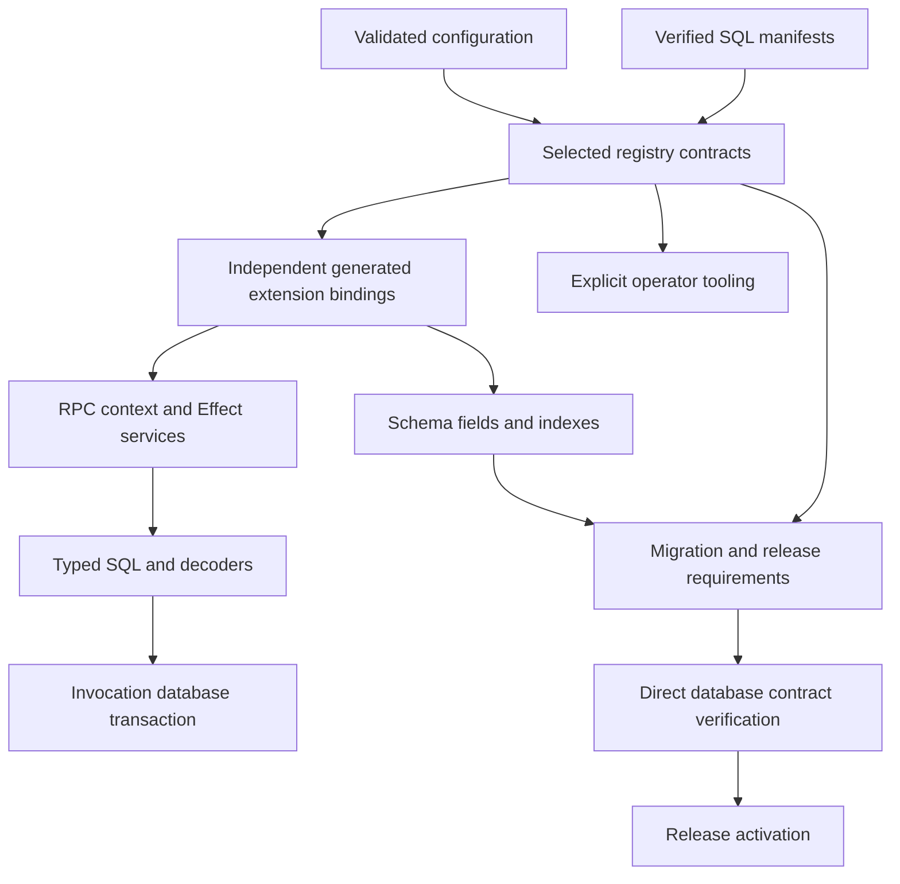
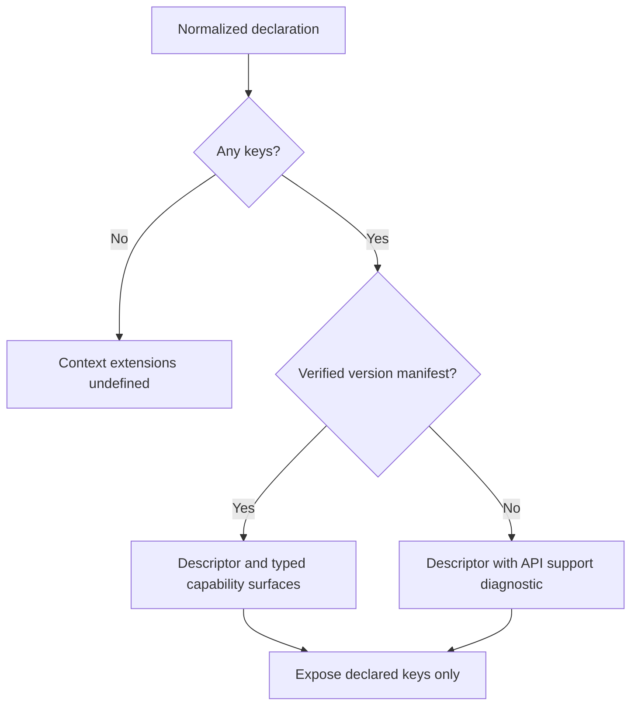
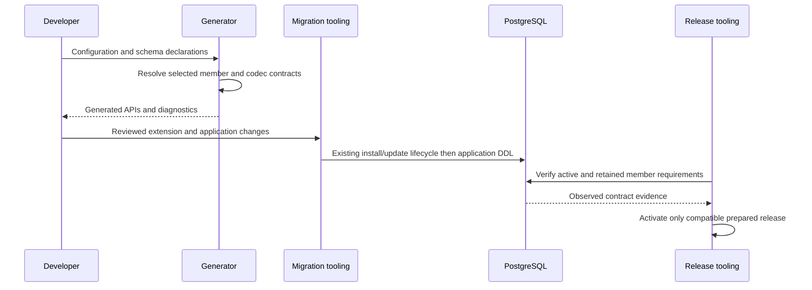
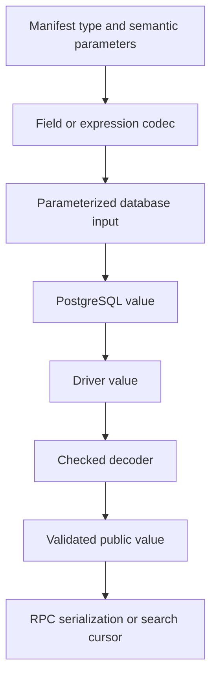
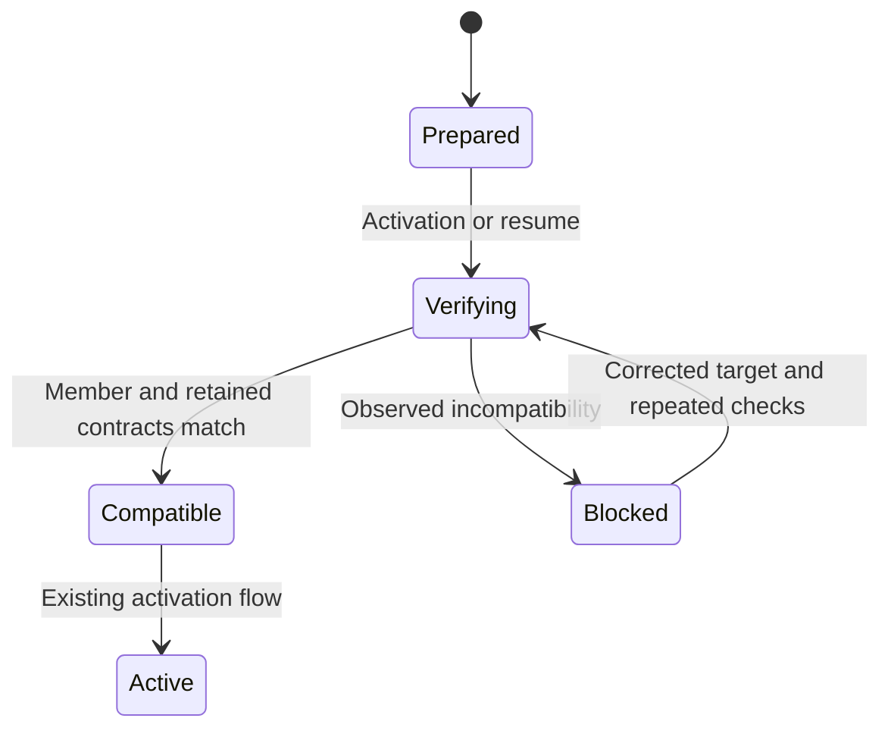

# Typed Neon Extensions - Plan

## Goal Capsule

- **Objective:** Loom developers can use every eligible Neon PostgreSQL 18 extension through accurate TypeScript APIs, with configuration determining which capabilities their application receives.
- **Means:** A versioned capability registry, selected generated bindings, and adapters for SQL, schema, and maintenance surfaces (KTD1–KTD6).
- **Authority:** Product requirements govern behavior; KTDs govern mechanisms; units implement both. The existing installation lifecycle remains authoritative for database changes under R12.
- **Execution profile:** Complete the catalogue coverage in this plan, including operational extensions. Family batches are delivery order, not a reduction of scope.
- **Stop conditions:** Surface a provider restriction that prevents an eligible capability from being implemented or verified. An unavailable acceptance environment is a verification blocker, never a pass.
- **Ownership and landing:** The implementation executor owns all units and verification. Use a dedicated change for typed APIs, preserving unrelated work and the completed installation changes. Follow repository conventions and subsequent user direction for commits and PR publication; merge and production deployment require separate authority.

---

## Product Contract

### Summary

Add typed extension APIs selected by `loom.config.ts`, available in RPC context and Effect services. Cover extension query functions and operators, schema fields and indexes, codecs, component requirements, and the database lifecycle. Provide explicit tools for capabilities that require administration or a dedicated session.

### Problem Frame

Loom already declares and installs extensions, but application authors still translate most extension SQL into unverified expressions and result types. The current configuration does not establish callable member signatures, runtime decoders, or the semantics required by reactive queries. A typed name catalogue alone cannot supply those contracts.

### Key Decisions

- **Configuration controls context membership.** Governs R1, R2. (session-settled: user-directed — chosen over exposing the whole catalogue: context should reflect the extensions actually declared.)
- **Full eligible catalogue coverage includes schema and operational capabilities.** Governs R3, R4, R8. (session-settled: user-approved — chosen over a query-helper-only first scope: the user confirmed the full integration.)
- **Privileged maintenance belongs in explicit tooling.** Governs R8, R9. (session-settled: user-approved — chosen over default RPC maintenance methods: administrative work has different credentials and execution requirements.)

### Requirements

**Selection and application use**

- R1. With no configured extensions, including an empty declaration, `context.extensions` is exactly `undefined` in TypeScript and at runtime.
- R2. With configured extensions, `context.extensions` is nonoptional and contains exactly the declared extension keys, with APIs determined by each declared version.
- R3. Cover every eligible entry in the dated Neon PostgreSQL 18 catalogue, and account for every public capability of each eligible extension in a checked coverage ledger.
- R4. Support typed SQL functions, aggregates, window functions, table-valued functions, operators, fields, indexes, and codecs wherever the verified extension exposes them.
- R5. Provide direct ergonomic helpers, including `extensions.pg_trgm.similarity(...)`, whose expressions compose with the existing transaction-bound `context.db`.
- R6. Reject wrong argument types and incompatible semantic parameters, and decode returned values accurately without user-selected generic return casts.
- R7. Preserve existing configuration and extension-free projects; versions outside the verified API registry retain installation support and expose a typed descriptor without invented query methods.

**Execution and authority**

- R8. Provide typed explicit tooling for eligible administrative, trigger, language, sampling, planner, session, and provider-specific capabilities that do not fit ordinary query expressions.
- R9. Keep maintenance credentials and DDL out of application request context; SQL access continues to respect Loom's invocation identity, policies, transaction scope, and component boundaries.
- R10. Live queries involving extensions invalidate correctly for observable table dependencies and clearly reject automatic subscriptions when their result depends on unobservable external or session state.
- R11. Component authors declare extension requirements; applications resolve compatible versions and namespaces and fail generation on missing or incompatible requirements.

**Database lifecycle and distribution**

- R12. Integrate typed contracts with existing development synchronization, migrations, branches, release preparation, activation, resume, and retained-release checks without changing their installation authority.
- R13. Detect incompatibility in required SQL members, extension field layouts, and codecs before activating a release, including requirements of retained releases.
- R14. Keep an omitted schema defaulting to `extensions`, honor explicit schemas, and honor fixed-schema provider restrictions throughout generated SQL and schema declarations.
- R15. Publish compiled ESM and declarations usable by isolated consumers, with only selected runtime adapters in application bundles and no Bun dependency in runtime exports.
- R16. Document configuration, generated APIs, field/index use, operational tools, coverage status, and migration behavior with examples checked against published exports.

### Actors and Flows

- A1. Application developer: declares extensions, defines schema, and writes RPC queries.
- A2. Component author: declares portable capabilities without choosing the host database namespace.
- A3. Operator or automation: uses the CLI and migration/deployment credentials for database changes and maintenance.

- F1. Configuration to query. A1 selects extension versions; generation resolves their registry contracts; RPC context receives selected bindings; `context.db` executes the expression. Covers R1, R2, R5, R6, R14.
- F2. Configuration to schema. A1 uses independent generated extension bindings while loading schema; development or migrations install required capabilities before application DDL; schema and API contracts enter release verification. Covers R4, R12, R13.
- F3. Component composition. A2 declares requirements; A1 supplies compatible configuration; generation binds the mounted component namespace and adapters. Covers R9, R11.
- F4. Maintenance. A3 reviews an operation, runs it through explicit tooling, and receives a structured result with its actual completion state. Covers R8, R9, R12.

### Acceptance Examples

- AE1. Covers R1. A project with no declaration or `{}` generates an RPC context whose `extensions` value is `undefined`, without adding an empty object or extension service implementation.
- AE2. Covers R2, R5, R6. A project declaring only `pg_trgm` can select a typed similarity score; `extensions.vector` and similarity on a boolean column fail type checking.
- AE3. Covers R4, R6, R14. A selected vector field accepts the configured dimension, decodes database values, and uses qualified types and operator classes in a custom installation schema.
- AE4. Covers R7. An existing project declaring a version without a verified manifest still generates and installs as before; its descriptor explains API support and has no callable members for that version.
- AE5. Covers R11. A component requiring vector support cannot mount when the application has no compatible declaration, and cannot access an undeclared extension inherited from another component.
- AE6. Covers R9, R10. An external `dblink` result cannot be presented as a table-revision-backed live query; a trigram query over an observable application table updates after a matching row changes.
- AE7. Covers R12, R13. A saved release that expects a specific member signature refuses activation when the target database has a different result contract, even if extension name and version still match.
- AE8. Covers R8, R9. A privileged cron or reindex operation is available through typed operator tooling with a structured result, and is absent from ordinary RPC extension helpers.

### Scope Boundaries

The coverage baseline is `docs/architecture/evidence/neon-extension-capability-map-2026-10-02.json`: 85 catalogue entries, 73 listed for PostgreSQL 18, and 74 names accepted by current Loom configuration. Listed availability is not proof of provider prerequisites or SQL signatures. R3 applies to the 73 listed entries with their provider restrictions; exact membership is established in U1.

The eight entries without a PostgreSQL 18 version, existing-only `pg_ivm`, deprecated `pgrag`, built-in `plpgsql`, and decoder plugin `wal2json` receive explicit coverage dispositions. Existing declarations remain covered by R7. A catalogue refresh cannot silently widen or reduce this baseline.

**Considered and not built:**

- Runtime SQL catalogue discovery on every request: contracts are build/release inputs, and deployment detects incompatibility before requests use them (R13).
- Automatic extension upgrades, drops, or retry of external writes: the existing lifecycle and explicit operations already expose these decisions (R8, R12).
- Arbitrary SQL wrapped in a caller-chosen result type: it would contradict R6; existing raw SQL remains an explicit application escape hatch.
- A replacement for PostgreSQL built-ins or a general database client: neither is needed to satisfy this extension API.

### Deferred to Follow-Up Work

Support for other PostgreSQL majors, future Neon catalogue additions, and unsupported/deprecated extension activation is separate work. General search UI features and unrelated dependency changes remain outside this plan.

---

## Planning Contract

### Evidence and Existing Behavior

The baseline is commit `f937a0c5dd592996d15b0d92291d6f2cdfd68df1`. `docs/plans/2026-10-01-1350-feat-neon-postgres-extensions-plan.md` covers the completed installation lifecycle; this plan adds typed capabilities.

| Boundary | Current evidence | Required change |
|---|---|---|
| Configuration | `apps/loom/src/tooling/config/define-config.ts` validates and returns a broad normalized type | Preserve literal extension selection alongside normalization |
| First load | `apps/loom/src/tooling/project/load.ts` loads config before schema; `project/references.ts` supplies virtual generated bindings | Supply independent extension bindings before schema import |
| Generated services | `apps/loom/src/tooling/codegen/server.ts` shares first-load and disk server bindings | Thread selection into context, RPC factories, and Effect services |
| Schema | `apps/loom/src/core/schema/fields.ts` and `compile.ts` use a closed storage-kind vocabulary | Add extension metadata, validation, native columns, and codecs |
| Query contract | `apps/loom/src/core/search/contract.ts` validates a closed field vocabulary | Add approved public representations and observable dependency semantics |
| Database DDL | `apps/loom/src/tooling/migrations/adapter.ts` uses Drizzle Kit; `snapshot.ts` validates snapshot version 8 | Preserve qualified extension types and index operator classes through round trips |
| Release | `apps/loom/src/tooling/deploy/neon/extension-release.ts` checks name/version/schema state | Add required member contracts and retained-release compatibility |

### Key Technical Decisions

- KTD1. **Use a checked, versioned capability registry.** Key it by extension, PostgreSQL major, extension version, and provider profile; normalize identities using symbolic SQL types instead of database OIDs. Bind generation and verification to the same registry digest to satisfy R2, R3, R13. Live discovery at application startup would make types depend on database reachability.
- KTD2. **Capture extension-owned SQL contracts, then annotate semantics.** Reuse membership traversal from `migrations/extension-membership.ts`; record routines, operators, types, casts, aggregates, access methods, operator classes, and required views. PostgreSQL catalogue signatures establish shape; reviewed annotations establish null behavior, codecs, dimensions, SRIDs, units, privileges, and dependency observability. This separates verified SQL facts from ergonomic adapter decisions under R3, R4, R6. See [PostgreSQL routine catalogue](https://www.postgresql.org/docs/18/catalog-pg-proc.html) and [extension dependencies](https://www.postgresql.org/docs/18/catalog-pg-depend.html).
- KTD3. **Emit independent `_generated/extensions.ts` bindings.** This module imports selected runtime adapters and a serializable selection descriptor, without importing application schema, server bindings, or executable tooling config. First-load virtual bindings and disk generation share the same emitter. It prevents the schema/server import cycle traced in `project/references.ts` and supports R1, R2, R4, R15.
- KTD4. **Preserve literal selection through public generics and generation.** Add a backward-compatible selection generic to context and service factories, defaulting to no extensions; generation resolves actual normalized config into literal keys, versions, and schemas. Broadly annotated configs remain valid operational inputs, but generation must not widen their public context to the catalogue. Implements R1, R2, R7.
- KTD5. **Build parameterized SQL with explicit overload and decoder contracts.** Provide direct aliases plus a canonical public `sql.functions` and `sql.operators` surface; qualify functions, casts, types, and operator syntax using the selected installation schema. Handle aggregates, windows, set-returning rows, defaults, variadics, and polymorphism deliberately. `sql<T>` alone is insufficient runtime decoding; use native column decoding and expression mapping backed by codecs. Supports R4–R6, R14; see [Drizzle SQL](https://orm.drizzle.team/docs/sql) and [node-postgres types](https://node-postgres.com/features/types).
- KTD6. **Separate extension field, SQL, and wire codecs.** Use native Drizzle custom columns for stored fields and per-expression decoding for results, with connection-scoped type resolution only when nested driver values require it. Never install global OID parsers or store fixture OIDs in manifests. Include codec identity and semantic parameters in fingerprints; RPC serialization receives supported public values, not SQL objects or opaque driver values. Supports R4, R6, R13, R15.
- KTD7. **Classify capabilities by execution authority and state.** Query expressions use the invocation database; maintenance uses migration/operator credentials; dedicated-session operations have explicit lifetimes. Session configuration uses transaction-local state or proven reset/cleanup. Nested SQL capabilities such as routing, crosstab, GraphQL, and remote queries require a typed input/output contract and their own authorization/dependency review. Supports R8–R10, with no automatic retry for external writes.
- KTD8. **Keep component requirements portable.** Components declare required capabilities and supported version contracts; the host resolves their selection and installation schema, while each component receives only its declared subset. Missing requirements fail before generation completes. Supports R9, R11 using existing component graph and virtual-binding paths.
- KTD9. **Extend schema metadata and search contracts together.** An extension field records registry type identity, parameters, codec, and owning capability. Only supported comparison, ordering, cursor, and public filter operations enter search contracts; extension-specific functions remain typed server expressions until their public semantics are verified. Apply SQL-AST relation tracking to embedded query forms and reject automatic live subscriptions for unobservable state. Supports R4, R6, R10, R13.
- KTD10. **Persist required member contracts with release evidence.** Carry the selected API contract and schema-used members into migration/build/release artifacts, and verify their symbolic signatures and permissions through the existing direct database checks. Preserve old artifact readers; introduce a new artifact version only where strict validators require one. Check both activating and retained release requirements before incompatible changes. Supports R12, R13.
- KTD11. **Treat Lakebase index format as separate operational state.** Index format is not extension version; express required rebuilds as reviewed operations and verify completion outside the common transactional migration runner when necessary. Supports R4, R8, R12 using [Lakebase vector guidance](https://neon.com/docs/extensions/lakebase-vector).

### High-Level Technical Design

**Component topology and data flow (KTD1, KTD3, KTD5, KTD10):**



**Selection decisions (R1, R2, R7):**



**Lifecycle sequence (R12, R13):**



**Capability surface sketch (directional API grammar; KTD5–KTD7):**

```text
selected extension
  descriptor -> installation identity and API support
  direct helper -> typed parameterized expression or relation
  sql.functions / sql.operators -> verified public SQL members
  fields / indexes -> schema declarations and associated codecs
operator tooling
  selected capability -> typed plan -> explicit execution -> observed result
```

**Codec data flow (KTD6, KTD9):**



**Release verification states (KTD10):**



### Output Structure

New files are planned; existing integration points remain authoritative.

```text
apps/loom/src/core/extensions/
  index.ts
  registry.ts
  contracts.ts
  sql.ts
  codecs.ts
  fields.ts
  adapters/
apps/loom/src/tooling/extensions/
  catalogue.ts
  capture.ts
  coverage.ts
  operations.ts
  manifests/
```

### Coverage Allocation

Every name in the 73-entry eligible baseline appears once below. Each batch includes all verified public members, with query, schema, and explicit tooling dispositions under KTD7. Internal support routines are recorded with reasons rather than exported as application helpers. U1 produces the exact member ledger; U5–U8 consume it.

| Batch | Eligible entries | Main integration proof |
|---|---|---|
| U5: text and general scalar/data types | `citext`, `cube`, `dict_int`, `fuzzystrmatch`, `hll`, `hstore`, `intagg`, `intarray`, `ip4r`, `isn`, `ltree`, `pg_hashids`, `pg_jsonschema`, `pg_tiktoken`, `pg_trgm`, `pg_uuidv7`, `pgcrypto`, `pgjwt`, `pgx_ulid`, `prefix`, `roaringbitmap`, `seg`, `semver`, `unaccent`, `uuid-ossp`, `xml2` | Input/output contracts, array/composite codecs, exact text and numeric behavior |
| U6: spatial, routing, chemistry | `address_standardizer`, `address_standardizer_data_us`, `earthdistance`, `h3`, `h3_postgis`, `pgrouting`, `postgis`, `postgis_raster`, `postgis_sfcgal`, `postgis_tiger_geocoder`, `postgis_topology`, `rdkit` | SRID, units, composite results, binary/text formats, typed nested queries |
| U7: vector and Lakebase | `vector`, `lakebase_vector`, `lakebase_text`, `lakebase_tokenizer` | Dimension checking, query operators, indexing, tokenizer and index format semantics |
| U8: execution and operations | `anon`, `autoinc`, `bloom`, `btree_gin`, `btree_gist`, `dblink`, `hypopg`, `insert_username`, `lo`, `moddatetime`, `neon`, `neon_utils`, `pg_cron`, `pg_graphql`, `pg_hint_plan`, `pg_partman`, `pg_prewarm`, `pg_repack`, `pg_session_jwt`, `pg_stat_statements`, `pgrowlocks`, `pgstattuple`, `pgtap`, `plpgsql_check`, `postgres_fdw`, `refint`, `tablefunc`, `tcn`, `timescaledb`, `tsm_system_rows`, `tsm_system_time` | Explicit state/authority models, trigger/index declarations, provider and session acceptance |
| U1/U2: catalogue dispositions | Eight unavailable entries, `pg_ivm`, `pgrag`, `plpgsql`, `wal2json` | Eligibility and backward compatibility under R7 |

### System-Wide Impact and Dependencies

Application and component authors gain new public generics and stored field metadata; isolated package consumption is part of the release contract. Operations staff gain typed maintenance actions through the same tooling available to automation, with structured failures and results. RPC identity and search policy cannot be inferred from extension-provided claims.

Development and deployment continue to use PostgreSQL 18 and Drizzle `1.0.0-rc.4`; this plan does not upgrade Drizzle. Some listed extensions require Neon-only builds, paid support, endpoint configuration, or permissions unavailable in a generic local PostgreSQL image. U1 records the executable fixture source and required environment for every member family; cloud verification establishes the provider-specific claims.

### Risks and Decisions

| Risk | Decision and proof |
|---|---|
| SQL catalogue does not encode semantic types or privileges | KTD2; annotation review and database examples validate semantic behavior |
| Complex overloads, polymorphic returns, or nested records | KTD5, KTD6; exact overload/shape contracts and round-trip coverage precede public exports |
| Duplicate adapter instances or another branch's type OIDs | KTD3, KTD6; shared-emitter and concurrent-database tests |
| Embedded SQL bypasses table policy or invalidation | KTD7, KTD9; policy checks and SQL-AST dependency evidence for each nested query surface |
| Provider support differs from upstream | U8 verifies provider profiles; only static masking for `anon`, Apache Timescale capabilities, and documented JWT behavior are advertised |
| A retained release still needs a removed or changed function | KTD10; evaluate the retained contract before applying/activating incompatible changes |
| Full member inventory is larger than the name catalogue | U1 measures it before adapter work; R3 completion is ledger-based, with no representative-test substitute for missing capability families |

### Deferred Implementation Details

Exact SQL member counts and overload signatures are execution-time discovery in U1, not verified facts in the current research. Final ergonomic aliases are chosen against those signatures while retaining R5. Concrete codec encodings follow each captured type's database I/O contract. Provider prerequisites and fixture availability are measured before the corresponding acceptance batch; restricted environments cannot be counted as completed verification.

---

## Implementation Units

| Unit | Outcome | Primary files | Depends on |
|---|---|---|---|
| U1 | Verified registry and coverage ledger | `tooling/extensions/`, `core/extensions/contracts.ts` | None |
| U2 | Exact selected context and component bindings | config, codegen, project references, RPC and services | U1 |
| U3 | Typed SQL composition and codecs | `core/extensions/sql.ts`, `codecs.ts` | U1, U2 |
| U4 | Extension fields, indexes, and search metadata | schema, search, migration snapshot | U1, U3 |
| U5 | Text and general data adapters | `core/extensions/adapters/` | U3, U4 |
| U6 | Spatial, routing, and chemistry adapters | `core/extensions/adapters/` | U3, U4 |
| U8 | Stateful and operational capabilities | adapters, `tooling/extensions/operations.ts` | U3, U4 |
| U7 | Vector and Lakebase adapters | adapters and operational index support | U3, U4, U8 |
| U9 | Migration, branch, and release contract verification | migration and Neon deployment tooling | U2–U8 |
| U10 | Published consumer and documentation acceptance | exports, documentation, packed/cloud tests | U9 |

### U1. Capture SQL contracts and establish the registry

**Goal:** Make the eligible capability set exact and reproducible before adapters depend on it.

**Requirements:** R3, R4, R7, R13. **Dependencies:** None.

**Files:** Create `apps/loom/src/tooling/extensions/{catalogue,capture,coverage}.ts`, `apps/loom/src/tooling/extensions/manifests/`, `apps/loom/src/core/extensions/{registry,contracts}.ts`, `packages/tests/unit/extension-registry.test.ts`, and `packages/e2e/integration/extension-capture.test.ts`; use the existing architecture evidence and `tooling/migrations/extension-membership.ts`.

**Approach:**

1. Refresh catalogue facts against the dated evidence and emit an explicit eligibility comparison.
2. Capture owned members on disposable PostgreSQL 18 databases using the direct tooling connection, including aggregate/window and type/operator class dependencies per KTD2.
3. Store canonical manifests, provenance, semantic annotations, public/internal/tooling dispositions, and an environment/fixture requirement per capability family.
4. Validate every eligible extension against the ledger; document restricted provider fixtures without inventing signatures.

**Patterns to follow:** Strict validators, deterministic artifact hashing, and extension membership traversal.

**Test scenarios:**

- Capturing the same extension on two databases with different OIDs produces the same symbolic manifest digest.
- An overload with default, variadic, OUT, or set-returning arguments preserves its exact callable and result shape.
- Owned internal members are distinguished from unrelated objects and dependency extension members.
- Every baseline name has one disposition; duplicate or missing eligible names fail coverage validation.
- A provider-restricted capture reports an unmet prerequisite and cannot be marked verified.

**Verification:** Registry provenance and exact member inventory are complete for each batch before that batch starts; the current research remains labeled as catalogue research.

### U2. Generate exact configuration-selected context bindings

**Goal:** Deliver the requested context shape in application, component, and Effect paths.

**Requirements:** R1, R2, R7, R11, R14, R15; F1, F3. **Dependencies:** U1.

**Files:** Modify `tooling/config/define-config.ts`, `tooling/codegen/{server,generate,application,components,runtime}.ts`, `tooling/project/{load,references,component-references}.ts` under `apps/loom/src/`; modify `core/server/rpc/procedure.ts`, RPC application/component factories, `core/server/effect/services.ts`, and `core/server/components/definition.ts`; create `tooling/codegen/extensions.ts`, `packages/tests/types/extensions-context.test-d.ts`, and `packages/e2e/integration/extensions-codegen.test.ts`; extend existing RPC/component codegen tests.

**Approach:**

1. Apply KTD3/KTD4 to config, first-load virtual bindings, and disk generation, preserving selection after validation.
2. Thread the generated selection through context factories, native RPC factories, and the `Extensions` Effect service alongside existing distinct service identities.
3. Bind portable component requirements at the host composition root per KTD8.
4. Emit descriptor-only bindings and useful diagnostics for R7 without importing executable config into runtime.

**Test scenarios:**

- Covers AE1. Missing and empty declarations have the same undefined context contract on first load and after generation.
- Covers AE2. Only `pg_trgm` yields a required `pg_trgm` key and a compile error for `vector` access.
- Covers AE4. A manifest-unverified version remains installable and exposes no invented method types.
- Covers AE5. Missing/incompatible component requirements fail generation; compatible mounts receive only their subset.
- Schema imports the generated extension module with no previous generated files present, without a schema/server cycle.
- Effect retrieval returns the same selected binding contract as RPC context, without sharing unrelated project's service identities.

**Verification:** Type regressions and first-load/disk/component integration evidence agree on exact keys and versions.

### U3. Implement typed SQL composition and decoding

**Goal:** Give captured members accurate executable expression and row types.

**Requirements:** R4–R6, R9, R14, R15. **Dependencies:** U1, U2.

**Files:** Create `apps/loom/src/core/extensions/{sql,codecs}.ts`, `packages/tests/unit/extension-sql.test.ts`, `packages/tests/types/extensions-sql.test-d.ts`, and `packages/e2e/integration/extension-codecs.test.ts`; integrate `core/server/database/{connection,pool}.ts` only where driver type resolution is required and `core/server/rpc/serialization.ts` for approved wire values.

**Approach:**

1. Implement KTD5's callable shapes and qualified parameterized expressions against the existing Drizzle contract.
2. Add KTD6 decoders for arrays, ranges, composites, binary values, and precision-preserving numeric results as required by captured manifests.
3. Establish reusable branded semantic values and explicit relation/result schemas for polymorphic and record-returning members.
4. Keep stateful execution descriptors distinct from scalar SQL nodes under KTD7.

**Execution note:** Prove decoding through the real driver before exposing result types.

**Test scenarios:**

- Values containing quotes or SQL syntax remain bound parameters; custom schema identifiers render correctly for functions and operators.
- Wrong overloads fail type checking, while defaults, variadics, aggregates, windows, and table-valued rows retain their result shapes.
- Null, empty arrays, nested records, binary payloads, large integers, and nonfinite database values follow their declared codecs and output validation.
- Two concurrent databases with different custom-type OIDs decode correctly without cross-pool contamination.
- A codec failure aborts the invocation before its writes commit; an expression executes on the invocation transaction.

**Verification:** No public method claims a result type without a matching decoder and database example.

### U4. Integrate extension schema and search contracts

**Goal:** Make typed extension fields and indexes survive schema, migration, and query round trips.

**Requirements:** R4, R6, R10, R12–R14; F2. **Dependencies:** U1, U3.

**Files:** Create `apps/loom/src/core/extensions/fields.ts`, `packages/tests/types/extensions-schema.test-d.ts`, and `packages/e2e/integration/extensions-schema.test.ts`; modify `core/schema/{fields,compile,table,define-schema}.ts`, relevant `core/search/{contract,types,public,json-schema,compiler,cursor}.ts`, and `tooling/migrations/{snapshot,adapter,extension-compatibility}.ts`; extend schema, search, and migration tests.

**Approach:**

1. Introduce KTD9 metadata and validator/codec projection using native Drizzle columns.
2. Preserve type namespace, typmods, index method, operator class namespace, and options through the pinned snapshot adapter.
3. Derive required extension contracts from fields and indexes, with precise diagnostics for incompatible configuration.
4. Extend only validated search operations and cursor representations; carry dependency observability into live-query eligibility.

**Test scenarios:**

- Covers AE3. Vector dimensions and a custom schema survive declaration, database introspection, and migration regeneration without repeated drift.
- Extension type or codec parameter changes alter fingerprints and produce a reviewed compatible/incompatible migration result.
- Nullability, arrays, defaults, uniqueness, and native relations retain validators and query inference.
- Unsupported ordering/filter operations fail search contract compilation; approved values round-trip through pagination cursors.
- Covers AE6. Tracked application-table expressions invalidate; an unobservable expression rejects automatic live subscriptions.

**Verification:** Desired and inspected snapshots agree; public search contracts preserve supported wire values and policies.

### U5. Implement text and general data-type capabilities

**Goal:** Complete the U5 coverage batch with direct helpers and exact canonical SQL surfaces.

**Requirements:** R3–R6, R9, R10, R14. **Dependencies:** U3, U4.

**Files:** Create batch adapters under `apps/loom/src/core/extensions/adapters/`, `packages/tests/types/extensions-data.test-d.ts`, and `packages/e2e/integration/extensions-data.test.ts`; extend registry coverage and shared codec tests.

**Approach:** Allocate each U5 ledger family to query/schema/tooling surfaces, then implement direct aliases over the canonical contract. Preserve extension-specific precision, cryptographic byte formats, collation, text search, probabilistic results, and range/array semantics.

**Patterns to follow:** KTD2, KTD5, KTD6; existing table/validator and transaction composition.

**Test scenarios:**

- Covers AE2. Trigram similarity composes with filtering/ordering and returns a decoded score; invalid input columns fail type checking.
- Text search, unaccent, case-insensitive text, and fuzzy matching prove their documented null and collation behavior.
- Semver ranges, IP ranges, ltree paths, hstore, sketches, and bitmap results round-trip their captured representations.
- Crypto/JWT and identifier helpers validate bytes and precision; extension claims do not become Loom invocation identity.
- The U5 ledger has no public member without an adapter disposition and matching executable capability-family proof.

**Verification:** Every U5 public member is represented; overload/type regressions and required database examples pass.

### U6. Implement spatial, routing, and chemistry capabilities

**Goal:** Cover spatial and scientific APIs without losing their semantic types or query authority.

**Requirements:** R3, R4, R6, R9, R10, R14. **Dependencies:** U3, U4.

**Files:** Create batch adapters under `apps/loom/src/core/extensions/adapters/`, `packages/tests/types/extensions-spatial.test-d.ts`, and `packages/e2e/integration/extensions-spatial.test.ts`; add fixtures for geometry, raster, topology, routing, geocoding, and RDKit values.

**Approach:** Use U6 manifests for version-correct names and overloads. Define explicit SRID/unit, geometry/raster, H3, and molecular representations; compose routing inputs through the reviewed nested-query boundary in KTD7/KTD9. Put topology/geocoder administration in tooling.

**Test scenarios:**

- Geometry/geography distance respects declared units and SRIDs, and incompatible semantic arguments fail early.
- H3 coordinate order and version-specific method spelling agree with the captured provider version.
- Geometry, raster, RDKit, and address composite outputs round-trip binary/text codecs and nullable fields.
- Routing/crosstable SQL carries parameters, relation dependencies, and table policy; unrestricted query text is not inferred safe.
- Every U6 ledger capability family has database proof, including optional provider companions and their dependency versions.

**Verification:** Public signatures match installed versions and domain values retain their semantics across schema, SQL, and serialization.

### U8. Implement operational and stateful capability surfaces

**Goal:** Complete the U8 batch with typed declarations, safe query surfaces, and explicit operator actions.

**Requirements:** R3, R4, R8–R12, R14. **Dependencies:** U3, U4.

**Files:** Create batch adapters, `apps/loom/src/tooling/extensions/operations.ts`, `packages/tests/types/extensions-operations.test-d.ts`, `packages/e2e/integration/extensions-operations.test.ts`, and `packages/e2e/cloud/extensions-provider-capabilities.test.ts`; integrate existing tooling exports and CLI dispatch.

**Approach:**

1. Implement trigger/index/sampling/planner declarations and typed observation views from the U8 ledger.
2. Implement session-owned HypoPG, FDW/dblink, notification, and large-object workflows with explicit cleanup and transaction/session lifetime.
3. Provide operator plans/results for cron, partitioning, Timescale, masking, repack, diagnostics, and tests; map provider prerequisites to existing checks.
4. Give GraphQL, JWT, and SQL-text-taking capabilities explicit result contracts and authority classification before exporting them.

**Test scenarios:**

- Covers AE8. Administrative methods cannot be reached through RPC query bindings and use explicit operator credentials.
- Pool reuse after successful, failed, or cancelled session operations does not leak state; dedicated-session cleanup reports failures.
- Cron endpoint requirements, repack support/version prerequisites, and Timescale provider restrictions produce accurate diagnostics.
- Static masking is reapplied after a branch reset before the branch is declared usable; unsupported dynamic masking is absent.
- JWT verification versus claims-only behavior is explicit and does not override verified invocation identity.
- Trigger and index declarations survive schema/migration inspection; observation queries and TAP results decode correctly.
- Covers AE6. Remote/unobservable results cannot opt into table-revision live behavior accidentally.

**Verification:** Every U8 member has a concrete query/schema/tooling/internal disposition and required provider proof; automation can perform the same operations and read the same structured results as a human operator.

### U7. Implement vector and Lakebase capabilities

**Goal:** Provide complete typed similarity, ranking, tokenizer, and index support for the selected vector/Lakebase versions.

**Requirements:** R3–R6, R8, R10, R12–R14. **Dependencies:** U3, U4, U8.

**Files:** Create batch adapters under `apps/loom/src/core/extensions/adapters/`, `packages/tests/types/extensions-vector.test-d.ts`, `packages/e2e/integration/extensions-vector.test.ts`, and `packages/e2e/cloud/extensions-lakebase.test.ts`; integrate index maintenance descriptors with `tooling/extensions/operations.ts`.

**Approach:** Implement vector families and operators from captured manifests. Model Lakebase BM25 query types, tokenizer dictionaries/options, index methods, and transaction-local query settings; persist index-format requirements separately under KTD11.

**Test scenarios:**

- Covers AE3. Vector and companion types enforce dimensions and decode every supported representation.
- Dense, sparse, half, and binary vector operators are available only where the selected manifest supports them.
- BM25 expressions use the target index identity and decoded ranking type; query and index misuse is rejected.
- Tokenizer/dictionary configuration changes produce the required reviewed invalidation or rebuild action.
- Covers AE8. A required concurrent reindex is planned outside the transactional runner and records actual completion before compatibility is accepted.

**Verification:** Local pgvector proof and Neon Lakebase proof are distinguished; no cloud-only capability is marked verified by a local substitute.

### U9. Verify typed contracts across migrations, branches, and releases

**Goal:** Prevent activation or reuse of a database that violates selected API or stored-schema contracts.

**Requirements:** R12–R14; F2, F4. **Dependencies:** U2–U8.

**Files:** Modify `apps/loom/src/tooling/migrations/{history,extensions,extension-compatibility,runtime-compatibility}.ts`, `tooling/dev/sync.ts`, and relevant Neon deployment files including `extension-release.ts`, `extension-quarantine.ts`, `schema-provision.ts`, `retained-release.ts`, and release validators; extend `packages/e2e/integration/{extensions-release,extensions-branch,dev-extensions}.test.ts`; create `packages/e2e/cloud/extensions-api-contracts.test.ts` and `packages/tests/unit/extensions-api-artifact.test.ts`.

**Approach:** Apply KTD10 to generation, committed artifacts, prepare/activate/resume, and retained-release checks. Reuse current install-before-DDL, secure namespace, locking, clone quarantine, and acknowledgement behavior. Introduce read-compatible artifact evolution for the new contract and KTD11's index-format requirements.

**Execution note:** Characterize existing extension-free and lifecycle artifact behavior before extending strict validators.

**Test scenarios:**

- Covers AE7. Same name/version/schema with a changed routine return type, operator contract, required privilege, or codec type identity blocks activation.
- Old extension-free and installation-only artifacts remain readable and executable with their original hashes.
- A resumed release repeats live member verification despite saved acknowledgement.
- A retained release prevents a change that would remove its required callable contract.
- Clone/reset/restore verification quarantines incompatible contracts before runtime credentials are usable.
- Development can apply proven additive installation/DDL automatically while destructive changes remain reviewed under existing policy.

**Verification:** Migration and release evidence reflect observed contracts; no application startup DDL or request-time migration credential is introduced.

### U10. Verify published APIs and teach the complete workflow

**Goal:** Deliver the full capability coverage as a usable published Loom API with verified documentation.

**Requirements:** R3, R7, R15, R16. **Dependencies:** U9.

**Files:** Modify `apps/loom/package.json`, public exports, `apps/docs/content/docs/integrations/postgres-extensions.mdx`, related schema/RPC/component documentation, and `patches/README.md` only if a necessary pinned Drizzle compatibility change was made; create `packages/e2e/integration/packed-extensions-api.test.ts` and extend documentation example verification and cloud extension acceptance.

**Approach:**

1. Export selected runtime adapters through compiled public modules and verify Node/browser/tooling boundaries.
2. Demonstrate configuration, context, Effect, fields/indexes, components, custom schemas, descriptor diagnostics, maintenance, and lifecycle behavior using real exports.
3. Publish the coverage ledger with exact supported versions and provider restrictions.
4. Run the complete verification matrix and reconcile every eligible capability's evidence before declaring R3 complete.

**Test scenarios:**

- A fresh tarball consumer generates schema and RPC bindings without workspace aliases or preexisting generated files.
- An extension-free build includes no selected adapter; a single-extension build excludes unrelated adapters and tooling config.
- Documented examples type check and run against the supported provider/database fixture.
- An unavailable or restricted cloud case is visibly blocked/skipped and cannot satisfy the full coverage completion gate.

**Verification:** Published package and documentation agree with the complete checked registry, not only workspace inference.

---

## Verification Contract

Use the repository scripts as execution gates; the commands here identify gates, not a sequence of shell steps.

| Gate | Repository entry point | Required evidence |
|---|---|---|
| Deterministic installation | `bun install --frozen-lockfile` | Clean consumer/tooling install with preserved pinned dependencies |
| Build, types, unit/static checks | `bun run check` | Generated literal types, adapters, declarations, and static rules pass |
| Lint and formatting | `bun run lint`, `bun run format:check` | Repository rules pass without weakening them |
| PostgreSQL 18 integration | `bun run test:integration` | All applicable unit scenarios, transaction/codecs/schema/lifecycle round trips pass |
| Client wire and live-query regression | `bun run test:browser` | New values and dependency semantics do not break existing consumers |
| Neon provider acceptance | `bun run test:cloud` | Exact provider versions, prerequisites, and restricted capabilities verified on disposable branches |
| Published consumer | Packed integration tests | Fresh tarball, first generation, selected bundles, compiled exports, and documentation examples work |
| Coverage closure | Registry/ledger verification in U1/U10 | All 85 entries have dispositions and all 73 eligible entries have complete public capability coverage and required evidence |

Test-only local fixtures cannot prove provider availability. Missing credentials, support enablement, extension builds, or provider fixtures remain named acceptance blockers. Reuse the Neon CLI's project discovery and disposable branch workflow; never print credentials or run maintenance against production for acceptance.

The full change requires schema/migration, security, API-contract, correctness, and package-boundary review. Verify both precise type regressions and observed runtime behavior; a type assertion or representative happy-path example does not establish member coverage.

---

## Definition of Done

- Every requirement is satisfied and traced to its implementing unit and verification evidence.
- Every unit's scenarios pass in its required environment, with per-member coverage reconciled under R3.
- The exact empty/configured context behavior, selected versions, component requirements, codecs, fields, indexes, and operational boundaries are verified through public exports.
- Existing installation lifecycle and old artifact compatibility remain intact under R7 and R12.
- Provider-specific capabilities and release member checks have real Neon evidence; skipped cases remain incomplete.
- Documentation teaches the shipped API and supported versions, and isolated consumer examples work.
- Abandoned experiments, unused adapters, temporary debugging code, and dead compatibility paths are removed.
- Execution progress and acceptance receipts live outside this plan; local completion, PR publication, merge, and deployment are reported separately.

---

## Appendix

### Sources and Research

- [Neon extension capability research](../architecture/neon-extension-types-research.md) and [dated machine inventory](../architecture/evidence/neon-extension-capability-map-2026-10-02.json): catalogue dispositions, family semantics, and primary references for every entry.
- [Neon extension catalogue](https://neon.com/docs/extensions/pg-extensions): current provider eligibility and extension update constraints.
- [PostgreSQL operator catalogue](https://www.postgresql.org/docs/18/catalog-pg-operator.html), [type catalogue](https://www.postgresql.org/docs/18/catalog-pg-type.html), and [available extension versions](https://www.postgresql.org/docs/18/view-pg-available-extension-versions.html): canonical member identities and target availability.
- [H3 API](https://github.com/postgis/h3-pg/blob/main/docs/api.md), [PostGIS reference](https://postgis.net/docs/reference.html), and [RDKit cartridge](https://www.rdkit.org/docs/Cartridge.html): overload and semantic constraints for U6.
- [pgvector](https://github.com/pgvector/pgvector), [Lakebase text](https://neon.com/docs/extensions/lakebase-text), and [Lakebase tokenizer](https://neon.com/docs/extensions/lakebase-tokenizer): U7 query/index contracts.
- [Neon anonymizer](https://neon.com/docs/extensions/postgresql-anonymizer), [cron](https://neon.com/docs/extensions/pg_cron), [repack](https://neon.com/docs/extensions/pg_repack), [session JWT](https://neon.com/docs/extensions/pg_session_jwt), and [Timescale](https://neon.com/docs/extensions/timescaledb): provider restrictions and operational boundaries for U8.
